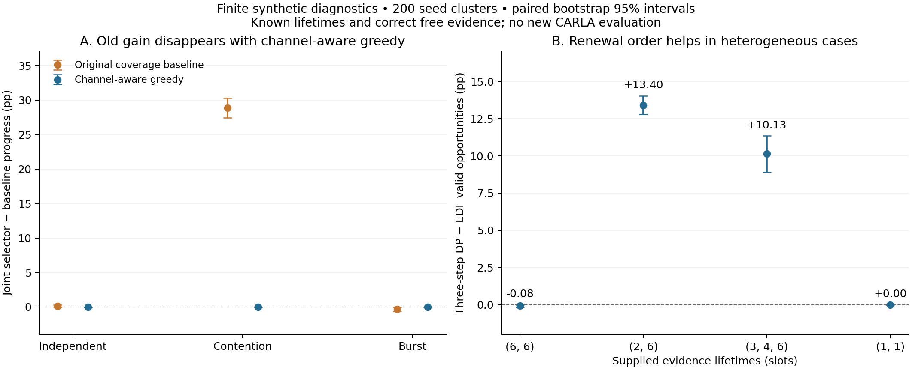

# V2X Evidence Scheduling toward MobiCom 2027

Finite experiments and literature-driven audits for semantic V2X scheduling. The latest research revision is dated **2026-10-01**; historical September code and data are retained for reproducibility.

## Main finding

**Latest sheng validation:** 44,000 synthetic episodes confirm that simple group refresh matches the core heterogeneous-lifetime result, and the candidate does not outperform a generic stationary scheduling reference. An 80-frame real CARLA coverage audit fails the primary complete-coverage gate in one of two views. The candidate has **not** established a new scheduling contribution or a new driving safety result. See the [sheng report](research/renewal_sheng_result_20261001.md).

**The October audit overturns the earlier interpretation of the contention gain.** A simple region-covering greedy that avoids channel conflicts matches the old joint selector's progress in all six tested network configurations. In five non-ideal configurations its selections also match in the enumerated state grid. The earlier improvement over channel-unaware coverage is therefore insufficient evidence for a new semantic scheduling algorithm.

The revised candidate is **renewing complementary evidence so it remains valid throughout action execution**. A finite synthetic diagnostic finds a 13.40-percentage-point gain over earliest-expiry-first scheduling for heterogeneous evidence lifetimes, but no gain with uniform lifetimes. This is a small exact DP reference with known lifetimes and correct free evidence, **not a novel algorithm or a new CARLA result**. Related work on physical validity, correlated information age, and coflows still needs to be ruled out before making originality claims.

This repository is a feasibility package, not a complete MobiCom evaluation. The CARLA study has five paired seeds, a software link model, and a controlled scene; zero recorded collisions do not establish natural-scene safety.

## Start here

- [Newest sheng results and research verdict (中文)](research/renewal_sheng_result_20261001.md)
- [sheng finite validation code and reproduction](experiments/renewal_sheng_20261001/README.md)

- [Latest research judgment and finite validation plan (中文)](research/update_20261001.md)
- [New literature, reading scope, and unresolved sources](research/literature_update_20261001.md)
- [October audit and diagnostic reproduction](experiments/research_update_20261001/README.md)
- [18,000-episode baseline audit](results/research_update_20261001/baseline_audit/paired_comparisons.csv)
- [3,200-episode validity diagnostic](results/research_update_20261001/validity_probe/paired_comparisons.csv)
- [Full experiment report](research/full_experiment_result_20260926.md)
- [Frozen protocol](experiments/carla_v2x_full/PROTOCOL.md)
- [Reproduction instructions](experiments/carla_v2x_full/README.md)
- [CARLA validation](results/carla_v2x_full/carla_main140/analysis/validation.json)
- [Mechanism verdict](results/carla_v2x_full/mechanism_v2/analysis/verdict.json)
- [Semantic-noise robustness analysis](results/carla_v2x_full/robustness/analysis.json)

Downloaded literature PDFs and extracted full text are intentionally excluded. The reading log and research synthesis remain under `research/`.

