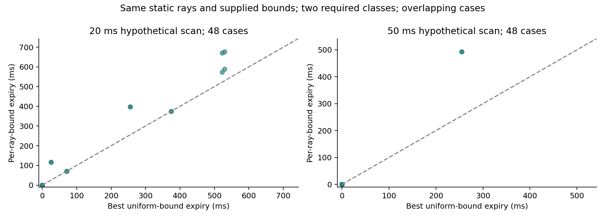

# V2X Evidence Scheduling toward MobiCom 2027

Finite experiments and literature-driven audits for semantic V2X scheduling. The latest research revision is dated **2026-10-03**; historical September code and data are retained for reproducibility.

## Main finding

**Latest: terrain-aware scoring repairs false obstacle support, but real-time expiry remains unsolved.** On sheng, a fixed15cm above-road score with new joint calibration removes all39 known pose counterexamples at stride4, while vehicle true-state exclusions change2→3/100 (pedestrian0/19 available,1 refused). These are reused-data diagnostics, not new risk validation. Continuous inversion at2000 nodes excludes1076 complete cells but yields no positive lower bounds; a fixed16000-node follow-up excludes132441 cells and obtains18.528–210.947ms lower expiry on10/24 queries. Compute takes6.13–11.43 seconds, so net usable expiry remains zero. Independent all-ray audits and five new tests accompany both full batches. A strong shared-reference lossless baseline reconstructs full current packets in19–54KB after725KB setup, correcting any claim that raw-point-cloud bandwidth alone establishes novelty. The concrete remaining bottlenecks are state inference, bound tightness and timely computation. See the [Chinese report](research/terrain_score_result_20261003.md), [derivation](experiments/terrain_score_20261003/THEORY.md), and [reproduction](experiments/terrain_score_20261003/README.md). The full project remains unfinished.

**Previous: continuous pose inversion exposes why true-box coverage still does not yield useful expiry.** Two finite sheng replays add288 calls over12 saved observations,24 public task queries and three nested raw budgets. Receiver candidate positions use no actor truth. Both interval implementations retain the entire declared upright prior within2000-node budgets, yielding zero lower expiry everywhere. Each study has119 zero-time disc-model witnesses;45 do not overlap the task using the tighter bbox footprint, so these are not physical collisions. A39-pose bank rescored under each budget leaves25 poses even with full input;17/24 full-budget queries have zero score/disc-model optimum, and7 remain unresolved. Full raw messages are1,037,588 bytes and exceed the500ms cap after modeled20Mbps transport/fixed reserves even before computation. Independent audits check317,672 nodes and72 packet records;12 tests pass. This rejects calibrated penetration fraction as a sufficient complete frontend, without refuting the older conditional formulas. A localizing calibrated state model, validated directional dynamics, compact task evidence, useful closed loop and novelty remain unfinished. See the [Chinese report](research/pose_inversion_result_20261003.md), [theory and limits](experiments/pose_inversion_20261003/THEORY.md), [reproduction](experiments/pose_inversion_20261003/README.md), and [summary](results/pose_inversion_20261003/summary.json).

**Previous: fresh 3D shape calibration reduces false exclusions, with an independently validated abstention fix.** Two finite sheng captures add528 frames and46,615,008 raw rays. Across100 vehicle test episodes, transferring a full-point-cloud threshold to three budgets falsely excludes the true box in17 episodes; joint view/budget calibration reduces this to2 while retaining83.92% translated-hypothesis rejection (a diagnostic, not free-space coverage). Initial pedestrian capture failures make its original calibration vacuous; a separately frozen fresh follow-up restores discrimination:0/19 available test exclusions versus4/19, with1 additional unavailable episode refused, and68.64% diagnostic rejection. Small-sample risk bounds remain broad. Two-host byte-identical independent audits check14,256 boxes;20 tests pass. A separate exact finite-disc expiry module matches2,000 analytic cases but is not yet fed by a validated complete continuous state set. Unknown inventory, physical contracts, dynamic control, real links and MobiCom novelty remain unfinished. See the [Chinese report](research/shape_evidence_result_20261003.md), [theory and scope](experiments/shape_evidence_20261002/THEORY.md), [reproduction](experiments/shape_evidence_20261002/README.md), and [summary](results/shape_evidence_20261002/summary.json).

**Previous: fresh CARLA observations falsify important physical premises behind the conditional lifetime results.** A finite48-frame experiment captures4,237,728 raw rays across six actual blueprints, four orientations and two views. With the unchanged error-aware rule, bicycles/motorcycles and some pedestrian poses produce22 exclusions of real occupied center tiles. Sprinter returns exceed the assumed2.5m outer radius in8 frames;7 have observed diameter>5m, ruling out every alternative center. Audi/Tesla non-refutation is not calibration. Independent raw/pose/corner audits match bytewise across hosts (12,288 perturbation cases), and six regression tests pass. A new explicit eligibility boundary preserves conditional horizons but grants no physical actions from this uncalibrated/refuted registry. Earlier frozen results remain conditional on their stated abstract model; they do not establish general traffic safety. Shape/pose/height contracts or a validated3D replacement must precede stronger dynamic claims. See the [Chinese findings](research/physical_contract_result_20261002.md), [theory](experiments/physical_contract_20261002/THEORY.md), [reproduction](experiments/physical_contract_20261002/README.md), and [independent audit](results/physical_contract_20261002/audit_sheng.json).

**Previous: paid historical proof repair restores useful lifetime with a bounded conservatism gap.** A finite sheng study adds5400 normal rows plus causal feedback events. A failed550ms interval triggers129 genuinely historical rays (407-byte request,1548-byte reply), restoring later proofs without treating old rays as fresh. Standard-link timely normal updates rise306→357/360 and CPU-busy-subtracted coverage21.64%→24.97%; slow-link counts219→261. Under selected normal-packet losses, ordinary backfill explains111→246, with historical repair further reaching285. All69 successful repair checks finish too late for immediate200ms-reserve actions; gains come from subsequent updates. All84 existing counterexamples survive rechecking against delivered supplements, giving18 positive lifetime brackets with at most74.488ms/13.5433% conditional missed-lifetime bound. Ten tests and byte-identical two-host independent audits pass. Bounds remain conditional, traces stationary/repeated, links modeled, and physical calibration/moving control/MobiCom novelty unfinished. See the [Chinese report](research/historical_repair_result_20261002.md), [proof](experiments/historical_repair_20261002/THEORY.md), [reproduction](experiments/historical_repair_20261002/README.md), and [summary](results/historical_repair_20261002/summary.json).

**Previous: class-specific facts restore zero lifetime, but indiscriminate extra evidence loses paid utility.** A finite sheng study adds5400 rows across five matched methods. With real current-scan augmentation, geometric support rises306→360/360; a same-information fine observer also recovers, so the gain is not unique to the scalar formula. Standard-link timely grants fall306→205/360 after source/transport/checking costs. Correcting initial root FIFO occupancy changes402 slow-link rows; authoritative slow-link grants are219 versus139/360. Rechecking all84 old candidates against augmented histories gives18 nonzero lower/upper brackets, with at most304.488ms/39.037% missed-lifetime bound, still too loose for a near-optimality claim. Eleven distinct tests and independent cross-host audits cover geometry, all packets, queues and15,400,478 segment checks. Fixed targets are not an adaptive scheduler; physical calibration, changing scenes, moving control/real links and MobiCom novelty remain unfinished. See the [Chinese result](research/class_guard_result_20261002.md), [theory](experiments/class_guard_20261002/THEORY.md), [reproduction and queue correction](experiments/class_guard_20261002/README.md), and [primary reading](experiments/class_guard_20261002/READING.md).

**Previous: received-evidence lifetime has an audited conservatism bracket, and extra sender observations refute its counterexamples.** A finite sheng study verifies84 hidden sphere/ellipsoid trajectories with13,946,682 full-ray checks. In15/18 stationary two-class queries, certified lower and feasible upper bounds limit missed conditional lifetime to74.488ms, at most13.5433%; three zero lower bounds remain unresolved. Each of36 original sphere witnesses is refuted by one previously untransmitted current-scan ray, independently checked with64 endpoint-box corner pairs. These760–768byte facts change received information and do not themselves extend TTL or grant actions. Fourteen new tests and three independent audit pairs pass on both hosts with byte-identical audit JSON. Physical/core/time contracts, repeated saved geometry, actual links, moving action/backup and online optimal selection remain unresolved; offline search is not a real-time controller or a full physical counterfactual. See the [Chinese result](research/validity_witness_result_20261002.md), [conditional derivation](experiments/validity_witness_20261002/THEORY.md), [finite reproduction](experiments/validity_witness_20261002/README.md), and [new primary reading](experiments/validity_witness_20261002/READING.md).

**Previous: two-endpoint past constraints remove avoidable expiry conservatism, and a strong fixed-region baseline matches the fine observer.** Two finite sheng studies add15,120 paid saved-source FIFO rows across seven methods and three link presets. Recursive receiver-owned facts remain separate from finite action authority; future validity never uses an unreceived terminal constraint. Giving the same past-motion improvement to all methods raises standard-link fixed/coarse admissions201→306/360, matching fine geometry. Common inter-message dictionaries reduce paid bytes79.007% and change low-bandwidth strong-baseline admissions0→225/360 without changing any mathematical horizon. Yet standard action duration coverage is only17.286% for the strongest fixed baseline; dropout and template-dependency failures remain. Thirteen new tests pass on both hosts. These are stationary-body repeated-geometry counterfactual links under uncalibrated physical contracts, not continuous driving, real wireless, minimum-conservatism optimality or established MobiCom novelty. See the [Chinese result](research/recursive_validity_result_20261002.md), [conditional derivation](experiments/recursive_validity_20261002/THEORY.md), [finite reproduction](experiments/recursive_validity_20261002/README.md), and [reading scope](experiments/recursive_validity_20261002/READING.md).

**Previous: common exact transport/cache makes some evidence useful, while precise recovery remains fragile.** Another frozen108-call sheng study gives lossless temporal dictionaries and exact caches to fixed-K and both position-set baselines; positional methods share conservative local windows and an established native squared distance transform. Fixed-K/coarse geometry stays6/12 with9/36 timely modeled calls each; fine geometry stays10/12 with just1/36 timely call. All30 saved dictionaries reconstruct original typed packet bytes,72 local masks conservatively contain original crops, and24 positional target horizons match. Independent audits check252 prefixes,120 sources,480 uncached class transitions,108 costs and40 boundaries. This is repeated saved geometry under conditional physical/common-clock assumptions, not stable real-time driving, actual wireless or a novel transform/filter. See the [Chinese result](research/compact_observer_result_20261002.md), [proof and limits](experiments/compact_observer_20261002/THEORY.md), and [reproduction](experiments/compact_observer_20261002/README.md).

**Previous: representation precision restores evidence on the same incomplete observations, but full computation and transport still defeat use.** On sheng, a 72-call matched comparison of fixed-K with an established position-set observer supports the same 6/12 targets, with 1/36 versus 0/36 timely modeled calls. A frozen post-analysis factor2 internal grid diagnostic supports 10/12 with unchanged raw observations and physical contracts, but 0/12 are timely. Four earlier temporal-gap refusals were not intrinsic information-impossibility results. Independent ball/vertex-tree audits revalidate all252 prefix packets, reconstruct both grids and check40 horizon boundaries; outputs match between hosts. Long-chain input/transport cost alone exceeds the final passing tick. This is conditional fixed-region replay, not optimal continuous-state expiry, effective driving or established MobiCom novelty. See the [new Chinese report](research/set_observer_result_20261002.md), [derivation and assumptions](experiments/set_observer_20261002/THEORY.md), and [baseline/reproduction](experiments/set_observer_20261002/README.md).

**Previous: verified history can recover self-occluded facts after an outage, but delivery time still limits use.** A corrected age/future model retains acceleration×age×future and revalidates all 252 old anchor packets. On sheng, 144 on-demand calls restore geometry in 6/12 targets but all miss timing; 360 charged FIFO maintenance calls and 72 target evaluations restore the same 6 targets, with only 2/36 backfill requests timely. Independent audits check raw sources, complete grids, temporal gaps, queues and 24 maximal-horizon boundaries. The selected-step maximum 475.211 ms cannot rescue late or gapped chains. This is fixed-region timestamped replay, with unvalidated physical conditions; no new driving, stable gain or MobiCom novelty is claimed. See the [new result (中文)](research/continuity_recovery_result_20261002.md), [conditional derivation](experiments/continuity_recovery_20261002/THEORY.md), and [finite maintenance reproduction](experiments/streaming_recovery_20261002/README.md).

**Previous: uncertainty-checked gap repair retains useful time in some horizon-extension cases, but does not beat fast renewal overall.** Four finite sheng studies add 2628 calls. With a common projection optimization given to all methods, gap greedy passes the strict modeled action budget in 6/9 selected difficult 475ms renewals versus 0/9 for old repair and nearest valid support. On ALL 384 original inputs, the strong old method passes 254 times versus 253 for gap greedy. All 1632 archived first-repeat packets pass independent full-receiver/source/history replay; 816 optimized packets match original bytes and 72 subset horizon checks agree. This is conditional fixed-region evidence and observed retrospective timing, not new driving, WCET or established MobiCom novelty. See the [research result](research/incremental_validity_result_20261002.md), [derivation](experiments/incremental_validity_20261002/THEORY.md), and [frozen protocols and reproduction](experiments/incremental_validity_20261002/README.md). The new age/future addendum above limits interpretation of the earlier split-motion model; frozen records are preserved.

**Previous selection audit: smaller proofs and a larger sent horizon do not guarantee more useful time after delivery.** Two new 288-call studies on sheng preserve full geometry and raw-ray provenance, but all modeled action tests fail after charging acquisition, generation, receiver verification and byte-dependent transport. Giving both greedy and reverse deletion a compiled kernel reduces full-rebuild cost; fast local renewal remains the stronger baseline. All 112 saved packets pass independent replay and 64 compiled-stage packets match their references byte for byte. See the [useful-lifetime result](research/usable_lease_result_20261002.md), [protocols and reproduction](experiments/usable_lease_20261002/README.md), and [primary-paper reading](research/usable_lease_reading_20261002.md).

**Previous: equivalent horizon search becomes cheaper, but faster proofs still do not yield effective driving.** On sheng, all 37 archived cases retain their joint certificate horizons while warm full-ray frontier cost falls from 809 to 91 ms and sent-subset cost from 266 to 23 ms. Coverage-result reuse retains byte-identical proposals. Ten fresh runs add 384 source-backed observations and 2,651 audited physics ticks, with 163 actual commands but negligible forward motion; modeled byte costs and dropout-induced history loss remain limiting. Thirty-two separate actuator episodes show a manual-gear response only for longer pulses, without establishing a calibrated new policy. These are reproducible engineering/diagnostic gains, not an established MobiCom contribution or completed driving system. See the [October 2 report](research/online_evidence_result_20261002.md), [frozen protocols and reproduction](experiments/online_evidence_20261002/README.md), and [equivalence argument](experiments/online_evidence_20261002/THEORY.md).

**Previous: incomplete observations now yield a maximal fixed-region certificate horizon, but fresh repair runs still cannot drive.** Eight new sheng runs produce 260 source-replayed frames, 2,636 audited physics ticks and zero forward commands. A finite post-analysis computes the largest integer-microsecond horizon admitted by the unchanged tile proof: complete root observations support 480.303 ms in one view and only 60.008 ms in the other; transmitted subsets retain 400.073 ms. All 807 geometry comparisons and nine rewritten packets pass reference checks. Three startup boundaries and one sub-microsecond availability flag receive strict integer corrections. The full-ray frontier is too costly online and does not establish a driving gain, physical safety or novelty. See the [new result and research judgment](research/live_repair_result_20261001.md), [expiry derivation](experiments/expiry_frontier_20261001/THEORY.md), and [reproduction](experiments/live_repair_20261001/README.md).

**Previous: actual-ego integration exposes a repairable proof-renewal bottleneck.** Three finite four-run batches on sheng yield 214 source-backed frame replays and 1,813 actual physics ticks, but zero admitted forward commands. Timely pre-ego initialization succeeds in the third batch; a small support-proposal gap then triggers an 814 ms full rebuild, missing the 400 ms geometric lifetime. A post-analysis repair of that one archived transition passes full verification and cuts paired median generation from 694 to 186 ms, with 14.3% more message bytes. Fresh closed-loop validation of the repair remains outstanding; this is not successful driving or an established MobiCom contribution. See the [integration and repair report](research/evidence_loop_result_20261001.md), [frozen protocols and reproduction](experiments/evidence_loop_20261001/README.md), and [full replay audit](results/evidence_loop_integration_20261001/analysis.json).

**Previous: independent-episode actuation calibration does not establish a learned-model advantage.** On sheng, 799 fresh CARLA episodes are split into 100 training, 299 calibration and 400 held-out tests. The constant joint maneuver envelope has 0/400 exceedances (one-sided 95% upper bound 0.746%); the state-conditioned predictor has 7/400 (3.262%). Both admit the same 400 counterfactual states. A separately labeled post-analysis 50 ms tick enlargement removes these sampled failures on the same test data, but also erases the median stopping-time advantage. Full 3D body reconstruction corrects up to 12.55 mm omitted by yaw-only geometry; the excluded preliminary 799-episode batch is preserved. These are fixed-distribution, sampled component results, not physical safety or evidence-guided driving. See the [calibration report](research/actuation_calibration_result_20261001.md), [frozen protocol and reproduction](experiments/actuation_calibration_20261001/README.md), and [statistical scope](experiments/actuation_calibration_20261001/STATISTICAL_SCOPE.md).

**Previous: verified free regions separate evidence expiry from fixed control waiting.** A new conditional handoff kernel reuses the unchanged raw-ray geometry and checks a complete command/backup maneuver from the current state. On sheng, 1,044 paired saved-data cases yield 2 old-gate versus 19 new-gate admissions, including five hypothetical moving cases; 43,587 age-grid comparisons isolate the removed hold-budget restriction. Twelve separate actual CARLA continuous-control runs make progress but all violate the supplied traction bound. No physical movement authorization or evidence-guided driving is claimed. See the [free-region report](research/lease_handoff_result_20261001.md), [conditional derivation](experiments/lease_handoff_20261001/THEORY.md), [reproduction](experiments/lease_handoff_20261001/README.md), and [source-backed validation](results/lease_handoff_20261001/validation.json).

**Previous: faster verification exposes limited control utility.** Current-ray cell hints, exact local lookup and lossless binary transport preserve the conditional proof decisions. Three paired stages on sheng cover 9,396 method/case evaluations of the same 1,044 cases; only two stationary cases pass the modeled time budget, and no moving case passes. A strong receiver-only verification baseline sends 7.46 MB of ultimately rejected proposals without resolving the timing gate. More importantly, 36 new actual CARLA episodes show almost no extra motion from a 50 ms go command after a 100 ms brake hold. The current stop/go policy has not established useful driving; future integration needs continuous control and legitimate certificate handoff. See the [runtime and realization report](research/policy_runtime_result_20261001.md), [reproduction](experiments/policy_runtime_20261001/README.md), and [validation](results/policy_runtime_20261001/validation.json).

**Previous: policy-conditioned validity and actual actuator diagnostics.** New sheng work adds 30 CARLA own-vehicle episodes, 180 paired geometry checks and 1,044 paired current-ray renewals. Restricting execution to a hold/go/brake policy extends the largest passing grid horizon by 100 ms in 4/36 scene/speed combinations; 13 cold and 87 renewed packets pass conditional geometry. All renewal outputs match the reference byte for byte, but **zero meet the measured age/stop budget**, and actual CARLA trajectories contradict several supplied actuator bounds. The contribution remains a conditional algorithm prototype, without evidence-guided driving or validated physical contracts. See the [policy report](research/policy_evidence_result_20261001.md), [reproduction](experiments/policy_evidence_20261001/README.md), and [source-backed validation](results/policy_evidence_20261001/validation.json).

**Previous integration gate: whole-body occupancy and complete stopping.** The 0.5 m disk results do not transfer directly to a vehicle. On sheng, 432 cold geometry checks and 1,044 current-ray renewals expose two contract gaps (incompatible acceleration/braking bounds and unverified initial-free assertions). Both have explicit receiver checks now, including integer expiry handling. Forty-five full-body renewal packets pass geometry, but **zero pass the complete stopping budget**. These are saved-data diagnostics, not new driving runs. See the [full-body report](research/body_evidence_result_20261001.md) and [reproduction](experiments/body_evidence_20261001/README.md).

**Previous: independently recomputable raw-ray proofs and new dynamic scans.** Version 2 lets the receiver reconstruct projection, quantization and per-ray age bounds from selected current first-return rays. Two exact optimizations match all 1,392 reference renewal outcomes byte for byte; the latest meets the modeled timing budget in 288 cases (299 geometrically valid). Two new 128-frame moving-obstacle CARLA monitor runs yield 23/1 and 22/9 geometric/timely acceptances. Both positive and negative results are retained: cold initialization and live timing remain limitations. These are receiver monitors for a 0.5 m query disk, without an ego controller or physical calibration. See the [new report](research/ray_proof_v2_result_20261001.md), [reproduction](experiments/ray_proof_v2_20261001/README.md), and [validation](results/ray_proof_v2_20261001/analysis.json).

**Previous follow-up: ray uncertainty and timing.** Supplied XYZ/pose/query error boxes and individual ray ages now produce explicit exclusion bounds. A matched best-uniform-error baseline explains equal positive-certificate counts in the 2 mm model; per-ray bounds lengthen expiry in 10/96 joint configurations, by up to 238 ms. Exact local search matches all 288 full-grid outputs. Larger-error tests retain failures: 20 mm input boxes with a 50 ms hypothetical scan give no joint certificates. These use saved static geometry and hypothetical ray times, not newly measured dynamic scans; the proof format is now implemented in the follow-up above; driving integration remains unfinished. See the [uncertainty report](research/visibility_uncertainty_result_20261001.md) and [project completion ledger](research/PROJECT_STATUS.md).

**Earlier sheng implementation: evidence validity from incomplete observations.** Actual empty-ray witnesses exclude impossible obstacle centers under explicit size/error/motion bounds; a receiver verifies a quantized geometric proof and every required obstacle class. Fresh-ray support renewal avoids rebuilding the cover each frame. In 2,000 analytic scenes, no center-exclusion or expiry-bound violations were detected under the stipulated model. A new 120-frame CARLA acquisition supports 38 timed two-class 200 ms proofs in dense free/far scenes; 20 eligible near-obstacle frames are rejected. Across all configurations, 38/232 renewal attempts succeed; sparse scans and missing templates remain refusals. These are conditional geometry and static timing diagnostics, not a driving safety guarantee or established MobiCom novelty. See the [first certificate report](research/visibility_certificate_result_20261001.md).

**Previous scheduling validation:** 44,000 synthetic episodes confirm that simple group refresh matches the core heterogeneous-lifetime result, and the candidate does not outperform a generic stationary scheduling reference. An 80-frame real CARLA coverage audit fails the primary complete-coverage gate in one of two views. The candidate has **not** established a new scheduling contribution. See the [earlier sheng report](research/renewal_sheng_result_20261001.md).

**The October audit overturns the earlier interpretation of the contention gain.** A simple region-covering greedy that avoids channel conflicts matches the old joint selector's progress in all six tested network configurations. In five non-ideal configurations its selections also match in the enumerated state grid. The earlier improvement over channel-unaware coverage is therefore insufficient evidence for a new semantic scheduling algorithm.

The earlier revised candidate was **renewing complementary evidence so it remains valid throughout action execution**. A finite synthetic diagnostic found a 13.40-percentage-point gain over earliest-expiry-first scheduling for heterogeneous evidence lifetimes, but no gain with uniform lifetimes. That is a small exact DP reference with known lifetimes and correct free evidence, **not a novel algorithm or a new CARLA result**. The latest work above implements the missing observation-to-validity interface instead of assuming lifetimes are known. Related work on physical validity, correlated information age, and coflows still needs to be ruled out before making originality claims.

This repository is a feasibility package, not a complete MobiCom evaluation. The earlier closed-loop CARLA study has five paired seeds, a software link model, and a controlled scene; zero recorded collisions do not establish natural-scene safety. The latest evidence-validity study includes new moving-obstacle scans and modeled message delay, with no ego driving controller.

## Start here

- [Class-specific facts: recovered lifetime and the measured cost of extra evidence (中文)](research/class_guard_result_20261002.md)
- [Finite experiment, corrected FIFO, independent bounds and reproduction](experiments/class_guard_20261002/README.md)

- [Incomplete observations: conditional expiry, stronger baselines and paid delivery (中文)](research/recursive_validity_result_20261002.md)
- [Recursive fact/action separation and finite reproduction](experiments/recursive_validity_20261002/README.md)
- [Closest-paper reading and honest novelty limits](experiments/recursive_validity_20261002/READING.md)

- [Common exact transport, conservative computation and remaining precision cost (中文)](research/compact_observer_result_20261002.md)
- [Finite common-optimization protocol, code and reproduction](experiments/compact_observer_20261002/README.md)

- [Same-observation baseline, representation conservatism and full cost (中文)](research/set_observer_result_20261002.md)
- [Position-set proof, reading scope and reproduction](experiments/set_observer_20261002/README.md)

- [Credible expiry, historical fact recovery and complete charged maintenance (中文)](research/continuity_recovery_result_20261002.md)
- [Corrected age/future derivation and primary-paper positioning](experiments/continuity_recovery_20261002/THEORY.md)
- [Finite sheng recovery implementation, verification and reproduction](experiments/streaming_recovery_20261002/README.md)

- [Incomplete observations, maximal conditional lifetime and incremental support (中文)](research/incremental_validity_result_20261002.md)
- [New algorithms, conditional derivation and independent replay](experiments/incremental_validity_20261002/README.md)

- [Equivalent online-cost optimization, ten fresh runs and actuator probe (中文)](research/online_evidence_result_20261002.md)
- [Finite October 2 protocols, source and full replay](experiments/online_evidence_20261002/README.md)

- [Fresh repair runs, exact certificate horizon and strict deadline audit (中文)](research/live_repair_result_20261001.md)
- [Observation-to-expiry algorithm and conditional derivation (中文)](experiments/expiry_frontier_20261001/THEORY.md)
- [New finite capture and complete replay](experiments/live_repair_20261001/README.md)

- [Actual-ego integration failure and local current-ray repair (中文)](research/evidence_loop_result_20261001.md)
- [Finite integration protocols and reproduction](experiments/evidence_loop_20261001/README.md)

- [Independent-episode calibration, failed prediction advantage and tick realization (中文)](research/actuation_calibration_result_20261001.md)
- [Calibration source, protocol and reproduction](experiments/actuation_calibration_20261001/README.md)

- [Free-region validity and conditional handoff (中文)](research/lease_handoff_result_20261001.md)
- [Definitions, sufficient proof and limits](experiments/lease_handoff_20261001/THEORY.md)
- [Handoff and continuous-control reproduction](experiments/lease_handoff_20261001/README.md)
- [Incremental verification, lossless wire and paired control utility (中文)](research/policy_runtime_result_20261001.md)
- [Runtime protocols, code and reproduction](experiments/policy_runtime_20261001/README.md)
- [Policy-conditioned validity and actual actuator counterexamples (中文)](research/policy_evidence_result_20261001.md)
- [Policy code, frozen protocols and sheng reproduction](experiments/policy_evidence_20261001/README.md)
- [Whole-body, braking and history-trust integration result (中文)](research/body_evidence_result_20261001.md)
- [Raw-ray proof, exact renewal optimization and live dynamic checks (中文)](research/ray_proof_v2_result_20261001.md)
- [Version-two code and complete reproduction](experiments/ray_proof_v2_20261001/README.md)
- [Ray error/time propagation and matched algorithm comparison (中文)](research/visibility_uncertainty_result_20261001.md)
- [Full project completion ledger and remaining integration](research/PROJECT_STATUS.md)
- [Incomplete observations → conditional expiry: first certificate report (中文)](research/visibility_certificate_result_20261001.md)
- [Evidence certificate code, contract, and reproduction](experiments/visibility_certificate_20261001/README.md)
- [Source, raw frame, and receiver-proof validation](results/visibility_certificate_20261001/analysis.json)
- [Previous scheduling results and research verdict (中文)](research/renewal_sheng_result_20261001.md)
- [sheng finite validation code and reproduction](experiments/renewal_sheng_20261001/README.md)

- [Latest research judgment and finite validation plan (中文)](research/update_20261001.md)
- [New literature, reading scope, and unresolved sources](research/literature_update_20261001.md)
- [October audit and diagnostic reproduction](experiments/research_update_20261001/README.md)
- [18,000-episode baseline audit](results/research_update_20261001/baseline_audit/paired_comparisons.csv)
- [3,200-episode validity diagnostic](results/research_update_20261001/validity_probe/paired_comparisons.csv)
- [Full experiment report](research/full_experiment_result_20260926.md)
- [Frozen protocol](experiments/carla_v2x_full/PROTOCOL.md)
- [Reproduction instructions](experiments/carla_v2x_full/README.md)
- [CARLA validation](results/carla_v2x_full/carla_main140/analysis/validation.json)
- [Mechanism verdict](results/carla_v2x_full/mechanism_v2/analysis/verdict.json)
- [Semantic-noise robustness analysis](results/carla_v2x_full/robustness/analysis.json)

Downloaded literature PDFs and extracted full text are intentionally excluded. The reading log and research synthesis remain under `research/`.

