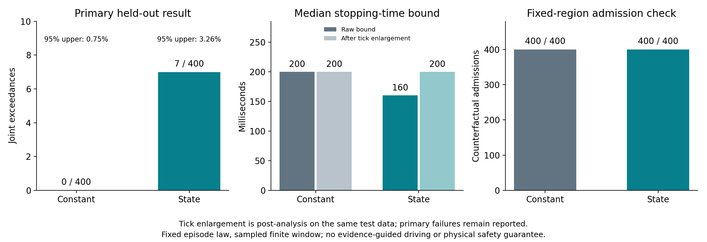

# 不完整观测的有效期：补齐动作包络的独立校准与反例

**本轮在 sheng 完成 799 组正式 CARLA 动作实验。简单统一包络在 400 组独立测试中零失配；状态条件预测器出现 7 次失配。两者在固定证据区域下均通过 400 项反事实准入检查，复杂预测器没有带来准入增益。** 这是对一个必要组件的实测验证，尚未完成证据驱动行驶，也没有建立新的 MobiCom 算法贡献。

## 1. 这一步解决什么

此前的空闲区域证明能回答：在给定观测误差、障碍物形状与运动契约下，区域 R 在绝对时刻 E 前是否仍可证明为空。它不能自动回答车辆执行下一条指令、再制动所需要的时间和空间。此前实际控制已推翻任意指定的牵引加速度上界 3 m/s²，因此继续代入该常数会使完整论证失效。

本轮把“观测有效期”和“动作可接受截止时间”分开。接收端先用当前原始射线重验 R、E；再用当前状态计算整段动作的占用包络 K 和完成时间上界 T。只有 K 包含于 R 且 t + T < E 才通过。整数微秒实现的最晚开始时间为 E_us − ceil(10⁶T) − 1；状态变化后必须重新计算。扩大允许开始的时间范围不能通过延长未经证明的 E 实现。

当前几何部分仍是**物理契约成立时的确定性充分条件**；本轮动作部分是**限定随机实验分布下的统计上界**。它们的保证类型不同，不能拼成无条件安全定理。若不约束隐藏障碍物的最小不透明尺寸和运动，完全相同的观测可以对应立即碰撞的世界，正有效期一般不可识别。相关定义和已有证明见 [条件理论](../experiments/lease_handoff_20261001/THEORY.md)。

## 2. 预先冻结的实验与测量修正

正式划分为 100 组训练、299 组校准、400 组测试，分别使用独立随机种子。每组重新生成车辆，从三个固定直道路点抽样位置，目标速度均匀抽自 0.3–1.2 m/s，前缀控制长度抽自 20–159 个 tick。车辆为 Audi A2，天气 ClearNoon，50 ms 同步 tick，最多十个 10 ms 物理子步。前缀后执行一次 50 ms 固定继电控制，再执行 2 s 全制动。没有删除、重采样碰撞或未稳定停止的试验。

保存全部热身、前缀、指令和制动状态及实际控制；预测特征均在下一条指令前可取得。联合目标是前、后、侧向整车最大扩展，以及速度进入 ≤0.02 m/s、且在剩余记录中保持该速度带的首个采样时刻。要求后续至少五个样本；这不是数学上永久静止。空间极值包含完整 2.05 s 记录，未在首次低速时截断。

最初 799 组采集只记录 yaw。源码审查发现俯仰会改变整车边界，于是先冻结 [测量附录](../experiments/actuation_calibration_20261001/POSE_ADDENDUM.md)，再按相同输入计划重新采集全部 799 组，记录完整三维姿态和八个包围盒角点。前批完整保存在 `preliminary_yaw_only.tgz`，不参与正式统计，也不把两批重复输入算成 1,598 个独立统计样本。

独立欧拉旋转实现核查正式数据的 120,186 组角点；与 CARLA 的最大坐标差为 7.92 μm。只用 yaw 最多遗漏 **12.55 mm** 边界扩展，因此修正具有实质意义。重建核对阈值不是物理传感器误差界。

## 3. 校准保证的准确含义

训练集分别拟合常数均值和固定特征的最小二乘预测器。对每个完整 episode 计算一个联合非一致性分数：四个目标正残差分别除以固定的 0.1 m / 0.1 s 尺度，取最大值；碰撞或没有持续低速段给无穷分数。不能把同一 episode 的相邻帧当作独立校准样本。

令 q 为 299 个独立校准分数的最大值。在训练后预测器固定、校准与新 episode 同分布且独立的假设下，经典次序统计量给出：**总体联合超界概率不超过 1%，其校准置信度至少为 1−0.99²⁹⁹ ≈95.046%。** 这是每个预先指定方法各自的保证，不是两个方法同时 95%，也不是每种速度或每个被准入状态分别 99% 覆盖。

该结论不是新共形算法，更不能证明确定性的执行器极限。真实连续闭环将访问新的自适应状态分布，不能只因速度仍处于相同区间就复用保证。完整限制及单侧精确二项置信界见 [统计说明](../experiments/actuation_calibration_20261001/STATISTICAL_SCOPE.md)。

## 4. 原始独立测试结果

| 指标 | 简单统一包络 | 状态条件包络 |
|---|---:|---:|
| 独立测试 episode | 400 | 400 |
| 联合超界次数 | **0** | **7** |
| 超界概率单侧 95% 上界 | **0.746%** | **3.262%** |
| 停止时间上界中位数 | 200 ms | 160.04 ms |
| 前向扩展上界中位数 | 77.32 mm | 49.46 mm |
| 固定区域下反事实准入 | **400/400** | **400/400** |

固定区域来自历史、可重验的同一 PVX1 射线证明。比较统一使用 130 ms 假设证据年龄、400 ms 几何有效期和 30 mm 位姿裕度；把每个状态放在该区域参考位姿。这不是 400 次新传感器闭环，也不是实际车辆根据该证明行驶。所有结果记录 `physical_movement_authorized=false`。

七次超界全部发生在停止时间，位于测试 0008、0099、0100、0160、0217、0247、0331。其中五次位于低速层，两次位于高速层。低速 72 组中状态预测器有 5 次超界，说明总体指标不足以替代局部审查。该结果不能被宣传为已达到实测 1% 风险目标；它也不单独构成对前述校准置信定理的数学反例。

正式 799 组中有 60 组的那一次候选指令，其采样加速度超过旧 3 m/s² 上界，进一步确认旧常数不可直接使用。没有碰撞或缺少持续低速段的 episode；这不表示不存在包络超界。

## 5. 发现新问题后的有限修正

预测器输出连续时间，例如 197.25 ms、99.12 ms，而观测停止时间位于 50 ms 格点。事后增加一个不重新拟合、不重新校准的单调扩大步骤：用精确浮点有理数比较，把预测时间向上取整为完整 tick。由于只扩大时间包络，不会削弱已有覆盖关系；同时可能压缩剩余可执行时间。

在**同一份** 400 组测试数据上，取整后两方法均无超界。但必须保留原始七次失配；这不是新增独立测试。统一包络仍全部为四个 tick；状态预测器为二个 tick 1 组、三个 99 组、四个 252 组、五个 48 组。状态预测器的中位时间随之变成 **200 ms，与统一包络相同**，平均时间为 193.375 ms。准入数量仍为 400 对 400。当前数据没有支持“学习得到更短有效动作期限，因此提升准入”的故事。

向上取整也不约束采样间行为，更不能补上分布漂移和延迟执行的缺口。该诊断及其八项测试已在 sheng 执行，原始结果独立保留。

## 6. 运行成本、复现与后续科学问题

sheng 实测 400 次/方法的加载后特征预测及包含关系检查，中位耗时分别为 0.0406 / 0.0418 ms；p95 为 0.0530 / 0.0586 ms。该计时不含传感器、射线验证、网络、状态估计或执行器延迟，也不是最坏执行时间保证。加入实测门控耗时及额外 1 ms 后，本固定反事实比较的通过数仍相同。

运行环境是 sheng 的 Ubuntu 20.04 WSL（hostname `DESKTOP-UGDDO8T`），CARLA 0.9.15 在同机 Windows 运行；Python 3.8.10、NumPy 1.24.4、SciPy 1.10.1。正式采集耗时约 638 s，核验了 119,387 行连续状态与实际控制。原始 episode、冻结协议/源码哈希、预备批、拟合参数、逐项测试、失败明细、角点核查和计时均已归档。图表在本地渲染；科学计算和最终八项测试在 sheng 完成。研究代码入口见 [复现说明](../experiments/actuation_calibration_20261001/README.md)。本次自建 CARLA 进程已经停止，单独清理记录确认不存在；没有创建定时任务或持续研究循环。

目前更合理的研究结论是：**先用完整动作的独立校准修正错误的动力学契约，再检查减少保守性是否真的带来决策收益。** 更小的预测误差或更窄的包络本身不是通信贡献。下一步仍须完成观测误差与障碍物内核契约、合法初始状态、独立执行超时保护，以及与证据获取和通信共同作用的实际闭环验证；其中分布改变需要重新设计校准和测试。已有包络不能直接授权真实车辆动作。项目整体尚未完成。

## 7. 文献约束

[Formal Verification and Control with Conformal Prediction，v3](https://arxiv.org/html/2409.00536v3) 的轨迹校准讨论与第 20 节强调独立校准轨迹和未来轨迹分布条件；不能把相邻帧样本数变成泛化证据。[Hulsman 2022，§4.2–4.3](https://arxiv.org/html/2210.14735v1) 解释单变量分数及 Beta 次序统计量覆盖关系，支持区分边际覆盖与校准置信；它是公开硕士论文，未作为新的期刊成果引用。

完整角点核查依据 CARLA 0.9.15 的 [Transform.h](https://raw.githubusercontent.com/carla-simulator/carla/0.9.15/LibCarla/source/carla/geom/Transform.h) 和 [BoundingBox.h](https://raw.githubusercontent.com/carla-simulator/carla/0.9.15/LibCarla/source/carla/geom/BoundingBox.h) 定义，再独立组合欧拉旋转矩阵复核。已有工作足以排除“首次用校准预测支持安全控制”的宽泛创新表述。可继续检验的贡献仍应落在从不完整观测形成接收端可核验证据，以及其分辨率、计算、传输和有效期之间的可测权衡上。
