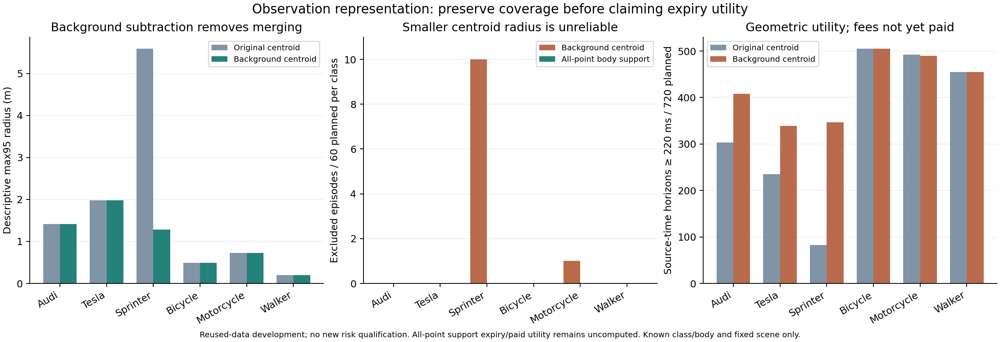

# 修复观测集合：背景合并可以去掉，部分观测不能压成可信单中心

日期：2026-10-04；执行 sheng，本地独立复算。前一轮交集结果已证明，在原声明模型里继续提高有效期求解精度收益有限。本轮转向观测到状态集合的表示，完成有限全量诊断，没有新启动 CARLA 或持续研究循环。

**得到两个具体结果。** 第一，原 Sprinter 最大校准误差不是单纯缺少返回：前端选中了 1515 个目标返回，却把它们与背景合并，再因尺寸超限丢弃。固定背景扣除将开发半径 5.591086 m 降到 1.283823 m，但复用测试出现 10/60 个 Sprinter 回合中心排除，不能把小半径用于可信授权。第二，用分量内全部观测点约束已知车体中心的集合表示，六类在复用测试中均未发现中心排除，覆盖了那 10 个 Sprinter 回合和原有 1 个摩托车回合。这是表示层面的开发证据；集合宽度、有效期和费用后收益尚未计算，不能宣称已经解决普遍不过度保守的问题。

## 失效原因与固定对照

保留六类各自原最大校准分数的原始云、组件统计和哈希。[合并见证](../results/background_frontend_20261004/merge_diagnosis_sheng.json)中，Sprinter 的 `prospective_vehicle_mercedes_sprinter_calibration_010_s10_v0` 选中 1515 个目标返回。含它们的组件有 1858 点，横向跨度 8.150442520 m，超过原尺寸筛选界，故全部丢弃；剩余两个背景组件中没有目标返回。最近保留中心距真实中心 5.58308586 m，再加 8 mm 的量化保护形成原 5.591086 m 半径。它与“没有获得目标观测”是不同的失败。

固定对照只用旧 `causal_state_20261003` 的校准部分、step0 XYZ 建立参考，每个视角 532 帧。公开坐标基础、固定传感器布局、已知类别和车体尺寸与父实验相同。ROI 为 |x|≤12、|y|≤8、0.3<z<3 m；10 cm 体素在至少 90% 拟合帧出现才列入静态背景，得到视角0/1各 354/548 个体素。频率按“每帧是否出现”计数，密集目标点不能凭点数抬高频率。拟合不使用标签、actor ID、真实位置或新批次云。

处理当前云时，先扣除匹配背景体素的当前 XYZ，再执行不变的 2D 分量提案器。保留所有合法分量，不选择最接近真实目标的分量；没有提案则拒绝。所有参数在 sheng 生产输出前冻结，没有搜索体素或频率阈值。完整参考、公共基础和 1064 个拟合输入的哈希被压缩进 `background.bin`，总计 **53552 B**；不能把参考获取和共享假装成免费。

## 全量数据与失败

处理未改动的前瞻性父批次 **5304 帧、117069888 个保存返回**，并分别执行未偏移、局部 XYZ 各轴 +1 mm、各轴 +10 mm 三种提案，共 15912 次提案诊断。两种坐标偏移是固定合成诊断，不是传感器噪声分布。未偏移处理中 1004026 个保存目标返回没有被背景参考删掉；ID 仅在 XYZ 提案之后用于这个离线检查，不能进入拟合或选择。

95 个计划校准回合的最大整回合中心误差仅用于**描述性开发半径**。本轮改变了前端，又使用已检查过的校准及测试部分，因此不能继承原先 max95 的前瞻性风险资质，也不能称这些是新的 untouched tests。失败计划、无提案帧及所有中心排除都保留。

| 类别 | 原半径→背景扣除半径（m） | 未偏移测试中心排除/60计划回合 | 可用/捕获测试帧 |
|---|---|---:|---:|
| Audi | 1.418654→1.418654 | 0 | 360/360 |
| Tesla | 1.982980→1.982980 | 0 | 348/348 |
| Sprinter | 5.591086→1.283823 | **10** | 360/360 |
| 自行车 | 0.492120→0.492120 | 0 | 359/360 |
| 摩托车 | 0.727269→0.727269 | **1** | 359/360 |
| 行人 | 0.197411→0.197411 | 0 | 286/288 |

Sprinter 原几何期限≥220 ms 的来源查询为 83/720，背景扣除后为 347/720，但其中 60 次属于出现中心排除的回合。它不是已收到或费用后的动作许可。Audi 303→408、Tesla 235→339、自行车 505→505、摩托车 492→490、行人 455→455；每类 720 是计划来源帧查询，不能与旧回放的每类1920动作查询混用。

+1 mm 时 Sprinter 排除变为11回合；+10 mm 时为8回合，自行车与行人各新增2回合排除，摩托车仍为1。较大偏移没有更差的 Sprinter 数字不代表更鲁棒：分量连接与量化会离散变化，所有方向/噪声分布并未验证。三次观测的未偏移完整提案/量化耗时中位数按上述类别依次为 1.5835/1.671/1.825/1.229/1.293/1.2315 ms；这是源端计算诊断，未包含新消息编码、链路、接收队列或动作。本轮没有生成授权策略。

## 部分观测应保留怎样的状态集合

背景扣除后的分量仍可能只覆盖车体一部分。其观测盒中点可以偏离真实中心；把中点当估计并统一缩小半径会损失覆盖。另一个表示直接利用已声明的车体外接圆：若真实中心 x、半径 R 的圆包住目标返回 p，则 |p−x|≤R。把 p 量化到 1 cm 后，增加 8 mm 保护。

对每个保留分量 G 定义

`C_G(δ) = ∩_{p∈G} disk(p, R + 8mm + δ)`，

然后对所有分量取并集。真实目标若有一个纯观测分量，其中心属于 δ=0 的集合；在线纯度并未被证明，因此另记开发分数：对每个分量取所有点到真实中心的最大超出量，再取各分量最小值，最后取整回合最大值。分数为覆盖所需的最小非负整数微米。生产式分组只读当前 XYZ，真实中心与 ID 仅用于后续开发分数、覆盖与纯度诊断，不能选分量。缺失提案拒绝，不推出“未知目标不存在”。

[此独立的结果后假设诊断](../experiments/background_frontend_20261004/BODY_SUPPORT_NOTE.md)保存所有分量的完整量化点集。其 95 回合开发松弛在六类均为 **0 µm**；未偏移复用测试每类均为 **0/60 计划回合中心排除**，可用测试帧合计 2072，未取得提案或采集失败继续拒绝。先前 10 个 Sprinter 回合和 1 个摩托车回合均在可用观测上获得包含真实中心的支持集。

这是条件表示覆盖的改善，不是集合紧致性证明：车体外接圆仍可能允许很宽的中心范围，分量归属、已知类别/数量和车体包络也限制了适用场景。所有支持状态是否兼容原始射线和完整物理网格，尚未证明；δ=0 的复用数据结果没有新前瞻性风险保证。当前也未求该多圆盘交集的查询距离或有效期，未测费用后动作收益。

## 复核与完整记录

背景前端的独立审计用三维整数元组计数、SciPy 栅格分量、Decimal 覆盖与独立整数期限端点验证，检查全部输入。车体点约束的另一个审计器用 BFS 重建全部分量，重新核验 **7389 个分量、945120 个量化点**，用 Decimal 验证整回合分数与中心成员关系；它不导入点约束生产函数。

五对 JSON（背景审计、汇总、显示规范化的合并见证、点约束结果、点约束审计）在本地/sheng 逐字节相同。每台机器原三项前端测试及新增两项整数边界测试均通过。最初两个合并见证仅在离线展示的跨度/中点有最大 **8.881784197001252e−16 m** 浮点差异，非浮点字段完全相同；原件和源码保留，显示统一到9位小数后匹配，未改生产提案、风险参数或集合。初次本地点约束的浮点分数源码与结果也保留；后续整数平方根对精确二进制输入计算最小整数松弛，独立 Decimal 审计确认。初始人工加出的1 µm成为精确的0 µm；这不改背景生产结果或此前的10个失败回合。

[复现入口](../experiments/background_frontend_20261004/README.md)、[冻结协议](../experiments/background_frontend_20261004/PROTOCOL.md)、[源码](../experiments/background_frontend_20261004)、[原始诊断与审计](../results/background_frontend_20261004)均保存。本轮所有有限进程已结束；无模拟器或持续任务遗留。原父数据和结果保持不变。

## 科研定位与下一道验证

背景扣除和聚类是常规方法，[PointPillars 原文](https://arxiv.org/html/1812.05784v2)已在引言描述传统背景扣除与时空聚类。[OYSTER 原文](https://arxiv.org/html/2311.02007v1)明确讨论部分观测的紧盒拟合带来的尺寸低估与中心偏移，并使用跟踪信息改进伪标签。已读章节在[阅读记录](../experiments/background_frontend_20261004/READING.md)；没有实现它们的学习模型比较，也不能把本轮工程修复称作新的检测算法或 MobiCom 创新。

目前候选问题具体到：**从完整的当前观测约束中，提取决定查询有效期的少量约束，保持整回合覆盖，并在原始源时间下支付其采集、传输和计算费用。** 多点车体支持提供了待验证的状态接口，下一关是独立可核验的查询距离上下界、紧致性和费用后收益，并在冻结的新校准/测试上验证风险。常规凸几何或背景扣除本身不是论文贡献；还需要独特的通信选择结果和有效闭环。

本轮完成的是两个有限诊断及其可复核软件包。可信且不过度保守的证据有效期、未知物体清单、真实链路和连续 ego 闭环、以及投稿级创新仍未完成；项目目标保持 active。
