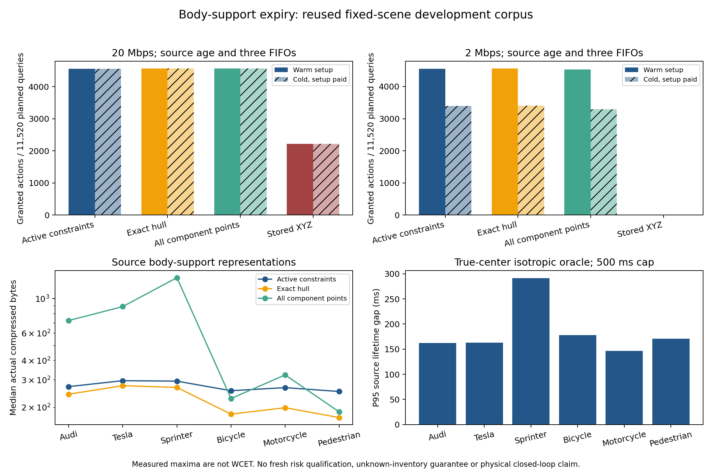

# 从局部点云反推状态集合，再计算证据有效期：完成一轮，尚未完成目标

2026-10-04，sheng。代码与实际报文、计时、独立审计均保留。本轮是已经看过的旧数据上的有限开发实验；没有新采集、没有新风险保证，也没有建立持续研究循环。

**结论先说：不再把局部可见点的中心当作物体真实中心，可以得到可核验的状态集合和有效期；但精确计算并未消除模型保守性，稀疏证书也没有战胜完整凸包。** 因此不能写成“已经解决可信且不过度保守的语义证据有效期”，更不能宣称 MobiCom 创新已经成立。

## 本轮解决的具体部分

前一轮背景扣除使 Sprinter 的描述性中心误差半径从 5.591086 m 降到 1.283823 m，却产生 10/60 个旧测试回合的真实中心排除。局部点云被遮挡时，观测点中心没有等同物体中心的理由。进一步缩小这个半径不能充当可信方法。

本轮把一个保留点组 G 解释为一组关于潜在中心 x 的约束：

\[
C_G=\bigcap_{p\in G}B(p,R_{\rm body}+8\,\mathrm{mm}+\delta),\qquad
C=\bigcup_G C_G .
\]

完整保留所有组和所有量化点，不使用目标 ID 选组。R_body 仍取已知类别三维半尺寸的范数，8 mm 支付厘米量化误差；δ=0 是前一轮拟合得到的**描述性开发参数**，没有在本轮重新标定，也没有统计资格升级。某组若确为目标表面点，其约束有明确几何意义；“真实中心属于至少一组”仍需单独验证，报文验算不能证明组的纯度、观测完整性或未知障碍物不存在。

每组的完整凸包与完整点集在这一模型里**严格等价**，无需近似。给定两个固定查询位置（±6 m）及 0.75 m 查询圆，求候选中心集合到查询的最小距离。整数对偶下界保证距离不会被高估；完整约束内的有理可行点给出上界。浮点 C++ 只提出候选。重合、相切、三圆两两相交而总交集为空、孤立交点均有独立处理和测试。

距离转成有效期时，沿用 5t+1.5t² m 的未来中心位移包络、完整体积外包圆及 500 ms 上限。动作需要 200 ms，加 20 ms 时钟预留。有效期从原始采集时刻起算；编码、实际字节传输、传播和接收计算只能消费有效期，不能刷新它。旧事实可继续使用；新观测缺失或计算拒绝不自动撤销旧事实；确证整集为空则撤销。

**这给出条件成立时的有效期下界，以及该抽象模型最优有效期的上界。它没有给出全部原始射线相容真实世界的最优安全期限。** 条件推导见 [THEORY](../experiments/body_expiry_20261004/THEORY.md)。

## sheng 的实际结果

沿用 360 个计划测试回合，14 个采集失败仍保留在动作分母里。2076 帧中 2072 帧得到有界证据，4 帧缺失有效点组而拒绝。独立审计重构 376837 个量化点、5746 个交集证书，核验 8304 个实际报文、5760 条完整队列轨迹及 184320 个动作判定。13 项不同边界/传输/独立验算测试在两个主机均通过。

4144 个有界源查询的距离上下界最大宽度 **2 µm**，有效期最大宽度 **1 µs**。六个类别在复用数据上的有观测中心排除数均为 0/60；拒绝帧没有被当作成功覆盖证据，采集失败回合没有从分母删掉。这个结果不能代替新冻结批次的风险标定，也不是许可条件下的错误概率保证。

四种方法真正编码、解码三次：稀疏活动约束、完整凸包、全部点组量化点、完整已保存 XYZ。原始 XYZ 报文逐字节重编码等于父实验报文，但接收端使用本轮新模型；父实验的中心校准不随旧运输报头继承。发送端支付当前前端、凸包/证书构造与编码，接收端支付实际验算。保存的点云是原来的 stride-four 数据，原始选择成本取父实验实测最大值并另加本轮处理时间。三次最大值不是 WCET。

公共背景、目录、位姿和模型注册的实际 setup 是 **55264 B**，发送构造 3780 µs、接收 1519 µs。冷启动与帧共享三条 FIFO。暖启动明确假设 setup 在回合之前已安装。

| 链路与启动 | 稀疏约束 | 完整凸包 | 全部组点 | 已保存 XYZ |
|---|---:|---:|---:|---:|
| 20 Mbps 暖 | 4556 | **4564** | 4563 | 2215 |
| 20 Mbps 冷 | 4556 | **4564** | 4563 | 2215 |
| 2 Mbps 暖 | 4554 | **4560** | 4533 | 0 |
| 2 Mbps 冷 | 3398 | **3404** | 3294 | 0 |

每列每行分母均为 **11520 个计划动作查询**。20 Mbps 下 setup 在首个正常观测可用前已完成，故冷暖计数相同；2 Mbps 下冷启动真实支付约 221 ms 的字节传输，显著减少许可。这是源时间戳回放与实测计算/实际字节上的模型链路，尚非真实无线实验。

稀疏约束对完整凸包在 20 Mbps 下仅有 3 个独有许可，却损失 11 个；2 Mbps 下独有 3 个、损失 9 个。微小计时差异不支持稳定优势。稀疏表示各类报文中位数 253–297 B，凸包是 172–276 B。当前两查询证明的长整数、方向与权重比短凸包更贵。发送端稀疏证书中位开销约 1.985–3.299 ms，凸包 1.796–2.921 ms；接收端虽缩短到 61–82.5 µs，净收益仍未成立。只展示对 19 万字节 XYZ 的压缩比，会掩盖这个负结果。不能据此宣称新通信算法优于强基线。

## “不过度保守”仍卡在哪里

与已知真实中心、相同体积圆/位移包络/上限的离线参照相比，源有效期差距中位数都为 0，但 P95 为：

| 类别 | P95 有效期差距 | 不受 500 ms 上限遮蔽的 P95 距离差距 |
|---|---:|---:|
| Audi | 162.006 ms | 2.476 m |
| Tesla | 163.156 ms | 3.468 m |
| Sprinter | **291.610 ms** | **4.064 m** |
| 自行车 | 178.151 ms | 1.168 m |
| 摩托车 | 146.385 ms | 1.283 m |
| 行人 | 171.011 ms | 1.021 m |

前三类最大有效期差距可达 500 ms。中位数 0 受上限和本就不安全的查询影响，不能证明整体不保守。这里统计的是有界源查询，不是筛选后的已许可查询；也没有为缺失帧伪造有效期。

进一步保留 **53 个条件模型接触见证**：真实中心参照能支持至少 220 ms，但当前模型期限为 0，某个完整点组交集中存在可核验的当前接触中心。32 个属于 Sprinter。这些点满足全部组点约束，已有原始点云 SHA 链接和整数证据。它们证明“再精确解同一个模型”不能消掉这些拒绝；**它们不是已证明与所有射线及真实网格相容的物理反例**。下一步若要减少保守性，需要增加合法的形状/姿态/时间关联约束，或用任务有效期校准处理模型欠拟合，不能删除不喜欢的候选点或凭真值挑选点组。

所有方法/启动组合合计 55539 个重复比较许可涉及 277695 个未来真值网格检查，观测到 0 个圆体积冲突。这不是 55539 个独立安全样本，更不证明两次物理采样之间的连续安全。

## 文献后的研究判断

[HMS-SCP 作者预印本](https://arxiv.org/html/2608.14603)的远场“safety horizon”指感知距离，训练/评估围绕检测、多尺度 JSCC 和推理时间。[Semantic Communication for Cooperative Perception using HARQ](https://arxiv.org/html/2409.09042)的 SimCRC 用感知损失差的相似性排序指导重传。这些指标本身不等于“接收时刻还能安全使用到何时”。这是本项目的问题定位，不能当作全面新颖性证明。

已有 [CooperTrim](https://proceedings.iclr.cc/paper_files/paper/2026/hash/c99e08e921b90e901e5eaa7ddee51d6c-Abstract-Conference.html)及前一轮读过的 MOT-CUP 已涵盖不确定性驱动分享/跟踪。集合传播、活动约束、凸包压缩和可检查报文也都是已有工具。因此 MobiCom 2027 的故事不能靠“加上证书”成立，而要证明：**不完整观测的歧义如何限制寿命；通信怎样买到能够减少该歧义的约束；收益在付完真实代价后仍超过同信息强基线。** 本轮明确了第一个模型边界，也淘汰了当前稀疏证书优于凸包的主张；尚未完成后两项。

## 可复现性与失败留存

冻结协议与源哈希先于本轮收费实验输出；由于已看过旧数据，这不是前瞻性新数据预注册。首轮因相对输出路径与绝对仓库根混用，在完成第一帧前失败。只修复路径；原始源码、冻结文件、setup/部分报文及错误日志保留在 `at_first_run`。模型/阈值没有变。

源与队列审计、汇总、模型接触诊断三对 JSON 跨主机逐字节相同。实际源代码、报文、setup、计时、构建收据、结果图和 SHA 闭包见 [复现说明](../experiments/body_expiry_20261004/README.md)、[汇总](../results/body_expiry_20261004/summary_sheng.json)、[独立审计](../results/body_expiry_20261004/audit_sheng.json)。不改写旧实验；没有 simulator 进程或定时研究任务。完整项目目标保持未完成。

