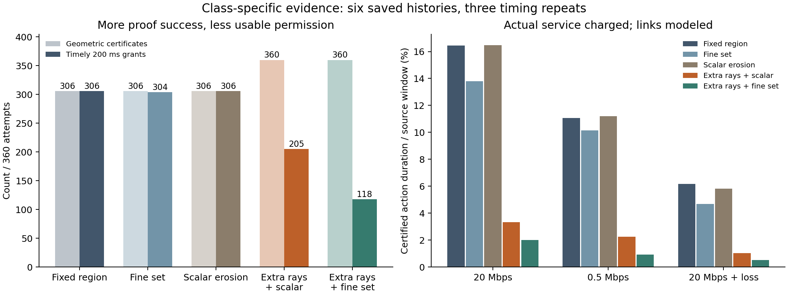
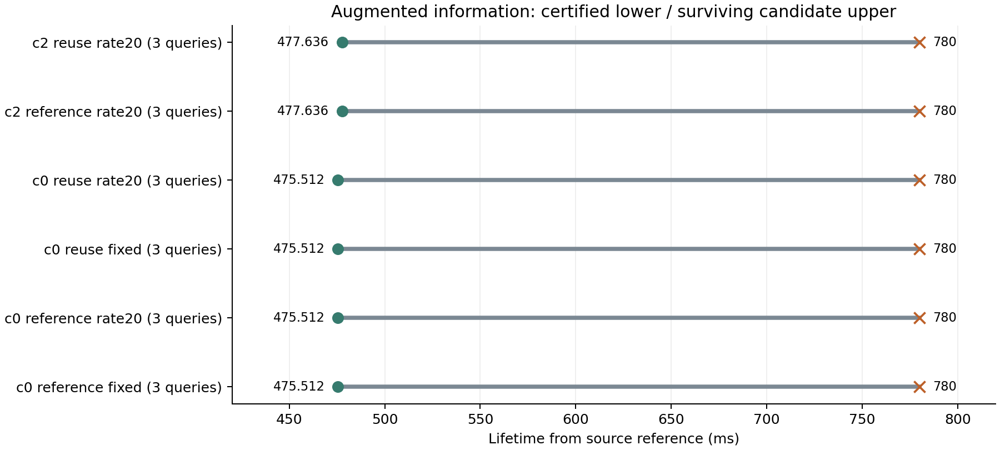

# 按类别保留证据：恢复零有效期，但计算与通信代价仍限制收益

本轮在sheng完成5400条对照记录，并对补充观测后的有效期重新求证。
**small类保留525ms防护事实、vehicle类保留475ms，动作仍只授权475ms，
可以消除本组长间隔历史的零下界。**但额外选证据的代价使标准链路及时授权
从306/360降至205/360，因此当前实现还不能宣称端到端改进或MobiCom创新成立。
完整项目仍未完成；代码、正负结果、计时修正和独立复核均保留。

## 这次解决了哪个具体问题

原算法按最短联合有效期475ms选射线，也把两类可以保留的空域事实都截断到475ms。
完整当前扫描的探查表明，small类能够支持更大的防护区域。我们为small选择真实
补充射线，保留所有原始射线和物理参数，让接收端分别维护两类空域事实。

保留事实与授权动作是两件事。历史空域按有界运动侵蚀后，接收端使用当前射线
证明新目标区域；两类都通过才发放联合动作权限。已过期动作不会因为事实仍在
而恢复。新增“标量空域侵蚀”基线也允许已知区域逐渐缩小，并与原来的强固定区域、
精细位置集合方法比较。推导和假设见[THEORY](../experiments/class_guard_20261002/THEORY.md)。

从相同原始信息出发，三个方法的标准组几何结果仍都是306/360。加入相同额外
观测后，标量方法与精细集合方法都达到360/360。因此恢复首先来自**真实信息补充**，
不能只归功于新的标量公式。原先失败的是120个不同源帧中的18个；三次计时重复
产生54条失败记录，不是54个独立场景。在之前选定的22／25／39查询上，三个零
下界现在均为475.512ms，但这是新增信息后的结果，没有解决原信息不变时的最优下界。

## 全成本比较

六条已有历史，每条先完整验证42个根历史包，再处理source20..39。五个方法、
三次计时重复、三种链路预设，共5400条记录。所有方法使用相同的有界字典传输，
每五帧完整刷新；丢包组丢弃27／28／29。源端没有访问后续帧或已丢失的接收端消息。
链路和队列为模型，CPU服务为实测；这轮没有新运行CARLA驾驶。

| 方法 | 标准组几何认证 /360 | 标准组及时授权 /360 | 慢链路及时授权 /360 | 丢包组及时授权 /360 |
|---|---:|---:|---:|---:|
| 强固定区域 | 306 | 306 | 219 | 111 |
| 精细位置集合 | 306 | 304 | 219 | 110 |
| 原射线＋标量空域侵蚀 | 306 | 306 | 219 | 111 |
| 补充射线＋按类标量事实 | 360 | 205 | 139 | 63 |
| 相同补充射线＋精细位置集合 | 360 | 118 | 55 | 31 |

标准组为20Mbps＋20ms，慢链路为0.5Mbps＋20ms。及时授权严格要求
`向上取整的证据年龄＋200ms < 有效期`。在共同源时间窗口上，强固定区域的标准组
授权时长覆盖率16.443%，补充射线标量方法只有3.324%。几何成功率高不能替代可用时长。

360次补充选择均成功，每包多1615–1633条真实射线；源选择增加65.556–128.528ms，
中位数71.041ms。标准组全部更新包总字节从强固定区域的1,569,495增加至2,216,334。
按类标量方法的中位总年龄242.700ms，强固定区域155.620ms，200ms执行余量因此更易耗尽。
这些数字来自当前两遍选择实现，不能解释为补充证据的不可避免成本。

在原来最困难的c0 reference_rate20历史中，补充射线标量方法仍把及时授权从6/60
提高到35/60；其余历史的额外成本超过收益。这支持进一步研究按需补充，但不能
事后利用运行名称或未来结果当作“在线选择器”。11秒左右的暖历史初始化为多个算法
实例合计报告，最后根包的发送／验证另行计入；没有宣称冷启动实时性。

## 更充分的信息需要重新验证保守程度

原始信息上的550／545ms反例上界不能直接套到新增信息。按预先固定的诊断规则，
我们把原有84条球体／椭球／方向解耦候选，逐一对完整新增历史重验，共进行
15,400,478个三维射线段检查。36条仍通过严格误差裕量；另48条未通过充分认证，
不能据此宣称最优性或把未通过本身当成稳健反驳。

18个联合查询都有幸存反例给出780ms上界。c0的12个查询下界475.512ms，c2的
6个查询下界477.636ms。因此在新增信息与同一抽象合同下，有`L ≤ H* ≤ 780ms`，
遗漏有效时长至多304.488ms，相对损失上界39.037%。这是一个仍然较宽的界，
不能称作近最优，也不代表实际损失必然达到39%。旧信息上较紧的13.54%界与这个
新信息界针对不同问题，不能直接比较算法优劣。

上下界只在明确的核心、外廓、速度／加速度、射线误差和共同时间相位合同下成立。
反例没有强制道路／墙体／地形约束，也不是完整替代CARLA世界。200ms余量不能
替代经过实测验证的移动备份控制器。上界复核为离线诊断，其计算时间不免费用于在线授权。

## 独立检查与发现的计时错误

独立审计器没有调用被测guard／flow／observer／native代码。它重新验证252个
历史包、6个增补根、120个原始源与120个增补源；检查360次选证据记录、5400次包
重建与费用、4104次逻辑类别传播、1392个状态数组对照、3621个边界和270个时长窗口。
传播用独立顶点KD树；过去位移用独立闭式公式；覆盖用逐球严格距离检查。

审计期间发现初始FIFO模型没有把根包对链路的占用传给首个更新，影响所有90个
慢链路初始条件。之前的审计也复用了这个建模假设，所以第一次通过没有证明
整个计时模型正确。现保留原始CPU测量和包，显式初始化根包源端／链路占用，
重算5400条队列，并独立验证所有非计时字段不变。402条慢链路记录改变；标准和
丢包组逐条不变。本报告和图表全部使用修正结果，详见[修正记录](../experiments/class_guard_20261002/FIFO_CORRECTION.md)。

两端各通过11项不同测试；最终FIFO／几何审计和新增信息反例审计分别逐字节一致。
初次父证据登记失败、一次审计路径设置错误、初始计时模型与修正过程均保留。
三次重复是计时重复，六条历史存在重复几何；不报告独立场景显著性或实际无线保证。

## 对候选问题的更新

更具体的候选问题是：**怎样给不会立刻延长联合有效期、却能避免未来证明中断的
观测定价，并在选证据、传输和验证后仍增加可用动作时间？**本轮显示，当前受vehicle
限制的联合期限没有变，额外small事实却能恢复长间隔历史；同时无条件补充会亏损。

[Where2comm](https://proceedings.neurips.cc/paper_files/paper/2022/file/1f5c5cd01b864d53cc5fa0a3472e152e-Paper-Conference.pdf)
已经按置信与请求选择空间信息；[Chiu和Smith](https://arxiv.org/html/2305.17181v1)已经使用
两轮信息增益选协作者。[SComCP](https://arxiv.org/html/2507.00895v1)研究特征选择和噪声信道编码；
[RICPN](https://www.sciencedirect.com/science/article/pii/S0968090X26000355)研究风险与盲区决定合作需求。
所以“只发重要信息”“按需请求”“风险驱动”都不能单独作为创新。阅读范围和推断见
[文献记录](../experiments/class_guard_20261002/READING.md)。

下一步需要解决的已是明确、可证伪的算法问题：从接收端可知历史推导未来证明
中断风险，选择最小必要补充，并与同信息强基线比较净动作时长。当前固定525／475ms
和非最小射线选择尚未实现这一机制。物理合同校准、动态场景、移动控制及真实链路
也仍是完整MobiCom项目的未完成项。这轮完成实质实验与问题收敛，没有创建持续研究循环。

复现与完整数据：[代码](../experiments/class_guard_20261002/README.md)、
[修正后的5400条记录](../results/class_guard_20261002/fifo_corrected.json)、
[结果摘要](../results/class_guard_20261002/summary.json)、
[独立审计](../results/class_guard_20261002/audit_sheng.json)、
[新增信息反例复核](../results/class_guard_20261002/witness_sheng.json)。
