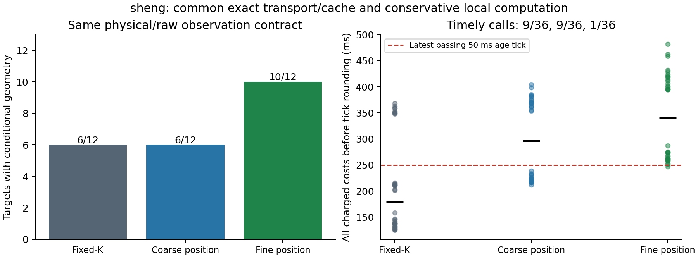

# 证据有效期的精度与使用前成本：有限共同优化验证

**已经实现条件可信的后验有效期、减少部分表示保守性，并降低传输和
重建成本；细粒度证据仍未达到稳定实时可用。** 本阶段在 sheng 增加
108 次冻结配对调用，代码与原始结果均归档。没有创建持续研究循环。

本报告接续 [同观测基线/细化诊断](set_observer_result_20261002.md)：保持
实际射线和物理参数不变，细化把可证明目标从 6/12 恢复到 10/12，但
计算/传输过时。本次执行上阶段已经明确的成本问题，没有仅停留在建议。

## 本次完成的实现

所有方法共用精确时间字典传输：只把每条射线时间戳转为相对于当前
参考时刻的整数年龄，保存原始 metadata、坐标、顺序和校验和，重建后
逐步通过原始合同解码。几何/年龄变化产生新模板；不用相似性近似。
压缩/解压、模板/步数/射线、重建大小均有边界，拒绝截断和尾随数据。

每个目标从空缓存开始；精确缓存键包含实际量化几何/年龄，位置传播
键再包含完整旧可能集合及精确位移。fixed-K 还包含声明 horizon，所有
方法每步继续验证原始校验和、物理合同及时间/序号，不缓存时间授权。
初次计算、建键、字典编解码、完整原始解码和最大期限计算都付费。

粗/细位置集合共同使用保守计算窗口，小类半宽 9 m、车辆类 11.5 m。
原始物理合同的 15 m 域没有改变；计算窗口外全部作为未知入口，每次
传播均注入可能进入的中心，并检验整个未来需求在窗口内。传播还共同
使用既有的可分离平方欧氏距离变换，见
[Felzenszwalb–Huttenlocher 原论文 §2](https://theoryofcomputing.org/articles/v008a019/v008a019.pdf)。
本项目实现该已有算法，用原先的全 tile 距离和向外比较条件；不把
字典、缓存、局部域或距离变换本身声称为创新。推导见
[THEORY](../experiments/compact_observer_20261002/THEORY.md)。

## 108 次配对实验的结果

全部 6 历史、目标 25/39、3 方法、3 次随机顺序重复。原始输入和已付费
FIFO 源生成记录与上阶段完全相同，所有当前目标成本重新实际测量。
链断的 fixed-K 不发送失败证明，但仍承担历史源成本。初始化三个
接收器各历史合计 8.87–10.11 s，单独报告，不称为免费冷启动。

| 共同优化后的方法 | 几何可证明目标 | 严格使用时限通过 | 非零条件期限 | 当前调用总成本范围 |
|---|---:|---:|---:|---:|
| fixed-K | 6/12 | 9/36 | 475.000 ms | 125.030–368.163 ms |
| 粗位置集合 | 6/12 | 9/36 | 475.211 ms | 211.802–404.446 ms |
| 细位置集合 | 10/12 | 1/36 | 475.512–475.551 ms | 246.702–482.212 ms |

判断继续支付当前字典装包、解压/原始校验/重建、20 ms+实际字节×8/20 Mbps，
向上取 50 ms age tick，再要求 age+200 ms<H。fixed-K 的低成本范围含
几何拒绝，不可计为有用成功。通信是明确的软件链路模型。

所有及时的固定 K/粗集合请求都是三个 reuse 历史的短目标 25，各三次。
细集合只有 c0/reuse_fixed 的目标 25、重复 0 通过，成本 246.702 ms；
距下一档拒绝只余约 3.298 ms 原始成本余量。额外恢复的四个 reference
目标仍未及时通过。长目标 39 全部过时，不能称为已实现中断后的实时
全面恢复，更不能把这次固定 K/粗集合的 9/36 当成细集合优势。

字典后每个已发送包为约 21.0–22.0 kB，传输项为 28.418–28.797 ms。
原先约 128/430 kB 的短/长历史传输项约 71/192 ms；原始内容保持精确
一致。新粗集合完整调用中位数 296.312 ms，细集合 340.792 ms。
组合工程优化降低了成本，但未隔离每项因果贡献；跨批次的原/新计时
也不能冒充统计显著性、CPU 最坏时延或移动场景普遍收益。

## 完整复核及真实局限

六个新不同测试在本地和 sheng 通过：native 传播与直接 square 距离/
原 EDT 一致，变化射线/年龄的字典无损，错误模板/大小/尾随输入拒绝，
未知入口仍可能，几何缓存正确失效，以及合法变观测的缓存重建与完整
不缓存计算相同。上阶段的八个测试及其记录保持冻结。

独立审计不导入 compact、native 或 EDT：重验 252 原历史包、120 实际
源记录，用个体球及顶点 KD 树不缓存地重建 480 次分类传播，核对 72
保存集合、30 传输包、108 成本行和 40 个 H/H+1 边界。另检查 72 个
局部集合包含原完整域集合的对应裁切、24 个位置集合目标期限保持
一致，以及 30 个字典精确重建原来的 typed packet 字节。独立结果已经
在本地与 sheng 逐字节一致，随后才封包发布。

当前数据各历史 20 个保存源的量化几何/相对年龄重复，所以精确缓存
收益受这一条件支配。改变射线的测试验证正确性，不替代移动场景的
性能实验。物理首回波/误差、不透明内核/外包、每次实际观测的速度界、
连续存在和公共可信时间轴仍是未完全标定的前提；校验和不认证源。
这是固定区域时间戳回放，没有新增 CARLA 驾驶、真实无线或安全认证。

本次把“可信却可能过于保守”与“有效却送到已太晚”分开，并完成了
共同成本优化的有限验证。尚未解决的是：既保留必要精度又在长链/变
几何情况下稳定及时交付，以及可执行动作闭环、物理标定和能胜过
既有强方法的通信创新。MobiCom 2027 项目仍未完成，不改写剩余目标。

另一个必要强基线是接收端持续维护已验证后验：本次每个目标从已验证
旧根重建整个所需历史，目标内缓存不跨请求。实际接收器可以在每条
观测到达时支付传输/校验/状态更新，再使用自身可信后验作为下一步
起点。该流式基线必须计入所有维护消息和队列，不能免费借用未来状态；
当前结果未测试它，因此长历史失败也不能推广为所有合法实现都失败。

代码/冻结协议/复现命令：
[compact_observer_20261002](../experiments/compact_observer_20261002/README.md)。
原始行：[analysis](../results/compact_observer_20261002/study/analysis.json)。
独立复核：[validation](../results/compact_observer_20261002/validation.json)。
精确比较：[equivalence](../results/compact_observer_20261002/equivalence.json)。
