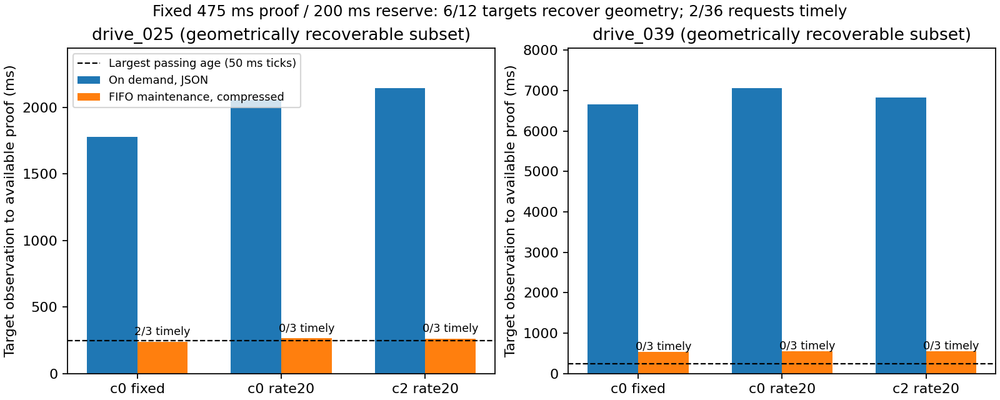

# 不完整观测的证据有效期：历史事实恢复、年龄耦合与实际可用时间

本轮在 sheng 完成两个有限实验：144 次按需补证调用；360 次逐观测维护和72次目标请求评估。历史连续性能够在6/12个目标上补回被自遮挡的几何证据，按需补算全部迟到；维护、原生网格验证与有界无损传输后，36次恢复请求有2次赶上固定475ms证据、200ms使用预算和50ms时钟格的诊断。其余失败全部保留。没有建立持续研究循环，也没有启动新 CARLA 行驶试验。

## 核心问题的可实施答案

**有效期来自所有仍可能存在的障碍状态及其运动范围，不能来自空检测、置信分数或任意 TTL。** 原始第一回波射线在明确的量化、坐标/查询误差、年龄和类别尺寸条件下，排除不可能的障碍中心。没有被排除的空间仍然未知。对固定动作区域，把未知中心能够侵入的最早时间反推为期限；多类别取最短期限，有限域边界也要约束。

本轮进一步保留一个容易丢失的事实：内部虽已被车身遮挡，外部对象也不能无路径地出现在里面。完整旧证明可建立类别中心排除区域 K。之后只证明外部对象可能进入 K 的入口带，就能持续维持这个事实，不需要每帧重新看见内部。通信中断后，接收端重验真正保存的历史射线及严格重叠的证明时段，可以恢复当前事实；没有合法起点或中间有时间空洞，必须拒绝。

这里明确区分三层：过去已证明的事实、当前有效的授权、验算交付后还能使用多久。历史事实能够补证，不意味着过期授权能够使用。新包到达、验算完成后，当前时间加使用预算必须严格小于新的终点。

推导与限制见[条件理论](../experiments/continuity_recovery_20261002/THEORY.md)。这是可复核的条件证明，不是对任意传感器、对象或自然道路的无条件安全保证。源真实性、尺寸/不透明核心、运动和误差界仍未完成物理验证；SHA256只能检查完整性。

## 修掉一个会产生不可信期限的模型缺口

旧投影文档把速度界放在观测时刻。若射线年龄 d、未来时长 h、加速度界 a，分别按同一速度 v 加两段位移，会漏掉 a·d·h。新路径先把参考速度更新为 v+a·d，再计算未来位移；逐射线年龄仍独立保留。即使最新真实射线没有参与平面覆盖，也须随包保留，不能用生成/收包时间代替观测时间。

新模型版本 observation-speed-age-v1 重新验证旧接收端的完整初始链。六条历史共252份旧证据全部通过，没有失败父证据被复用。该界是在每次真实观测时间对整个类别成立的上游条件；若只有初始化速度受限，后继观测不能重新把它清零为 v。旧冻结实验未改写，也不能自动推广到后一模型。

## 有限实验与全部成本

使用已有六条成功初始化的10月2日历史，选 drive25（五次丢包后的首次恢复）和 drive39（更长时间未更新），共12个目标。这些是明确针对旧失败挑选的诊断，不是独立随机测试集。根是 drive20 前最后一份真实已接收证据，后继观测来自真实存档，没有插入理想扫描。

| 实现 | 12个目标中的合法几何恢复 | 三次重复的时间预算通过 |
|---|---:|---:|
| 当前完整射线、去掉过期历史 | 0/12 | 0/36 |
| 最近支持射线、固定475ms补链 | 0/12 | 0/36 |
| 既有贪心、按需生成全部475ms历史步骤 | 6/12 | 0/36 |
| 既有贪心、已保存历史步骤缩到下一真实观测 | 6/12 | 0/36 |
| 逐观测维护475ms、原生完整验证、有界压缩 | 6/12 | 2/36 |
| 同原生内核与压缩的当前冷证明 | 0/12 | 0/36 |

按需实现每次生成所有历史步骤，并支付采集、序列化、完整几何验算、20ms固定链路延迟和全部字节在20Mbps上的传输。固定贪心在恢复目标25需约1.4–1.7秒生成，目标39约5.5–5.8秒；事实虽能重建，早已不可使用。

后续实现不等查询才补算：每次真实观测到达后，以单FIFO工作队列计算固定475ms步骤，不知道下一帧时间或未来查询。360次提前工作全部记录其成本和完成时间，观测采集也计入；生成中位数70.25ms，范围66.46–97.22ms，测得队列等待为零。恢复时再支付完整链条组装、压缩、解压和逐步几何验证。每步最多8192条真实射线、整个解压链最多2.1MB和32步；资源预算大于单包，不能宣称同消息尺寸比较。

当前原生内核遍历个别严格见证球内的实际网格中心，再运行既有最大增益贪心。发送端候选池扩至全部实际跨平面射线。接收端不相信发送端覆盖图，仍重新计算原始射线和误差。无损 zlib 仅改变表示，拒绝超限、截断、尾随数据，不丢掉几何约束。

维护后仍只出现2次时间通过，集中于 c0/reuse/fixed 的短恢复目标：总耗时238.37ms和228.53ms，向上取时钟格后均只剩25ms使用余量，同一目标另一个重复失败。三个可恢复短目标的总耗时中位数为238.37/264.52/262.56ms；长目标为539.15/555.08/548.53ms。长链全部迟到。这是实现可行性和成本瓶颈的证据，尚不能声称稳定优势、有效行驶或解决全部场景。FIFO按存档时间模拟，链路也是模型；200ms为预设诊断使用预算，不是已校准的实车动作保证。

图只展示6个可恢复目标，另6个时间断链负例仍列在完整结果中；虚线250ms是50ms时钟格下最大的允许交付年龄，不是把475ms证据期限改成250ms。

## 最大期限没有挽救时限

新增修正运动模型下的最大整数期限计算：完整域中排除真实射线已证明的单元与整块落在 K 内的单元，对最近剩余单元及有限域边界反推单调运动条件，整数二分到最大微秒。输入是接收端已登记的根和选中原始射线，不接受任意已知空区。

十二个保存的目标步骤都能在“合法 K 已成立”的条件下覆盖475ms，但所选子集的最大联合期限均为475.211ms。完整独立网格验算确认 H 通过、H+1失败，共24个边界检查。每次求边界约287–298ms，作为事后诊断独立记录，没有免费进入计时算法。多出来的0.211ms不能补回丢失的时间重叠或超时。

六个未恢复目标是时间断链，不是当前射线的入口带覆盖不足。即使其单步几何条件成立，也不代表 K 在断链后仍为空；代码继续拒绝。这说明“不过度保守”应指在给定信息和明确证书中不任意缩短期限，而不是忽略最坏情况、放松物理界或假设未观测内部安全。更强的联合状态集合算法可能减少本充分条件的保守性，目前没有证明全局最优。

## 独立验证、论文定位与下一项科学要求

sheng 与本地均通过16项不同测试。独立审计器不加载发送端或原生网格内核，使用不分误差箱的球邻域查询重算完整必需单元。按需包核验252份初始证据、12个保存的包、152个真实历史步骤和144行成本；维护包另核验252份初始证据、120个源步骤、6个保存的完整链及其76个步骤、360行队列、72行成本、24个边界。只归档首个重复的包；其他重复仅有测量与算术核查，不冒充保存了全部包。

启动时的 Python 同名模块导入冲突、审计器对失败调度诊断字段的误读及对应原代码均保留。修复后没有改动已测数据。完整代码、冻结协议、来源和复现入口见[历史补证](../experiments/continuity_recovery_20261002/README.md)与[增量维护](../experiments/streaming_recovery_20261002/README.md)。两项结果各有来源清单及全部文件SHA256清单。

本轮检查原始论文的相关章节：[Orzechowski等2018](https://arxiv.org/pdf/1807.01262)中的集合遮挡推理和已验证起点，[Zhang与Fisac2021](https://arxiv.org/pdf/2105.08169)中的约束可达集与后续观测，以及[Zheng等2025](https://arxiv.org/html/2502.06359v1)的遮挡规划假设和备份控制。阅读范围列在[文献记录](../experiments/continuity_recovery_20261002/READING.md)，未声称完整复现。历史连续性、入口带、集合观测器和备份思想均已有先例。

因此候选问题现在具体化为：**接收端知识可能过期/断链时，怎样用有限计算、字节和原始观测恢复可用的条件证据，而不把过去事实与当前权限混淆？** 当前接口和负例已实现，但 MobiCom 贡献还需对同等历史、源条件与资源预算的强集合观测器建立优势；还需运动车身/控制闭环和真实通信成本评估。少量通过不足以宣布原创突破或整个项目完成。
