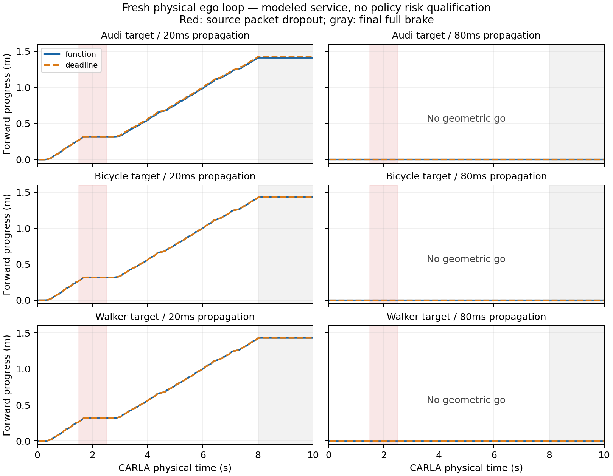

# 部分观测有效期接入真实自车物理闭环

**已在 sheng 完成新点云—源有效期—消息时序—实际自车动作—失效制动的有限闭环。12 段全部成功采集；20ms 传播的六段实际前进 1.412–1.430m，80ms 的六段均拒绝前进。函数式消息没有显示行动优势；补齐紧凑截止时间对照后，也没有报文字节优势。**

本轮是有实际车辆物理响应的同步、实测费用协同仿真，尚不是墙钟实时、真实无线或已经认证的自车策略。生产授权标志始终为 False；只有构造的模拟环境显式执行几何条件，用于工程诊断。没有修改旧策略认证的适用范围。

## 冻结与完整计划

源代码、12 段计划和独立审计在新观测前以提交 `5093782c02cb79d26a77b7882fc486a17c22a3db` 发布，127 个源文件、38 个输入全部冻结。核心 SHA-256 为 `c53d036843ee2fea131d7aff53fea5444b4b6742373dc7cc494ef80556e979b9`。无模型、阈值、风险预算或测试场景重调，无失败补样。

CARLA 0.9.15 / Town10HD_Opt / ClearNoon，50ms 物理步与10ms子步。一个标准 Audi A2 自车、一个停驻登记目标（Audi、自行车、行人三类），原 RSU view0，已有背景与预测器保持不变。自车从登记锚点后12m开始，每段160次驾驶决策加40次全制动；每个驾驶步产生新源消息。两种传播延迟20/80ms、20Mbps串行链路，与 function/direct-deadline 配对，共12段。自行车组倒序运行两个方法。

每段驾驶源索引30–49连续丢弃20个包，约1s；被丢包仍支付序列化链路费用。完整记录1,920份新源扫描、1,920份原始实际报文和2,400次控制决策。所有结果与失败记录均保留。

## 接入时实际补齐的两件事

运行时点云只读取 XYZ。自车进入视野后，使用自车里程计、已知三维车身包围盒和30mm余量去除自身回波；不使用目标 ID、标签或目标真值过滤。标签仅供离线检验。目标类别来自登记清单，完整场景只含实验构造的登记目标；这不是未知目标识别或多目标完整性解决方案。

动作查询中心为当前自车包围盒中心，取整到微米。查询半径为完整三维外形半径向上取整，再加声明速度0.75m/s × 300ms，以及20mm余量。这将一次驾驶及其后备运动纳入同一个查询圆盘。低速反馈目标0.3m/s，超过0.6m/s或离开预定走廊立即全制动。速度上界及300ms制动余量是本轮声明条件，尚未由独立统计样本证明为任意时刻的连续物理边界。

function发送源观测几何与冻结预测，接收端完成后可对当前自车位置查询。deadline在源端按当时自车位置及额外150mm半径计算时间；接收端还要验证当前行动圆盘被该源查询圆盘包含。两种方法使用相同模型、目标外形、源时刻与运动包络。源端可即时获得自车里程计，没有上行费用；这个条件有利于deadline，不能当作分布式无线比较。

逐包实测源采集/复制/前端/预测/编码费用。串行FIFO支付实际包长、20Mbps及传播延迟。到达后才解码与编译，实测接收费用向上取整到物理步后才对控制器暴露；每次查询另付实际计算费用。全部有效期仍锚定源观测时刻，缓存、到达及重发不续期。

## 实际动作结果

| 登记目标 | 传播 ms | function前进 m | deadline前进 m | function几何驾驶次数 | deadline几何驾驶次数 |
|---|---:|---:|---:|---:|---:|
| Audi | 20 | 1.411663 | 1.430041 | 136 | 137 |
| Audi | 80 | 0 | 0 | 0 | 0 |
| Bicycle | 20 | 1.430041 | 1.430041 | 137 | 137 |
| Bicycle | 80 | 0 | 0 | 0 | 0 |
| Walker | 20 | 1.430041 | 1.430041 | 137 | 137 |
| Walker | 80 | 0 | 0 | 0 | 0 |

20ms各段在驾驶步33转入制动，即连续丢包开始后约150ms；恢复新证据后继续前进，并在步160结束驾驶。每段两次驾驶转全制动，12次转换均未被提前恢复驾驶打断，最长三步停车确认时间150ms；加一个50ms驾驶步仍在声明的300ms预算内。这是本批已采样转换的诊断，不是所有中途制动的概率或连续时间保证。观察到的最大速度0.510909m/s，12段均无记录到的碰撞。

80ms条件下，逐级向物理步取整的接收可用时间消耗了源有效期剩余预算，两方法均没有几何驾驶。这揭示当前服务时序的可用性限制，不能把始终停驻当作成功驾驶或安全概率证据。

横轴为CARLA物理时间，红色为源丢包区间，灰色为最终全制动。完全重合的轨迹保留两种线型。每段10s物理记录，本批约156.2s墙钟完成120s计划物理时间，未按墙钟20Hz限速；不能宣称实时/WCET达标。

另一个必须保留的边界：本批全部2,358次非空缓存查询都取到500ms上限，自车始终远离停驻目标。本轮证明接口连接和过期制动有实际响应，**没有检验近障碍时有效期随几何不确定性收紧、移动目标避让或新的保守性改善**。这些不能由本轮行驶图推出。

## 公平报文对照：已经纠正重复字段问题

原deadline发送了接收端不需要的距离下界、声明字符串和重复授权标志，而function没有对应开销。直接比较它们会夸大函数消息优势。保留原报文及驾驶轨迹，另实现紧凑deadline，只传源时刻、查询圆盘、状态及有效年龄，接收端从登记上下文恢复其余字段和绝对失效时刻。

纠正模块与全量同输入审计在评估其输出前冻结，补充 SHA-256 为 `370cc8c3563c6176101b9532713d25011ee1b66f5bea832656e6ce18984dd5ea`。对全部1,920份源观测，用相同冻结几何/预测和原声明源查询分别生成两种报文，完整保留紧凑报文字节。1,179次原deadline缓存决策的源年龄与查询域语义全部保持一致。

| 同输入1920份观测 | 总报文字节 |
|---|---:|
| function | 625,915 |
| compact deadline | 517,225 |

紧凑deadline少17.37%字节；因此没有函数式传输字节优势。该补充是历史输入的报文/语义回归，不是新驾驶实验：没有据新包长重算旧费用、改写旧行动或推断新的实际时延收益。后续实际比较应使用紧凑对照，并支付真实查询上行和网络服务。

## 独立核验及首次失败记录

源前端、冻结预测器和每份原始报文完整重放；模型使用共享冻结实现，未假称独立重写。几何使用另一套整数/Fraction审计，检查2,139次源/接收查询的距离下界、最大整数有效期和严格分离边界；完整三维姿态与八顶点另行重建。1,920份源集合均包含其当时目标中心，没有从不包含目标的源集合出具几何驾驶。统计风险仍未认证，不能把这个零观测排除推广到新交通分布。

离线审计记录的自车回波残留、目标回波误删、0.75m/s自车速度上界及300ms未来已采样车身包络违例均为0。这里检查的是实际采样轨迹和声明条件，不是连续道路或未知对象保证。

原严格审计在sheng Python3.8通过。本地Python3.12第一次因重新计算反馈制动浮点数的逐位相等断言失败，完整日志和102个不一致样本保留；最大差异4.163336342344337e-17。[Python官方文档](https://docs.python.org/3/library/math.html#math.hypot)说明3.10改进了hypot精度，这与末位差异相符，未将其解释为控制变化。

另行冻结兼容审计，仅把一个反馈标量重算断言改为1e-15绝对容差，整数几何、时刻、报文字节、动作选择及原始数据不改。兼容本地、兼容sheng与原严格sheng审计JSON完全一致，SHA-256为 `5c06e92dbb826f690fc46adfb02c6b425a9c9ebb9d00ad3c5a85e0daba2ce344`。紧凑报文全量审计两主机也完全一致。不能把最初的严格本地失败隐去。

## 发布与当前结论

源代码、原始扫描、全部报文、丢包/费用/缓存选择、实际控制与车身轨迹、初始失败、后续补充、图表及冻结凭据完整发布。[复现](../experiments/ego_expiry_live_20261004/REPRODUCE.md)与发布包验证区分字节完整性、几何条件和未获认证的风险。演员计数归零、退出同步模式，仅停止本次匹配PID74332/程序路径/启动时间的服务。没有持续研究循环。

已填补的是物理自车与部分观测源有效期的因果接入，完整MobiCom项目仍未完成。新的自车策略选择性风险认证、任意时刻执行/制动边界、近障碍与移动目标、真实通信服务以及优于公平强基线的移动系统收益仍缺少证据。当前资料不支持宣称函数式消息更优，也不支持将旧固定策略的风险证书用于本批自车。
