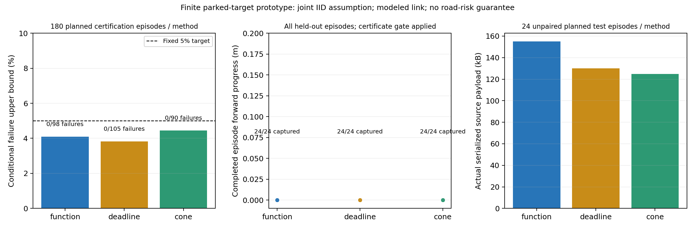

# 不完整观测的证据有效期：整段风险与强紧凑基线

**540段认证和72段测试全部完成，但测试三种方法都没有有意义的前进：最大位移仅0.54微米。条件风险检验通过不等于“不保守而可驾驶”，本轮没有解决全部目标。**

本轮固定540段认证、72段独立测试，在同一实际自车控制法下检验function、单次编码deadline和Lipschitz-cone三种方法。以下是有限构造场景的结果，不能据此认定真实道路风险或MobiCom创新已经成立。

## 有效期从哪里来

运行时输入是XYZ回波、自车里程计、登记类别和冻结上下文，目标真值与语义ID仅用于审计。部分回波约束与固定学习假设给出可能中心集合S；在真实中心属于S时，L(q)是中心到当前查询的距离下界。令B为目标完整三维外形的球形半径，r为包含自车完整外形与未来300ms动作的圆盘半径。

最大有效年龄T取满足严格不等式的最大整数微秒，且上限500ms：

`L(q) > B + r + 5T + 1.5T²`，此处T以秒表示。

绝对到期时间为原始源时刻τ+T。动作必须满足`now+实际已支付查询费用+300ms≤τ+T`，接收、缓存和重新查询均不续期。矛盾、空集、缺失证据和不适用查询拒绝。该几何推导依赖声明的5m/s、3m/s²目标包络和自车行动包络；停驻目标试验不能验证移动目标满足这些条件。

“不过度保守”同时看同模型真实中心oracle与候选年龄的有符号差距、完整计划中的拒绝率、实际进度和报文字节，不能只挑可用帧或更长的源TTL。此前独立近障碍试验中，自行车类集合改善有证据；本轮不重调该模型。

## 科学上新增的检验

旧六帧固定观察法的证书不能覆盖闭环内生观测。本轮统计样本是一整个计划回合，G是曾尝试授权行动，F是任何引用源中心覆盖失败、动作源年龄超界、记录的采样运行违例/碰撞或获准后采集不完整的并集。所有相关帧合在同一个F内；不完整获准回合按失败保留。

使用标准条件二项检验，目标P(F|G)≤5%，三种预先固定方法分别使用1/60显著性，联合置信度至少95%。零失败需要至少80个获准回合。独立Fraction递推复核计数、CDF和上界；测试开始前冻结认证结果，未通过的方法在独立测试中拒绝所有工程行动。此置信解释要求**完整场景及服务/执行过程联合IID**；随机场景抽样不证明服务IID。因此这是带明确条件的原型认证，不是已经验证的道路碰撞概率保证。[风险推导与范围](../experiments/ego_policy_certificate_20261004/RISK_ARGUMENT.md)。

## 冻结、环境和完整计划

核心在新观测前提交`7c6d8bed028a6f299f122c611b899130635b22bb`，冻结173个源文件、54个输入。分析/图表/封装在独立测试和证书生成前以`a624d4bc583bbbf7425831ef464bf76a235ae6cb`发布，冻结178个源文件、54个输入。没有更换失败场景、追加认证样本或依据测试调参。

在线Tailscale节点名称sheng对应Windows DESKTOP-UGDDO8T；CARLA0.9.15在Windows运行，计算在该机Ubuntu20.04 WSL用户sheng下运行，不将其报告为另一台Linux集群。历史SSH别名地址本轮不可达；实际使用已核验在线节点。[真实运行环境](../experiments/ego_policy_certificate_20261004/RUN_ENVIRONMENT.md)。

场景law为243个有限单元：Audi/自行车/行人三类停驻登记目标，6/7/8m自车起点，目标纵横±10cm/0cm及偏航±10°/0°，独立有放回抽样。每种方法180认证+24测试，方法顺序轮换而场景不配对。每段60个驾驶步、40个最终制动步，20个源观测/3s，20Hz控制；第30–49控制步对应7个源包丢弃。源端与接收端指定处理费用实测并支付在20Mbps FIFO+20ms传播的同步物理模型中，50ms物理步/10ms子步，非墙钟实时、非实际无线、非所有RPC的端到端计时或WCET。自车里程计即时免费，无uplink费用。认证原始数据的一次性归档曾与部分独立测试并行，没有性能隔离；处理费用保留原实测值并照常支付，不能将这些结果报告为隔离资源的性能基准或证实相同服务law。联合服务IID与测试law迁移仍为未验证条件。

三个方法都只有一次相同前端/模型处理及一次实际报文压缩。deadline源查询额外包含150005μm运动/取整余量；cone发送源锚点和距离下界，在新位置用`max(0,L0−ceil(||q−q0||))`更新距离，再用相同整数运动期限。这个标准三角下界基线消除了把标量查询域损失误认为完整几何报文必然优势的解释。

## 全部认证结果

| 方法 | 计划回合 | 获准回合n | 获准后失败k | 条件上界% | 通过5%检验 |
|---|---:|---:|---:|---:|---|
| function | 180 | 98 | 0 | 4.091831 | 是 |
| deadline | 180 | 105 | 0 | 3.824329 | 是 |
| cone | 180 | 90 | 0 | 4.447344 | 是 |

该上界仅针对定义的P(F|G)和声明的联合IID回合law。未获准回合不能当作成功驾驶；0次记录失败不表示真实风险为0。

## 全部独立测试结果

| 方法 | 完整/计划回合 | 实际驾驶授权/计划驾驶步 | 完整回合平均前进m | 源年龄有符号差距P95 ms | 实际源报文kB |
|---|---:|---:|---:|---:|---:|
| function | 24/24 | 144/1440 | 0.000000 | 73.260000 | 154.938 |
| deadline | 24/24 | 155/1440 | 0.000000 | 98.100000 | 130.146 |
| cone | 24/24 | 144/1440 | 0.000000 | 72.888000 | 124.833 |

**function/deadline/cone分别尝试144/155/144个驾驶步，但全部72段几乎静止，不能当作成功驾驶。** 原500ms源期限与300ms动作预算叠加采集/接收延迟，150ms刷新间隔会中断连续油门；当前把几何授权当作有用进度的解释被这批测试否定。另行冻结的36段接收预算诊断检验该原因，不迁移本轮证书。

各方法是独立场景抽样，不是相同输入的配对比较；不能据该均值差距声称因果增益或同输入压缩率。年龄差距保留有符号值，所有可用缓存驾驶查询均纳入，没有将相关查询作为独立样本。均值仅使用明确列出的完整回合，不完整回合仍保留在计划分母与风险判定；完整逐回合数据见summary_sheng.json。认证拒绝会改变测试行驶和观测，不能把测试拒绝方法的轨迹当作未加门控的反事实轨迹。

## 费用与完整性

| 方法 | 源费用P95 ms | 接收费用P95 ms | 查询费用P95 ms | 缺失缓存驾驶步 | 年龄超过oracle次数 |
|---|---:|---:|---:|---:|---:|
| function | 5.956250 | 0.810200 | 0.911050 | 72 | 0 |
| deadline | 6.697600 | 0.188100 | 0.100000 | 72 | 0 |
| cone | 6.557250 | 0.174050 | 0.132000 | 72 | 0 |

认证采集完整540/540、测试完整72/72，审计合计12240份新源扫描、61200次控制决策与47736次独立几何查询检查。

认证采样违例：`{"ego_enclosure": 0, "ego_speed_cap": 0, "self_mask_leak_returns": 0, "target_mask_removed_returns": 0}`；记录碰撞0。

测试采样违例：`{"ego_enclosure": 0, "ego_speed_cap": 0, "self_mask_leak_returns": 0, "target_mask_removed_returns": 0}`；记录碰撞0。

全部原始扫描、实际报文、完整/部分轨迹、失败、门控、时间戳和费用均保留；核心及补充源码/input逐文件SHA核验。本地Python3.12与sheng Python3.8的两份物理审计、条件统计审计和汇总均逐字节一致；整数几何与期限严格，反馈标量仅采用采集前固定的1e-15跨版本容差。

- audit_certification SHA-256：`efa025891b2260b0023e517accb9bfa0b909a45c5d5c74673b1bc2f4f7dd436c`。
- audit_test SHA-256：`99e58d9ce0bc1d9ad8b658d1d249c36963c23aef630d464d7991b3476095d0ab`。
- certificate SHA-256：`e76f12cd5f4561d665d8b731d41308196b95a7b4dfc91e180ec72610b1006403`。
- summary SHA-256：`33ee101c9fbee22b99a0fcefcd499dcb5f7e9a2542417905336d9bcc2ed55c2d`。

拥有的CARLA进程按PID、可执行路径和启动时间核对后停止，两次采集均清空车辆/行人/传感器并恢复非同步。没有持续研究循环或定时任务。复现及完整字节闭合见[REPRODUCE.md](../experiments/ego_policy_certificate_20261004/REPRODUCE.md)与verification_local.json/verification_sheng.json。

## 全量同输入强基线回放

同输入比较在独立测试及证书生成前冻结，保留全部可用源观测及缓存驾驶查询，未依据结果选样。该回放针对表示质量和实际序列化长度；它不会重写已测费用、原驾驶动作或迁移另一策略的风险证书。

完整/计划测试回合72/72，同输入源观测1440份，可用缓存驾驶查询4104次，缺失缓存驾驶步216次。三种报文对应各自真实采集方法时，逐份重现原报文字节；相同输入的前端、模型假设和自车掩码完全相同。

| 方法 | 全部同输入源报文字节 |
|---|---:|
| function | 469018 |
| deadline | 391979 |
| cone | 373394 |

function−cone年龄差距保留正负值：最小0.000000ms、中位0.000000ms、P95 0.000000ms、最大0.001000ms。完全相同4076次，cone更长0次；deadline查询域无效0次。

cone更新的依据是源下界对真实距离成立时的三角不等式，不要求每次重新优化得到的数值下界自身是Lipschitz函数，因此不把function必然支配cone写成未经证明的前提。由于这些轨迹几乎静止，4076次相同期限不能证明移动查询等价；紧凑cone同输入报文减少约20.4%，当前没有支持完整几何消息通信优势的证据。全部函数与源标量几何使用独立Fraction检查，cone年龄另用严格整数安全端点检验。三种消息在相同源观测上比较，但来自相关闭环；不能把数千查询作独立统计样本。

同输入诊断SHA-256：`1bdb07ffc565e596a71a8a1d74d2430efbc45e33da6744bc79bde0006c344a14`，补充冻结SHA-256：`b4151cf4e04a17da60b2bea3cc7e6fc29b624a48e35b853317556d65565bb63a`。本地与sheng逐字节一致，额外完整分母核对见matched_verification.json。

## 文献约束与研究判断

额外阅读[Steinmetz等2018作者全文，CARA](https://research.chalmers.se/publication/508154/file/508154_Fulltext.pdf)的II–V节：该工作用状态不确定性与未来碰撞可能性决定通信时机；其基础信道设定误差为零、延迟可忽略，车辆沿固定路径建模。由此不能把“不确定性决定最晚刷新”说成本项目首次提出。部分XYZ回波的集合可信性、实际源年龄及获准后的风险是本项目需要另外验证的环节；本轮也未复现CARA控制器。

[FCP-MPC、conformal ACC及STCC阅读记录](expiry_motion_prior_work_20261004.md)已明确全文与摘要的阅读范围。可查询距离场、集合传播、conformal校准、Lipschitz下界和二项检验都是已有工具；本轮的可复现组合与验证不自动成为新算法贡献。

本轮补上新有限自车策略的整段条件风险检验及优化后强紧凑对照，但否定了该控制时序能够提供有用行驶的主张。原同输入导入失败保留，仅显式路径修正；原图表布局警告和PNG也保留，另图只修正米尺度与标题布局。真实移动/遮挡多目标完整性、未登记隐藏目标、实际网络、连续执行包络与足够强的MobiCom通信创新仍没有完成证据。问题不能通过让停车比例任意增大而被宣布解决，也不能通过不断换场景和增加样本包装通过。本报告保持完整计划与负结果，整个MobiCom2027项目仍未完成。
