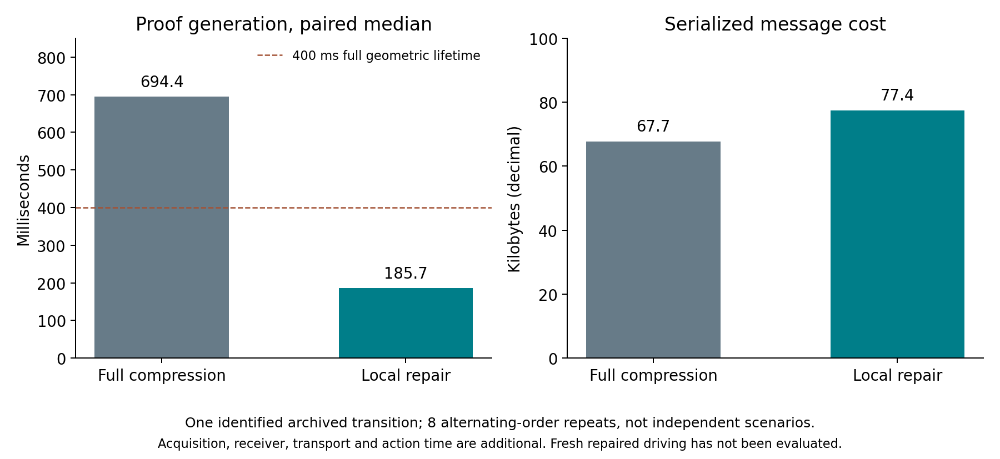

# 有几何证据却无法及时续期：实际车辆集成、失败定位与局部修复

**本轮没有实现成功的证据驱动行驶。** sheng 完成三批、每批四种配置的有限集成实验；其中三组进入了实际车辆阶段，共记录 120 次行驶阶段决策、1,813 个物理 tick，前进指令均被拒绝。随后把失败定位到一个可修复的算法环节：旧支持点只漏了 19 个分属两类模型的网格，系统却退回全量压缩，错过证据截止时间。事后局部射线修复生成了完整可验证证明，在该帧的配对计时中将生成耗时中位数从 694 ms 降至 186 ms；尚未完成该修复的新闭环验证。

## 1. 实际集成范围与不变条件

此前独立动作实验不能替代闭环。本轮加入真实 CARLA ego、当前传感器射线、接收端历史、准入判断与实际控制接口。第一视角的路侧传感器横向距离/高度为 4/8 m，第二视角为 8/6 m；每个视角分别测试仅当前射线和接收端历史两种模式。两类障碍物、10 mm 输入坐标盒、400 ms 证明时长、区域半长 2.3 m / 半宽 1.3 m 与 30 mm 裕度均保持不变。256 通道、200 万点/秒 semantic LiDAR 仅输出 XYZ 给证明算法，语义 ID 不参与编码和验证。

初始状态不能凭空断言空闲：先在 ego 尚未生成时，用真实射线建立接收端核验的根证明，再加入已登记的自车。外部障碍物命题不包含这辆已知自车；实验期间不再生成外部车辆。这是受控仿真的有限初始化条件，不能直接用来假定真实道路的初态安全。根证明缺失或已过期就不生成车辆。

每个成功初始化的车辆先经历 20 次制动热身决策，再进行 40 次行驶阶段决策。控制器沿用固定 0.5 m/s 目标的继电控制和上一轮冻结的常数动作包络；没有重新拟合或用本批结果修改误差界。该包络原有的 iid episode 校准保证**不适用于这里的自适应状态分布**。

实验使用**同步延迟协同仿真**：测量采集、编码、验证墙钟耗时，加上明确建模的 20 ms 链路，然后将这些时间向上取整为 50 ms 物理 tick。在结果可使用之前，先按上一条控制承诺推进对应物理步数。单次前进指令最多持续一个 tick，之后默认全制动。这样没有把暂停物理仿真当成免费的有效期；但仍未实现独立墙钟执行器看门狗，也不是实时无线驾驶实验。日志写入是实验记录开销，未作为端到端最坏耗时保证。

## 2. 三批原始结果全部保留

| 批次 | 修正内容 | 进入实际车辆阶段 | 行驶阶段前进指令 |
|---|---|---:|---:|
| initial | 首次集成 | 0/4 | 0 |
| compressed | 保覆盖压缩、当前射线续期、时间戳次序修正 | 1/4 | 0/40 |
| fast | 精确提案计算、去掉重复完整验证、更严格的初始化余量 | 2/4 | 0/80 |

首批第一视角的完整射线足以覆盖两类要求，却选出 21,710 条不同候选射线，超过 8,192 条的包格式容量；已有贪心压缩可以产生合法包。第二视角确实缺少覆盖，没有通过放宽物理条件使其通过。

第二批接入已有压缩与续期后，第一视角能产生几何证明，但大部分在计算完成时已经过期。一个根证明只剩不到一微秒，形式上尚有效，却无法跨过下一次采样。第三批因此加上了至少还能维持一个 50 ms 采样 tick 的初始化要求，并只做语义等价的计算优化。第三批第一视角两种模式均成功初始化；第二视角仍拒绝。

接收端优化保留了完整原始射线验证，只消除同一包的第二次重复验证。214 个保存的输入全部重新执行编码和接收逻辑；第三批同时与完整参考续期器和严格接收端比较，结果一致。1,813 个实际 tick 的控制值、时序和状态机也逐项重放一致。

**不能把零碰撞、无包络违例当作行驶安全证据：三组车辆都没有获准前进。** 计划中的行驶索引 20–24 中断标记执行了，但当时没有有效行驶证明可供丢弃，因此不能声称验证了行驶中失联后的备用制动。非空控制承诺的一 tick 限制只由独立单元测试覆盖。这些范围必须分开。

## 3. 自遮挡与计算失败需要分别诊断

第三批带历史模式的第一帧含车观测，只用当前射线仍有小目标模型 2,960 个、车辆模型 422 个危险中心网格未排除；加入当时仍有效的接收端历史后，两类未排除数都为零。两类网格尺寸不同，不能相加当作物理面积，也不能把这些候选位置称为真实障碍物。

这帧通过了续期：记录的生成耗时约 167 ms，接收验证约 42 ms，折算后的证据年龄约 300 ms。下一帧才出现关键转折：

| 第二帧含车观测的诊断 | 结果 |
|---|---:|
| 观测时历史尚余时长 | 约 50 ms |
| 原支持点提案中的当前射线 | 2,626 条 |
| 小目标模型仍未覆盖网格 | 16 |
| 车辆模型仍未覆盖网格 | 3 |
| 使用完整当前观测及有效历史后的缺口 | 两类均为 0 |
| 实际退回全量压缩的生成耗时 | 814.17 ms |
| 结果可使用时的证据年龄 | 950.00 ms |
| 固定几何证明时长 | 400 ms |

因此，这个具体转折不是完整观测信息不足，而是续期提案的小缺口触发了昂贵的重建。完整几何证明可以成立，但它在可用之前已经过期。此后没有有效历史，自遮挡又导致后续当前射线无法独立恢复证明，形成无法重启的状态。

这把问题从抽象的“TTL 估计准不准”收窄为：**在几何有效期不变的情况下，能否及时修复少量失效的射线支持，使当前可验证证明继续覆盖动作？** 增大一个预测置信分数不能解决这种失败。

## 4. 两种有限修复及其真实验证范围

首先实现了与原贪心选择同规则、同射线 ID 决胜顺序的惰性贪心。六个保存状态、每个四次交替顺序比较，共 24 对；输出包逐字节相同。总体生成耗时中位数从 770.94 ms 降至 671.39 ms；第一帧含车观测为 628.60 ms 对 571.75 ms。这仍超过 400 ms，仅换一种贪心维护方式不够。

随后实现局部修复：保留现有当前射线提案，找出仍未排除的网格；每格先提议四条名义最近射线，必要时再提议十六条。每轮都重新传播所选原始射线误差并执行完整几何验证。最近距离只是候选生成规则，不作为空闲结论；两轮都失败则拒绝，不修改误差、障碍物、区域、有效期或射线数量上限。

在上述第二帧的**事后定点诊断**中，八次交替顺序比较全部生成合法证明，且所用射线均可追溯到该帧原始 XYZ。完整压缩与局部修复的生成中位耗时分别为 **694.39 ms 和 185.72 ms**。代价是消息从 2,355 条射线 / 67,728 字节增至 2,696 条射线 / 77,441 字节，约增加 14.3% 字节；局部修复相对原 2,626 条提案补了 70 条当前射线。这是计算与消息量的交换，20 ms 固定链路模型没有自动计入新增字节的传输代价。

这一结果没有包含新的独立场景，也没有将修复用于新采集的连续闭环；不应把它写成 3.7 倍驾驶性能提升或实时完成保证。接收、采集、动作时间和消息大小仍须共同计入预算。

惰性贪心、局部集合覆盖修补以及缓存支持点均有成熟基础。这里尚未建立算法新颖性；其价值是消除一个可测的实际失败，为后续公平闭环比较提供可运行候选。

## 5. 对证据有效期主问题的更新

观测导出的几何截止时刻 E、计算/通信造成的证据年龄、完整动作的持续时间 T 必须分别记录。可信准入仍要求动作占用包含于已验证区域，且当前时刻加 T 严格早于 E。减小保守性应来自更充分的当前证据、合法历史和更及时的证明构造，而不能把超时的证明延期。

本轮排除了两个误判：不能把包容量失败解释成传感器信息不足，也不能把一个局部提案失败解释成完整观测无法证明安全。下一项明确工作是把局部修复加入新的冻结闭环批次，验证是否能持续续期并实际前进，再执行非空控制承诺下的中断测试。仅一次修复成功不说明此后每一帧都能修复。

同时仍缺少传感器/障碍物模型的物理契约验证、独立执行器超时保护、真实或可校准的字节敏感网络模型，以及超出固定场景的泛化和新颖性论证。不能将上一轮 0/400 独立动作失配移用为本轮闭环风险保证。项目整体尚未完成。

## 6. 复现与清理

所有科学计算在 sheng 的 Ubuntu 20.04 WSL（`DESKTOP-UGDDO8T`）执行，CARLA 0.9.15 在同机 Windows 运行。八项测试覆盖有限控制承诺、过期/伪造/重放历史拒绝，以及惰性贪心与穷举最大收益选择的等价性。图表若有均为本地渲染。代码、冻结协议、三批原始 XYZ、全部原始证明、完整物理状态、运行日志、逐项重放和事后诊断均随仓库归档。

本次专用 CARLA 进程 PID 58232 已停止且独立确认不存在，没有创建持续任务。见 [代码与复现](../experiments/evidence_loop_20261001/README.md)、[逐项重放报告](../results/evidence_loop_integration_20261001/analysis.json)、[转折诊断](../results/evidence_loop_integration_20261001/transition/report.json) 和 [局部修复诊断](../results/evidence_loop_integration_20261001/repair/report.json)。
