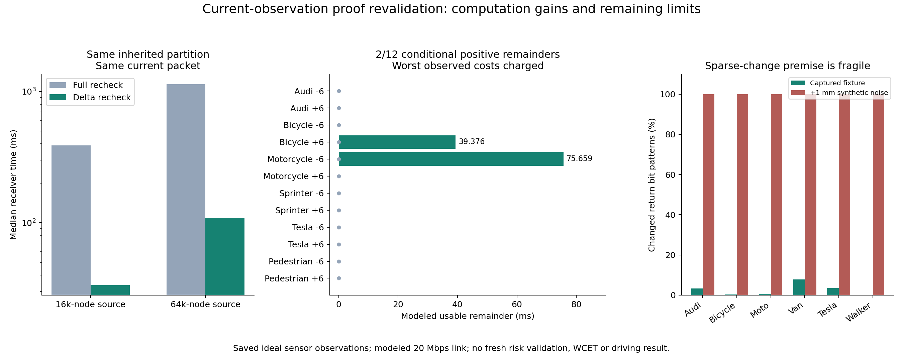

# 当前观测增量复核：首次出现有代价核算的正余量，但真实噪声下尚未解决

2026-10-03在sheng完成48次原生反演、24次暖缓存查询及成对全量复核。**在固定保存观测和模型化链路条件下，两个查询首次保留39.376ms、75.659ms的正可用余量；同分区全量复核均为零。** 该结果是计算路径的进展，不代表已实现真实车联网闭环或已解决噪声下的可信有效期。

## 从性能证据出发

上一轮16000节点反演中位耗时9.601秒，无法使用毫秒级期限。剖析一次Audi查询发现，反复构造有理数来求失效时间占了大量开销，区间包围、射线数组运算和重复候选评分也很昂贵。

本轮实现C++17计算核，保留同样的地面裁剪评分、阈值、连续姿态先验、圆盘运动模型与未知边界。固定运动参数下把安全条件化为128位整数不等式，浮点根仅提供初猜，最终逐微秒边界由整数验证。没有打开fast-math。精确姿态探测在新版本中关闭，因此上界仍来自未知边界；没有借此宣称上下界更紧。

16000节点下，原生实现与旧Python运行的503,118个分区节点逐一一致，期限和排除数一致，中位整套反演耗时降至0.608秒。它仍不足以支持及时动作，因而继续检验当前观测的增量复核。

## 复用计数，不直接续期旧结论

每个连续姿态区间有四个射线计数：可能有效、必然有效、必然穿透、可能未穿透。它们都是逐射线贡献之和。当前完整报文经过无损差分重建和身份检查后，可以精确计算：

> 当前计数＝旧计数−变化射线的旧贡献＋变化射线的当前贡献。

射线方向变化也被重新计算，不假定变化点还在旧射线上。所有返回坐标都比较，视角、类别、校准标识、采样方式和数量不兼容时拒绝复用。帧号与原始源时间必须递增。缺失报文或错误参考不会被理解成“场景没变化”。

新的计数不能再排除某个旧区间时，就撤销该排除、重新保留该区间。旧未解决区域也继续保留。当前有效期由整个保留集合重新求得，不能直接给旧TTL换时间戳。

这项区别有实际证据：16000节点的12次暖查询撤销3,442个旧排除；64000节点撤销9,605个。一个Audi查询原有205.465ms下界，当前观测复核后，该继承分区的下界必须降为零。此时证书已经失效；这不等于证明发生物理碰撞，也不等于当前信息的最佳期限必然为零。

## 公平比较与全部结果

每类用测试索引0的已有扫描建立分区，用同类测试索引10的扫描复核，原始源时间相隔20.5秒。六类、两个固定查询，两个预定计算预算。两个任务分别评估，没有把并发调度当作已验证能力。不是新采集，不是连续运动轨迹。

增量复核与全量复核使用**完全相同的继承分区、当前点云和无损报文**。每次的所有计数、保留／排除状态与期限一致；差别是是否重新处理所有未变化射线。

| 初始反演预算 | 原生反演中位时间 | 暖增量复核中位时间 | 同分区全量复核中位时间 | 增量正净余量 | 全量正净余量 |
|---|---:|---:|---:|---:|---:|
| 16,000节点 | 607.797ms | 33.502ms | 387.405ms | 0/12 | 0/12 |
| 64,000节点 | 2770.223ms | 108.794ms | 1137.896ms | 2/12 | 0/12 |

净余量使用三次实测中最大的编解码加复核开销，以及五次消息构建中最大的开销；再扣除20Mbps串行化、20ms单向传播、20ms时钟余量、200ms动作预留。它不是WCET。冷启动参考帧和初次证明也计费；在这些20.5秒间隔的独立任务中均已准备好，没有隐去启动排队延迟。传感器采集与回调延迟尚未实测。

两个正例是自行车的+6m任务和摩托车的−6m任务，几何下界分别297.139ms、341.182ms，扣费后剩39.376ms、75.659ms。其余10个高预算暖查询没有正净余量，不能删去。未知边界给出的上界仍较宽，不能据此声称不过度保守或接近最优。

## 为什么还不能推广到真实噪声

当前采集脚本使用CARLA的语义LiDAR。[官方传感器文档](https://carla.readthedocs.io/en/0.9.16/ref_sensors/)区分了它与普通LiDAR的强度、丢点和噪声模型。这些固定传感器、冻结几何观测中，大多数背景返回逐位重复，是增量算法当前优势的重要前提。

额外的敏感性检查对当前坐标加入固定种子的1mm和1cm合成扰动，六类全部返回都变成“已变化”。这只是位变化检查，不是合法传感器标定或噪声环境下的期限测试。它表明当前逐位复用不能证明真实传感器鲁棒性。忽略小变化会破坏上述精确计数等式，不能作为未经证明的捷径。

下一项必要算法问题已经具体化：用可验证的几何变化界证明哪些射线贡献仍然稳定，而非要求坐标逐位相同；超过界限的贡献继续更新或拒绝。真实传感器不确定性还需独立校准。该机制尚未实现，本轮不会把它写成已有成果。

## 审计范围与研究结论

[完整实现与复现命令](../experiments/expiry_runtime_20261003/README.md)、[固定实验协议](../experiments/expiry_runtime_20261003/PROTOCOL.md)和[推导](../experiments/expiry_runtime_20261003/THEORY.md)一并保留。独立审计采用另一套世界坐标七平面相交实现，核对分区、计数、撤销、整数期限与实际源报文。其SciPy角度预筛选比被测内核更宽，并补做确定性的全点云检查；这与逐区间无条件扫描所有射线不是同一工作量，两组共核对2,437,114个分区节点、351,129个暖复核区间；独立预筛选后检查2,311,178,165次候选点贡献，并补做1,494次全点云对照。具体计数见审计JSON。浮点工程裕量不是形式化向外舍入验证。

五项测试包含整数时间边界、计数增量等价、失效证书撤销、身份／时间不兼容和损坏参考拒绝。无损编码输出独立重建并跨主机核对。所有结果保持地面评分的既有误排记录：车辆3/100，行人0/19可用、1拒绝；没有进行新风险校准。

本轮支持的结论是：**完整接收当前观测后，复核已有证明的成本可以显著低于重新构造或全量复核，在少数受控案例中可将条件几何期限转化为正的模型化余量。** 它没有完成噪声鲁棒性、未知物体覆盖、物理运动契约、动态闭环、实测无线链路或MobiCom新颖性论证。项目仍未完成；没有创建持续研究循环。
