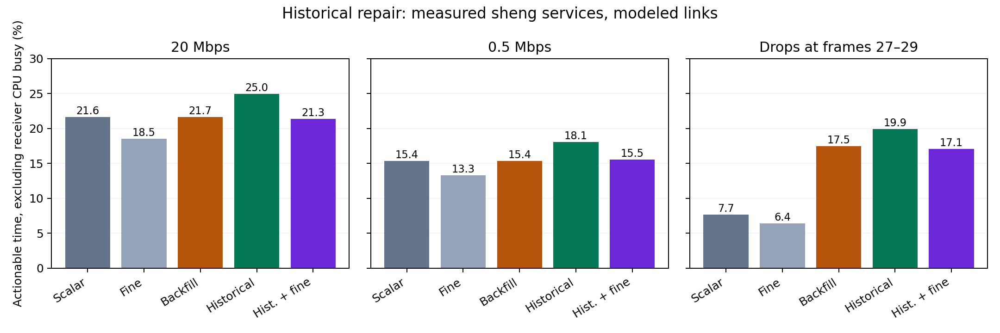
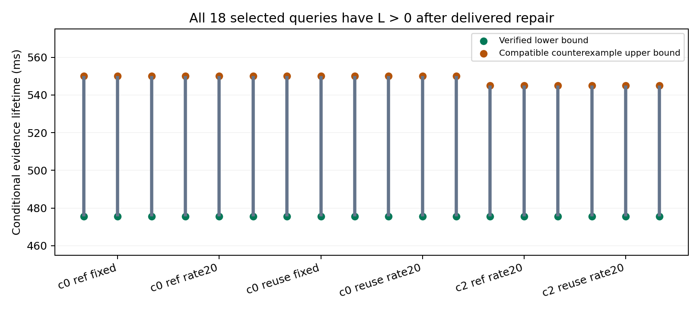

# 从不完整观测得到可信、不过度保守的证据有效期：历史补证实验

本次已在 sheng 完成有限的五组对照：6 条已有观测历史 ×20 次正常更新 ×3 次计时重复 ×3 种链路条件 ×5 种方法，共5400行；另保存全部请求、回复、队列与失败事件。没有运行新的 CARLA 驾驶，没有建立持续研究循环。

**目前成立的结论：有效期应由“所有仍可能的物理世界”定义，再用可验证下界和兼容反例上界夹住；证明链断裂时，少量真实历史补证可以恢复后续有效期。** 本次补证恢复了原先3个零下界查询，同时保留了可验证的保守程度上界，并在计入主要计算与双向传输后提高了实际可用时间。这是条件性算法证据，还不是完成实车校准或 MobiCom 论文的结论。

## 1. 问题定义与解法

令 I 为接收端已经收到并验证的信息，A 为明确的物体形状、运动、传感误差、时钟和任务假设。考虑与 I、A 一致的全部物理历史 W。我们要求的有效期 H*，是这些历史中最早可能发生任务违反的时间。

算法给出 L≤H*；一个仍与全部已收观测兼容、并在 U 时刻违反任务的具体轨迹给出 H*≤U。因此 **L≤H*≤U**。L 的安全性和 U−L 的保守性分别有证据，不用检测置信度替代它们。

当前证据不能续期时，从尚未证明安全的任务区域反推上一时刻的可达前驱，减去已有事实和已收到的旧射线排除的区域，只请求剩余区域需要的旧射线。接收端重新验证完整前驱覆盖，随后重放已经收到或经过付费补回的历史。旧射线保持旧时间戳；过期事实可以支持新证明，但不能恢复已过期的动作许可。

[形式化条件和证明](../experiments/historical_repair_20261002/THEORY.md)说明两端速度约束仅用于已发生的时间段，未来仍使用单侧可达界。有限域外未知前驱、缓存缺失、证据不完整均拒绝续期。

## 2. 实际机制与代价

困难历史第一次出现550ms间隔前，最近间隔只有250–300ms，不能让选择器提前知道这次突变。本次在失败发生后才反馈请求。

在真实21→22转换中，当前小物体类别有610个未证明网格；其历史前驱中487个网格需要额外证据。发送端用已缓存第21帧中的129条真实射线覆盖它们：407字节请求，1548字节回复。标准链路三个重复中，标量修复在第22帧参考时刻后363.161–368.726ms完成，得到475ms事实。由于还需预留200ms动作时间，这三次修复自身均不能立即授权动作；它们恢复后续帧的证明链，每次恢复17个正常更新。

发送端缓存最多8个完成生成的记录；接收端历史最多32步。一次仅允许一个请求，重复失败几何被抑制。请求绑定已有父事实和实际失败目标；回复检查顺序、摘要、原始观测时间、物理合同和全部射线覆盖。没有自由 ACK、未来帧或按历史名称选择策略。

## 3. 付费闭环结果

下表每项有360个正常更新。正常更新及时次数使用50ms动作检查网格和严格200ms预留；修复自身的授权另计，所有69次成功修复均未及时满足该预留。覆盖率使用连续授权区间并扣除接收端CPU忙碌区间，对18个条件实例取平均。

| 链路 | 标量基线：及时/覆盖率 | 仅历史重传：及时/覆盖率 | 历史补证：及时/覆盖率 |
|---|---:|---:|---:|
| 20Mbps，单程传播20ms | 306 / 21.64% | 306 / 21.65% | **357 / 24.97%** |
| 0.5Mbps，单程传播20ms | 219 / 15.37% | 219 / 15.38% | **261 / 18.05%** |
| 正常包27–29丢失，20Mbps | 111 / 7.68% | 246 / 17.45% | **285 / 19.93%** |

丢包实验中，111→246主要来自普通历史重传，不能算新射线算法贡献；补证相对这个对照再提高到285。该丢包条件只丢指定正常包，不是所有消息均中断的真实无线黑障。

同信息细粒度集合观察器得到相同的357/261/285个及时正常更新，但覆盖率为21.35%/15.54%/17.08%，低于标量补证：更精细的内部状态需要更多计算。原始细粒度对照是305/219/111，覆盖率18.53%/13.28%/6.41%。

标准链路18次运行中，仅困难历史的3次重复发出补证请求，合计1221字节上行和4644字节额外下行。计时差异可以解释基线与无成功修复的重传对照之间约0.01个百分点的微小差异，不能声称那是算法收益。

这些覆盖率不能直接与上一版 class_guard 的数字比较：本次采用连续授权、扣除CPU忙碌；上一版使用量化动作检查时刻开启区间。本次所有五组方法使用同一口径，正常及时次数仍保留量化检查。

## 4. “不过度保守”的证据

对标准链路、重复0、细粒度补证方法，在22/25/39三个查询点逐一加入实际已交付的历史补证，再检查既有全部84个球形/椭球/独立朝向反例。共13,949,004次完整三维射线段检查，84个反例全部仍兼容；没有重新挑选反例或直接沿用旧上界。

18个查询全部得到正下界，包括原先3个零下界查询：

- c0的12个查询：**475.512ms≤H*≤550ms**，最大间隙74.488ms。
- c2的6个查询：**475.551ms≤H*≤545ms**，间隙69.449ms。

因此这些查询中，(H*−L)/H*≤13.5433%。这是明确假设下、选定查询和实际新增信息下的保守性上界；不是全场景近似比，也不是13.5%的碰撞概率。反例属于声明的抽象射线与运动模型，未额外满足道路规则/地形约束，也没有在CARLA重建对应替代世界。第22帧修复完成后的事实下界为正，与它不能及时授权动作并不矛盾。原始未增加信息时的三个零下界问题仍没有被此实验解决。

## 5. 验证、定位与未完成项

10个有意义的测试在本地和sheng通过，覆盖真实补证、过期动作、仅重传失败、请求绑定、改动射线、校验和正确但不完整的证据、缓存驱逐、旧父事实、外部未知区域和重复请求。首次测试夹具把默认物体半径放进过小测试域，启动完整实验前已修正；失败日志保留。

独立审计不导入被测接收器、前驱生成器、事件调度器或原生核。它检查252个完整已接受前缀、126个源/根的点云来源、5400个正常包、5130次实际正常接收、78个缓存快照、69次成功修复、4266次逻辑类别传播、53个独立KD传播计算、3936个H/H+1边界、10,908个CPU作业、5556次传输和270个覆盖时间窗。前驱用独立KD参考验证；另一单元测试用方格间解析距离验证。主审计与84反例复核均在两台主机运行，分别得到逐字节一致的JSON结果。

科学定位应当是“由任务证明缺口决定历史负证据的语义价值，并在付费闭环中修复证明链”。稀疏请求本身已有[Where2comm](https://proceedings.neurips.cc/paper_files/paper/2022/file/1f5c5cd01b864d53cc5fa0a3472e152e-Paper-Conference.pdf)和[Chiu/Smith](https://arxiv.org/html/2305.17181v1)等前作；本项目不宣称发明请求地图、集合滤波或贪心覆盖。此前的[阅读记录](../experiments/class_guard_20261002/READING.md)保留逐篇范围与限制，当前结果也不证明学术首次性。

剩余边界必须保留：传感/时钟/运动界未完成真实校准；任务矩形静止；数据有重复几何；三次重复是CPU计时重复而非独立道路场景；网络为模型而非实测无线。计入了实测主要生成、编码、请求/回复构造、验证和双向链路排队，warm setup单列；解释器调度、日志、轻量状态提交和物理协议栈不构成已测的完整WCET。未来需要动态场景、可执行移动控制与备份、实测链路和独立数据验证；不能把本包称为全项目或MobiCom论文已完成。

[汇总数据](../results/historical_repair_20261002/summary.json) · [运行代码](../experiments/historical_repair_20261002/bench.py) · [独立审计](../experiments/historical_repair_20261002/analyze.py) · [冻结协议](../experiments/historical_repair_20261002/PROTOCOL.md)
