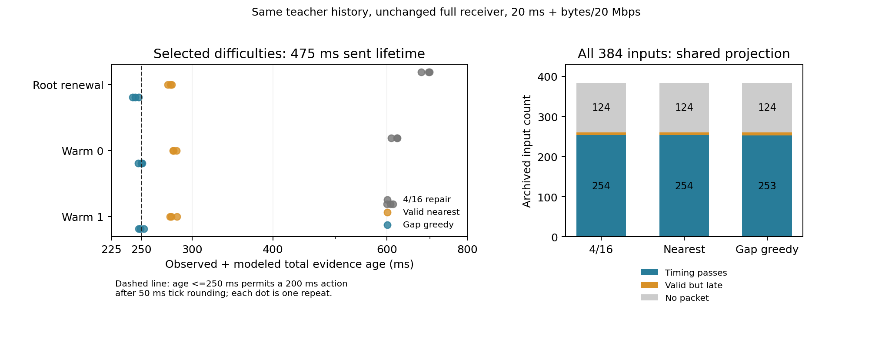

# 不完整观测的可信条件有效期：增量补证与端到端成本

本轮在 sheng 完成四项冻结的有限回放：两项各 162 次的困难状态试验、两项各 1152 次的全输入试验，共 2628 次调用。算法保留未知空间、逐射线误差和合法历史，只为新期限尚未覆盖的必需单元添加当前射线。困难状态出现可核查的时间收益，但完整回放没有超过强基线。不能据此宣称已经完成 MobiCom 创新或有效行驶系统。

## 回答核心问题

**可信性来自明确的不确定集合及可复核的排除证据；不过度保守来自求同一证书中的最长期限，并支付得到它的全部成本。** 没有障碍尺寸、运动、传感器/时钟界时，不完整观测不能保证正有效期：遮挡区立即侵入和空旷道路可以有相同观测。学习置信度也不能独自排除这种歧义。

已有代码把原始第一回波射线量化，接收端重新计算几何区间、逐条年龄和逐类别运动误差。当前射线及合法历史未排除的单元继续视为可能含有障碍。对固定矩形，找到最近未排除单元，反推所有类别和有限域约束均通过的最大整数微秒期限 H*。这只是在既有网格证书中的最大值，保留网格、外接形状和运动界的保守性，不是连续物理世界的真实最大安全期限。

信息层、消息层和到达后的可用层必须分开：全量观测可能支持 480.303ms，旧子集可能只有 400.073ms，而一份承诺 475ms 的证书若耗时 300ms 才可用，就不能再支持本诊断中的 200ms 动作。离线全量 H* 不作为免费线上选择器。

当前代码已有三个可审查接口：[完整域边界](../experiments/expiry_frontier_20261001/frontier.py)、[等价前缀边界](../experiments/online_evidence_20261002/shell_frontier.py)、[本轮增量补证](../experiments/incremental_validity_20261002/patch.py)。条件推导和限制见 [THEORY](../experiments/incremental_validity_20261002/THEORY.md)。

## 增量补证为何成立

旧模板只建议当前射线的索引。基础射线与接收端历史已支持的单元无需重建；新目标期限带来的未支持单元构成缺口集合。按实际误差分箱搜索具有正排除半径的射线，拒绝仍无法排除的缺口，再对带类别索引的缺口并集做既有贪心覆盖，保留所有基础射线。

每个必需单元因此由基础射线、合法历史或新增射线覆盖。最近射线如果误差过大，不能充当证据；未知空洞、过期历史和失真的包仍被拒绝。这里没有全局最小字节保证，候选子集和贪心都可能留下额外冗余。接收端不接受发送端覆盖断言，仍完整解码、重算和检查期限。

比较包含旧 4/16 邻居修复、最近有效射线补证、缺口贪心。三者使用同一个编译版完整覆盖回退，并支付失败修复尝试的成本。原版本试验完成后，另冻结共同投影优化：类别无关的几何区间只计算一次，再按原浮点运算顺序加入每类运动误差并向上分箱。三个发送方法及共同回退全部得到该优化，原接收端不变。这控制实现成本，不构成独立新颖性。

## 困难状态：有局部收益，余量较小

六个旧状态来自此前事后选取的诊断，含稀疏视角和无合法历史的负例。每个状态评估 400/450/475ms，三个重复，方法顺序随机。每项试验 162 次，三个方法各 54 次，各自产生 36 份几何有效输出。原投影版本的时间预算通过均为零；共同投影版本仅缺口贪心有 6 次通过。

下面是延长到 475ms 的三个困难状态，每格给出共同优化后的生成耗时中位数及三次重复中的时间预算通过数：

| 状态 | 旧 4/16 修复 | 最近有效补证 | 缺口贪心 |
|---|---:|---:|---:|
| root_001 | 558.81ms；0/3 | 99.06ms；0/3 | 105.43ms；3/3 |
| warm_000 | 478.51ms；0/3 | 93.57ms；0/3 | 102.68ms；1/3 |
| warm_001 | 470.22ms；0/3 | 93.13ms；0/3 | 106.59ms；2/3 |

在 root_001，基础 2832 条射线留下 6473 个带类别缺口；贪心增加 636 条当前射线，包共 3468 条、99,284 字节。最近有效补证保留 5937 条、171,443 字节，生成稍快，但更大的通信/接收端成本使它仍迟到。旧方案回退后包略小（97,737 字节），但完整重建过慢。因此新方法的局部优势不是简单的“包最小”，而是复用已证明部分、减少重新证明的计算量。

root_001 缺口贪心的完整接收端中位数 34.39ms，含采集、生成、验证和 20ms+字节/20Mbps 模型链路后，剩余有效时间中位数 230.05ms。总年龄向上取整为 250ms，200ms 动作预算后只剩严格的 25ms tick 余量。warm_000 中位剩余时间为 224.808ms，略不足以落入 250ms 年龄桶，故仅一次通过。这是观察到的计时边界，不是未来最坏时延保证。

三个困难状态的贪心子集独立边界均为 475.328ms，全量观测边界为 480.303ms，发送的 475ms 不超过子集边界。稀疏视角全量边界仅 60.008ms，无历史状态边界为零；新方法不会用补证制造观测没有提供的自由空间。400/450ms 试验及所有失败均保留。

## 全部 384 输入：未建立整体算法优势

十次 October 2 原闭环记录的全部 384 输入，以原目标 475ms 重放。每个方法共享原闭环实际接受的历史与原模板，一次调用；顺序轮换。每项 1152 次。统一采用 20ms+字节/20Mbps，并另外保存原固定链路条件。实验输出只在接收端克隆中检查，不更新原历史。

| 方法 | 原投影：几何有效 / 时间预算通过 | 共同投影：几何有效 / 时间预算通过 |
|---|---:|---:|
| 旧 4/16 修复 | 260 / 254 | 260 / 254 |
| 最近有效补证 | 260 / 252 | 260 / 254 |
| 缺口贪心 | 260 / 253 | 260 / 253 |

分母均为 384。共同投影下，有效输出的生成中位数分别为 48.21、48.47、48.08ms，完整接收端约 32ms。普通续期已经很快，新方法没有整体收益；共同优化后的缺口贪心在 `c0_view0_reference_rate20/warm_001` 比旧方案少一次时间通过。

共同优化后的旧方案和最近有效补证：root 12 份有效、6 次时间通过；warm 120/120；drive 128/128；另外 12 个 root 和 112 个 drive 输入无有效包。贪心只在 warm 少一次通过。这里的 drive 是旧记录的阶段标签，**不是新算法的实际行驶通过率**。原来的自动车辆响应几乎没有有效前移，本次没有改变或重新验证动作策略。

## 审计、失败与复现

原五项测试和新增共同投影控制的八项测试在 sheng 通过；八项是不同测试数，不能相加为十三项独立测试。原始不确定区间字段在异构来源/年龄测试中逐字段位等价，包对照要求字节相同。独立审计使用原接收端、原始射线、原历史和整数时间规则：1632 份首重复包完整复核、72 次子集最长边界核对、816 份优化前后包字节相同、全部 2628 行时间算术通过。其余重复只有时间算术审计，不另计逐包独立复核。精确计数、结果哈希和源哈希见 [validation.json](../results/incremental_validity_20261002/validation.json) 与 [source_manifest.json](../results/incremental_validity_20261002/source_manifest.json)。

保留两次零测量启动失败：临时编译库消失，以及共享困难状态试验误用了 October 2 全输入目录。前者改为持久项目 build 路径；后者保留空包目录与 traceback 后使用原困难状态语料。没有证据确定临时文件消失原因。两次 C++ 编译耗时为 350.55/361.99ms，源及生成二进制 SHA-256 完全相同；启动编译/库加载单独记录，未算作证据已经采集后的消息成本。

另外保留 sheng 绘图缺少 `six` 的依赖错误，用相同脚本本地渲染已冻结数据并记录图像来源哈希；没有改动共享 Python 环境。首个打包脚本的相对/绝对路径不匹配也保留原脚本与原因，修正只影响归档操作，不修改测量核或数据。本地另行完整审计产生与 sheng 逐字节相同的 JSON，八项单元测试亦通过；来源和命令见 [本地复核记录](../results/incremental_validity_20261002/local_verification.json)。本轮没有启动 CARLA、没有创建循环任务。代码、冻结协议、全部结果和复现命令见 [实验目录](../experiments/incremental_validity_20261002/README.md)。

## MobiCom 研究判断

可成立的故事是：部分观测的未排除空间限制几何有效期；压缩丢失期限，重建消耗期限；增量补齐新必需单元可在某些期限延长状态减少端到端损失。当前证据只支持这个局部机制，不支持整体方法优势。贪心覆盖、缺信息补充、投影复用本身均不足以声称新颖性；与 Where2comm、AoI/VoI 等工作的约束见 [此前正文阅读](usable_lease_reading_20261002.md)，本轮没有声称复现这些系统。

真实传感器误差界、不透明核心假设、自然道路的合法初始化/历史失效恢复、有效动作及备份占据、独立 watchdog、真实无线链路和独立场景仍未解决。当前默认射线位置/来源/查询界为 10mm，时钟界 20ms，类别运动界 5m/s、3m/s²，网格 50/100mm，均是显式供给的模型条件，不是本次新校准结果。校验和检测损坏，不认证传感器真实性。最大网格期限和计时通过都不能替代这些物理条件。

下一项研究应检验在变化观测/目标期限/历史失效下可执行的增量触发与恢复，比较最强普通续期及完整证明，并验证它是否能维持有用的动作接口。不能以本次事后困难状态或单个 tick 门槛跨越来证明自适应策略、普遍安全或 MobiCom 创新。完整项目未完成，进展与未完成项继续记录在 [PROJECT_STATUS](PROJECT_STATUS.md)。
