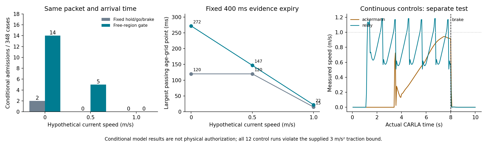

# 将几何有效期与控制可执行性分开：条件区域证据与交接

2026-10-01，sheng 的 Ubuntu 20.04 WSL 环境（主机名 DESKTOP-UGDDO8T），通过同机 Windows 的 Tailscale 入口执行；CARLA 0.9.15 在 Windows 运行。问题仍是从不完整观测得到可信且不过度保守的证据有效期。

**本轮实现并验证了一个更合适的接口：先证明某区域在指定期限内无障碍，再检查当前状态下的完整动作能否在区域和期限内完成。** 同一批 1,044 个案例、相同证据和相同到达时刻，旧门限通过 2 项，新门限通过 19 项，其中 5 项为假设 0.5 m/s 的运动状态。另有 12 组实际 CARLA 连续控制实验，车辆确实前进，但全部出现超过原先 3 m/s² 牵引加速度假设的采样。因此条件算法的进展与真实控制保证必须分开表述。

## 核心逻辑

在给定传感器误差、障碍不透明内核、外包尺寸、运动和时钟界后，不完整观测对应一个“所有仍可能世界”的集合。可信的区域有效期要求：**每个与观测及这些前提相容的世界，在该期限内都不能有相关障碍进入该区域。** 没有检测到目标不是空闲证明；不受限制的隐蔽目标可以使任何正期限失效。现有射线算法用可检查的网格覆盖给出充分条件，尚未求得最不保守的精确有效期。

上一版几何检查覆盖的是一个完整圆角矩形，并加入了障碍尺寸、运动、观测年龄、投影和量化误差。只要这个检查成立，该区域直到原截止时刻 E 都满足条件空闲命题。用来构造矩形的旧 hold/go/brake 参数在这一层只是形状描述，不能当作车辆确实能执行该策略的证据。

新接收端将结果注册为“区域 R + 截止时刻 E + 观测身份/作用域”。在每次决策时，使用当前速度与位置，另算下一段指令及完整制动的车身可达包络 K 和完成时间 T。只有 K ⊂ R 且 t + T < E 才允许该**条件模型**中的动作。整数实现对当前时刻、完成时长向上取整，对控制停止时刻向下取整，不允许浮点边界延长期限。

这去掉了“证据年龄必须小于固定 120 ms 等待预算”的额外限制。它没有延长射线证据的 E，没有证明等待期间的既往轨迹安全，也没有从几何中推导出动力学保证。完整定义和条件推导见 [THEORY.md](../experiments/lease_handoff_20261001/THEORY.md)。

## 相同证据上的配对结果

复用冻结二进制阶段的 1,044 个案例，包含 957 个无几何包的拒绝项。87 个包全部在 sheng 重新核验；另用完整参考查询回查它们来自当前原始点云的射线。传感器、障碍、期限、包内容和误差界均未修改。

年龄采用旧记录的采集及源端耗时，加上本轮实际接收端耗时、一次新门限计算和假设 20 ms 链路。旧门限与新门限使用**同一个最终年龄**。这是一种混合历史计时诊断，不是新在线无线闭环。当前状态采用沿原航向匀速前移的独立假设，各案例不拼成连续行驶轨迹。

| 假设当前速度 | 全部案例 | 几何通过 | 旧门限通过 | 新区域门限通过 |
|---|---:|---:|---:|---:|
| 0 m/s | 348 | 29 | 2 | 14 |
| 0.5 m/s | 348 | 29 | 0 | 5 |
| 1.0 m/s | 348 | 29 | 0 | 0 |
| 合计 | 1,044 | 87 | 2 | 19 |

额外增加 1 ms 后通过数不变。87 个有效包上的接收端中位耗时为 3.160 ms，新门限为 0.0347 ms，最终年龄中位数为 134.28 ms。不能把它与其他轮次的接收端计时直接当作同阶段加速比。失败原因完整保留：957 项没有几何包，31 项仅期限不够，37 项期限和空间都不满足，19 项通过。

在固定 0–500 ms、步长 1 ms 的年龄网格上，共复核 43,587 个旧/新配对。50 个包的新门限有更多通过点，37 个包不增加；这一数据集上旧门限通过点都是新门限通过点的子集。没有证明对所有状态、形状和政策都支配旧方法。

| 400 ms 原证据期限下的速度 | 旧门限最大通过网格年龄 | 新门限最大通过网格年龄 |
|---|---:|---:|
| 0 m/s | 119–120 ms | 272 ms |
| 0.5 m/s | 119–120 ms | 147 ms |
| 1.0 m/s | 15 ms | 22 ms |

旧门限的 119/120 ms 差异来自不同参考时刻的浮点到整数保守边界。表格给的是固定离散网格的最大通过点，不能直接作为连续时间精确有效期。对应的动作时间界来自外部提供的牵引/制动参数；这些参数在实际控制中尚不成立。19 项也不是 19 个独立道路场景，更不是 19 次安全驾驶。

## 有限交接与失败处理

`lease.py` 保存已通过核验的旧动作及其后备制动，新证据完整核验和当前状态包含检查成功后才能替换。损坏、重放、未来时刻、过期、作用域不符以及未注册身份不能重置承诺。检测到速度或车身越出模型承诺时，状态锁定为 CONTRACT_BREACH。没有新包时，只保留旧承诺覆盖的有限后备区间；区间结束返回 NO_GUARANTEE，不能把“停下来”改写成对未来所有运动障碍都安全。

8 项测试涵盖实际保存证据的交接、拒绝不重置、时间边界、控制截止取整、违规锁定、圆角矩形包含及随机模型轨迹包络。随机测试不是形式验证，也不是物理标定。真正控制还必须有**独立执行截止时间的看门狗**；不能依赖繁忙的点云处理循环及时踩刹车。本轮实现的是接口和条件状态机，没有宣称该独立执行层已接入 CARLA。

## 12 组实际连续控制诊断

三个直路出生点 × 目标 0.5/1 m/s × 默认 Ackermann/固定 relay 控制。每次满制动预热 20 tick，再连续控制 8 s，最后满制动 2 s；dt=50 ms、物理子步不超过 10 ms。没有修改车辆物理、强制设定速度或运行中传送。记录每个 tick 的统一 world snapshot，并验证 2,400 行帧号、时间和前后速度连续性；relay 和制动阶段的实际控制回读也符合指令。

| 控制器与目标 | 8 s 实际前进距离，三个点位范围 | 最后 4 s 平均速度 |
|---|---:|---:|
| Ackermann，0.5 m/s | 1.675–1.723 m | 0.383–0.393 m/s |
| relay，0.5 m/s | 2.363–2.394 m | 0.328–0.338 m/s |
| Ackermann，1.0 m/s | 2.606–2.663 m | 0.615–0.631 m/s |
| relay，1.0 m/s | 5.446–5.478 m | 0.789–0.796 m/s |

12 组都出现采样加速度大于 3 m/s²，峰值约 12.15–12.74 m/s²。Ackermann 的 desired acceleration=0.5 不能当作硬上界；[CARLA 0.9.15 API](https://carla.readthedocs.io/en/0.9.15/python_api/) 将该参数定义为期望加速度。满制动后在 50–100 ms 内出现连续五个采样低于 0.02 m/s 的停止带，但这批有限工况不能撤销前轮其他控制条件下的停止期限反例。未记录碰撞不构成遮挡场景安全评价。服务器及本轮车辆、传感器均已清理。

## 文献边界与研究判断

本轮补读 [Nezami 等，A Safe Control Architecture Based on Robust Model Predictive Control for Autonomous Driving](https://arxiv.org/pdf/2206.09735) 的 II、IV、V 节，尤其后备控制保存、扰动传播和递归可行性。安全监督加后备动作是已有思路；该文还依赖终端不变集，本项目的有限期限区域没有实现这个长期保证。因此不能把新接口本身直接宣称为 MobiCom 创新。

更值得检验的贡献仍是：**从不完整原始观测生成接收端可复核的区域及期限，在可执行动作条件下减少无效等待，并量化证明字节、验证耗时与可行动窗口的关系。** 本轮验证了其中“几何期限与固定等待政策解耦”的收益，尚未建立整个研究贡献。网格、统一区域期限及最坏运动界仍可能过度保守；物理观测契约、自遮挡下初始化、可执行控制/后备界、独立看门狗和动态通信实验仍是未完成项。

[复现代码](../experiments/lease_handoff_20261001/README.md) · [完整复核](../results/lease_handoff_20261001/validation.json) · [实际控制分析](../results/lease_handoff_20261001/control_analysis.json) · [项目完成状态](PROJECT_STATUS.md)
