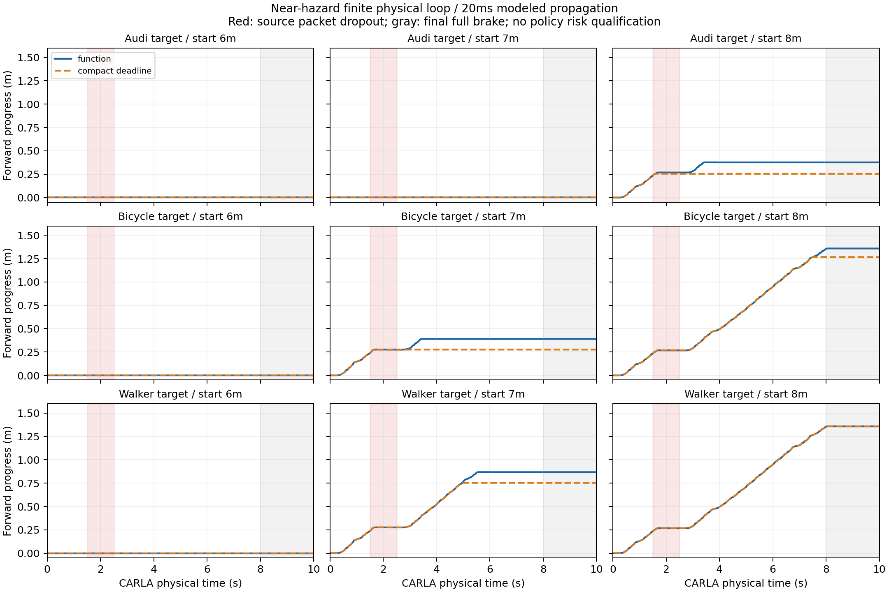

# 近障碍下部分观测有效期：完整有限闭环结果

**已在sheng完成18段新CARLA物理闭环、2880份新源观测和3600次控制决策，并完成本地/sheng逐字节一致的审计与分析。有效期确实在靠近目标时缩短；自行车734次源查询比冻结的历史方法更长，没有缩短查询。新的自车策略仍没有统计风险认证，不能据此宣称道路安全或整个MobiCom项目完成。**

## 为什么要补这一轮

上一批远距离停驻目标的缓存查询全部达到500ms上限，无法评估近障碍的保守性。本轮保留三类停驻登记目标，将自车起点改为8/7/6m，并用实际紧凑deadline报文驱动物理时序。此前观察过的旧源扫描只用于选择这三个开发距离，已在PROTOCOL.md明确披露；它们不是新独立测试数据。

计划、运行时代码与完整分析公式在新扫描前以提交`78f0b9b7c4dab37484a37fdf1ca99f764dd2ff47`发布。核心冻结147个源文件、44个输入，SHA-256为`08490fe231fc6b6e67da692fcc4ef820dbdfb5949ba39b37978c32a9511753c5`。模型、背景、类别登记和校准阈值均不变；18段完整保留，无失败补样、场景挑选或阈值调整。

## 实际协议和算法

CARLA0.9.15/Town10HD_Opt/ClearNoon，50ms物理步及10ms子步，每段160次驾驶源观测与40次最终全制动。函数消息与紧凑源截止时间各一段，方法顺序交替。20Mbps串行FIFO、20ms传播；第30–49源包丢弃，仍支付串行费用。源端、接收端及每次查询实际计时，接收就绪向50ms物理步取整。本轮约230.084s墙钟对应180s计划物理记录，没有墙钟实时/WCET承诺。

运行时只使用XYZ、自车里程计、登记类别和冻结上下文；语义标签/ID及目标真值只用于离线诊断。完整三维自车包围盒用于自回波去除及行动圆盘。低速反馈目标0.3m/s，声明自车速度上界0.75m/s，行动余量300ms；走廊x[-10,-3]m、横向±0.5m。目标运动包络仍为5m/s与3m/s²，目标实际停驻。此声明覆盖比停驻真值宽，不能用停驻试验宣称移动避让能力。

源观测给出可能中心集合S，距离下界L(q)在中心覆盖事件下保守。最大整数微秒年龄T满足严格不等式：

`L(q) > 目标完整外形半径 + 行动圆盘半径 + 5·T + 1.5·T²`，其中T在该表达式中以秒计。

原始源时刻τ固定，接收端只有在`now + 已支付查询费用 + 300ms ≤ τ + T`且查询域有效时执行工程驾驶。到达、缓存、丢包和重发均不续期；不完整/矛盾/不可证集合拒绝。这里是构造模拟环境中的条件几何动作，所有生产授权和风险适用标志仍为False。

## 全部配对物理结果

| 目标 | 初始距离m | function前进m | compact deadline前进m | function驾驶次数 | deadline驾驶次数 |
|---|---:|---:|---:|---:|---:|
| Audi | 8 | 0.376130 | 0.253997 | 44 | 29 |
| Audi | 7 | 0 | 0 | 0 | 0 |
| Audi | 6 | 0 | 0 | 0 | 0 |
| Bicycle | 8 | 1.358304 | 1.266170 | 137 | 127 |
| Bicycle | 7 | 0.389375 | 0.275954 | 45 | 29 |
| Bicycle | 6 | 0 | 0 | 0 | 0 |
| Walker | 8 | 1.358304 | 1.358304 | 137 | 137 |
| Walker | 7 | 0.868083 | 0.752756 | 87 | 76 |
| Walker | 6 | 0 | 0 | 0 | 0 |

全部18段无记录碰撞。10段发生前进、8段始终拒绝前进；不能把后者当成成功驾驶。18次驾驶转制动均没有被提前驾驶打断，最长停车确认150ms；加一个50ms驾驶步在本次声明300ms预算内。观察最大速度0.515096m/s。自车速度、未来已采样行动车身包络、自回波残留及目标回波误删四项违例均为0。这仍是采样诊断，不是任意时刻的连续制动边界。

红色表示源丢包区间，灰色表示最终制动。近目标时函数消息可按当前位置重新计算距离，而标量deadline还支付额外150mm源查询圆盘的最坏距离与域包含限制。这解释了若干配对中的行动差异，也限定了结论：每个单元只有一次配对，源点云受实际ego运动影响，两种轨迹不是同一观测回放，没有置信区间或真实网络结论。这里不是对所有紧凑可查询消息的最优比较。

## “不过度保守”按同源参考量度

预注册分析对每份新源观测在其当时自车行动圆盘查询三种年龄：分量校准component_mean、历史local_mean、已知真实中心的oracle。三者使用同一个目标完整外形、查询半径、运动包络、源时刻和500ms上限。历史方法保留其原有支持分支与pose-only回退定义；这是同输入离线有效期比较，**历史方法没有实际驾驶实验，旧风险证书也没有移交**。

全部2880次源查询中，792次达到500ms上限、2088次低于上限。三类各960次；Audi和Walker的历史/分量有效期全部相同，自行车734次增加、226次相同，0次缩短。全部2880次两种候选年龄均未超过同模型oracle年龄；不能把“零观察越界”写成真实失败概率为0。

自行车各组P95(oracle−候选年龄)，单位ms，保留两个实际采集方法各自的完整来源：

| 初始距离m/来源方法 | 历史local_mean | component_mean |
|---|---:|---:|
| 8/function | 63.49810 | 33.55145 |
| 8/deadline | 62.509 | 32.577 |
| 7/function | 82.116 | 51.909 |
| 7/deadline | 64.059 | 34.105 |
| 6/function | 102.244 | 70.568 |
| 6/deadline | 102.244 | 70.568 |

改善来自原已冻结的支持误差与几何回退误差分开校准，不来自这批新数据调参。自行车6m虽改善源年龄，两种传输仍都无法前进，说明更紧的感知集合不必产生可用的端到端动作。

对每份源观测额外检查方向性距离损失h=floor(真实中心距离)−L≥0时的整数界：`oracle_T−T ≤ ceil(h/5)+1μs`，h以μm计、声明速度5m/s；这是运动反函数斜率和整数端点的标准推论。本批2880次均通过，不将该已有数学关系宣称为新定理。

## 紧凑对照和费用敏感性

本轮实际发送function471122字节、compact deadline388851字节。两个方法的实际轨迹/点云不同，这些是各自完整工作量总字节，不能据此直接估计同输入压缩率。此前已发布的同输入紧凑对照也显示标量报文更小，因此不能声称函数消息有报文字节优势。

还有一个实现限制：紧凑适配器复用旧编码入口，先生成一次旧完整deadline报文再紧凑化；两次编码费用都已支付。这是冗余计算，限制“优化后强基线”的说法，不能隐去。另作明确标记的事后敏感性诊断：将全部源计算费用理想化为0，保留实际包长、采集费用、FIFO和传播；2520个未丢包中2517个首解码物理步不变，3个改变（Audi/function/8m一个，Audi/deadline/6m两个）。没有据此重写实际驾驶、推导优化实现的时延或宣称实测WCET。未来实际对照应直接单次编码并考虑更强的紧凑可查询下界。

## 完整复核与保留的实现失败

审计重放所有2880份原始点云/报文及3600次控制，使用独立整数/Fraction几何检查3213次查询，另重建完整三维车身。全部2880份源集合包含当时真目标中心，无引用排除源的工程驾驶。学习模型是共享冻结实现，不假称独立重写。

物理审计成功后，预注册汇总脚本先遇到同名audit模块导入错误；明确路径导入后，又发现runtime未导出horizon函数。两次原始失败日志和脚本均保留。只修正显式模块导入和直接调用同一个冻结整数函数，所有数学公式、阈值、数据和统计循环保持不变。两个修正分别在成功指标生成前冻结并发布，无重新采集。详情见IMPORT_CORRECTION.md、SCALAR_CORRECTION.md及对应freeze清单。

最终物理审计、完整同输入分析和费用敏感性结果均在本地与sheng字节一致：

- audit：`9a50b61c8a40fcb5b11425eb1f12af0a1826f8478ce6cf847e887668ed16be7c`。
- analysis：`67d4001d7ecdb55ea50d9b8c82614b73944d5b509fa1e95f791e32145fea91e6`。
- timing sensitivity：`315f383505b6178ce66577f88b93d4e8d33b1615ce424d0c10030b8361b47bc7`。

2880源扫描属于18个相关闭环，不能按2880个独立风险样本认证。原校准只覆盖旧六帧固定观察法，不能覆盖新160帧内生ego观察法或新控制策略。完整代码、扫描、报文、时序、轨迹、失败日志及图表全部发布，[复现步骤](../experiments/near_expiry_live_20261004/REPRODUCE.md)明确区分字节闭合与风险认证。

车辆/行人/传感器均归零，退出同步模式；本次拥有的PID75844已按程序路径和启动时间核对后停止。没有持续研究循环或定时任务。

## 研究判断

这轮填补了“只有500ms上限、没有近障碍变化”的证据缺口，独立新数据再次支持自行车类的保守性改善，并把源年龄缩短接入实际ego制动。它没有填补任意隐藏目标、移动目标避让、新ego策略风险、真实通信与连续执行误差。

追加检索发现功能型conformal距离场和conformal ACC已有直接相关工作；[新增原始论文阅读与范围记录](expiry_motion_prior_work_20261004.md)说明阅读范围，不能把可查询不确定性场、时间历史或conformal管控制本身包装成创新。完整MobiCom2027项目仍未完成；需要独立新控制法认证、移动/遮挡场景、实际网络和经过优化的强基线收益。
