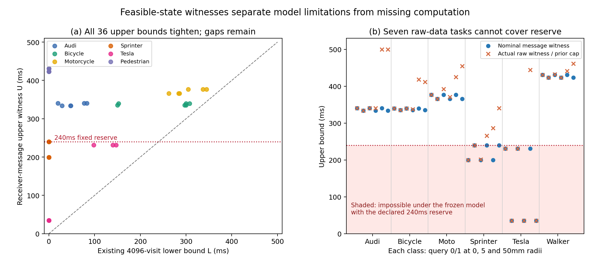

# 不完整观测的有效期：从找不到反例，推进到可核验的模型边界

日期：2026-10-03；运行服务器：sheng；目标：MobiCom 2027 车联网语义通信。

**本轮为全部36个任务找到了可独立复核的有效期上界，并确认7个任务即使给出完整当前点云，在现有分数与运动模型下仍无法覆盖固定240ms预算。** 因而，不能再把全部失败归因于计算太慢或通信压缩。另一方面，18个最接近的消息反例会被完整点云排除，说明额外坐标确实能解除部分具体歧义。

这次解决的是上一轮“没有相容上界见证，难以判断保守性根源”的缺口。上下界仍不够紧、物理覆盖仍未验证，完整项目尚未完成。

## 如何构造可信上界

接收端已经拥有旧参考点云、当前端点球和精确例外点。对未发送的坐标取球心，对例外点取消息中的当前值，就能得到消息允许的一种原始观测。搜索过程只使用这一合法实现，不读取隐藏的当前原始点云或车辆姿态真值。目标类别、尺寸、道路和锚点仍是继承的已知模型合同，不是新推断出来的场景事实。

在完整六维姿态范围内，算法提出候选状态；只有该状态在两个既定射线预算下都通过原有分数阈值，才作为相容状态。按照相同运动模型算出的接触时间，是稳健有效期的上界。已有区间证明提供下界，形成L≤H≤U。搜索器找不到候选不能证明不存在，找到候选也必须先独立验算。

搜索使用[SciPy 1.10.1的差分进化实现](https://docs.scipy.org/doc/scipy-1.10.1/reference/generated/scipy.optimize.differential_evolution.html)，由Sobol样本及消息点云的高密度位置初始化，每任务最多8192次评价。优化算法本身不是创新声明。固定分数、阈值、运动模型和上一轮4096次修复的下界均未改变。

## sheng 的实际结果

36个任务共评价294,912个姿态，记录549个逐次改进的可行见证。全部任务都找到候选，全部上界都收紧；最大收紧量为409.284ms。单任务搜索计时0.233–2.052秒，中位数0.510秒，累计25.980秒。这是离线诊断，不能作为免费在线组件加入上一轮结果。

之后按预先写明的第二阶段规则，将每类目标的候选合并为固定候选池，共545个不同姿态。所有目标消息重新检查各自同类候选，额外收紧24个上界。此阶段是在看到初始结果后进行的方法开发，不能称为独立验证集。完整点云只在审计中对同一批候选复核，不参与候选生成。

|检查项目|结果|
|---|---:|
|有独立核验上界的任务|36/36|
|消息允许的反例上界≤240ms|9/36|
|完整当前点云仍接受的反例上界≤240ms|7/36|
|最接近的消息反例被完整点云排除|18/36|
|最终上下界差距|32.075–430.799ms|
|上下界差距≤10ms|0/36|

**不能把消息与完整点云的两个启发式上界之差称为压缩损失。** 消息允许许多不同点云，本轮接收端搜索只使用其中一种。某个消息反例在实际点云下失败，只说明完整坐标能够排除那个状态，不能说明所有短期限状态都消失。计算保守性和信息损失仍须用严格的集合包含及上下界来区分。

## 一个改变研究判断的具体反例

Tesla右侧查询(6,0)存在如下模型允许的姿态：局部中心约(2.4165,-0.7405,0.6950)，俯仰、偏航、滚转约(0.00864,2.50380,-0.00164)弧度。完整无扰动点云给出两个预算下的穿透分数57/142和232/556，均低于已冻结阈值28/65。它不依赖“射线不足8条”的低支持回退。

独立计算得到该状态的接触时间上界为 **35.083ms**。同一个状态在1mm和10mm扰动后的完整点云下也通过。换言之，三个条件下，即使立即传完完整点云、验证计算耗时为零，原有模型也无法支撑固定240ms预算。

固定预算由20ms传播、20ms时钟余量和200ms动作保留组成；编码、序列化和计算只会进一步增加成本。7个完整点云反例包括Sprinter左侧的两个条件、Tesla左侧的两个条件，以及Tesla右侧的全部三个条件。

这不是“真实车辆一定35ms后撞上”的结论。该姿态只是原有状态分数接受的候选，接触时间仍来自保守车体圆盘和运动合同。现有实验没有分解逆观测模型和车体/方向运动抽象各自造成多少保守性，也没有证明候选能生成完整物理一致的交通世界。

## 核验与可复现性

初始审计使用独立世界坐标七平面相交实现，对全部549个逐次最优见证以及每任务32个固定分散样本复算，合计1696次完整姿态检查、45,817,440次射线检查。未选中的优化评价保留原始记录，但没有声称全部独立复算；它们不支持任何状态排除结论。

第二阶段对全部同类候选分别在消息合法点云与实际当前点云上完整复算，合计6540次姿态检查、176,678,100次射线检查。上界接触时间用高精度参考核验，下界使用此前已冻结并独立审计的证明。初始审计、候选转移、汇总三对JSON在本地和sheng逐字节一致，两端各通过3项测试。

首次审计遇到的是优化器初始化归一化带来的浮点末位差异，最大观察值约1.33e-15。仅初始化对照改为绝对容差1e-14；实际姿态域检查、分数计数和上界计算没有放宽，原始搜索没有重跑。详细说明见[复现文档](../experiments/nominal_witness_20261003/README.md)。浮点防护和独立审计仍不等价于形式化向外舍入证明。

## 对下一步的实质约束

现在已有证据否定“只要压得更小、算得更快，就能解决全部期限失败”。对这7个任务，必须验证更有辨识力的状态推断，或更贴近实际且有依据的车体与方向运动合同；也可以改变具体动作。不能直接降低保留时间或在见到反例后收紧阈值并继续沿用旧的风险声明。

下一版状态推断需要同时利用物体的正观测约束，并在独立数据上验证覆盖；新的运动模型必须有可测前提。当前545个候选可作为固定回归反例库，但不能兼作新方法的最终测试集。对另外一些消息歧义，后续补传策略应以“排除哪些相容短期限状态”为目标，而非只追求重建误差或平均压缩率。

完整场景覆盖、足够小的保守性界、新场景有效性、真实计时闭环及MobiCom层面的最终创新仍缺证据。本轮完成了上界见证与根因诊断，没有将完整目标缩小为这组测试，也未创建持续研究循环。

[理论边界](../experiments/nominal_witness_20261003/THEORY.md) · [复现命令](../experiments/nominal_witness_20261003/README.md) · [完整汇总](../results/nominal_witness_20261003/summary_sheng.json)
