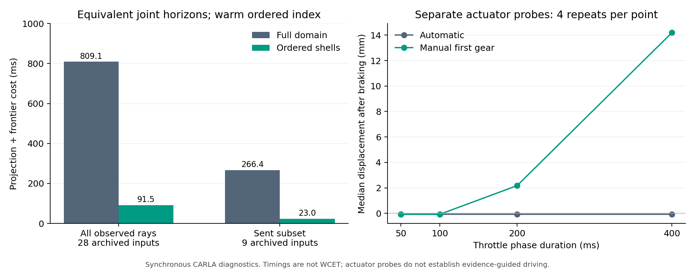

# 在线证据计算：等价加速、新闭环与执行器约束

本轮在 sheng 完成三个有限算法对照、一批十组新 CARLA 闭环和 32 回合独立执行器诊断。**证据计算成本显著下降，已能准入实际指令，但尚未形成有效驾驶。** 完整数据在 `results/online_evidence_20261002`，代码与冻结协议在 `experiments/online_evidence_20261002`。

## 保持证明内容的加速

1. 同一源算法、六个明确标为事后选取的保存状态，对比默认数值库线程与单线程。四次重复的正常续期中位数约 130.59→55.28 ms，困难续期约 183.19→103.28 ms，输出逐字节一致。线程配置是工程因素，不是算法新颖性；两个完整进程按默认后单线程顺序执行，不能排除全部顺序/负载影响。
2. 新边界搜索按到矩形的距离检查单元，发现最近未排除单元便停止。某类别已经限制联合时长后，其他类别只需检查该时长对应的前缀。对上一轮**全部 37 个案例**，三次重复、两种方法共 222 次调用，联合有效期和已报告的限制单元距离均与完整域参考一致。
3. 修复器复用同一候选的投影和未覆盖单元，省去失败候选的重复序列化/验证。接收端仍完整重算全部几何和截止时间。在六个保存状态、400/450/475 ms 三种时长上完成 54 个配对重复，优化输出与完整修复参考逐字节一致，36 个非空结果全部通过原完整验证器和当前射线来源检查。400 ms 参考还与原归档算法/输出相同。

| 边界输入 | 完整域中位数 | 距离前缀中位数 | 测量范围 |
|---|---:|---:|---|
| 全量射线 | 809.05 ms | 91.46 ms | 28 个保存输入，重复使用排序索引 |
| 已发送子集 | 266.36 ms | 23.03 ms | 9 个保存输入，重复使用排序索引 |
| 全量射线，冷排序索引 | 802.77 ms | 116.42 ms | 首次构建排序索引计入 |
| 已发送子集，冷排序索引 | 265.22 ms | 48.08 ms | 首次构建排序索引计入 |

这里冷指新的排序索引；公共网格及其他库缓存可能已有数据，不是整个进程/硬件的冷启动。可见表项是观测耗时，不是未来最坏执行时间。推导及搜索语义见 [THEORY.md](../experiments/online_evidence_20261002/THEORY.md)。每个未检查单元依旧未知，其更远距离才允许停止查询；未采用未检出即为空的假设。

覆盖复用在某个困难保存状态的 400 ms 生成中位数约 111.61→74.86 ms。把旧 400 ms 模板直接扩展到 475 ms 时却经常超出候选能力、触发约 0.65–0.79 s 的完整重建。因此“更长有效期”和“更快计算”不能分别优化后直接相加。

## 十组新闭环

在开始采集前冻结 `LIVE_PROTOCOL.md`：三个相隔至少 15 m 的受控直路位置，20 Mbps+20 ms 按字节计费软件链路，每处原修复/覆盖复用配对；另加首个位置的 20 ms 固定延迟对照，以及稀疏视角负对照，共十组。两种方法都用单线程、475 ms 目标时长、原 200 ms 采样动作包络和严格整数到期判断。475 ms 是根据既有 480.303 ms 根边界选择的固定证明目标，**没有把在线最大边界算法免费插入控制链路**。

| 条件 | 原修复指令数 | 覆盖复用指令数 | 实际前进 |
|---|---:|---:|---|
| 道路 0，20 Mbps | 20 | 21 | 接近零 |
| 道路 1，20 Mbps | 0 | 0 | 根证明失败，未创建自车 |
| 道路 2，20 Mbps | 20 | 21 | 零 |
| 道路 0，固定 20 ms | 39 | 42 | 接近零 |
| 道路 0，稀疏视角/20 Mbps | 0 | 0 | 根证明失败，未创建自车 |

384 个原始观测全部重新生成其消息/拒绝结果；同输入源方法等价、完整参考接收端、严格可用时间、按字节计费延迟和 2,651 个实际物理步的控制/车身检查均通过。六组创建自车、240 次驾驶阶段决策，共 163 次真实已应用前进指令。记录的前向投影位移绝对值小于 0.001 mm，处于数值分辨率附近，不能作亚微米运动解释，更不能称为有效驾驶。

丢包前首 20 次驾驶决策中，道路 0/20 Mbps 源生成中位数约 70.10→64.94 ms，道路 2 约 84.20→75.85 ms，但两者的建模处理步数中位数都还是五步（250 ms）。固定延迟对照的源生成约 72.03→63.12 ms，二者仍为四步（200 ms）。离散时序和执行器响应使小幅编码改善没有变成有效运动。

每个有自车的运行在丢包阶段只抑制了首个可生成的有效消息。其后父证据到期、自遮挡不能由当前射线补全，证明无法恢复。各运行丢包开始时速度已接近零；因此不构成有运动的失联回退验证。零碰撞和零采样包络违例也不支持移动安全结论。

## 执行器诊断

在上述结果后冻结新的有限协议，创建 32 个组件回合：50/100/200/400 ms 的 .45 油门，自动挡/手动一挡，四次重复且交替顺序，随后 40 步制动。记录实际挡位、请求/实际控制、全 3D 车身和速度；1,880 个物理步及所有摘要完成独立重放。

| 油门时长 | 自动挡最终前向位移中位数 | 手动一挡最终前向位移中位数 |
|---|---:|---:|
| 50 ms | −0.080 mm | −0.080 mm |
| 100 ms | −0.080 mm | −0.080 mm |
| 200 ms | −0.080 mm | 2.177 mm |
| 400 ms | −0.080 mm | 14.196 mm |

自动挡峰值速度约 0.00107 m/s，属于微小初始漂移量级；手动一挡在 200/400 ms 时达到约 0.0644/0.0850 m/s。换挡/控制接口影响响应，但此对照没有确定全部底层机制；50–100 ms 的手动指令仍几乎不动。所有回合最终速度为零、没有记录碰撞。**手动策略不同于原校准策略，不能据此直接复用旧统计包络或宣布手动闭环安全。** 油门阶段时长也不能代替完整备份时长。

## 复现、贡献边界与下一步

六项新测试通过。完整保存所有算法对照、冷/热排序索引成本、失败根、按字节链路、丢包断链、原始云/包、实际控制、独立执行器数据和源码/文件哈希。专用 CARLA 进程 65996 与 22096 已分别独立确认停止；两批清理均恢复零车辆、零传感器及异步模式。没有创建持续研究循环。

[新增文献核查](online_evidence_reading_20261002.md)记录出版方摘要的实际阅读范围和正文访问失败。线程调优、排序搜索、覆盖结果复用不能单独被称为 MobiCom 新算法；感知/计算/通信联合优化及闭环网络评估已有相关工作。

当前结果让项目的未完成点更具体：需要可执行、可校准的当前状态动作/备份接口，以及历史到期后仍合法的观测恢复机制。然后才能评价有效期信息保留算法在相同字节和计算预算下是否减少不必要拒绝，完成有运动的失联回退、多场景/真实链路及充分创新对比。本轮改变了权威代码、数据和后续研究方向，属于进展；完整项目及目标会议贡献仍未完成。
