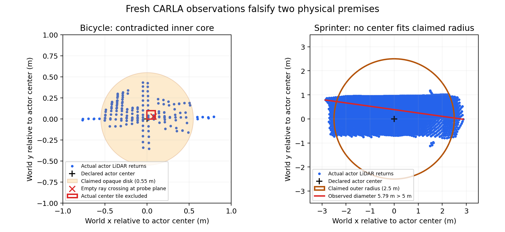

# 新 CARLA 实验证伪了部分物理前提：可信有效期需要先验证观测模型

本轮在sheng重新运行CARLA0.9.15，采集了**48帧新观测、4,237,728条原始语义射线**。结果发现：此前统一的两类障碍物模型不能直接覆盖这次测试中的自行车、摩托车、行人和Sprinter。前几轮的有效期上下界仍是明确假设下的数学结果；把这些数值解释成一般交通物体的物理安全保证，没有依据。

这改变了后续工作的顺序：在更复杂的通信或驾驶实验前，需要修正并验证形状、姿态、探测平面和传感模型。继续增加相同假设下的重放数量，不能解决这个问题。

## 新实验与直接结果

冻结协议先于采集。使用Town10HD_Opt同一标准直路、ClearNoon、50ms同步步长及原有256线/2M点每秒/20Hz语义LiDAR。六个真实蓝图，每个四个朝向、两个既有RSU视角，共48帧。每个物体先落稳再冻结物理姿态，专门隔离几何前提。没有修改半径，没有删除不利帧，没有把同一批数据用于调参后再称为验证。

被检验的假设是：关于同一个中心，车辆在指定平面具有半径0.55m的不透光内核，并被半径2.5m的外包络包含；行人的相应数值为0.2m和0.4m。本次中心取演员包围盒中心，与此前CARLA真值评估口径相同。评估真值不进入编码器。

| 蓝图 | 帧数 | 射线与名义内核矛盾 | 原接收公式稳健排除真实中心网格 | 真实回波越出外半径 |
|---|---:|---:|---:|---:|
| Audi A2 | 8 | 0 | 0 | 0 |
| Tesla Model3 | 8 | 0 | 0 | 0 |
| Diamondback自行车 | 8 | 8 | **8** | 0 |
| Kawasaki摩托车 | 8 | 8 | **8** | 0 |
| 行人0001 | 8 | 8 | **6** | 0 |
| Mercedes Sprinter | 8 | 0 | 0 | **8** |

这些“排除”是将不适用的物理模型套入原公式后的诊断，不是已经发出的危险动作或观测到的碰撞。数学规则在真实不透光内核假设下的条件性推导没有因此被反驳；被反驳的是本次物体/姿态/高度下的物理解释。

22帧的矛盾在扣除原有点坐标、原点、查询配准误差和整个网格的半对角线后仍成立。自行车的净排除余量为0.289–0.429m，摩托车为0.062–0.265m；因此不是微小浮点误差造成的。行人的另两帧只有名义矛盾，没有达到稳健排除阈值，单独保留。

Sprinter实际回波到声明中心的最远平面距离为2.928–2.982m，超过2.5m。更强的是，其中7帧的实际回波点对距离超过5m：由三角不等式，**换一个中心也无法用半径2.5m覆盖这些实际点**。Tesla包围盒角点虽超出2.5m，但实际观测回波未超出；包围盒角点未必是实体表面，不能把它算成同类反例。

## 为什么这与“可信、不过度保守”直接相关

以前定义的L≤H*≤U，针对的是与观测I及假设A一致的世界集合W(I,A)。如果实际物体不满足A，真实世界不在这个集合里；更紧的L/U、更快的算法或更小的消息都不能补上这个缺口。

有限理想射线本身也不能对完全不受限制的障碍物给出普遍非零的空闲空间保证：在有限条三维线段之间，仍能放入一个足够小且不改变任何回波的物体。因此必须有可验证的最小可探测结构、可靠先验空闲状态，或明确校准的残余风险模型。[推导及限制](../experiments/physical_contract_20261002/THEORY.md)给出具体论证。

Audi和Tesla这8帧没有反例，并不证明其所有姿态、动画、高度和运动过程都满足原假设。本次测试也没有给出真实传感器的统计置信保证。[CARLA官方传感器说明](https://carla.readthedocs.io/en/0.9.15/ref_sensors/)明确区分理想语义LiDAR与带强度、丢失和噪声模型的普通LiDAR；本轮使用前者。

## 已完成的修正与验证

新增`ContractGate`和`OperationalBoundary`，把“条件性数学有效期”与“物理动作适用性”分开。适用性依赖接收端配置的完整潜在物体群体，不能由当前已经看见的类别列表替代，因为遗漏的类别可能正在遮挡后方。被反例证伪的模型标为refuted；有限测试未发现反例、未见蓝图或修改后的半径均标为unverified。本包没有正向物理校准证书，因此这层接口不授予物理动作权限，同时保留数学有效期供研究诊断。

这项接口修正防止误用，不等于已解决模型适配或已获得可用驾驶策略。旧冻结实验和哈希没有改写，条件性结果保留；新的部署入口要求单独处理物理前提。

独立审计不导入被测几何代码，逐帧从原始语义字节和欧拉姿态重建世界点云，并核查同帧演员状态、真实射线、包含实际中心的网格以及演员自身回波。每条关键射线枚举64组端点/原点误差角点和4个查询误差角点，共**12,288组检查**。原投影公式提供整个误差盒的保守包络，独立角点核查用于交叉验证本次实例。两台主机的分析和独立审计JSON均逐字节一致。6项回归测试包括真实自行车反例、遮挡类别不能省略、外半径失败、未校准状态和审计摘要绑定。

最初的离线分析在记录相对路径时出错，发生在读取点云之前；已修正并保留失败日志。48帧没有重采。采集结束后车辆、行人、传感器均为零，原异步设置已恢复，本次专用CARLA进程已关闭。

## 下一步的实际问题

应建立与形状、姿态和高度绑定的观测合同，或者改用形状相关的三维证据及独立残余风险校准，再评估历史补证和有效期。不能从本次48帧选一个更小半径，随后将同一批帧报告成验证成功。动态驾驶、真实链路及MobiCom创新性仍未完成。本轮给出了具体可复现的物理反例和适用性边界，项目目标保持未完成。

[冻结协议](../experiments/physical_contract_20261002/PROTOCOL.md) · [复现说明](../experiments/physical_contract_20261002/README.md) · [分析结果](../results/physical_contract_20261002/analysis_sheng.json) · [独立审计](../results/physical_contract_20261002/audit_local.json)
