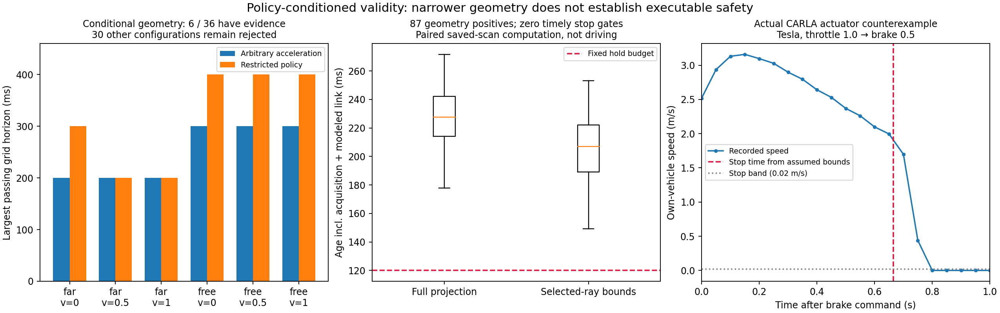

# 策略约束的证据有效期：几何改善、时延失败与执行反例

日期：2026-10-01。目标仍是从不完整观测构造可信且有用的车联网证据有效期。

**本轮推进了条件几何算法，但没有解决可执行安全闭环。** 在 sheng 完成 30 组新的 CARLA 车辆控制诊断、180 组静态几何对照、1,044 组当前射线续证对照。限定执行策略后，4/36 个场景—速度组合的最大通过网格期限增加 100 ms；但全部续证仍错过固定的等待预算，车辆实测也反驳了先前使用的若干运动界。不能把条件几何通过写成安全行驶成功。

## 问题的数学边界

令 O 为截至参考时刻的观测，M 为明确声明的传感器、遮挡物几何和动力学约束，W(O,M) 为与二者相容的所有世界。对一条包含失联后备动作的执行策略 π，有效期应满足：在期限内每个时刻、每个相容世界中，障碍占用与车辆实际可能占用均不相交。它是 O、M、π 的函数，不能仅是检测置信度的函数。

如果同一份 O 同时允许“遮挡后没有物体”和“未观测物体能在任意短时间内进入行动区域”两个世界，那么仅凭 O 无法给出统一的正安全期限。缺失运动界、最小可感知几何或有效误差界时，缩小置信区间不能解决这个不可区分性。概率期限可以换一个问题，但必须声明分布及校准适用范围，不能把有限数据上的覆盖率当成逐场景确定性保证。

本实现仍沿用“原始第一返回射线 → 带误差的空闲见证 → 排除潜在障碍中心 → 覆盖行动所需区域”的条件证明。减少保守性的可检查途径是缩小**实际允许执行的动作集合**；不是宣布未知区域为空、删除小目标类别或把未经标定的误差改小。接收端仍重算原始射线的量化、投影和逐射线年龄误差。

## 本轮算法

`tube.py` 将动作限定为：等待证据时执行制动/保持，最多等待 120 ms；随后执行 50 ms 前进片段，再进入制动后备。反应时间上界暂设 20 ms。假定向前速度非负，牵引增长 ≤3 m/s²，有效制动使速度至少按 4 m/s² 降低，偏航率 ≤0.2 rad/s、速度方向相对航向偏差 ≤0.03 rad。低速终止带为 0.02 m/s，并在剩余有限期限内继续计入漂移。**这些是模型前提，下面的实际控制实验并未使它们成立。**

设初速 v、等待 δ、反应时间 r=min(δ,0.02)、控制及制动反应合计 t=0.07，a=3、b=4。保守路程为：

S = vδ + a(rδ−r²/2) + (v+ar)t + at²/2 + (v+ar+at)²/(2b)。

从参考时刻到终止的时间为 δ+t+(v+ar+at)/b。对 δ≥20 ms，等于 δ+0.1375+v/4；还必须满足 δ≤120 ms。v=0.5、δ=0.12 时，S=0.1872625 m、完成时间 0.3825 s。此前任意方向模型对应的停车时间为 1.75δ+0.1225+v/4；两个式子执行约束不同，不能据此声称新算法在相同控制能力下全面优于基线。

车身为半长 2 m、半宽 1 m 的矩形；路径长度、横向方向偏差、车身旋转、定位误差与低速漂移共同构成完整占用包络。每一障碍类别再加入外半径及未来运动范围。所有被所需集合触及的网格均需当前射线覆盖。**本轮不使用历史空闲先验或人为初始空闲矩形。** 包中绑定策略、速度、航向、坐标系、参考时刻和期限；接收端检查缺失类别、伪造先验、策略替换、未来时间和整数微秒过期。

`strict_policy.py` 补充了精确参考时刻检查，避免向上舍入接收时间时将略早于参考时刻的消息误认为已到达；保留已经计时的原始实现及其散列不变。`conditional_stop_gate` 的名字明确表示条件计时诊断，代码没有把网络包内的一个布尔声明当作物理标定或行动许可。

## sheng 计算结果

冷启动使用已有十二个首帧、速度 0/0.5/1 m/s、期限 0.2/0.3/0.4/0.5/0.6 s，共 180 组配对。速度是模型输入，不是这些静态采集中的实际车速。

| 项目 | 结果 |
|---|---:|
| 通用绝对加速度 8 m/s² 模型：几何通过 | 9/180 |
| 策略约束模型：几何通过、压缩后接收端通过 | 13/180、13/180 |
| 仅假设 20 ms 年龄、忽略计算的停车门限通过 | 7/180 |
| 计入冷启动计算，尚未计采集：停车门限通过 | 0/180 |
| 当前射线续证尝试，含缺失模板 | 1,044 |
| 模板可用／几何通过 | 261／87 |
| 完整投影与选中射线重算的字节一致结果 | 1,044/1,044，含双方均拒绝 |
| 计入历史采集耗时、计算和建模链路：停车门限通过 | 两种实现均为 0 |

两类模型都只有加密视角 0 的 free/far 六个场景—速度组合存在正证据，其余三十个组合在网格内均失败。free 的三种速度最大网格期限从 0.3 s 到 0.4 s；far 的静止配置从 0.2 s 到 0.3 s。该 100 ms 增量受预设网格分辨率限制，不是连续最优有效期；近障碍场景没有几何通过项。

续证仅复用模板的支撑位置，并从新一帧选取实际射线，再完整核验。对于 87 个几何通过项，完整投影源端中位数 138.20 ms，优化后 112.93 ms，接收端 18.98 ms，历史采集耗时 54.92 ms。计入假设 20 ms 传输后，年龄中位数分别 227.51/206.87 ms。最快的优化通过项也有约 149.25 ms，超过 120 ms 等待约束。因此期限更长并未转化为实际可用行动窗口。

这是既有扫描的配对计算对照：顺序交替、保留无模板拒绝，并非无线链路实测或新的动态驾驶。所有 100 个保存的几何包（13 冷启动、87 续证）均回查其当前源射线，并复算记录的计时判定。

## 实际执行条件：30 组 CARLA 诊断

CARLA 0.9.15 在已授权 Windows 主机运行；客户端及实验计算位于 sheng 的 WSL Ubuntu。固定 50 ms 同步步长，物理子步最大 10 ms；空世界、直路、零转向；无目标速度覆盖、无段内位置传送。各阶段先写固定方案，再采集。逐帧保存自身位置、速度、控制、时间及碰撞事件。检查连续帧、50 ms 时间差和相邻记录的前后速度一致。官方 [API](https://carla.readthedocs.io/en/0.9.15/python_api/) 说明这些车辆状态 getter 读取最近 tick 的客户端状态；[同步与子步文档](https://carla.readthedocs.io/en/0.9.15/adv_synchrony_timestep/) 给出相应步长条件。本数据不是连续时间传感器标定。

| 阶段 | 固定配置 | 达到目标 | 观测 |
|---|---|---:|---|
| 18 组初始控制诊断 | Audi、油门 0.2；三种目标速度、三种制动、两次重复 | 12/18 | 六组 2 m/s 目标失败；驱动采样加速度最高约 12.32 m/s² |
| 8 组传动/指令诊断 | 自动/手动一挡 × 直接/同步批量；目标 0.5/2 m/s | 2/8 | 实际控制值匹配；同步批量和手动一挡未解决低油门响应 |
| 4 组车辆/油门敏感性 | Audi/Tesla × 油门 0.5/1.0；目标 2 m/s、制动 0.5 | 4/4 | 行驶可以实现，但原运动界仍不成立 |

初始 18 组未记录控制回读，分析将该字段记为 null，不能将其当作“已核验无差异”。后 12 组回读均匹配油门、制动、转向，且无手刹或倒车标志；重复同场景不是独立统计样本。30 组均无记录碰撞，这既不验证遮挡安全，也不建立稀有事件保证。

强反例来自 Tesla、油门 1.0 后切制动 0.5：制动开始速度约 2.518 m/s。按旧牵引、反应和制动界，应在 0.66451 s 内停止；实际在 0.70 s 仍为 1.69788 m/s，0.75 s 仍为 0.43884 m/s，0.80 s 才进入观测低速带。该轨迹否定将那组参数直接用于该执行条件。四组敏感性数据中最大驱动采样加速度约 18.23 m/s²，最大制动减速度幅值约 25.18 m/s²。未发现采样越界也不能反过来证明连续时间硬界。

Audi 和 Tesla 的实际车身尺寸分别保存在元数据；Tesla 控制诊断没有被偷换成半长 2 m 的几何准入实验。每阶段清理传感器、车辆、同步模式和本轮专属 CARLA 进程，并保存检查结果。没有建立持续研究循环。

## 科学结论与项目状态

本轮支持的结论是：**动作约束能够在同一不完整观测上减少条件几何保守性，但计算年龄和真实执行约束可使其完全失去可用性。** 这使下一步有了可证伪的目标：同时缩小动作/后备占用、验证控制可实现性，并把生成与核验时延纳入可用期限。单独画“证书期限更长”的曲线不够。

“考虑后备动作以降低遮挡保守性”并非已建立的新颖点。[Zhang 与 Fisac，RSS 2021](https://roboticsproceedings.org/rss17/p066.pdf) 已研究相应博弈及未来避让能力；本轮沿用前一报告实际阅读部分的定位，未新增全文综述。通信方向真正尚待证明的贡献是：在有限带宽、延迟和不完整输入下，接收端能独立复算的动作条件有效期，能否比强几何/控制及通信基线更有用。

当前尚缺物理传感器与不透明内核约束的有效标定、可实现的控制包络、真实车身自遮挡下的可靠初始化、使用该证书的动态闭环与公平强基线。项目没有完成，也尚未达到可声称 MobiCom 2027 充分实证支持的阶段。负结果和全部源码、方案、原始输出保留。

[复现说明](../experiments/policy_evidence_20261001/README.md) · [几何复核](../results/policy_evidence_20261001/validation.json) · [执行诊断](../results/policy_evidence_20261001/actuation_analysis.json)
