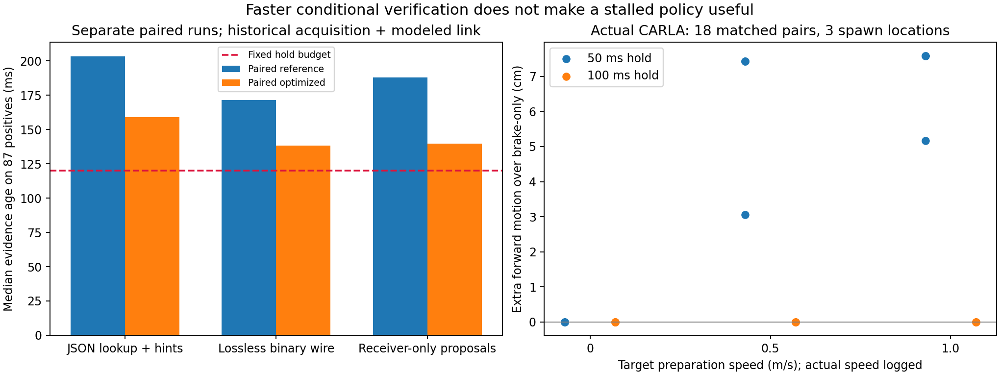

# 当前射线增量复核、无损传输与策略实用性诊断

2026-10-01，sheng。当前任务仍是：从不完整观测得到可信且不过度保守的证据有效期，并形成可支撑 MobiCom 2027 研究的算法与闭环实证。

**本轮消除了部分计算浪费，也发现现有短时前进策略的实际用途不足。** 三阶段共 9,396 次方法—案例评估使用相同的 1,044 个基础案例，不是 9,396 个独立道路场景。新增 36 组实际 CARLA 控制轨迹形成 18 个配对。无损二进制组合实现有两个静止案例及时通过，但所有方法的运动配置均未及时通过；控制配对显示等待制动 100 ms 后，50 ms 前进指令几乎没有额外位移。该策略不应继续作为“已实现有效行驶”的候选方案。

## 可复核的计算改进

原来的包已经包含当前原始射线，接收端每次重新做完整最近邻查询。本轮只缓存“某网格上次用哪条射线证明”的索引提示。设当前射线的平面见证为 w、重算误差为 e，网格中心为 c、边长为 Δ，则提示只有在

‖c−w‖ + e + Δ/√2 + 数值保护项 < 障碍不透明内核半径

时才可覆盖该网格。每个网格每次都用当前 w、e 检查；提示失效时，对剩余网格执行原完整查询。缓存中没有可直接接受的旧“空闲”事实。故提示命中提供同一充分条件，回退保留原搜索结果；它不延长证据的物理有效期，不引入初始空闲先验。源端与接收端使用不同提示缓存。

第二个优化只缩小射线匹配搜索范围：候选被限制在旧支撑位置的包围盒外扩 0.25 m 内，只有最近距离严格小于这个裕量且没有近似并列时才使用局部查询，否则回退到原完整树。

第三个优化是无损 PVX1 编码：元数据保留明确模型，坐标仍为毫米整数，射线年龄仍为微秒整数。每条射线使用 20 字节，接收端重建与旧 JSON 完全相同的整数观测时刻。大小、索引、范围、年龄、模型绑定、未来时刻和截止时刻均检查；SHA-256 只检测损坏，不提供传感器认证。二进制与 JSON **不是字节相同**，验证目标是解码后的全部整数射线及语义相同。

最后补充了强简单基线：源端发送未验证的候选射线包，由接收端做唯一一次完整几何核验。这避免重复核验，但接收端拒绝的包也已消耗通信资源。代码将其命名为 proposal，不能在核验前用于行动。

## 三阶段配对实验

保持上一轮的传感器误差、两类障碍、完整车身、运动参数、120 ms 等待预算及期限不变；这些物理前提仍未得到标定。使用同一组已有静态扫描，轮换方法执行顺序。所有方法每轮 1,044 个案例，几何通过均为 87。计时加入历史采集耗时、源端与接收端耗时、一次时限谓词计算及假设 20 ms 链路，并另报 +1 ms 记账敏感性。它不是完整在线无线闭环计时。

| 阶段及方法 | 有效包上的源端中位数 | 接收端中位数 | 证据年龄中位数 | 条件停车门限通过 |
|---|---:|---:|---:|---:|
| A：JSON 原查询 | 103.62 ms | 24.42 ms | 203.32 ms | 0 |
| A：JSON 局部查询 | 98.72 ms | 24.80 ms | 197.09 ms | 0 |
| A：JSON 索引提示 | 68.69 ms | 13.42 ms | 167.01 ms | 0 |
| A：JSON 两项组合 | 65.66 ms | 14.83 ms | 158.95 ms | 0 |
| B：JSON 组合，同阶段参照 | 76.58 ms | 15.35 ms | 171.35 ms | 0 |
| B：二进制、完整查询 | 107.83 ms | 21.09 ms | 199.91 ms | 0 |
| B：二进制组合 | 50.11 ms | 7.98 ms | 138.14 ms | 2，仅 v=0 |
| C：只在接收端核验、完整查询 | 63.14 ms | 40.98 ms | 187.90 ms | 0 |
| C：只在接收端核验、局部查询及提示 | 50.99 ms | 10.79 ms | 139.74 ms | 0 |

不同阶段的机器计时存在波动，比较应在同阶段配对进行。两个及时案例为 dense_0_free_03、H=0.4，及 dense_0_free_09、H=0.3，年龄分别约 113.96/112.91 ms；额外加 1 ms 后仍通过。它们都是假设静止车身，不能作为运动闭环成功。后续更简单的接收端基线再次得到零及时项，也说明不能把两项边界成功当成稳定能力。

A 阶段四种实现的全部 4,176 个结果与冻结参考字节相同，包含双方拒绝。B/C 阶段解码语义与参考决策一致。固定数据中相邻帧高度重复，这有利于索引提示，不能据此宣称动态场景加速同样成立。

B 阶段包大小中位数从 41,041 降到 31,525 字节，总有效包字节从 4,481,377 降到 3,432,631，约减少 23.4%。C 阶段每种方法发送 261 个候选、接收端只通过 87 个；总发送 10,895,995 字节，其中 7,463,364 字节最终被拒绝。假设的 20 ms 链路没有计入这些额外包引起的队列与竞争，因此不能将该基线描述为免费省掉源端计算。

新增 120 个固定稀疏包扰动案例：端点平移、观测年龄、射线删除与重排交叉。四种接收端的 480 次判定全部一致，只有两种未改变几何与年龄的完整包顺序通过，其余拒绝。这个结果显示当前稀疏包几乎没有冗余裕量；它不证明完整新点云在轻微运动后一定无法重新选择出有效证明。未来需要单独比较压缩率、覆盖裕量与可续证范围。

## 实際控制：增量位移而不是惯性滑行

新增 36 个 Audi A2 轨迹：三个直路出生点 × 目标准备速度 0/0.5/1 m/s × 等待 50/100 ms × 前进/持续制动。每一配对重新准备相同状态，记录的参考位置、航向、速度完全相同。按实际初速检查模型，目标准备速度不被当作实测速度。

执行参考策略时，等待阶段满制动，之后油门 0.5 持续一个 50 ms tick，再满制动 40 tick；配对对照在该 tick 也持续制动。使用单一 world snapshot 读取状态，并检查其帧号等于 tick 返回帧号；无目标速度覆盖。保存真实控制回读、车身尺寸和偏移、逐帧时间、速度和位置。

| 初始准备目标 | 等待 50 ms 时相对持续制动的额外前移范围 | 等待 100 ms 时 |
|---|---:|---:|
| 0 m/s | 数值精度量级，约 0 | 约 0 |
| 0.5 m/s | 3.06–7.43 cm | 0 |
| 1.0 m/s | 5.16–7.59 cm | 0 |

36 个轨迹全部完成准备，采样车身均位于声明的 2 m × 1 m 半尺寸内；在前 0.4 s 的采样中未发现整体包络违规，也未发现所记录的停止时间反例。这个有限结果不撤销前轮其他控制条件的执行反例，也不证明连续时间硬界。三点位和固定控制没有形成可交换、独立的校准数据集。未记录碰撞不能代替遮挡安全评估。

上述结果直接限制了“等待中制动—50 ms 前进—再制动”策略的适用性：在目前超过 100 ms 的证据年龄附近，它没有显示可用的持续行驶能力。后续动态集成应使用有证据支持的连续控制及证书交接，保持完整后备动作覆盖，评估真实任务进度、失效制动与通信开销。当前策略不应靠扩大试验数量获得成功表述。

## 校准路线的文献边界

本轮核对 [Formal Verification and Control with Conformal Prediction，v3](https://arxiv.org/html/2409.00536v3) 第 3 节的有限样本分位数与第 21 节局限。可交换数据下的边际覆盖不自动成为每个当前状态的硬保证；控制改变数据分布也需处理。不能用本项目少量重复轨迹直接宣称任意道路上的可信动力学界。

另阅读 [Lin 与 Bansal，L4DC 2024](https://proceedings.mlr.press/v242/lin24a/lin24a.pdf) 第 5 节 Theorem 3、Lemma 5 及讨论：校准样本置信水平与系统风险水平需要区分，文章还建立了对应的场景优化关系。仅给当前系统加一个 conformal 分位数不是已经证明的研究创新。两篇均按上述章节阅读，未声称全文复现。

## 验证与状态

11 项测试覆盖当前覆盖条件、提示失效、近边界回退、并列最近邻、未来/过期时间、损坏消息及二进制非法整数/索引/年龄。522 个阶段—格式包检查回查当前原始射线，并复算记录的判定；其中包含必须拒绝的候选包，不能全部称为安全证书。代码、原始数据、正负结果与 sheng 环境记录均归档，独立 CARLA 进程已清理，没有建立持续任务。

完整项目尚未完成。当前已形成可检查的条件证书实现和更完整的失败定位；可信物理观测模型、可执行连续动作、初始化、动态通信闭环及足够强的新颖性证据仍欠缺。

[代码与复现](../experiments/policy_runtime_20261001/README.md) · [全部判定复核](../results/policy_runtime_20261001/validation.json) · [控制配对](../results/policy_runtime_20261001/execution_analysis.json)
