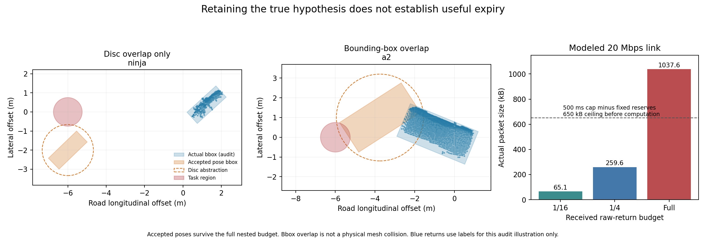

# 连续姿态反演结果：覆盖真实状态，仍可能没有可用有效期

2026-10-03，在 sheng 完成两组各144次、合计288次有限重放。本轮实现了不依赖真实障碍坐标的连续姿态集合外包、原始时间戳保留的几何消息、最早失效见证及独立审计。**结果是否定性的：上一轮“真实形状误排少”并不足以支持可信且有用的 TTL。当前穿透比例模型不能作为完整方案继续宣称成功。**

## 实际补上了什么

接收端之前只能对给定真实盒评分。本轮接收端从射线、传感器位姿、公开道路参考系与预先声明的形状目录出发，考虑连续位置和朝向。它不读取真实 actor 坐标、语义标签或检测器输出来定位候选状态。

先验明确限制为一种已声明蓝图、平坦道路、中心高度在该盒半高上下0.1m内、俯仰／横滚各±2°、任意航向。水平计算区间为24m×16m，区间边界及以外仍视为未知。所有12个选中真实姿态都落在该范围，**但这不是自然交通先验或物理边界的验证**，更不是未知车型、未知数量、倾倒物体等情况的覆盖保证。

算法把六维姿态域切成连续区间，仅在能排除整个区间时删除它；计算预算耗尽的部分继续保留。对每个保留区间计算任务最早可能失效的下界，实际被评分接受的姿态提供上界。这样不会把“采样点没出问题”误当成整个连续空间安全。

消息只传感器坐标系的float32 xyz、位姿、帧号、原始时间戳、固定采样步长和校准标识，含完整性摘要，不包含真值标签。收到1/4点云时继续使用1/16约束；收到完整点云时继续使用前三种约束。由此，同一评分模型的精确保留集合满足嵌套关系，不会因更换预算而忘掉已有约束。

## 实验与未成功的改进

使用上一轮每类测试索引0和10、视角0，共12个已有观测；每个观测有道路坐标(-6,0)和(6,0)两个固定任务圆，半径0.75m。三个点云预算、两种队列顺序，共144次。随后保留原实验，以相同输入和2000个检查节点上限，再做144次更紧区间界比较。

收紧包括两项：按旋转轴分别计算包围误差，以及利用“穿透比例＝1−未穿透数／有效射线数”保留分子分母关联。数学上可比独立计数比值更紧，边界和随机几何回归验证通过；**实际288次调用仍未排除任何完整姿态区间，全部有效期下界为零。** 更紧的公式在当前搜索分辨率和预算下没有转化成实际收益，不能作为成功优化报告。

这也意味着返回的外包集合仍等于原先验。实现覆盖了连续空间，但还不是一个有效收紧的定位器。FIFO比较也不是完整复现文献SIVIA的栈搜索，不能据此断言所有集合反演算法都失败。

本轮没有新CARLA采集，也没有新独立校准；它是固定旧观测上的算法与模型诊断。所有运行、区间树、消息和失败结果都保留，没有挑选有利案例代替原结果。

## 失效见证揭示了两种不同问题

每组144次调用中，有119次找到当前评分模型接受、且圆盘外包模型在时刻零就与任务圆冲突的姿态。这119次包括不同预算／队列对同一观测的重复，不是119个独立交通场景。

进一步使用实际姿态的包围盒投影核验：

- 74次仍有包围盒投影重叠。
- **45次只有外包圆盘重叠，较紧的包围盒投影并未重叠。**

因此，零上界证明的是当前“评分保留集合＋圆盘运动外包”模型下的零期限，不能解释成119次物理碰撞，也不能解释成原始传感器信息本来就不足。即便包围盒重叠，其内部也不一定被实体填满。

这把两个问题分开了：一是测量摘要允许大量错误位置／姿态；二是碰撞和运动外包本身丢失形状、朝向与运动约束。单纯把区间切得更细，无法自动修复两者。

## 更多观测排除了哪些反例

把两种算法、两种队列找到的姿态去重，得到39个候选反例。使用独立六面交点程序，按每个预算重新计算全部分数，共4,425,018次点检查。这里没有使用真实 actor 位置生成新候选，也没有把其他预算的结论免费赠给较小预算；每个候选都按该预算实际包含的射线重新验证。

| 收到的预算 | 消息字节 | 39个候选中仍被接受的个数 | 24个任务查询中已有零期限见证的个数 |
|---|---:|---:|---:|
| 1/16 | 65,060 | 39 | 23 |
| 1/4，保留1/16约束 | 259,568 | 32 | 22 |
| 完整点云，保留全部约束 | 1,037,588 | 25 | 17 |

增加观测排除了14个已知反例，但完整点云下仍有25个存活。对24个查询，17个可证明当前抽象模型的最优期限为零；其余7个的下界仍为零、上界至多340.649ms。**正的上界不证明存在正的有效期**，因为可能还有更早、尚未找到的反例。

全部12个真实姿态都被这些预算保留；24个真实包围盒在观测时都不与任务圆重叠。若审计阶段免费提供真实位置，使用同一圆盘运动上界可得到142.953–500ms的正下界。该真值对照不能成为部署算法或公平在线基线，但说明“保留真值”和“把错误状态收紧到足以行动”是不同要求。

## 错误姿态的支持来自哪里

对完整点云下仍存活的25个姿态进一步审计：**18个的全部“未穿透返回”都位于公开道路高度上下5cm内，而且没有一个属于真实目标 actor。** 这里的近道路高度是审计指标，不能直接等同于在线语义地面分类。旧评分把这些返回也算作支持假想障碍的证据。

随后独立实现了固定高度裁剪与重新校准，并继续做连续空间检验，见[地形修复报告](terrain_score_result_20261003.md)。旧结果和旧评分保持不变，不把修复后的数字回填到原实验。

## 信息成本也不能忽略

在明确标注的20Mbps、单向20ms链路模型中，完整点云仅串行化就需要415.035ms；加上传播20ms、时钟预留20ms和动作预留200ms，共 **655.035ms**，已经超过500ms研究上限，尚未计算任何算法开销。

进一步测试普通无损压缩：完整包的zlib大小为719,861–734,019字节，连续32位差分加字节重排为763,998–765,242字节，仍超出上述零计算截止条件。但**共享设计参考帧的无损差分仅需19,413–53,663字节**，36份消息全部逐字节重建了当前观测与当前时间戳；缺失／错误参考和错误摘要均被拒绝。参考帧首次安装需725,278字节，首次合计成本仍超过500ms；已缓存时则消除了这个受控重复场景中的大包瓶颈。参考只用于编码，不把旧观测当作当前自由空间证据。三个普通编码器及共享参考的字节结果均跨主机一致；CPU开销另存实测日志。这是强基线，不是新的通信贡献，也不能外推到改变传感器或场景后的压缩率。

原区间实现的接收端中位耗时随三种预算为19.20、53.46、80.75ms；收紧实现为21.11、61.85、92.08ms。所有调用的可用下界仍为零。这些是有限离线重放的实测程序耗时加模型化链路，不是实时车联网测试或WCET保证。

图中真值标签仅用于审计展示，算法没有收到这些标签。两种反例均通过完整嵌套预算的评分；图示包围盒也不等于车辆实体网格。

## 与文献的关系及下一步应改变的对象

[Jaulin与Walter的SIVIA论文](https://webperso.ensta.fr/Jaulin/paper_automatica93.pdf)早已研究通过区间包含关系构造集合内外界，不能把本轮分支细分当作新发明。[S-Lemma姿态不确定性论文](https://arxiv.org/html/2511.21666)已研究从测量不确定性传播到连续姿态集合，并明确指出局部边际覆盖不能直接等同于联合姿态覆盖。阅读范围与限制记录在[READING.md](../experiments/pose_inversion_20261003/READING.md)。

本轮改变了后续研究决策：**先建立能实际定位、具有联合覆盖解释的测量前端，再使用保留方向信息的轨迹外包；通信设计必须先比较普通无损与共享参考压缩，不能仅凭未压缩全点云成本宣称优势。** 需要先和强的点云定位／跟踪加校准基线比较，再讨论消除最早失效反例的语义通信价值。旧穿透比例可以作为诊断或附加约束，不能独自承担完整状态估计。

合理的MobiCom研究问题仍是：有限通信能消除哪些导致近期任务失败的状态，扣除源端处理、传输和接收验证后，净增加多少可用有效期。新颖性、有效行驶和真实链路结果都还没有建立。

## 审计与可复现性

独立程序检查288次调用、72份消息记录、317,672个树节点、全部分区覆盖、原始字节、时间戳、同信息见证及代价计算。由于没有区间被删除，真实数据上的区间排除审计计数为零，不能包装成成功排除验证。连续包含公式的证据来自推导和随机／边界测试；float64工程裕量不是形式化向外舍入证明。

12项测试在两端通过。最初跨平台输出仅有4个真值注释坐标相差最后一位浮点数；未舍入文件和差异记录均保留。仅把输出注释规范到12位小数后，独立审计、反例库和汇总逐字节一致；所有几何判定使用原始数值，未改变。

本轮没有启动CARLA服务，没有建立自动研究循环。整个项目仍未完成：有效状态定位、经验证的运动／传感器契约、动态风险、可用闭环、实测链路和最终论文贡献仍需完成。本轮不能被改写成一个已经成功解决这些要求的候选方案。
