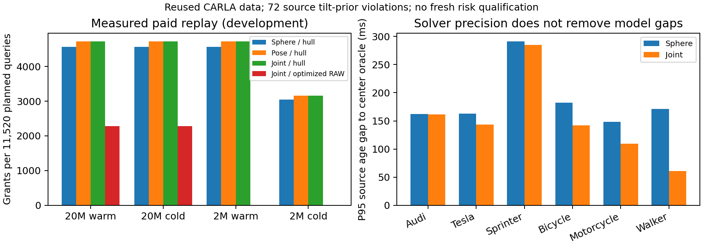

# 不完整观测的有效期：完整朝向覆盖有小幅收益，但可信性仍需新校准

**sheng 已完成这轮有限实验、完整点云强基线优化和独立复核。已得到可核验的有效期下界，但“可信且不过度保守”尚未解决。** 完整未知朝向集合比球模型多165/11520次付费可用决策；同报文姿态模型几乎已解释全部收益。另有72个观测帧违背原来的倾斜先验，不能因为这批数据没有中心排除就把模型当作新的安全保证。

## 本轮实际解决了什么

局部可见点偏在车体一侧，不应把其均值当作物体真实中心。本轮用已知类别的长宽高反推所有可能中心，保留每个点组的全部180个朝向区间，每区间1°；不选一个PCA或最可能朝向。每区间的约束形成旋转矩形，完整并集保留未知朝向和组关联歧义。完整凸包保留全部方向投影极值，和全组点约束完全等价。

每个查询到这个有限外包集合的最小距离有精确有理数见证，距离上下界差最多1µm，源时刻有效期差最多1µs。它是**所声明外包模型内**的数值紧度，包含朝向网格、倾斜余量和形状外包的保守性；不是全部传感器射线、真实网格和连续物理世界的最优有效期。

球模型与姿态模型使用同一个校准余量。联合下界取两者有效期下界的最大值，成立需同一个当前状态联合覆盖事件，不假设模型或视图独立。两个分离模型的上界取最大值不能证明联合交集的近最优性，因此本轮没有这个主张。

代码和冻结范围见[协议](../experiments/pose_support_20261004/PROTOCOL.md)、[条件推导](../experiments/pose_support_20261004/THEORY.md)和[复现说明](../experiments/pose_support_20261004/README.md)。

## 全部有限评估结果

复用已检查的930计划回合：884捕获、46失败，5304源观测帧；测试360计划回合，346捕获、14失败，2076帧。2072测试帧有界，4帧无观测而拒绝。每类95个校准回合，整回合分数同时覆盖球/姿态及该回合全部源观测；这次设计使用过既有数据，所以校准只是开发描述。

整回合最大余量：Audi、Tesla、Sprinter和行人0；自行车21424µm；摩托车34905µm。每类60计划测试回合中，观测到的联合中心排除均为0，缺失观测不给新事实。不能将其解释为新获得的5%风险控制或按已接受决策条件化的风险。

| 链路与安装状态 | 球模型／凸包 | 姿态模型／同凸包 | 联合／同凸包 | 联合／优化完整XYZ |
|---|---:|---:|---:|---:|
| 20Mbps，已安装上下文 | 4563 | 4727 | 4728 | 2279 |
| 20Mbps，需传上下文 | 4563 | 4727 | 4728 | 2279 |
| 2Mbps，已安装上下文 | 4562 | 4726 | 4727 | 0 |
| 2Mbps，需传上下文 | 3043 | 3159 | 3157 | 0 |

每格分母11520计划查询；失败计划保留。20Mbps联合比球模型新增167次、失去2次，净165次，即1.4323个百分点。相对姿态模型只新增5次、失去4次；2Mbps需传上下文时反而净失去2次。几何更紧不保证付完计算以后更好。

三种凸包政策传完全相同的实际报文，共享完全相同的源处理计费；分别测量完整接收推理。完整XYZ基线重新做在线点组和同一联合推理，另一次冻结后的优化给予其相同精确凸包约简：全部2076帧输出相同，完整三次接收任务的最大测量值重新计费，1440条因果轨迹重建后仍为2279/2279/0/0。原来未优化的结果保留，没有故意让基线做冗余投影来制造胜利。

共同上下文实际56710B，源/接收最大测量4541/1519µs；低速冷安装比上一轮更贵，不能跨轮比较成算法退步或进步。冷指服务已初始化而上下文需要传输，不是冷启动Python/本地库。各政策支付原始观测获取、采样、完整源处理、实际压缩字节、20ms传播、完整接收计算和三条FIFO队列；有效期始终从原源时刻计，不在到达时刷新。200ms动作加20ms时钟余量固定，500ms上限固定，观测最大值不是WCET。

## 新发现的可信性问题

姿态外包推导曾假设实际朝向距某纯水平朝向的算子范数不超过0.087267，相当于一个充分的近直立条件。本轮审计发现72帧不满足：Audi12帧、自行车12帧、摩托车48帧。测试中分别涉及2、2、7个回合；另有24帧来自校准回合。

这里没有只检验一个可能选错的水平朝向。对任意纯水平旋转U，都有Ue₃=e₃，故‖R−U‖≥‖Re₃−e₃‖。使用保存的道路/物体矩阵的精确二进制有理数，全部72帧的必要条件下界仍超过先验；最小下界0.098680602802已大于0.087267。每一帧的分数和有理数见证完整保存。

20Mbps联合政策的155次可用决策引用这些先验违背的源帧，2Mbps需传上下文时为111次。**这不等于观测到了155次碰撞或中心排除**：当前数据中联合中心仍在集合内，可能由外包余量或其他点组保持。它说明不能依靠这个未经验证的确定性先验给出新的安全授权。不能用隐藏真值在线筛掉这些帧，当前接收器没有这样做。

处理方向是把形状反推看作一个固定的集合预测器，直接校准“真实状态是否在预测集合内”，而不把近直立当作已成立的物理事实。若在新的独立整回合上冻结设计后再校准，拟合余量可以统计地吸收倾斜、混组等失配；证明来自固定评分和回合分布条件，而非朝向先验。在这批已检查数据上重复拟合不能获得这项资格。本轮没有用测试结果扩大倾斜上界、删回合或重新报安全数字。

## 保守性减少了多少

相对同一球形身体/运动条件下的真实当前中心oracle，源有效期P95差距如下。这里oracle仍使用已声明的球身体和运动界，不能称真实连续车辆oracle。

| 类别 | 球模型P95差距(ms) | 联合模型P95差距(ms) |
|---|---:|---:|
| Audi | 162.006 | 161.709 |
| Tesla | 163.156 | 143.354 |
| Sprinter | 291.610 | 284.763 |
| 自行车 | 182.244 | 141.748 |
| 摩托车 | 148.442 | 109.390 |
| 行人 | 171.011 | 60.863 |

行人方向较对称，身体形状约束显著缩小了球形中心歧义；Sprinter长车仍有约285ms差距。中位数0混入上限截断和本来不自由的查询，不能证明不过度保守。额外源有效期大于1µs的查询共846个，不应等同于846次付费可用决策。

## 核验与科研判断

独立审计重建945120量化点，检查859724个完整姿态矩形、8304实际报文、5760因果轨迹和184320计划决策；279840个重复未来真值网格检查中冲突为0。这些是同批观测上的离散模型检查，不是新的独立风险样本或连续物理安全证明。额外强基线审计重建1440轨迹和46080决策。

主审计、主汇总、优化RAW审计、诊断及精确倾斜反例五个输出对在本地与sheng逐字节一致；9个不同的几何/协议测试在两个主机通过。源文件、冻结输入、实际字节、时序、失败计划和完整证据闭包都保存。

文献进一步否定了宽泛的新颖性主张：[AlignNet-3D](https://arxiv.org/abs/1910.04668)已研究局部点云的中心偏差；[Yang和Pavone的CVPR2023工作](https://arxiv.org/html/2303.12246)已构造统计覆盖的姿态集合并传播几何不确定性；[ECCV2024两步框校准](https://arxiv.org/html/2403.07263v2)明确区分类别不确定性和漏检；[Proof-of-Perception](https://arxiv.org/html/2603.00324)已有集合化工具输出和预算接受机制。全文阅读范围和获取限制见[阅读记录](../experiments/pose_support_20261004/READING.md)。

目前得到的是“改进集合表示有可测收益，同时暴露必须校准的失配”。MobiCom故事仍需要证明通信选择怎样消除动作相关歧义，并在强同信息基线、真实开销和独立覆盖评估下获益。未知物体清单、连续物理/通信/自车闭环以及独立新颖性尚未完成；不把有限开发实验完成写成整个目标完成。没有建立持续研究循环。
