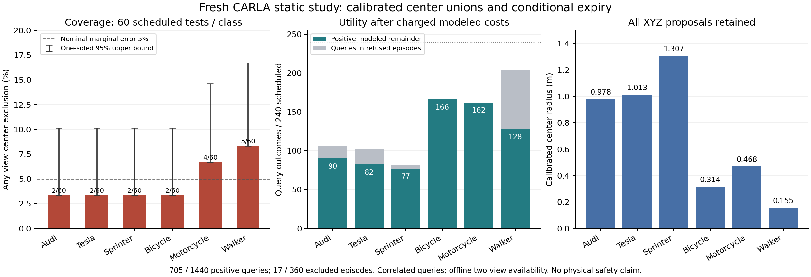

# 从不完整点云到校准状态集合：sheng 新采集结果

日期：2026-10-03。目标仍为 MobiCom 2027，算法侧重点为证据有效期。
本轮完成一个有限的、采集前冻结规则的新实验，没有创建持续研究循环。

## 结论

**应先解决“哪些状态仍可信”，再求这些状态最早何时能使任务失效。**
旧射线穿透分数即使用完整点云仍允许近处假目标；单纯加快求解无法消除
这种模型歧义。本轮改用 XYZ 点云提出所有候选中心，并以独立校准数据
给候选中心并集加半径，再求并集下的最早接触时间。

这条路线在新数据上得到有用的条件性期限，但尚未完成用户要求的完整问题。
在 360 个计划测试场景中，29 个拒绝输出，17 个仍排除了真实中心；
1,440 个计划查询结果中，705 个在计入本轮费用后仍有正的模型剩余期限，
正值中位数 211.871 ms。不能以这个数量替代覆盖率验证或真实驾驶安全。

## 新数据、输入边界与计算

在 sheng 的 Windows CARLA 0.9.15 和 WSL 环境执行；Town10HD_Opt、ClearNoon。
六种已知类别分别 39 个校准场景和 60 个测试场景，共 594 个预定场景；
纵向位置 Uniform[-8,8] m、横向 Uniform[-4,4] m、朝向 Uniform[0,360)。
校准与测试使用分离的新种子。42 次生成失败不替换，552 个成功场景产生
1,104 帧。每帧保留原始扫描每第四个返回，共保存 24,367,488 个点；
传感器原始报告 97,467,744 个返回，不能说全部原始返回都已保存或审计。
采集耗时 386.543 s。专属传感器、车辆、行人已清零，同步模式已恢复，
专属 CARLA 进程已关闭，保留清理和停止凭据。

前端只读取 XYZ、已知坐标变换、道路与类别尺寸合同。语义标签、当前 actor ID、
真实位置不参与候选提取，只供校准和评估。0.2 m 网格连通分量经过冻结的
高度、点数和跨度规则后，保留**所有**候选中心，不使用真值选择正确目标。
任一必要视角缺失或无候选，整个场景输出全平面并拒绝。错误但非空的候选
不能当作拒绝，必须计为潜在覆盖失败。

校准分数是两视角各自最近候选误差的最大值；39 个分数的第 38 顺序统计量
给出类别半径，再加入 8 mm 中心量化保护。候选中心按 1 cm 编码；消息包含
半径、帧号、时间和合同/校准摘要。SHA 校验是完整性检查，不是发送者认证。

使用已知包围体的外接圆盘、5 m/s 速度界、3 m/s² 加速度界、0.75 m 查询半径、
500 ms 上限。费用含观测回调耗时、完整处理、20 Mbps 模型传输、20 ms 传播、
20 ms 时钟及 200 ms 动作预留。完整处理包括 XYZ 数组构造，其遗漏在后续有限
计时核查中补齐；旧输出保留，最终费用取保守的观测最大值组合，所有最终
剩余期限不大于初次结果。它不是 WCET，也没有真实链路测量。

**两个视角在静止场景中依次完成，整个场景可用性依赖两个已完成视角。**
当前数字没有解决因果在线的视角完成调度及等待老化，因此不能据此授权车辆动作。

## 完整测试结果

每类 60 个计划场景，两个视角 × 两个查询，共 240 个计划查询结果。

| 类别 | 半径 / m | 可用 / 拒绝场景 | 任一视角中心覆盖失败 | 正模型期限 / 240 |
|---|---:|---:|---:|---:|
| Audi A2 | 0.977868 | 56 / 4 | 2 / 60 | 90 |
| Tesla Model 3 | 1.012639 | 55 / 5 | 2 / 60 | 82 |
| Sprinter | 1.306667 | 59 / 1 | 2 / 60 | 77 |
| 自行车 | 0.313678 | 60 / 0 | 2 / 60 | 166 |
| 摩托车 | 0.467815 | 60 / 0 | 4 / 60 | 162 |
| 行人 | 0.155307 | 41 / 19 | 5 / 60 | 128 |

合计 331 可用、29 拒绝，17 / 360 任一视角排除真实中心。29 次拒绝包括
25 次测试生成失败及 4 次候选提取失败。4.72% 只是分层总体的描述值，不能
当作同质二项样本的部署保证。每类固定拟合结果的单侧 95% 二项风险上界分别
为 10.12%、10.12%、10.12%、10.12%、14.61%、16.73%，均未证明部署风险 ≤5%。
行人条件于可用的上界更高，为 23.95%。拒绝不能被隐藏来美化风险。

无校准半径、仅保留量化保护的诊断，在全部 331 个可用场景中都发生中心排除；
这证明需要表达状态误差，不构成击败先进方法的证据。真值中心只作为明确标注
的理想诊断。模型求解器在声明集合内的期限上下界差至多 1 μs；这只是数值误差，
不是相对完整点云或真实物理最优期限的保守性界。

正期限共 705 / 1,440，中位 211.871 ms，范围 0.011–225.145 ms。
仅 11 μs 的余量不抵抗未建模延迟。测试帧完整处理费用中位 2.543 ms，
可用测试消息中位 152 bytes。没有扣除完整双视角在线等待，故仍称模型剩余期限。

40 个正查询结果来自至少一个视角发生覆盖失败的场景；不能把它们统一称为
获保证的安全输出。初次真值可达性诊断只检查费用扣除后的使用起点，随后
新增独立 `check_expiry.py` 检查整个正区间末端。705 个结果在同一圆盘运动模型下，
起点与末端均没有真实中心可达冲突。运动可达半径单调，因此末端检查也覆盖
该模型中的中间时刻。这不是实际运动/碰撞实验，也不消除 17 次中心排除。
同场景视角和查询相关，不能把 705 当作独立风险样本。

## 独立验证和旧反例

独立审计器用二维栅格标记重建连通分量，与生产器的集合遍历实现分离；
检查全部保存的 XYZ、源帧/标签对齐、冻结随机抽样、校准排名、量化包含关系、
1,104 个消息和 6,624 次解析时间边界。解析验证使用 80 位 Decimal 加整数不等式。
审计、旧反例诊断、最终费用汇总、全期限真值核查，四组输出均在本地和 sheng
逐字节一致。两端各 10 项针对性测试通过。

初次本地审计因 SciPy 二项分位数末位相差 2.78e-17 而失败，日志保留。
审计器改用独立高精度二项 CDF 反演，报告舍入到 15 位；未修改覆盖结果或阈值。

冻结的旧 545 姿态库只用于回归：36 个旧最近名义反例没有一个留在新集合，
36 个旧最近实际原始数据反例中仍有 5 个留下。这说明新状态模型确实改变了
旧假设歧义，也说明问题未被统一消除。旧数据单视角回归不是新测试、不是
新双视角规则下的授权，更不是新旧任务成功率的公平对照。

## 与文献的关系及剩余问题

普通 split conformal 已提供边际覆盖构造，并明确区分边际和条件覆盖。
本轮第 38 顺序统计量与按类校准采用现有原理，不申报为理论创新。
参见 Angelopoulos 与 Bates 的[教程，第 1、3 节](https://arxiv.org/html/2107.07511v6)。

CVPR 2023 的 Yang 与 Pavone 已将关键点校准区域传播成姿态不确定集合，
第 4 节采用最大残差，第 5 节研究几何传播；命题 2 说明单调变换单点分数
不能改变相同的 conformal 集合。本项目不能把“校准后做几何传播”当创新。
本轮 XYZ 候选并集与其 RGB 关键点方法不同，但未进行公平复现实验。
参见[论文全文](https://arxiv.org/html/2303.12246)。

面向用户的问题，已经落地的是：不完整 XYZ → 经校准的多候选状态集合 →
同模型内几乎无数值松弛的期限 → 显式费用和独立失效审计。仍未解决的是
集合本身的保守性、固定部署风险、未知场景的完整目标覆盖、物理传感器与运动
合同、双视角因果调度，以及动态闭环收益。新方向需要在这些约束下证明
通信内容/调度如何改变可用证据期限，并与相同信息和费用的强基线比较。
**当前是研究推进，不是已经解决全部问题或达到 MobiCom 录用标准。**

复现入口：[README](../experiments/positive_state_20261003/README.md)；
[条件理论](../experiments/positive_state_20261003/THEORY.md)；
[最终汇总](../results/positive_state_20261003/summary_sheng.json)；
[全期限检查](../results/positive_state_20261003/expiry_sheng.json)。
