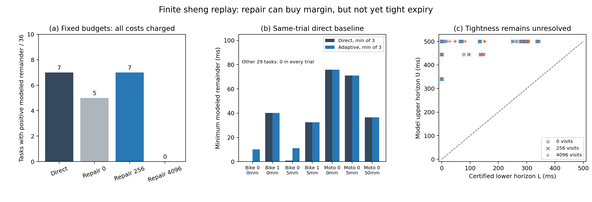

# 从不完整观测得到可信有效期：证明修复与计算停止实验

日期：2026-10-03。目标：面向 MobiCom 2027 的车联网语义通信算法。
执行：sheng 上的有限实验；未创建持续研究循环。

**本轮完成了当前证据的区间证明修复、因果停止策略，以及两套独立审计。结果支持“少量修复能增加临界任务的可用余量”，不支持“已经普遍得到紧且可信的有效期”。** 更强的直接验证基线纠正了一个表面收益：固定256次修复与直接验证都只有7/36个任务留下正净余量。自适应实验中，三次均为正的任务数从6增至7，但29个任务仍全部失败；多数有效期上下界仍很宽。

## 1. 问题应如何准确表述

证据有效期不应是从置信度直接映射出来的TTL。给定当前消息、允许的场景、运动约束和具体动作，定义所有与消息相容的状态集合。最强的稳健有效期是这些状态中最早可能违约的时间。本实验将其截断在500ms。

算法输出两个数：下界L表示已经证明的期限；上界U来自明确的相容反例、允许的未知区域边界，或500ms截断。只有L≤H≤U成立，才能用U−L度量尚未解决的计算保守性。L变大本身不等于接近最优；没找到反例也不等于证明不存在反例。

**可信度与保守性是两项不同义务。** 区间算法只能证明“如果真实状态属于该集合，结论成立”。真实状态是否被集合覆盖，需要另外验证传感器、未知目标、形状、运动及统计覆盖假设。目前沿用的地形分数经过已见数据上的修正，历史车辆真实姿态误排除仍有3/100；本轮没有建立新的部署风险保证。

完整推导、集合包含关系和不可辨识性反例见 [THEORY.md](../experiments/proof_repair_20261003/THEORY.md)。如果同一观测允许一个已经发生冲突的世界，任何可靠算法都不能无条件给出正有效期。此时需要新增证据、改变动作或有依据地缩小模型，而不能直接放宽安全阈值。

## 2. 实际实现了什么

上一版只检查历史上已排除的姿态区间。历史未解决区间始终保留，即使当前消息已经足以排除它，也不会更新。这是一种可修复的计算保守性。

本轮沿用当前消息中的端点球及精确例外点，先撤销失效的旧证明，再按最早可能接触时间处理全部保留区间。通过当前证据排除整个区间，或沿原规则细分。每64次访问尝试一个区间中点作为上界候选，只有在消息允许的一种原始观测实现下确实通过分数检查，才接受该候选。候选不是车辆真值，也不能借用未发送的实际坐标。

所有修复均保持完整划分，不把未访问区间当成空。固定预算从同一当前验证结果独立开始；几何下界不得下降、上界不得上升。当前消息身份、时间戳、传感器变换、旧参考摘要和分数阈值检查全部保留。

另一个实现问题是：证明所花的时间会消耗证明的有效期。自适应规则在当前下界扣完已发生开销后尚有5ms余量时立即返回；若连上界也已过期则停止；否则最多访问4096个区间。最终再次按读取决策结果时测得的在线计算时长计算余量，避免在这段计算中跨过期限仍输出可用结果。5ms是本次声明的工程余量，不是最坏执行时间保证，也没有证明该停止规则最优。

## 3. 实验设计与完整结果

固定实验采用6类目标、2个查询，以及预先选定的3组条件：无扰动/0半径、1mm合成扰动/5mm球、10mm合成扰动/50mm球，共36个任务。每个任务分别执行0、256、4096次修复预算，每种重复3次，合计324次调用，保存108棵不同预算的证明树。

自适应规则是在查看固定实验结果后制定的，继续使用同36个任务，每个再执行3次，共108次调用，并保存每次不同停止位置的证明树。这是同一数据上的方法开发，不能称为独立验证集。全部任务、失败和计时结果均保留。

### 固定预算：更长的几何期限不必然有用

|方法|正净余量任务数/36|几何下界提高任务数|接收计算时间中位数|
|---|---:|---:|---:|
|直接验证强基线|7|0|96.953ms|
|修复包装层，0次访问|5|0|100.888ms|
|256次访问|7|8|118.942ms|
|4096次访问|0|21|341.821ms|

计时为先取每任务3次中位数，再取36任务中位数；有效期按每任务3次观察到的最大编码与计算总时长扣除。直接验证基线取0预算调用内、进入修复包装层之前测得的直接验证时间。因此不能使用“5→7”作为相对强基线的可用率提升。0预算包装层只是开销消融。

例如Tesla左侧查询在无扰动时，下界从77.988ms提高至147.111ms（256次），再到147.301ms（4096次）。这表明修复确实消除了部分未解决区间，但仍不足以抵扣本实验的通信、计算和动作保留时间。大预算并未带来可用收益。

### 自适应：增加临界余量，但收益局限明显

|指标|同次直接验证|自适应修复|
|---|---:|---:|
|正净余量单次结果/108|20|21|
|3次均为正的任务/36|6|7|
|3次结果有正有零的任务/36|1|0|
|接收计算时间中位数|98.958ms|252.588ms|

基线临界任务会受机器计时波动影响，不能将固定实验的7/36与自适应同次基线的6/36混为一个稳定的成功率差异。3次重复也不足以估计可靠性分布。

自适应真正修复了两个临界自行车查询：

- 无扰动、左侧查询：直接验证余量为0、0.280、0.516ms；访问28个区间后，每次余量为10.023–15.120ms。
- 1mm扰动、5mm球、左侧查询：直接验证余量0.848–1.196ms；访问20个区间后，每次余量10.956–12.195ms。

另5个正余量任务在直接验证后就满足停止条件，未做修复。108次中21次因余量足够停止，54次因上界已不够覆盖时间停止，33次到达预算/队列退出路径。其余29个任务三次均无正净余量。该策略增加了大量任务的计算开销，不能声称整体效率优于直接验证。

### 时间成本没有免费初始化

账本计入旧证明构造、旧参考编码传输和本轮恢复，初始化需0.694–14.503s，均落在保存数据的20.5s间隔内；新增等待为0。当前开销含原始包构造的既有最慢测量、当前编码、接收验证与修复、20Mbps序列化、20ms传播、20ms时钟余量和200ms动作保留。

这些查询分别运行，不能解释为并发车联网系统吞吐量。原始记录是两个保存的观测，20.5s间隔不是实时闭环调度证明。传感器采集、回调、真实链路、WCET和控制执行尚未测量。计时终点位于原生决策结果读取后，随后的证明树导出、上下文释放和NPZ落盘均未计入。研究包装函数实际上在这些步骤后才返回；完整集成API返回延时尚未测量。部署需要单独的提前返回路径或异步日志，并重新计时，不能将当前数字直接当作端到端API延迟。

## 4. 独立核验

固定实验的独立世界坐标平面审计检查8,962,022个划分节点、128,700次不同新增计数界，以及171,800个新增接触时间。自适应审计检查8,964,176个划分节点、49,780次不同新增计数界，以及173,954个新增接触时间。每套审计验证2,516,883次历史当前计数的来源一致性。跨预算/重复的相同区间使用已核验缓存，计数不能理解为全都独立样本。

新增计数使用与执行器不同的几何实现；接触时间用高精度十进制参考检查。候选射线过滤与239/91次全点云交叉检查均留有记录，未声称每个区间都无条件扫描所有射线。两套审计都验证完整树、当前计数来源、所有新增排除及上下界；自适应审计还核验停止条件与最终时间算术。

固定与自适应审计、汇总JSON均在本地和sheng字节一致；两台主机各通过6个回归测试，包括合成正上界见证、旧未解决区间重新排除、期限已过停止和已有余量跳过修复。两端一致指审计同一份sheng输出，不是声称不同机器会产生同样的自适应停止位置。

**本轮实际数据没有找到新的相容上界见证。** 合成测试只证明见证代码能走通，不能替代实际结果。U仍来自原来的未知区域边界/时间截断，不能用它证明实际物理碰撞会发生；宽U−L也继续阻止近最优声明。

## 5. 对论文方向的判断

安全证书复用已有明确先例，见[Bialkowski等IJRR论文](https://journals.sagepub.com/doi/10.1177/0278364915625345)及[作者稿](https://ottelab.com/html_stuff/pdf_files/Bialkowski.Otte.ea.IJRR16.pdf)。仅把证书缓存与分支定界组合起来，不足以建立创新。

[Lindemann等RA-L 2023](https://www.georgejpappas.org/wp-content/uploads/2023/08/Safe_Planning_in_Dynamic_Environments_Using_Conformal_Prediction.pdf)从轨迹预测区域推导安全规划，并列明环境分布不受自车动作改变、独立轨迹数据等前提。本项目的静态姿态分数与保存帧实验不能替代这些前提。两篇原始文献本轮重新核对，既有其他阅读见[前轮记录](tube_evidence_reading_20261003.md)。

当前更准确的候选问题是：**在不完整消息允许的场景集合内，如何联合选择新增证据和证明计算，使上下界收敛，并在证明完成时仍有可用期限？** 本轮完成了其中“当前证据重新验证—区间修复—按已耗时间停止”的实现和有限验证，没有实现完整的新增证据选择，也没有得到足够紧的全任务界。

距离回答用户提出的完整问题，还缺三项关键证据：完整场景集合及其独立风险验证、明确量化的保守性上限、在新场景与真实时间开销下仍有收益的闭环。不能为了结束任务把这些改成已完成。现有代码、原始失败结果、审计和推导可复现地交付；本轮没有建立持续研究循环。

代码与命令：[复现说明](../experiments/proof_repair_20261003/README.md)。完整数值：[summary_sheng.json](../results/proof_repair_20261003/summary_sheng.json)。
