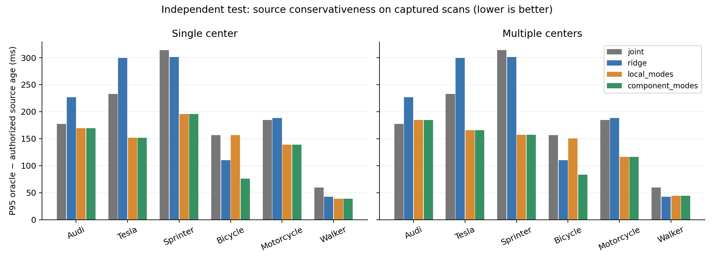
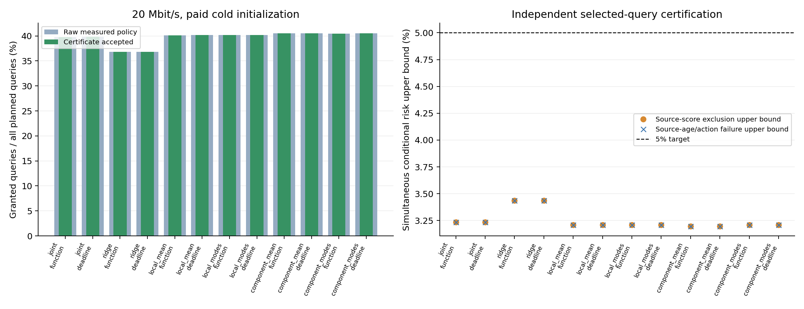

# 不完整观测下的证据有效期：独立校准、授权认证与测试结果

**结论：分量校准候选在已登记单目标的固定分布中可行，降低了自行车类的有效期损失，同时没有出现测试查询有效期缩短。它的端到端动作收益较小，相同模型的直接截止时间对照仍略好；目前不能宣称已经形成强 MobiCom 系统贡献。**

所有模型、可观测支持判据、得分、几何、查询和48个服务策略均在新采集前冻结。分析、图表与无损归档规则在新数据评分前冻结。既往数据全部用于开发；本轮没有重调模型、阈值或测试规则，没有替换失败场景。

## 方法回答的具体问题

从部分点云构造中心可行集合，将模型支持的观测误差和不受支持时的几何回退误差分别校准。支持分支保留观测约束与学习圆/多圆交集；回退分支直接以微米误差阈值外扩，不让稀少回退残差扩大所有正常观测的学习圆。空观测、矛盾集合和不满足授权条件的证据均拒绝。

对已知外形半径 b、查询半径 r 和运动包络 m(t)，以保守距离下界 L 求最大整数微秒 T，使 L>b+r+m(T)，上限500ms。失效时刻是源时刻 τ+T，接收与重发不重置 τ；动作仅在 now+220ms≤τ+T 时授权。推导见 [证明与边界](component_expiry_proof_20261004.md)。

## 有限独立实验

在 sheng 上运行 CARLA 0.9.15 / Town10HD_Opt / ClearNoon，两个固定RSU布局、六种登记目标。每段6次点云扫描、21个物理真值快照。运行时前端使用XYZ；标签、目标真值与语义ID只用于离线评分与审计。场景坐标、航向和速度来自预先固定整数网格；这与以前的连续采样分布不同。

| 阶段 | 计划段数 | 成功采集 | 保留失败 |
|---|---:|---:|---:|
| calibration | 1560 | 1460 | 100 |
| certification | 600 | 563 | 37 |
| test | 360 | 341 | 19 |

总计2,520段计划、2,364段成功、156段失败，14,184帧点云。失败段作为拒绝授权保留在计划分母中，不补样。每类260段用于校准；认证采用600段六类均匀混合的独立场景，每段在观测前独立选择32个计划查询中的一个；测试每类60段，共360段。

## 保守性：必须按类别看

下表为独立测试中捕获扫描的 P95(oracle有效期−算法源有效期（拒绝时记0）)，截断到非负，单位ms，越低越好。失败采集没有可比较扫描，不在此指标中；它们仍在服务通过率的完整分母中。这个 oracle 使用声明的外形和运动包络，不是真实碰撞时间。

| 目标 | 原mean | 分量mean | 原modes | 分量modes |
|---|---:|---:|---:|---:|
| Audi | 169.726 | 169.726 | 184.941 | 184.941 |
| Tesla | 151.941 | 151.941 | 165.659 | 165.659 |
| Sprinter | 195.596 | 195.596 | 157.597 | 157.597 |
| Bicycle | 156.854 | 76.265 | 150.753 | 83.479 |
| Motorcycle | 139.101 | 139.101 | 116.509 | 116.509 |
| Walker | 39.027 | 39.027 | 44.353 | 44.353 |

自行车 mean 损失减少 51.38%，modes 减少 44.63%。这批独立校准中，自行车混合得分阈值为7.6383，而支持分量阈值分别约2.1698和2.8127；回退几何仍支付76,383μm阈值。改善来源是解除误差分量耦合，而非把风险或外形边界取消。

六类合计，mean 有254个源查询有效期增加、0个缩短；modes 有251个增加、0个缩短。此前开发集的主要收益在摩托车，本轮摩托车 P95 没有改善；不能把开发数字冒充独立验证。

图左比较 joint / ridge / local_mean / component_mean，图右比较 joint / ridge / local_modes / component_modes。完整六类和全部对照均保留。

## 可信度：覆盖与授权后风险分别检验

校准单位是整段场景的最大得分。每个分量方法将支持与回退事件各分配2.5%边际排除风险；这不是“已进入回退时也只有2.5%失败”的保证。六类、两个支持头与共享回退头共18个事件，另有24个对照事件。每类260段时联合坏校准界为0.024954427814。

对48个预先固定策略分别检验两个授权条件风险：引用源证据的得分排除，以及源年龄加220ms动作预算超过 oracle。96项精确二项检验使用 Bonferroni 总置信预算0.025，风险目标5%。每段仅取一个预先独立选择的查询，不把相关查询当成独立样本。

48/48策略通过认证，认证所选授权查询中两种失败均为0；这不等于真实风险为0。20Mbit/s、支付登记初始化的 component_mean_function 得到254个独立授权查询，条件风险上界3.1971%；component_modes_function 为253个，上界3.2095%。校准与策略置信预算联合下界为95.004557%，依赖所声明的场景与服务联合IID条件。

独立测试中 mean 的集合排除出现在Audi与Tesla各1段，modes在Tesla有1段，每类分母60段。20Mbit/s下 mean 的4次授权引用超阈值源证据；modes为0次。两个分量方法、全部对照及全部测试服务策略均未观察到有效期超过 oracle。不能省略这些排除事件或把它们与物理失效等同。

## 支付计算、传输和排队后，收益较小

以下均为20Mbit/s、冷登记初始化、计划360×32=11,520次查询的授权数。所有策略已通过认证，原始与可用授权数一致。function传输可查询几何函数；deadline直接传输预先计划查询的有效期。两者使用同一模型与相同初始化条件。

| 方法 | function授权 | deadline授权 |
|---|---:|---:|
| joint | 4585 | 4587 |
| ridge | 4245 | 4244 |
| local_mean | 4623 | 4627 |
| local_modes | 4632 | 4633 |
| component_mean | 4667 | 4671 |
| component_modes | 4662 | 4671 |

分量mean的function比原mean增加44次授权（约0.95%相对增长，0.382个百分点）；分量modes增加30次（约0.65%，0.260个百分点）。同模型deadline分别比function多4次和9次。不能把这些结果写成函数式语义消息具有明显端到端优势。2Mbit/s结果及warm/cold的全部48个单元均在汇总中，不根据最佳单元择优报告。

实际完整前端、预测、编码和接收分别测量3次，取最大耗时；方法顺序按冻结哈希规则打散。服务包含源端/传输/接收三个FIFO、20ms传播和220ms动作余量。三次实测不是WCET；这些轨迹也不是真实无线链路。

| 方法 | 源端中位数μs | 接收中位数μs | 报文字节中位数 |
|---|---:|---:|---:|
| joint_function | 2331.5 | 958.5 | 368.5 |
| joint_deadline | 3347.0 | 35.0 | 303.0 |
| ridge_function | 2527.5 | 78.0 | 386.5 |
| ridge_deadline | 2560.0 | 33.0 | 302.0 |
| local_mean_function | 2808.5 | 866.5 | 414.0 |
| local_mean_deadline | 3801.5 | 36.0 | 307.0 |
| local_modes_function | 2812.5 | 900.5 | 480.0 |
| local_modes_deadline | 3847.5 | 36.0 | 307.0 |
| component_mean_function | 2797.5 | 868.5 | 416.0 |
| component_mean_deadline | 3768.5 | 36.0 | 310.0 |
| component_modes_function | 2820.5 | 876.0 | 483.0 |
| component_modes_deadline | 3832.0 | 36.0 | 311.0 |

冷初始化仅指登记上下文：测试上下文2,120字节，源端158μs、接收349μs。模型与背景前端已经加载，不是完整模型安装/加载的冷启动。

图中的 cold initialization 指上述登记上下文。条件风险图对应独立认证查询，而柱图对应保留全部计划失败场景的独立测试。

## 审计与发布

本地与sheng审计字节完全一致。审计检查14,184帧、2,729,378个量化点、32,544次独立几何检查，另核验65,088份实际报文、46,080条三FIFO轨迹和1,474,560个决策。预测器使用共享冻结模型重放；几何、得分、有效期、报文、排队与精确风险检验另行核验，不声称独立重写了学习模型。物理快照的外形、运动和未来查询网格均未发现违反声明边界；快照诊断不是连续轨迹或真实道路证明。

采集前及完整评估后的5项必要测试通过。本次owned CARLA进程已停止，车辆/行人/传感器计数归零并退出同步模式。无持续研究任务或定时循环。

原始点云、实际报文、耗时、失败记录、冻结凭据、审计及全部结果均发布。较大的逻辑JSON无损gzip归档，保留恢复后的原始字节SHA-256；[复现步骤](../experiments/prospective_component_20261004/REPRODUCE.md)说明如何恢复与审计。

- 核心冻结SHA-256：`11ca599501e64abcade322c55b9de06f4bf6ec457589514a0731068af9e29fd2`。
- 校准凭据SHA-256：`cc4040e20de6c789c072101bb0b259fff40536fe8b3355d398aaf2e4eccf4d15`。
- 策略凭据SHA-256：`18741259db36ee2934cea46702d93f6e2d88ae66f82ef3741879c941029418a9`。
- 双主机审计SHA-256：`b44bcf4ac5cc6218cb0f0507a7f0bfbc676e9811ebbaa3e6032d0de4f44a9f63`。

## 结论边界与MobiCom定位

已实现并独立验证的是：在已登记目标、固定分布和外形/运动假设下，通过分离误差分量改善部分观测的源有效期，并对固定授权策略另外控制选择性风险。任意不可见未知目标、任意地点或每个回退子群均不在此保证内。

这仍是固定RSU、单登记目标和离线服务重放，没有真实ego控制闭环、真实无线、多目标完整性、分布漂移或负载变化保证。实际服务时延的IID与边界真实性是条件，无法由CPU实测三次证明。

现有文献已经研究 normalized conformal、几何预测集合、校准感知驱动自触发控制、conformal-inspired时序协作门控以及真实车辆对象级协作规划；[文献对照](expiry_related_work_update_20261004.md)和[控制/部署补充](expiry_control_prior_work_20261004.md)逐项说明阅读范围。不能把这些标准组合宣称成新的统计定理。

因此当前候选通过了本轮机制可行性验证，但完整MobiCom项目尚未完成。没有为了凑会议故事继续调测试集、启动第二轮候选或创建持续研究循环。
