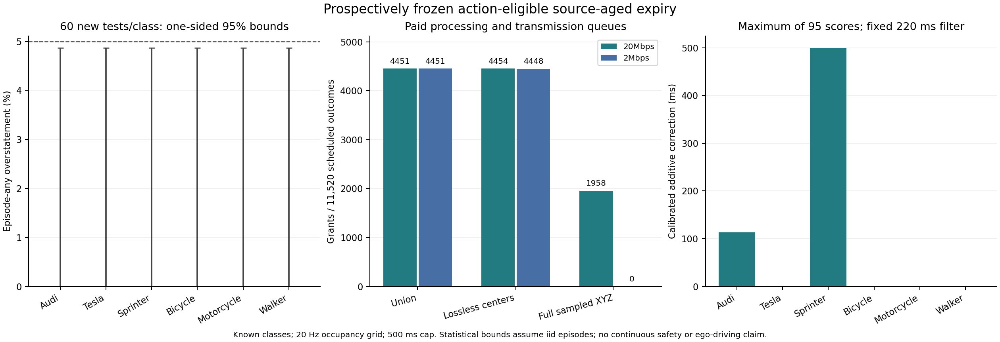

# 不完整观测的证据有效期：冻结前瞻验证

完成了一个采集前冻结算法的全新有限CARLA批次。动作资格后直接校准有效期，在20Mbps下给出4451/11520个付费后可用查询，比同批状态包络方案3446增加1005（29.16%）；360条计划测试没有发现期限高估或网格占用授权冲突。但是，Sprinter的修正量达到500.001ms，**整类完全拒绝**；Audi需要112.969ms修正。结果支持风险与效用可分开校准，却没有证明“所有场景都可信且不过度保守”。强无损中心基线4454略胜，不能宣称新压缩算法获胜。

## 新数据与完整分母

Sheng的Windows已安装CARLA0.9.15完成930条固定计划，各类95校准、60测试，使用新的2026102100/2026102200种子基数加类别索引。884条成功采集、46次生成失败，不补样、不删失败。共5304个保存扫描，117069888个每四点保留一点的返回；传感器报告468268944个原始返回，未保存部分不可复核。两个RSU同时工作，每条成功序列保留0/5/10步的各两帧以及0..20步的21个50ms真实快照。目标物理运动，未冻结物理；没有ego驾驶。

| 类别 | 校准成功/95 | 测试成功/60 | 动作修正(ms) | 测试高估序列/60 | 单类单侧95%风险上界 |
|---|---:|---:|---:|---:|---:|
| Audi | 94 | 60 | 112.969 | 0 | 4.8703% |
| Tesla | 94 | 58 | 0 | 0 | 4.8703% |
| Sprinter | 89 | 60 | **500.001** | 0 | 4.8703% |
| Bicycle | 95 | 60 | 0 | 0 | 4.8703% |
| Motorcycle | 95 | 60 | 0 | 0 | 4.8703% |
| Walker | 71 | 48 | 0 | 0 | 4.8703% |

测试346条成功、14条生成失败，2076帧中2073帧有候选、3帧拒绝。每条计划测试32个查询结果，每方法每链路11520个；没有生成对象的计划仍是无授权查询。单类测试上界不是六类同时95%置信结论，0/60也不证明零风险。六类联合校准界另见下面的固定评分器理论。主状态集合的半径为1.418654、1.982980、5.591086、0.492120、0.727269、0.197411m，测试Motorcycle有1条中心集合覆盖失败，其他类0；不能拿动作期限零高估取消这条状态失败。

## 完整到达费用后的效用与保守差距

三个表示产生完全相同的量化候选和有效期：紧凑并集、中位数152B；无损float64候选、中位数179B；完整**保存XYZ**、中位数191951.5B。固定前端、几何、查询、类别契约、校准配置、20ms传播和220ms动作/时钟预算均相同，各表示支付自身实测三次最大处理耗时、字节和源/线速/接收FIFO费用。离线共享配置的首次分发未计入。

| 表示 | 状态包络20Mbps | 动作校准20Mbps | 状态包络2Mbps | 动作校准2Mbps | 动作校准20Mbps占用冲突 |
|---|---:|---:|---:|---:|---:|
| 紧凑并集 | 3446 | **4451** | 3439 | **4451** | 0 |
| 无损中心 | 3446 | **4454** | 3438 | **4448** | 0 |
| 完整保存XYZ | 1449 | 1958 | 0 | 0 | 0 |

固定200ms方案总短于220ms动作预算，只有诊断作用，不作为主要胜利基线。本批没有运行未来预测管或未筛选任务策略的生产器，开发批的相应数字不能移入此表。20/2Mbps并集结果恰好相同只说明这些小包在当前50ms决策网格上没有额外跨过期限边界，不证明真实无线速率没有影响。

20Mbps并集4451次授权涉及1305个不同来源—查询对、286条序列。它们仍然相关。相对独立审计的截断未来网格标签，正保守差距中位数0、均值15.034ms、p95=112.969ms、p99=116.029ms、最大179.353ms；3792/4451次差距≤10ms。扣除220ms预算后剩余时间中位数80ms。相同到达、相同基础资格的完美未来标签oracle有6167个授权，算法保留72.17%；oracle不可实施，也不是所有观测/所有算法的最优期限。

完整XYZ仅剩1958个授权，所选授权差距p95=0，但它漏掉了大量查询；不能用更小的条件差距把更慢表示称为整体优越。500ms截断使大量无接触样本的差距为零；Sprinter没有任何授权，未进入授权样本分位数。**零中位差距排除了最差类并受到截断，不能证明普遍不过度保守。**



## 已实现的算法与可证明范围

每个当前XYZ扫描独立输出全部候选中心；没有候选就拒绝。对固定任务区域，接收器用量化中心、已知车体半径和固定3m/s膨胀预测器计算基础接触年龄H，最长500ms。未来真值仅在离线校准与独立审计中使用。G是当前至未来500ms、20Hz网格首次车体圆盘占用之前1µs；当前已占用时G=−1µs，无接触则G=500ms。

已有的动作与时钟预算B=220ms决定校准资格：H<B不可能支持动作，明确拒绝；其误差不压缩其他可用证据。每条完整序列的校准分数为

```
Z = max{0, H_f − G_f : 当前输出可用且 H_f ≥ B}
δ_class = max(95条独立校准序列的 Z)
L_f = max(−1µs, H_f − δ_class)  （不满足资格则拒绝）
绝对截止时刻 = 来源时刻 + L_f
授权 ⇔ 消息已送达并验证，截止时刻 ≥ now + B
```

来源时间不能在接收或更新时刷新。源处理FIFO、真实保存消息字节的线速FIFO、传播和接收FIFO均另付费；接收者只看到已完成处理的因果前缀。未来标签不进入在线输出。

在Z≤δ的整条序列上，所有可授权期限同时不晚于G；从多个来源中选择最长已到达期限仍受该序列事件覆盖。类别内完整序列iid且评分器、资格筛选在新数据之前冻结时，最大次序统计量满足

```
P_calibration[P_new(Z>δ_class)>5%] ≤ 0.95^95
六类联合校准置信下界 ≥ 1−6×0.95^95 = 95.4091%
```

这允许序列内部相关，不是给定授权后的条件错误率，也不证明未知场景、连续时间物理碰撞安全。拒绝/生成失败的整条序列没有授权，评分为零但仍保留在计划分母；因此该风险界也不能改写为仅对成功采集场景的条件风险界。

δ是这一固定加性修正族中、覆盖全部观察到的校准误差的最小非负常数；更小常数会违反至少一个校准分数。这个有限样本性质不能推出所有算法中的最优期限、最小部署风险或最小时间遗憾。移除H<B的项只保证同一校准集上的δ不增加；付费效用与实际保守差距仍须实测。

## 为什么不能无条件承诺可信且任意精确

如果两个符合物理契约的状态产生同一不完整观测，却有不同真实期限G1<G2，仅依赖该观测且对两者都确定安全的输出必须L≤G1；对第二状态至少损失G2−G1。获得同时可信与不保守的期限，需要明确风险容忍与场景分布，或者增加能区分这两个状态的证据。数值求根精确至1µs并不能消除这种观测歧义。

## 新校准中的具体漏检与整类拒绝

`prospective_vehicle_mercedes_sprinter_calibration_083_s05_v1`对左侧查询给H=500000µs，而离线真实车体圆盘当前已占用，G=−1µs。误差500001µs达到评分定义的最大可能值。同一步view0给H=0，已经反映当前占用；单视角独立给事实、收到后选择最长期限的规则不能利用这条相反证据。类别统一修正必须取500001µs，于是所有Sprinter来源期限都≤−1µs。不能删掉该序列或降低δ来恢复效用。

`prospective_vehicle_audi_a2_calibration_058_s05_v1`对右侧查询给H=312968µs，未来网格首次接触前期限G=199999µs，因此δ=112969µs。同一步view0给H=158004µs，本来就不能覆盖220ms预算。全部当前输入、真值、两视角、消息哈希与修正结果保存在`calibration_counterexample.json`；这是结果后的解释性提取，不是额外独立安全测试。

这揭示了新的具体问题：**一个错误视角与一个能否决它的视角同时存在，单视角分数的类别最坏修正却把所有正确视角也禁用。** 需要按实际付费到达顺序利用互补证据，或者把已有同时覆盖事件用于更精细的状态集合运算。简单放宽常数、测试后改筛选或只报成功类，都不能解决它。本批冻结算法没有实施这些新规则，也没有用新测试结果重拟合。

## 独立复核与实测范围

本地与sheng七组独立审计/汇总逐字节一致：原始状态、状态汇总、任务期限、任务汇总、目标返回支撑、授权期限差距、XY契约。两端各7项因果测试通过，覆盖来源期限不刷新、未来后缀不改变过去决策、缺失计划保留分母、拒绝不授权及三段FIFO费用。原始与任务审计分别检查15912个表示消息引用、10608个几何/年龄边界；全部117069888个保存点参与原始核对。

26520次保存快照运动检查没有违反声明的5m/s、3m/s²包络。所有148512个API包围盒XY角点在声明车体圆盘内，尺寸身份没有不一致；全部保存的真实目标返回在XY和3D支撑内。原始3D角点审计仍有13036个快照出现最大4.277588µm正超量，保留此数值差距。API中心与float64矩阵重算的差异向外舍入最多2µm。这些检查不覆盖未保存/未返回表面或tick之间的连续运动，不能证明物理模型全过程。

采集后的WSL→PowerShell清理调用发生`UtilAcceptVsock accept4 failed110`，原始`stop.log`保留。同一所有权核对脚本通过Windows SSH成功停止本实验PID88040；回执一致。评估随后由有限`resume_once.sh`执行一次，未重复采集或修改冻结策略。采集端对象清理后vehicles/walkers/sensors均为0，synchronous=false。没有自动持续研究任务。

模型把CARLA来源时间与墙钟实测耗时组合，模拟20/2Mbps、20ms传播与队列；没有实际无线传输或ego控制。取原始归档/下载期间与部分主评估重叠，记录的是该负载下三次实测最大耗时，不是隔离时延或WCET；不能把跨批耗时差异当算法加速。SHA核对内容一致性，不提供身份认证。

算法/评分器及新种子在新采集前完成哈希冻结，源代码在`cf4daa07`发布时采集已进行、尚无新校准或评估输出；这不是采集前的外部预注册。冻结生产器和其审计器继承了“posthoc/no untouched holdout”等旧scope字符串，按原哈希保留；本批事实范围由新种子、冻结、划分和执行回执记录在`prospective_scope_receipt.json`，不能把字符串当调参证据，也不能把本批设计写成没有开发阶段选择。

## 文献定位与MobiCom候选边界

上下文相关性与任务驱动通信已有直接先例。[Lusvarghi等的作者全文](https://uwicore.umh.es/semanticV2X/Publications/The_Search_for_Relevance.pdf)按相关性选择V2X内容，在其数值模型中以一个通信周期使接收信息过期；这并未提供本研究的观测相关、风险校准最后有效年龄。[V2Xverse/CoDriving](https://arxiv.org/html/2404.09496)已有驾驶请求地图、感知置信度选择通信内容及真实反馈CARLA驾驶；固定查询的离散因果重放不能称为同等闭环。[V2XPnP，ICCV2025](https://arxiv.org/html/2412.01812)已有时空融合、感知与预测及延迟实验；它与MobiCom2025的MPnP不同，本项目没有运行其模型作比较。

直接安全分数、未来轨迹校准、完整资格/选择流程校准和最大次序统计量都已有方法基础，详见本批和开发批READING.md。当前可讨论的系统问题是：在实际到达与动作预算下，如何选择、补充或撤销不完整证据，使剩余有效期足够且错误受控。现实现验证的是资格筛选后校准，不是已确立的新内容选择算法或MobiCom贡献。

本次有限实现、前瞻实验、反例和公开包已完成。原目标中“可信且普遍不过度保守”仍未完成：Sprinter整类拒绝、Audi尾部差距、未知完整对象库存、真实链路/连续物理/ego交互及区别于已有方法的MobiCom贡献，都没有由本批解决。
