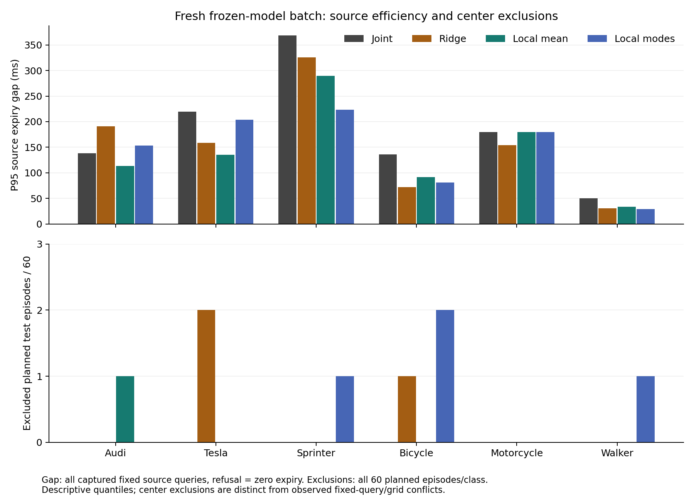
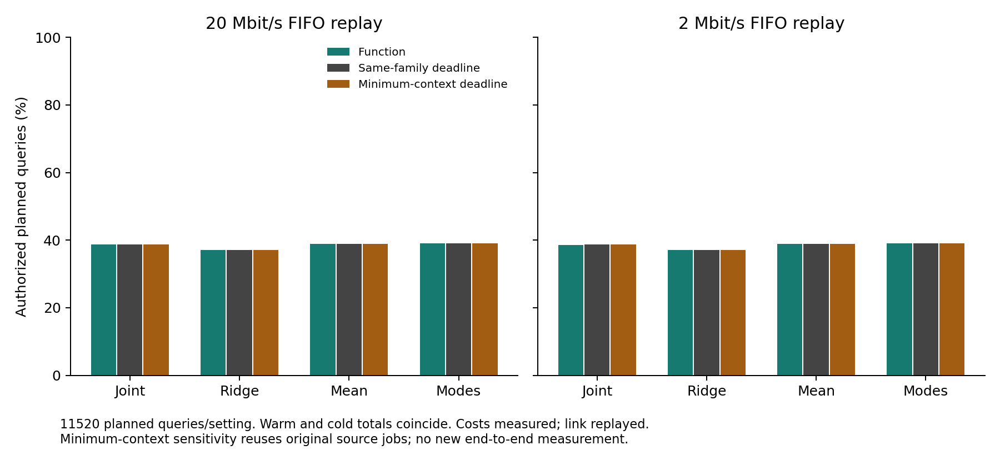

# 从不完整观测获得可信、不过度保守的有效期：独立批次结果

2026-10-04，sheng。本批次验证了“冻结中心假设集 → 整回合校准 → 距离下界 → 源时间有效期 → 真实计算费用和队列扣减”的实现链条。**局部集合在部分车型上减少有效期损失，但摩托车没有改善；最优方法随类别变化，通信授权收益很小。不能据此宣称整个问题已解决或已具备 MobiCom 2027 的贡献。**

## 怎样得到可信有效期

对观测 X，生成可能中心集合 S(X)，并用独立完整回合校准其排除风险。整数几何给出 L(q)≤d(q,S)。在真实中心位于集合、车身半径 b 和中心运动包络 m(t) 成立时，严格满足 `L(q)>b+r+m(t)` 的源龄 t 才有效。当前运动包络为 `5t+1.5t²` 米，查询半径为 0.75 米，有效期上限 0.5 秒；具体舍入和条件见[论证](expiry_incomplete_observation_reasoning_20261004.md)。接收端从原观测时间扣除计算、传输、排队、传播和行动保留费用，不能收到消息后重新计时。空观测、失败回合不给新证据。

“可信”对应明确事件和假设，不对应没有看到碰撞。冻结四类方法、六个目标类别，每类 125 个计划校准回合取六帧最大分数再取回合最大值。在固定分布 iid 完整回合假设下，整回合中心集合排除风险容忍为 5%，24 个类别/家族事件的联合校准置信下界为 **96.0585%**。这不是授权条件风险或连续道路安全保证。

“不过度保守”用相同车身/运动规则下真实当前中心 oracle 的有效期差衡量，不能通过缩小风险集合而省略排除事件。方向距离损失 h 在覆盖条件下造成的连续有效期损失至多 h/v，加整数端点预算；多模式假设不必优于单个局部中心，因为靠近查询的错误模式会主导距离下界。

## 独立性、采集失败和分母

模型/分数/计划于 `caf2129` 发布；测量实现于 `ae38d1e` 发布，均早于新校准和测试推理。最小 deadline 注册检查于 `cf6bd49` 冻结。校准收据写入时测试云读取数为零。既有数据只用作开发，不对本批次的阈值、guard、尺度或模型做测试后修补。

1110 个计划回合中采集成功 1040 个，70 个 `spawn_failed` 原样保留、不替补；6240 帧，137729280 条存储射线。校准成功 709/750，测试成功 331/360。失败回合仍进入计划风险/授权分母，但源有效期差只能对实际取得的测试源计算，不能把这个条件样本的差值写成全部环境的性能。

|类别|校准成功/计划|测试成功/计划|
|---|---:|---:|
|Audi|123/125|60/60|
|Tesla|120/125|57/60|
|Sprinter|119/125|58/60|
|Bicycle|125/125|60/60|
|Motorcycle|125/125|60/60|
|Walker|97/125|36/60|

Walker 的测试采集成功率仅 36/60，是显著的可用性限制。固定场景单个已知目标、两套静态 RSU 布局；LiDAR 推理只使用 XYZ，标签及真值仅用于离线校准/审计。没有实时 ego 控制或真实无线测量。

## 保守余量与排除事件同时报告

下表是全部已捕获测试帧、两个固定源查询的 P95 oracle 有效期差，单位毫秒；拒绝的候选有效期记零，不只统计授权样本。

|类别|Joint|Ridge|Local mean|Local modes|
|---|---:|---:|---:|---:|
|Audi|137.977|190.733|113.441|153.104|
|Tesla|219.862|158.484|135.146|203.819|
|Sprinter|368.736|325.354|289.132|223.120|
|Bicycle|135.640|71.699|91.453|80.991|
|Motorcycle|179.461|153.727|179.461|179.461|
|Walker|50.324|30.555|33.821|28.957|

Local mean 相对 Joint 在五类降低 P95 差值；摩托车两者相同。Ridge 在自行车、摩托车、行人上也很强，不能仅对比最弱的几何基线。Local modes 在 Audi 反而更差。pair clip 相对 cheap max 只改善自行车的一次源查询，没有改变任何类别的 P95；复杂裁剪不应作为主要贡献。

每格为全部 60 个计划测试回合中的中心排除回合数：

|类别|Joint|Ridge|Local mean|Local modes|
|---|---:|---:|---:|---:|
|Audi|0|0|1|0|
|Tesla|0|2|0|0|
|Sprinter|0|0|0|1|
|Bicycle|0|1|0|2|
|Motorcycle|0|0|0|0|
|Walker|0|0|0|1|

0/60 的单事件 95% 二项上界约 4.870%，但同时考虑 24 格后的上界约 9.778%；1/60 的单事件上界约 7.664%。这些经验上界与独立校准的 5% 容忍声明是不同推断。重复帧、查询和授权不增加独立样本数。

测试后只做描述性分解：摩托车两个局部家族的校准最大分数均为 `35569/2500=14.2276`，来自 `freshhyp_vehicle_kawasaki_ninja_calibration_072_s10_v0` 的 **fallback_pose**，对应 142276 µm 的 pose 扩张。它把同一全局阈值抬高并影响 supported 源的局部半径，解释了局部预测精度没有转化为有效期收益。其余五类局部阈值最大项来自 learned 项。诊断未修改分数、阈值或推理。[精确分解](../results/prospective_hypotheses_20261004/calibration_bottlenecks.json)留存最大样本和分量。

## 完整计费后收益很小

每个实际测试源、每种服务做三次实际源端/接收端计时，顺序由固定哈希打乱。服务已初始化，源处理包含 XYZ、前端、hull、预测和编码；deadline 源额外计算同一有效期。20/2 Mbit/s、20 ms 传播、220 ms 行动保留的三阶段 FIFO 为回放链路。每个设置有 11520 个计划查询，包括采集失败回合。

|家族|20M function|20M deadline|20M minimum deadline|2M function|2M deadline|2M minimum deadline|
|---|---:|---:|---:|---:|---:|---:|
|joint|4452|4453|4454|4448|4451|4451|
|ridge|4266|4267|4267|4264|4264|4264|
|local_mean|4477|4484|4484|4474|4478|4478|
|local_modes|4505|4502|4502|4499|4498|4498|

Warm/cold 的本批次授权总数相同。主比较共享 1812 字节必要注册，额外敏感性检查把 deadline 注册降至 **610 字节**，复用原始源端任务和消息、仅重新实测接收/注册费用；不是新的一次同时端到端测量。该检查进一步排除了强迫 deadline 传输无用状态的优势来源。

20M 下 local_modes_function 比 joint_function 多 53 次授权，占全部计划查询的约 0.46 个百分点；但同一家族的 deadline 只少 3 次。Local mean 的 deadline 反而多 7 次。不能把几十毫秒的源 oracle 差改善自动解释成显著网络/系统收益，或给这些小差值附上没有做过的显著性声明。

|方法|源端中位数 µs|接收端中位数 µs|消息中位数字节|
|---|---:|---:|---:|
|joint_function|2291.5|924.5|371.0|
|joint_deadline|3246.0|34.0|304.0|
|ridge_function|2465.5|76.0|390.0|
|ridge_deadline|2487.5|33.0|303.0|
|local_mean_function|2715.0|827.0|416.0|
|local_mean_deadline|3711.0|35.0|308.0|
|local_modes_function|2744.0|851.0|481.5|
|local_modes_deadline|3665.5|35.0|308.0|

初始化之外的进程冷启动没有计入；费用峰值是观察最大值，不能当 WCET。实际无线拥塞、移动查询、安装费用和执行环境可信性尚未验证。

## 双主机审计和科学边界

sheng 与本地的 qualification、paid、minimum-context 三份审计 JSON **逐字节一致**。主审计检查 6240 帧、13902 次独立几何、15888 条实际消息、11520 条 trace、368640 个决策，以及 707820 个保存的未来网格检查。固定源查询未发现有效期越界，保存网格未发现冲突；网格检查不是连续时间证明。Local mean/modes 的每个计费设置分别有 4/8 次授权引用了中心排除的源，这些事件已保留，不能由“零网格冲突”抹去。额外最小注册检查独立核对 7944 条消息、5760 条 trace 和 184320 个决策。

独立部分覆盖 raster、hull 包含、整回合阈值、整数几何、wire 和 FIFO 算术；冻结学习器的预测 replay 是共享实现，不伪称独立模型重写。当前本地 8 个主测试和 3 个最小注册测试通过，sheng 的执行前后测试和完整日志一并发布。

## 对候选问题的更新

已落实的是条件明确的有效期生成算法及可复核的有限批次。尚未落实的是跨车型稳定降低保守余量、授权条件风险、未知目标清单和真实移动网络收益。授权选择可以集中失败事件，`P(F)≤ε` 不推出 `P(F|grant)≤ε`；固定分布覆盖也不能替代 ego 策略变化下的保证。

摩托车结果给出下一候选的具体机制：**异质的 fallback 与 supported 证据共用全局校准尺度时，少量几何失败会压低大量正常观测的有效期。** 应研究在完整回合风险预算下，怎样区分证据类型而不因数据分组、查询选择或策略反馈破坏可信性。它目前是基于冻结结果得到的后续假说，不是已验证的新算法；不能在这份测试集上修改阈值后仍把它称为独立验证。

文献已覆盖部分可观测语义采样、局部/多模式校准及动作条件决策；[阅读记录](../experiments/prospective_hypotheses_20261004/READING_UPDATE.md)区分全文方法阅读与摘要线索。MobiCom 故事必须证明这个具体移动决策瓶颈及比直接 deadline/强状态估计更好的收益。当前证据没有达到这一结论。

代码、原始点云、采集失败、真值、实际消息、冻结收据、计时、审计、图表和无损大 JSON 归档均在本批次目录。复现入口为[README](../experiments/prospective_hypotheses_20261004/README.md)。归档及来源由完整 manifest 固定，项目总体目标仍未完成；没有建立持续研究循环。
