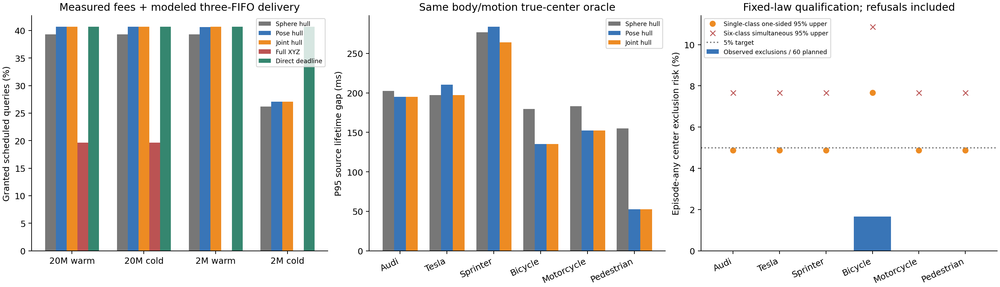

# 从不完整观测到证据有效期：新数据资格验证与强基线结果

这次 sheng 实验补上了此前缺失的独立新数据检验，但没有证明整个问题已经解决。直接校准真实中心是否属于候选集合，使形状先验失效也能作为预测误差被检验；联合形状／球形集合减少了部分保守性。然而新测试有一个自行车回合出现中心覆盖失败，且在当前固定查询、可信源模型中，直接发送有效期几乎匹配几何报文，低带宽初始化时明显更好。因此不能把这批结果包装成已成立的 MobiCom 通信贡献。

代码和主协议在新采集前以 `a10acd54abdfb9c36e517b0765adf58c5041ca92` 发布。直接有效期强基线另以 `540f42ca6a7f1a827aff589640edd1249138f0e9` 发布：它在采集期间冻结，但在任何新校准或评估输出产生前注册，不能写成它也在采集前冻结。全部记录保留，不替换失败回合，不以测试集修正阈值。

930 个计划回合包括六类已知目标，各 95 个校准回合、60 个测试回合。879 个回合成功采集，51 个失败；5274 帧保存 116,407,728 条抽样射线，对应 465,620,364 条原始报告射线。成功回合有两个路侧视角、三个源时刻和 21 个真实轨迹快照。测试成功 341/360 个回合、2046 帧，其中 2044 帧输出有界集合，2 帧拒绝。所有计划失败仍在策略和风险统计的分母中；拒绝表示没有新权威，不表示零不确定性。

运行时仅使用 XYZ、已知类别与冻结上下文，不使用目标标签、真实中心、隐藏姿态、未来轨迹或其他视角的真值。每回合已知存在一个注册类别目标是实验条件；这不能处理未知目标库存或证明没有未观测车辆。

对于固定集合预测器，定义每个源的分数为“至少需要扩张多少才能包含真实中心”。对球形和形状两种集合取最大，再对整个回合的六个源取最大，得到一个回合级联合分数。每类用 95 个校准回合的最大值作为共同扩张量。程序先写入不可变 `calibration_frozen.json`，随后才打开测试点云。六类实际扩张量均为 0，这表示这些校准样本无需额外扩张，不能解释为不存在不确定性或保证以后不失败。

若每类完整回合独立同分布且符合冻结实验分布，则校准随机性上至少

\[
1-6(1-0.05)^{95}=0.9540914313
\]

的概率，六类各自的回合内任一源／模型中心排除风险均不超过 5%。这是一条条件明确的容忍区域／PAC 校准结论，不是每次授权的 95% 条件安全保证，也不是从零测试失败推得的结论。更换随机种子本身不能证明 CARLA 回合或自然场景独立同分布。最大秩校准和联合界是已有方法，参见 [Vovk 的原始论文](https://proceedings.mlr.press/v25/vovk12/vovk12.pdf) 与 [Bian、Barber 关于训练条件覆盖的原始论文](https://arxiv.org/pdf/2205.03647)。

新测试的回合级中心排除结果如下。置信上界是针对所有计划回合的描述性二项式界，包括不能授权的失败／拒绝回合，不能改称可用回合或已授权决策的风险。

|类别|成功测试回合 / 60|排除回合 / 60|单类单侧 95% 风险上界|六类同时 95% 风险上界|联合集合 P95 源有效期差距|
|---|---:|---:|---:|---:|---:|
|Audi|60|0|4.8703%|7.6691%|194.983 ms|
|Tesla|59|0|4.8703%|7.6691%|197.027 ms|
|Sprinter|56|0|4.8703%|7.6691%|264.141 ms|
|自行车|60|1|7.6640%|10.8724%|135.212 ms|
|摩托车|60|0|4.8703%|7.6691%|152.561 ms|
|行人|46|0|4.8703%|7.6691%|52.428 ms|

差距参考使用真实当前中心，但保留相同外包身体圆、运动界和 500 ms 上限，因而不是未来真轨迹最优有效期。每个可用源查询都有权参与，不能只展示已授权或较容易的查询。52–264 ms 的 P95 差距说明主要保守性仍来自状态模型；几何数值界已经很紧，缩小求解误差不能消除这些差距。

唯一失败源为 `freshshape_vehicle_diamondback_century_test_053_s00_v0`：球形成员分数为 0，形状成员分数为 2363 µm。它未违反离线近直立列向量诊断，故不能把所有失败归因于倾斜。我们没有改阈值为 2363 µm。该源两个联合有效期均为 500000 µs，与同身体／运动真实中心参考一致；本批没有观察到源有效期高估。20 Mbps 下联合策略有 8 次授权引用该失败源、24 次授权位于该失败回合；2 Mbps 初始化时分别为 0 和 16。它们不是观测碰撞数，也不能用未观测碰撞抹去真实集合覆盖失败。诊断文件保留完整来源。

全批另有 84 帧离线列向量倾斜指标超过近直立先验参数，其中 28 帧属于测试集。直接成员校准的逻辑不依赖先验必然为真，但有限样本覆盖不能免除身体和未来运动条件。独立审计检查了 147672 个包围盒角点和 58014 个源后位移快照：未见角点超出身体圆，未见位移超过既定 `5t+1.5t²` 及 8 µm 数值诊断余量，最大正位移超量为 0。277330 个重复未来授权快照没有观察到冲突。这些重复快照不是独立风险样本，更不能证明连续时间、实车或真实无线安全。

四种主策略和直接有效期基线均支付实际三次完整源／接收工作与采集抽样复制费用，再进入相同的源计算、链路和接收计算 FIFO。传播 20 ms，动作预留 220 ms，查询固定为两个半径 0.75 m 的圆。链路是 20/2 Mbps 软件模型；计时是实测三次最大值而非最坏执行时间。初始化表示已启动服务传输上下文，不是冷启动进程。

|配置|球形 hull|形状 hull|联合 hull|完整 XYZ + 精确 hull|直接有效期：完整注册|直接有效期：最小注册|
|---|---:|---:|---:|---:|---:|---:|
|20 Mbps 已初始化|4526|4683|4688|2263|4686|4686|
|20 Mbps 需注册|4526|4683|4688|2263|4686|4686|
|2 Mbps 已初始化|4526|4681|4685|0|4686|4686|
|2 Mbps 需注册|3016|3118|3120|0|3121|4686|

每格分母为 11520 个计划查询。20 Mbps 联合策略相对球形多 162 次、相对形状仅多 5 次。完整 XYZ 接收端同样进行了精确 hull 化，不能称其低效结果证明 hull 是新贡献。低带宽时存在测得计算费用导致的少数反向决策，配对比较保留全部得失。

直接有效期源端从原始 XYZ 重做相同集合推断，接收端解码同一源时刻的两个下界；没有使用缓存推断为其少算源费用。完整注册隔离计算／报文变化，最小注册则检验接收端实际需要的信息。几何完整上下文 57854 B，直接有效期最小上下文 2402 B；直接报文中位数 137 B。2 Mbps 需注册时，最小直接有效期相对联合几何多 1566 次授权（净增 13.594 个百分点），配对为直接独有 1568 次、联合独有 2 次。可信已注册源是两者共同实验条件；校验和与源代码哈希没有实现传感器执行证明，不能凭空引入对抗模型排除这个基线。

科学故事现在可以讲清：先保留不完整观测能支持的多个状态，再直接校准包含真实状态的误差，按身体与运动条件推导源有效期，最后支付传输和计算费用判断到达后是否还有用途。可信性来自明确的回合级风险事件及条件；减少保守性需要缩小状态集合，而不是把“检测器有信心”当作证据。结果也明确否定了当前固定两查询场景中的几何传输优势。

面向 MobiCom 2027，仍缺少独立的通信／移动算法贡献与真实查询、未知目标及连续物理闭环验证。未来未知查询的可复用证据是一个需另行冻结并检验的候选问题，必须与直接发送有效期函数／查询响应等强基线比较；这批固定查询实验没有证明它。当前项目目标仍未完成，不能把新数据资格验证改称论文已经成立。

独立审计重建 914517 个量化点、822462 个形状矩形、8184 个主报文、2046 个直接有效期报文，以及 184320 + 92160 个决策。两次数值兼容性修复仅涉及计划重建末位和真值投影表示的前向误差检查；冻结模型、校准分数、精确距离／年龄界和所有策略不变。原始源文件、冻结记录和失败日志全部保留，见 `AUDIT_REPAIR.md`。跨主机核验包括完整 v2 审计、直接有效期审计、配对比较、失败诊断和规范展示汇总；两套原始二项式汇总也保留，不假称它们逐字节相同。每台主机 5 项新成员／报文测试与 9 项继承几何测试通过。

复现入口为 [最终复现说明](../experiments/prospective_shape_20261004/FINAL_REPRODUCTION.md)。超过 GitHub 单文件上限的原始分析 JSON 采用无损 gzip 保存，先恢复再审计；恢复前后大小与 SHA256 都有记录，其他原始点云及实际消息完整保留。所有采集、模拟器和有限评估任务已关闭，没有周期研究任务。最终文件闭包与发布来源见结果目录的 `verification.json`、`publication_source_manifest.json` 和 `artifact_manifest.json`。
