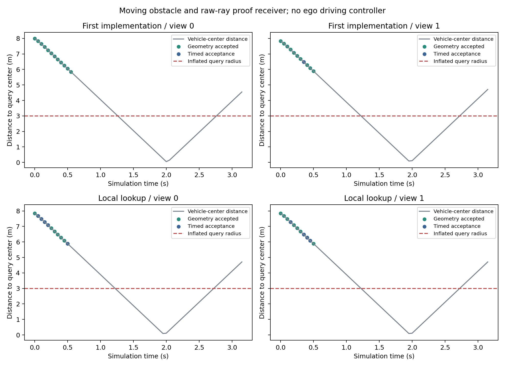

# 从不完整观测到可复核的有效期：原始射线证明与动态验证

本轮解决的是接收端此前无法独立核验逐射线误差的问题，并检验计算开销会不会耗尽证据寿命。代码和全部原始结果已保存在仓库；生产实验在 sheng 的 Ubuntu WSL 执行，动态场景使用同台 Windows 的 CARLA 0.9.15。**已实现条件成立时可复核的有效期；尚未建立现实传感器下的无条件可靠性，也没有证明“最不保守”。**

## 科学问题及可实现的答案

不完整观测本身不能保证正有效期。例如，两幅世界产生完全相同的已观测射线，一幅在盲区有即将进入动作区域的小物体，另一幅没有；缺少物体尺寸、运动或感知误差约束时，算法无法区分它们。给两者相同的正有效期可能不安全。因此，可信性必须写成明确契约下的结论，而不能由检测置信度或平均预测误差替代。

本项目的契约是：每类障碍在指定水平面包含半径至少 r_min 的不透明圆盘内核，整体水平范围包含在同中心的 r_max 圆盘内；首回波射线可靠；原点、回波和查询位置有给定坐标误差盒；时间对齐误差和运动上界已知。小目标与车辆都必须通过，不能只保留容易通过的车辆类别。车辆模型当前 r_min=0.55 m、r_max=2.5 m，小目标为 0.2 m、0.4 m。输入误差盒是实验设定，并未由真实设备标定。

令第 i 条射线的平面交点为 w_i，投影与量化误差界为 ε_i，距共同参考时刻的年龄为 A_i。记运动包络 D(s)=vs+as²/2。共同参考时刻，中心排除半径是

ρ_i = r_min − ε_i − D(A_i)。

如果一个网格中心 c 满足 ||c−w_i||+h/√2 < ρ_i，则整块边长 h 的网格都可排除该类障碍中心。取全部可证排除网格的并集；其他网格和计算域外仍视为未知。设它们距查询圆盘经 r_max 膨胀后的最小距离下界为 d，则联合有效期取各类别 min max(0, D⁻¹(d)−时钟界)。这是此前 `weighted.py` 已实现的寿命计算。本轮通信接口认证指定的 200 ms 下界，**没有把固定 200 ms 当作每一帧的最大有效期**。

这条推导分三步成立：真实空点排除不透明内核中心；逐射线年龄消耗其排除半径；未来可达距离消耗剩余空间余量。网格半对角、域外边界和所有必需类别都保留。它证明的是契约下“尚未知晓的中心不能及时到达查询区域”，不是把盲区直接认定为空。

降低保守性也必须可解释。逐射线误差避免一条差射线拖累全部证据；只覆盖当前动作真正需要的区域；不同证据可互补排除中心；续期只复用寻找支撑射线的位置，全部几何内容来自新一帧。上一轮与最佳统一误差阈值比较，仅在部分配置延长寿命，详见 [误差实验](visibility_uncertainty_result_20261001.md)。本轮不声称贪心选包达到全局最小字节数或最小保守性。

## 新证明包与接收端

第二版包发送选中首回波端点、传感器原点、每条射线时刻、共同参考时刻、作用区域和序列号。接收端固定误差契约和完整类别集合，重新计算穿越条件、投影误差、运动折减和全部必需网格的覆盖。发送端不能自报一个较小误差来换取更长寿命。坐标按 1 mm 量化，时间按微秒编码；误差加上半个量化单位，观测时间向下、参考时间向上取整，误差桶再向上取整。

接收时还要满足“当前时间 + 动作执行时间 < 参考时间 + 有效期”。证据必须处于同一个已对齐的源时钟体系；本轮没有验证任意多传感器时钟。SHA-256 仅检查意外内容损坏，不提供来源认证，也不能证明发送端没有伪造射线。反重放序列水位由调用者维护。过期、错误区域、缺失类别、未来或过老射线都拒绝。

## sheng 的全部结果

旧静态采集的 120 帧用于回放，十二个首帧配置、两种输入误差盒、三种时间设置、两种选包模式，共 144 项冷启动。其余 116 帧产生 1,392 项续期尝试，包含没有模板而拒绝的情况。20/50 ms 逐射线时间由方位角构造，只测先前有信息量的相位 0，不能冒充真实滚动传感器或盲测。

| 实验阶段 | 总尝试 | 几何通过 | 时间预算通过 |
|---|---:|---:|---:|
| 冷启动参考 | 144 | 32 | 0 |
| 续期参考 | 1,392 | 299 | 0 |
| 复用校验及共享原点编码 | 1,392 | 299 | 266 |
| 局部支撑射线查找 | 1,392 | 299 | 288 |
| 第一轮新动态采集 | 128 帧 | 23 | 1 |
| 局部优化后新动态采集 | 128 帧 | 22 | 9 |

时间预算包括记录/测量的采集处理、发送端和接收端计算，另加建模的 20 ms 传输与 50 ms 动作，要求总和小于 200 ms。不是无线链路实测，也不包含完整应用栈。静态回放不与 CARLA 渲染并发，不能拿它代替实时性能。

两次续期优化分别在全部 1,392 项上与原参考证明包**逐字节相等，差异均为 0**。局部算法先在模板周围扩展盒中查最近射线；仅当最近距离小于扩展余量且唯一时采用局部结果，否则回退全量 KDTree。盒外射线不可能更近；最终所选射线仍由原接收端完整验证，物理边界与寿命没有放宽。

局部回放中，异质模式 147 项几何通过且全部及时；统一模式 152 项几何通过、141 项及时。发送端续期耗时中位数分别为 15.55、20.98 ms，分母仅为各自几何通过项。**异质模式并非所有续期都占优**：两种模板所选支撑位置不同，影响后续能否续期。本轮统一基线寻找第一个足以覆盖的公共误差阈值，再贪心选包；它不是上一轮的最大有效期基线，也不是全局最省字节基线。

成功冷启动包：异质模式 JSON 9,027–24,781 字节，zlib 后 2,919–7,970 字节；统一模式 JSON 9,027–39,988 字节，zlib 后 2,919–12,334 字节。相同量化原始整帧压缩后 512,748–644,062 字节。这个整帧比较只用于字节核算，未构造完整接收应用，不能据此宣称超过学习式协同感知方法。

动态实验让一辆 Audi A2 以接近 4 m/s 向查询位置驶来，两种传感器安装位置各 64 帧。标签中的位置、速度和包围盒只参与离线评价，不输入证明生成。256 帧的传感器/世界帧号全部对应。两轮并非严格相同物理轨迹或随机独立试验，几何通过数 23 与 22 的差异不能归因于等价优化。

第二轮两种视角分别有 5 与 4 帧及时。对几何通过的非冷启动帧，发送端耗时中位数分别由第一轮 89.65/83.58 ms 降至 56.29/62.02 ms；第二轮接收端中位数为 9.54/19.83 ms。仍有超时长尾，不能称稳定实时，更不能称达到 20 Hz。同步 CARLA 在计算时暂停推进；本轮只是活动模拟器下的接收准入监测，不是实时驾驶控制闭环。

复核了 **376 个不同的有效证明包**：32 个冷启动、299 个续期、45 个动态包。全部射线能追溯到对应当前点云，接收端独立通过，过期后拒绝。45 个动态包均有完整 200 ms 未来记录；在帧间线性插值的车辆中心轨迹上，没有发现进入膨胀查询圆盘的情况。这是离散标签的模型诊断，不是连续物理网格碰撞证明，不估计现实事故概率。两次 CARLA 清理后均无实验车辆/传感器，独占服务器进程已停止。

## 文献对选题的约束

本轮再次检索后阅读了 [KARYON 原文](https://publications.lib.chalmers.se/records/fulltext/178062/local_178062.pdf) 的架构、§IV 感知故障及 §V 通信不确定性相关内容。它已把传感器有效性与远端信息使用、时序故障和服务降级联系起来。因此，“数据附带有效性供远端决策”不能当作新的概念贡献；其有效性属性与本项目条件几何寿命也不能混为同一量。

另阅读 [SCOPE，2026 年 8 月预印本](https://arxiv.org/html/2608.04420v1) 的摘要、§I–III 和 §VI-B。它要求运动覆盖的完整膨胀体积在执行前得到观测认证，并明确区分规划得到的路径与实际执行轨迹是否仍在认证集合内。这进一步说明，本项目 0.5 m 查询圆盘不能被包装成整车运动安全。这里未声称读完所有实验附录，也未将预印本称为已发表顶会论文。

面向 MobiCom，可继续检验的具体主张是：**在通信与计算预算内，用可独立重算的少量当前射线维持具有明确到期时刻的动作证据，减少丢包/陈旧观测造成的不必要拒绝。** 目前支持“接口可以实现与复核”，尚不支持“相对最强现有方法形成充分创新和系统收益”。物理契约标定、整车动作占用与后备控制、更多独立场景、匹配通信预算的完整基线仍是未完成项，见 [项目状态](PROJECT_STATUS.md)。

[复现入口](../experiments/ray_proof_v2_20261001/README.md) · [机器可读复核](../results/ray_proof_v2_20261001/analysis.json)

