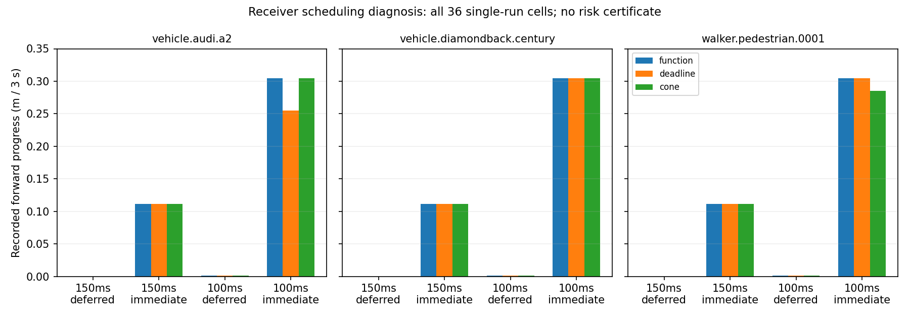

# 接收预算与采样周期：36 次固定闭环诊断

**结论：短有效期的可用性会被控制周期的额外等待消耗。按实测处理耗时及时使用证据后，本批次出现了实际前进；这些开发实验不构成独立风险认证。**

上一批 612 次实验中，通过条件风险检验的三种方法，在 72 次测试中仍几乎没有前进。本次固定诊断将接收处理方式与源周期交叉，覆盖 3 种表示 × 3 类已登记静止目标，共 36 次，每次 3 秒驾驶与 2 秒制动。所有单次结果保留，未追加采样、替换失败或挑选方法。

## 全部条件结果

| 源周期 / 接收方式 | 每回合源报文 | 9 个单次场景的前进范围（米） |
|---|---:|---:|
| period3_deferred | 20 | 0.000001–0.000001 |
| period3_immediate | 20 | 0.111773–0.111773 |
| period2_deferred | 30 | 0.001482–0.001482 |
| period2_immediate | 30 | 0.254600–0.304956 |

图与表为事后描述性汇总，没有置信区间或重复试验估计。相同场景单元的实测观测和处理耗时不同，不能将微小方法差异解释为算法优势。150 ms 改为 100 ms 的周期带来 50% 更多源报文；它不是免费的有效期增长。

## 机制与保留的成本

deferred 模式在报文已到达后额外等待一个 50 ms 控制周期。immediate 模式在当前控制步完成接收，并将该步全部解码与查询耗时计入决策时间；超过 20 ms 的预算则拒绝。两种方式均保留源采集、复制、编码、接收与查询成本、20 Mbps FIFO 序列化和 20 ms 模拟传播时延，不重置源时间戳。完整三维自车包络额外膨胀 0.26 m，用于 0.75 m/s × (300+20) ms 以及 20 mm 余量。这个控制器变化改变了认证分布，不能沿用旧证书。

运行环境是 Tailscale 名为 sheng 的 Windows 主机及其 Ubuntu 20.04 WSL；CARLA 0.9.15 在 Windows 同步非实时节拍运行，算法在 WSL 执行。尚未证实这等同于另一台独立 Linux 集群服务器。这里的链路是队列模型，不是真实无线实验，也没有最坏执行时间保证。

## 审计与异常处理

36/36 回合完成，900 次源扫描、3600 次控制记录、2940 次独立几何查询；记录中的四类采样违规和碰撞均为零。本地与 sheng 的完整审计 JSON 逐字节相同。采样检查不能推出连续时间安全、未登记目标完整性或道路部署许可。

原始清理脚本确实关闭了自己拥有的 CARLA 进程，但把停止回执写到了沿用的临时文件名；外层复制找错名字，导致主命令最终退出码为 1。原日志和复制错误原样保留，独立恢复脚本核对 PID、进程启动时间、可执行文件与停止日志后，仅复制已有停止回执。没有重启服务或重跑采集。详见 [清理恢复说明](../experiments/receiver_budget_live_20261004/CLEANUP_RECOVERY.md)。

## 全部 36 个单次结果

| 条件 | 类别 | 表示 | 前进 m | GO 步 | 最长连续 GO 步 | 报文字节 |
|---|---|---|---:|---:|---:|---:|
| period3_deferred | vehicle.audi.a2 | function | 1e-06 | 12 | 1 | 7150 |
| period3_deferred | vehicle.audi.a2 | deadline | 1e-06 | 12 | 1 | 5348 |
| period3_deferred | vehicle.audi.a2 | cone | 1e-06 | 12 | 1 | 5096 |
| period3_deferred | vehicle.diamondback.century | deadline | 1e-06 | 12 | 1 | 5477 |
| period3_deferred | vehicle.diamondback.century | cone | 1e-06 | 12 | 1 | 5290 |
| period3_deferred | vehicle.diamondback.century | function | 1e-06 | 12 | 1 | 6480 |
| period3_deferred | walker.pedestrian.0001 | cone | 1e-06 | 12 | 1 | 5192 |
| period3_deferred | walker.pedestrian.0001 | function | 1e-06 | 12 | 1 | 6058 |
| period3_deferred | walker.pedestrian.0001 | deadline | 1e-06 | 12 | 1 | 5399 |
| period3_immediate | vehicle.audi.a2 | deadline | 0.111773 | 25 | 2 | 5325 |
| period3_immediate | vehicle.audi.a2 | cone | 0.111773 | 25 | 2 | 5081 |
| period3_immediate | vehicle.audi.a2 | function | 0.111773 | 25 | 2 | 7152 |
| period3_immediate | vehicle.diamondback.century | cone | 0.111773 | 25 | 2 | 5271 |
| period3_immediate | vehicle.diamondback.century | function | 0.111773 | 25 | 2 | 6486 |
| period3_immediate | vehicle.diamondback.century | deadline | 0.111773 | 25 | 2 | 5499 |
| period3_immediate | walker.pedestrian.0001 | function | 0.111773 | 25 | 2 | 6055 |
| period3_immediate | walker.pedestrian.0001 | deadline | 0.111773 | 25 | 2 | 5370 |
| period3_immediate | walker.pedestrian.0001 | cone | 0.111773 | 25 | 2 | 5174 |
| period2_deferred | vehicle.audi.a2 | cone | 0.001482 | 19 | 1 | 7557 |
| period2_deferred | vehicle.audi.a2 | function | 0.001482 | 19 | 1 | 10690 |
| period2_deferred | vehicle.audi.a2 | deadline | 0.001482 | 19 | 1 | 7972 |
| period2_deferred | vehicle.diamondback.century | function | 0.001482 | 19 | 1 | 9762 |
| period2_deferred | vehicle.diamondback.century | deadline | 0.001482 | 19 | 1 | 8306 |
| period2_deferred | vehicle.diamondback.century | cone | 0.001482 | 19 | 1 | 7885 |
| period2_deferred | walker.pedestrian.0001 | deadline | 0.001482 | 19 | 1 | 8110 |
| period2_deferred | walker.pedestrian.0001 | cone | 0.001482 | 19 | 1 | 7773 |
| period2_deferred | walker.pedestrian.0001 | function | 0.001482 | 19 | 1 | 9065 |
| period2_immediate | vehicle.audi.a2 | function | 0.304956 | 38 | 30 | 10756 |
| period2_immediate | vehicle.audi.a2 | deadline | 0.2546 | 33 | 29 | 7997 |
| period2_immediate | vehicle.audi.a2 | cone | 0.304956 | 38 | 30 | 7603 |
| period2_immediate | vehicle.diamondback.century | deadline | 0.304956 | 38 | 30 | 8281 |
| period2_immediate | vehicle.diamondback.century | cone | 0.304956 | 38 | 30 | 7900 |
| period2_immediate | vehicle.diamondback.century | function | 0.304956 | 38 | 30 | 9747 |
| period2_immediate | walker.pedestrian.0001 | cone | 0.284957 | 36 | 30 | 7756 |
| period2_immediate | walker.pedestrian.0001 | function | 0.304956 | 38 | 30 | 9069 |
| period2_immediate | walker.pedestrian.0001 | deadline | 0.304956 | 38 | 30 | 8093 |

## 对研究问题的含义

值得保留的是“感知不确定性 → 源时刻可达集合 → 接收时剩余有效期 → 处理及动作时间预算”的完整链条，而不是给短有效期配一个无法利用它的控制器。下一项已预注册的独立实验同时检验条件风险与所有回合中的有效前进概率；本次数据仅作开发输入。

目前没有证据证明函数表示优于紧凑圆锥表示，也没有证明方法在所有场景中最不保守。已知目标、已标定动作模型和受限模拟分布外，仍须重新验证。这个诊断是工程因果线索，不是 MobiCom 级算法创新已成立的证明。

## 复现

按继承项目要求还原固定模型输入并编译原生几何内核后，运行 `audit.py --split certification --capture results/receiver_budget_live_20261004/capture --out /tmp/receiver-audit.json`，与发布的 `audit_sheng.json` 比较。运行 `summarize_complete.py --out /tmp/receiver-summary.json` 可复算本表。`verify_package.py --out /tmp/receiver-package.json` 检查所有公开字节、双方审计、全部原始源与停止回执。核心冻结先于采集，描述性汇总与打包发生在结果之后，二者在清单中区分。
