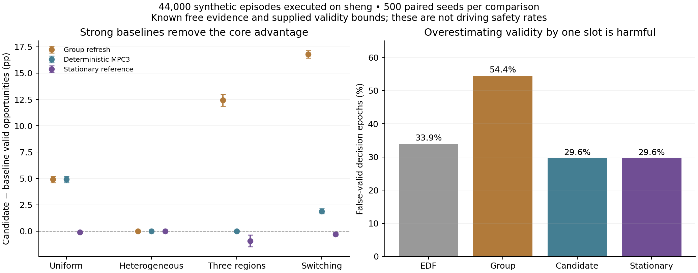

# sheng 候选问题验证：调度收益被强基线解释，真实覆盖仍是门槛

日期：2026-10-01。本报告接续[上一轮候选问题](update_20261001.md)。**已在 sheng 完成本轮有限验证；当前候选没有通过算法创新门槛，不能称为完成了 MobiCom 论文或新的安全驾驶系统。** 负结果和失败尝试均保留。

## 已执行的范围

| 工作 | 实際执行位置与规模 | 产物 |
|---|---|---|
| 强基线与失效条件 | sheng，11 条件 × 7 方法 × 500 种子，38,500 episodes | 逐 episode 原始数据、配对统计、源代码哈希 |
| 平稳参考补充 | sheng，11 条件 × 500 种子，5,500 episodes | 收敛残差、逐 episode 数据；明确是初轮结果后的补充 |
| 运动界限诊断 | sheng，10,000 个一维运动样本 | 界限内检验、故意低估界限的反例 |
| CARLA 传感器前置验证 | sheng 客户端 + Windows 服务端，均为 0.9.15；Town10HD_Opt；80 个实测帧 | 两视角 × 空闲/障碍；320 条分辨率/抽稀统计，4 份点云样本 |
| 单元与回归测试 | sheng 上 8 项主测试 + 2 项补充测试；本地再次通过 | 确定性穷举、服务耗时、物理界限、错误有效期、滚动规划端点效应 |

算法运行在现有 Linux Python 3.8 环境，主机名为 `DESKTOP-UGDDO8T`，即此前确认的 sheng WSL 环境；不是在本地算完后标注为服务器结果。算法是 CPU 小规模参考求解，无 GPU 训练。服务器工作目录：`/home/sheng/mobicom2027_renewal_20261001`。本轮无持续研究循环、自动续跑或定时研究任务。

## 1. 两区域核心收益被简单分组刷新完全解释

所有方法共享有效期、执行余量、服务时间、成功率、预算及当前需求区域。每个种子提前生成 `[decision, region]` 成功表；方法不能观察未来结果。每 episode 60 个通信决策，比较指标是模型中的有效动作机会比例，不是车辆速度或碰撞率。

新增强对照为：按归一化年龄选择、长寿命优先周期轮询、分组刷新、确定性三步 MPC、随机六步 MPC，以及折扣因子 0.99 的平稳值迭代参考。**它们是透明的通用基线，没有冒充 C-MASS、AoUI 或 coflow 论文的官方复现。**

分组刷新很简单：检查下一次提交时会失效的区域；在缺失区域中先刷新寿命最长的那个；若下一动作已有支持则空闲。对于核心 `(2,6)` 条件，它与候选随机三步 MPC 的 500 个 episode 在有效机会、宣称有效、误宣称有效、漏用机会、发送数与建模字节数上逐项相同。两者有效机会均为 **70.0567%**。

| 条件 | 候选 − 分组刷新 | 候选 − 确定性 MPC3 | 候选 − 平稳参考 [95% CI] |
|---|---:|---:|---:|
| 同质寿命 | +4.92 pp | +4.92 pp | −0.103 pp [−0.157, −0.057] |
| 两区域异质寿命 | 0 | 0 | 0 [0,0] |
| 三区域异质寿命 | +12.44 pp | 0 | −0.923 pp [−1.473, −0.363] |
| 需求区域切换 | +16.79 pp | +1.89 pp | −0.290 pp [−0.433, −0.143] |

完整 11 条件见[配对统计](../results/renewal_sheng_20261001/combined_comparisons.csv)。候选相对平稳参考在其余条件也没有正的平均优势。这里的参考仅优化给定小模型的无限时域折扣目标；切换条件下仍不知道未来需求，不是预知未来的 oracle。没有据此证明候选在一切场景都无用，但**现有证据不足以把调度方法作为新算法贡献**。

## 2. 不能用一个失效参考制造优势

六步滚动规划在无丢包的两区域条件下会一直不发送。穷举 729 个长度六的动作序列，确认其有限时域最优值确实为 4 次有效机会、5 次发送；立即开始也能获得 4 次机会，却多发送一次。每次重规划都选择推迟，导致闭环永远推迟。

这属于有限时域、无终端价值且优先少发的目标产生的端点效应，不是“短算法胜过一般最优解”的证据。原始结果未删除；随后新增平稳值迭代作为补充。值迭代 Bellman 残差小于 `1e-10`，小状态空间为 4–140 状态；这不能外推为多车大规模实时可用性。补充表中的 `cold_s` 部分配置命中已有缓存，不能全部当冷启动耗时。所有调度时延也不包含实际感知、网络和控制，不能据此声称完整闭环满足 20 Hz。

## 3. 错误的有效期会破坏任何调度收益

当所有方法看到寿命 `(3,7)`、实际寿命为 `(2,6)` 时，候选方法 **29.6033% 的决策时刻**宣称证据有效，但实际上不能覆盖执行余量。平稳参考也为 29.6033%；EDF 为 33.9033%，分组刷新为 54.4333%。分母是全部决策时刻，不是已放行动作；这不是实车碰撞率。

在一维入侵模型中实现了保守期限：已观测空闲长度扣除位置误差后，求解 `v_max*t + a_max*t²/2 = distance`，再扣除时钟误差。覆盖缺失或观测不为空闲时不发放期限。10,000 个满足输入界限的合成样本无违反；故意低估动力学界限的对照全部构成边界反例。这只检验代数及实现，没有验证真实感知误差或分布外运动，也不是新理论。

**因此，有意义的研究问题必须包含“为什么接收端可以相信这个有效期”，而不能把正确 TTL 当作免费输入后只优化调度。** 但有效期估计本身已有可达性文献；需要进一步证明新的可实现方法和收益，不能现在宣称创新已成立。

## 4. CARLA 实测：一处空洞就暴露了表示的保守性

使用真实 CARLA semantic LiDAR 原始点云，转换到地图坐标；10 m × 3 m 区域按 0.5 m 单元离散，共 120 个单元。地面回波提供采样覆盖，有抬高的障碍点则判 occupied；没有覆盖判 unknown。该定义仍不能证明单元内部连续体积为空，也依赖理想语义传感器，不能直接部署。

预先指定两个传感器安装位置，空闲和障碍条件各测 20 帧。主结果使用原始点云和 0.5 m 网格：

| 视角 | 空闲时平均覆盖 | 空闲时 free / unknown | 有障碍时 occupied |
|---|---:|---:|---:|
| 侧向 4 m、高 8 m | 120/120 = 100% | 100% / 0% | 100% |
| 侧向 8 m、高 6 m | 119/120 = 99.17% | 0% / 100% | 100% |

第二视角的一处未覆盖单元使严格完整覆盖门槛失败。1 m 网格的敏感性结果能通过两视角，但不能事后换粗网格就宣布安全：必须另证最小可探测障碍、采样间距和遮挡之间的关系。八倍抽稀又显著降低覆盖。**这是当前离散表示的有效性/保守性问题，不是证明 CARLA 或物理证据通信不可行。**

80 帧来自静态场景，不是 80 个独立交通场景。首次 RPC 启动失败和首次订阅帧缺失均记录；修复仅使预热允许跳过未就绪帧，正式测量必须 frame ID 匹配，覆盖阈值未改。最终测量没有跳过或填补缺失帧。

因为主覆盖门槛未通过，按事前协议没有把这些证据接入新的驾驶控制器，也没有用不充分观测制造新的闭环进展数字。旧 140-episode CARLA 结果保持历史定位；本轮不是 MDrive 复现，也不是新的驾驶安全结果。[CARLA 官方传感器说明](https://carla.readthedocs.io/en/0.9.15/ref_sensors/)明确 semantic LiDAR 包含仿真语义/实例真值且无普通 LiDAR 噪声模型。

## 5. 立项判断与剩余工作

- **当前候选调度算法：不通过 G1，不能据此写新的 MobiCom 算法贡献。** 普通分组刷新和通用优化已经解释收益。
- **真实证据有效性：完成前置实测，但不通过当前 G2 表示门槛。** 需要证明采样覆盖如何约束未观察空间和潜在入侵者；粗化网格或调参不是证明。
- **研究问题本身：保留为尚未解决的感知—通信接口问题。** 若继续，先比较已有可达性方法与“考虑最小障碍尺寸的覆盖界限”，再看是否需要新的通信反馈/刷新机制。Plan2comm、AoUI、AoCI 全文仍未补齐，独占新颖性尚不能下结论。
- **G3/G4 未完成：** 没有新自然交通闭环、实测无线链路或多车规模证明。这些不会由本轮运行数自动补足。

本轮的完成物是可复现的候选验证和明确的否定/限制证据，不是保证得到正结果。相比继续扩大弱基线对照，现有结果已经足以停止推广当前调度故事。

## 工件与复现

- [代码、依赖与运行命令](../experiments/renewal_sheng_20261001/README.md)
- [先行协议](../experiments/renewal_sheng_20261001/PROTOCOL.md)与[事后参考补充说明](../experiments/renewal_sheng_20261001/ADDENDUM.md)
- [38,500 episodes](../results/renewal_sheng_20261001/main38500/per_episode.csv)、[5,500 参考 episodes](../results/renewal_sheng_20261001/stationary5500/per_episode.csv)
- [CARLA 覆盖统计](../results/renewal_sheng_20261001/carla_coverage_v4/summary.csv)、[版本/安装位置/哈希](../results/renewal_sheng_20261001/carla_coverage_v4/manifest.json)
- [完整性验证](../results/renewal_sheng_20261001/validation.json)、[世界清理记录](../results/renewal_sheng_20261001/cleanup_world.json)
