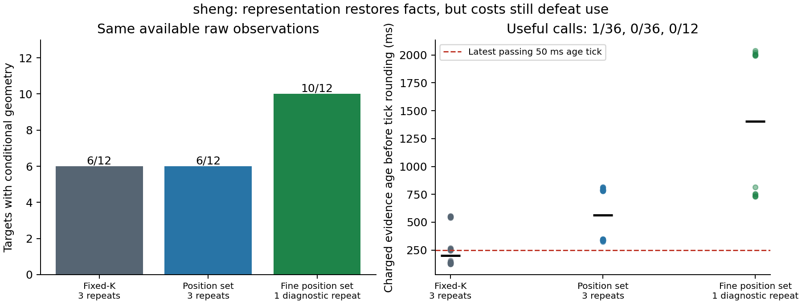

# 不完整观测的可信有效期：同观测强基线与保守性诊断

**更新后的科学结论：已有方法能从不完整观测恢复条件有效期；先前部分
失败来自表示精度，而不是已经证明的信息不足。实时计算/传输仍未解决。**
本阶段在 sheng 完成 72 次同观测比较及 12 次预定细化诊断，完整归档正负
结果、原始传输包、可能中心集合、成本及独立复核。不新增持续研究循环。

## 本次具体解决的问题

过去的 fixed-K 方法要求每个历史参考时刻严格落在已有证据期限内；断链
即拒绝，不能重新授权。但断链后新观测可能排除所有已进入的潜在中心。
因此“固定 K 归纳失效”不能推出“原始信息无法支持有效期”。本次实现
一个既有的集合成员估计基线：传播全部可能中心、注入域外未知入口，再
与当前射线的全 tile 空证据相交。可信根完全重验；没有自行假定车体
遮挡内部为空，也不把旧发送 horizon 字段当作事实。

直接读过的方法依据是 [Narri 等的 V2V/RSU 集合估计论文](https://arxiv.org/html/2103.01791v1)、
[SPOT 的集合预测论文](https://archive.air.in.tum.de/Main/Publications/Koschi2017a.pdf)
与 [RSS 2021 遮挡动态博弈论文](https://www.roboticsproceedings.org/rss17/p066.pdf)。
它们分别说明集合预测/观测交集、保守未来占据及利用观测历史处理未知
遮挡都是已有工作。此处实现的是匿名中心位置网格基线，不声称复现
上述论文各自的模型/驾驶控制，也不能把集合观察器本身包装成创新。
详细阅读范围见 [READING](../experiments/set_observer_20261002/READING.md)。

## 配对条件与真实成本

主比较覆盖全部 6 条已经初始化的历史、目标 25/39、两方法、3 次随机
顺序重复，共 72 次。双方拥有相同可用原始字典及相同已付费的历史 FIFO
源生成记录。fixed-K 拒绝断链时不发送失败证明；集合方法发送相同可用
记录。因此不把“可用输入相同”误写成所有负例“实际传输内容相同”。

目标支付实际已记录采集/源生成完成、当前装包/压缩、解压/完整后验重建/
最大整数微秒边界，及 20 ms+实际字节×8/20 Mbps，向上 50 ms 取整。
严格动作条件是 age+200 ms<H。原始根初始化单独记录：主比较两接收器
合计各条历史约 5.47–6.89 s，不进入暖目标成本，也不宣称免费初始化。

粗 tile 为小类 5 cm、车辆类 10 cm。主结果之后冻结一次 factor2 诊断，
全部 12 目标各测一次，内部 tile 改为 2.5/5 cm；物体半径、误差、速度、
射线、可信根和实际源记录均保持原始合同。它是后分析的精度敏感性
检验，不是新留出评估，也不是在线优势试验。

| 方法 | 几何可证明目标 | 通过完整使用时限的调用 | 非零 H | 完整目标成本范围 |
|---|---:|---:|---:|---:|
| fixed-K | 6/12 | 1/36 | 475.000 ms | 125.038–557.268 ms |
| 粗位置集合 | 6/12 | 0/36 | 475.211 ms | 326.146–816.454 ms |
| 细位置集合，后分析一次 | 10/12 | 0/12 | 475.512–475.551 ms | 731.343–2040.878 ms |

fixed-K 成本范围包含不发送的拒绝调用；低成本不是成功。历史流式研究
曾得到 2/36 及时回填；本次另一次真实配对计时是 1/36，保留各自记录，
不能把不同运行的偶发通过率当成稳定收益。图包含所有调用，细化只有
一次重复，不能据此做统计优越性声明。

恢复的四目标是 c0/reference_fixed 的 25/39 与 c2/reference_rate20 的
25/39。c0/reference_rate20 的两目标仍是 H=0，没有构造连续可行危险
轨迹或联合位置/速度最优滤波证明，不能称为不可辨识。已经正值的目标
细化只增加 0.301–0.340 ms；主要价值是四个零值变为正值。

## 可信性如何检查

八个不同测试在本地和 sheng 通过：全 tile 距离与直接 box 计算一致、
原始个体半径空球与独立计算一致、连续点轨迹保留、过期后合法新观测
恢复、长期缺观测保留未知入侵者，以及合同/根/时间/重放/传输拒绝。
细化检查不改物理 metadata，并且不凭更小 tile 创造自由隐藏区域。

独立审计不导入观察器、native mask 或距离变换，用反向个体球 KD 查询
及顶点 KD 距离重建集合。主审计重验 252 旧根/前缀包、120 源记录、240
分类传播、36 保存集合、18 保存传输包、72 成本行及 18 H/H+1 边界。
细审计从这些已完全复核根重建另 240 分类传播、36 集合、12 传输包、12
成本行及 22 边界。H=0 案例检查 1 μs 拒绝；不把零当作危险存在的证明。
本地与 sheng 的两份审计输出逐字节一致，后续封包记录代码/输入校验和。
另对所有 12 对粗/细传输包逐字节检查一致，24 个细网格可能集合都包含
于粗集合的细格提升表示；精度恢复没有偷偷增加传输信息或改变物理合同。

这是在明确模型下的可信外包归纳。尚未标定的首回波真实性、不透明内核、
外包半径、位姿误差、每个选中观测时刻的速度上界、连续存在及公共可信
时间轴仍是前提。摘要哈希提供一致性，不提供身份/物理真实性。代码说明
与推导见 [THEORY](../experiments/set_observer_20261002/THEORY.md)。

## 下一算法问题现在更具体了

长目标 39 即使把当前装包和接收器计算假设为零，原有源就绪时间加
实际大小链传输仍需 297.292–329.265 ms。475 ms 左右期限及 200 ms
动作保留允许的最后 age tick 是 250 ms：六条长链已由输入/传输成本
单独阻塞。因此只有加速接收器不能解决这些例子。

对全部 120 保存字典的有限诊断发现：每条历史 20 帧的量化起点、端点
及相对射线年龄只有一个精确签名。这指出精确时间字典/缓存可能有用，
也暴露当前评估大量重复几何的限制。尚未实现或测量新优化；不能把
静态重复视作普遍移动场景。任何精确缓存还需校验 scope、误差/物理/
motion 合同和网格，不能只凭端点相似而复用证据。

候选突破口应围绕“在使用期限内保留足够精度的可复核后验”：保守局部
计算窗口、可精确重建的历史传输和增量后验共同减少成本，并给既有
集合/固定 K 强基线同样实现优化。后续仍需改变场景的有限验证、实际
通信和可执行动作闭环。当前已经定位并减少一类过度保守，但没有完成
实时驾驶接口、物理安全保证或 MobiCom 2027 创新验证。

实现/冻结协议/复现命令：
[experiments/set_observer_20261002](../experiments/set_observer_20261002/README.md)。
原始计时： [main](../results/set_observer_20261002/study/analysis.json)、
[fine](../results/set_observer_20261002/refined/analysis.json)。
独立复核：[main](../results/set_observer_20261002/validation.json)、
[fine](../results/set_observer_20261002/refinement_validation.json)。
完整项目仍未完成；不把此次条件组件结果当作最终论文结论。
