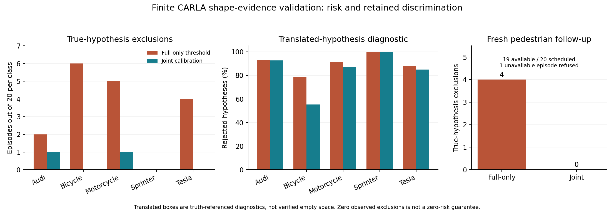

# 从不完整观测到可信有效期：三维校准、明确拒绝与最早失效见证

2026-10-03，在 sheng 完成两组有限实验。**本轮解决了旧物理模型的一个替代方案及输入不可用时过度保守的问题；尚未完成真实道路上的端到端有效期认证。** 原始数据、失败场景、代码、双端复核和负结果一并保留。没有建立持续研究循环。

## 问题的正确分解

证据有效期不能只由数据年龄或预测置信度决定。应先构造“收到这些观测之后，还不能排除哪些世界”，再计算其中最早可能使任务失效的时间：

\[
T^*(I,Q)=\inf_{w\in\mathcal W_\alpha(I)}\inf\{t\ge0:Q(t)\cap O_w(t)\ne\varnothing\}.
\]

这里有两项独立责任：**可信**要求真实世界以明确概率落在保留集合里；**不过度保守**要求计算接近该集合的真正最早失效边界。安全下界和一个仍可成立的失效世界分别提供下、上界，才能量化损失。证明条件不成立时，算得再精确的 TTL 也无效。

上一轮 48 帧已经证伪部分“不透光圆盘／统一半径”前提，因此本轮不再调整旧半径以迎合反例。新模型检查三维射线与显式包围盒假设的相容性，允许盒内存在空隙；缺失射线不被当作空闲空间。多个观测视角、多个压缩预算一起校准。

## 新观测与严格隔离

第一组预先固定六种 CARLA 0.9.15 蓝图，每类 19 个校准场景、20 个测试场景。车辆／行人位置和朝向随机，两个 RSU 视角属于同一个场景。234 个预定场景中 229 个成功，得到 **458 帧、40,434,988 条原始射线**；5 个行人生成失败，没有补样。先稳定姿态再冻结物理，实验不包含行驶控制。

非相容分数为：进入假设盒的已观测射线中，有多少在首次返回之前又穿出该盒。少于 8 条有效射线或传感器处于盒内时拒绝作出排除判断。采用固定 3 cm 扩边，采样步长固定为 1、4、16。扩边属于被校准的流程，不是物理传感器误差的硬保证。

校准单位是整个场景，分数取两个视角、三个预算共六种情况的最大值。每类 19 个校准样本、风险参数 0.05，对应取最大校准分数；严格超过阈值才排除假设。旧 48 帧只用于设计，未进入校准或测试。

## 风险与信息保留的实际结果

第一组五类车辆均有 20 个独立测试场景：

| 蓝图 | 完整点云阈值直接用于全部预算：误排场景 | 联合校准：误排场景 | 联合校准后偏移假设排除数 |
|---|---:|---:|---:|
| Audi A2 | 2/20 | 1/20 | 889/960 |
| 自行车 | 6/20 | 0/20 | 530/960 |
| 摩托车 | 5/20 | 1/20 | 835/960 |
| Sprinter | 0/20 | 0/20 | 960/960 |
| Tesla Model 3 | 4/20 | 0/20 | 814/960 |
| 描述性合计 | **17/100** | **2/100** | **4028/4800，83.92%** |

若使用“任何穿透都排除”的实心盒诊断规则，五类车辆全部 100 个测试场景都会出现误排。完整点云阈值跨预算转用也不可靠，尤其影响细小、空隙多且压缩后射线少的目标。

偏移假设按协议由真实盒沿道路方向平移构造。它们**不保证为空，也不是部署时自动找到的安全区域**；该指标只检验校准是否仍有区分力，不能解释为 83.92% 可行驶空间。直接转用完整点云阈值排除 90.15%，联合校准以约 6.23 个百分点的区分率代价降低本组误排。

第一组行人的三次校准生成失败按原协议赋最大分数，阈值变成 1，完全不能排除假设。这是保留的负结果。把不可用输入混进“最坏观察误差”，会导致不必要的全局保守。

## 新问题的独立修正：不可用时明确拒绝

读取第一组结果后，另行冻结一次新的行人验证，使用完全不同的随机种子，仍为 19 校准、20 测试。修改的是预测程序：**某个必需输入不可用时，输出整个假设空间，并拒绝授权**。此时没有排除真实假设，排除分数定义为 0；这不等于把缺失标签伪造为正确观测。

39 个预定场景中 35 个成功，得到 **70 帧、6,180,020 条射线**。3 个校准场景和 1 个测试场景生成失败，全部保留。

- 新联合阈值为 **7/9**，恢复为非平凡阈值。
- 19 个成功测试场景中，直接转用完整阈值有 **4 个误排**，联合校准 **0 个误排**。
- 另 1 个测试场景拒绝授权。不能把它计算成一次成功感知。
- 联合校准仍排除 **626/912＝68.64%** 的预设偏移假设。

这是新数据上的修正验证，不能与旧行人测试拼接成一个事先固定的成功实验。最终实现还增加了“只缺一个家庭成员也整体拒绝”的保护；重放确认它没有改变这些完整或完全缺失的已采集场景输出。

## 怎样接到有效期

新增 `lifetime.py` 接收一个**已经建立完整覆盖的状态集合**，对每个保留状态计算最早可能接触任务区域的时间，再取最小值。具体参考实现采用有限个不确定圆盘、初始速度上界和各向同性加速度上界：

\[
\|c-q\|^2 > \left[r+R+vt+\tfrac12at^2\right]^2.
\]

实现使用有理数和整数微秒，返回最后严格安全的时刻；造成最早失效的状态同时给出下一微秒的抽象碰撞见证。未被上限截断时，抽象模型下的有效期上下界间隔不超过 **1 微秒**。收到数据时继续扣除其原始年龄、时钟误差与动作预留时间，旧证据不会因补传而变新。

在 sheng 和本地各完成 **2,000 个解析参考案例、10,359 次边界检查**，与独立高精度闭式解一致。它证明该参考模块的数值与边界处理；不证明真实道路几何或运动上界正确，也不是新 CARLA 闭环结果。

**目前形状实验尚未构造覆盖所有未知障碍和连续姿态的完整状态集合，所以不能直接接到这个模块后宣称已获得物理有效期。** 模块对未建立覆盖或空集合默认拒绝；旧物理资格门没有被放开。这个缺口比再优化 TTL 算式更重要。

## 可信度不能被数字包装

在相同单对象场景分布、可交换校准与测试样本、固定六种观测方式的前提下，联合阈值有 5% 的**边际排除风险**保证。它不是给定已拟合阈值后的 95% 置信／5% 风险保证，也不保证已获授权子集的条件风险。多对象、多个时刻还需要共同事件和风险预算，不能重复套用单对象 5%。

新行人测试的 0/20（其中 1 次拒绝）只给出无条件风险的一侧 95% 上界 **13.91%**；若仅看 19 个可用场景，上界为 **14.59%**。车辆中出现 1/20 的两类上界约 **21.61%**。因此本轮不能支持“真实风险已证实低于 5%”或“零风险”。

第一组单盒评分的 sheng 中位耗时为完整点云 **3.235 ms**、1/4 采样 **0.711 ms**、1/16 采样 **0.248 ms**。这些不包含采集、坐标变换、完整状态集合构造、传输和控制，不能报告成端到端时延。

## 文献约束与 MobiCom 定位

[Perceive With Confidence](https://arxiv.org/html/2403.08185v3) 已研究环境级校准、遮挡处理与感知／规划接口；[Predictive Semantic Safety](https://arxiv.org/html/2609.34356v1) 的近期预印本进一步明确固定对象清单、轨迹联合覆盖与备份控制条件。详细阅读范围见 [READING.md](../experiments/shape_evidence_20261002/READING.md)。因此不能把“加共形预测”“三维占用”“加安全控制器”本身包装成新贡献。

更值得推进的通信问题是：**当前最早失效的反例由哪些信息缺口支撑；发送哪一小段仍带原始时间戳的证据，能以最小总代价排除它，延长真正可用的有效期？** 评价必须同时给出风险、失效见证、有效期上下界，以及发送和验证成本后的净收益。此前历史证据修复的收益仍以旧抽象几何为条件，不能与本轮拼接成一套已验证系统。

## 复核与交付

两组共 **528 帧、46,615,008 条新射线、14,256 次独立三维盒检查**。审计使用另一套六面交点实现，不导入被测评分代码；复核同帧真值、源字节、随机划分与精确分位数。两端分析、两端独立审计及有效期解析核验 JSON 均逐字节一致；**20 项测试**两端通过。原始采集失败均保留。拥有的 CARLA PID 80708、17272 已停止，参与者和传感器清理完毕，原世界设置已恢复。

对外口头进度中曾把车辆合计误写为 15；经自动汇总立即纠正为 17，逐类原始结果没有改变。正式报告由已存结果支持。

本轮已交付一个经过新数据检验的形状证据组件、可用性修正和严格条件下的有效期参考实现。**完整状态覆盖、真实传感器／动力学契约、动态风险、有效行驶、实测链路与最终新颖性仍未完成，整个 MobiCom 项目不能标记为完成。**
