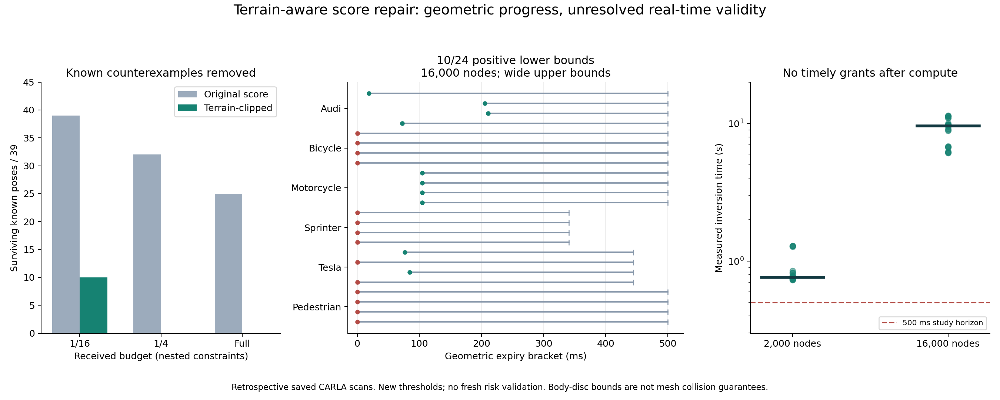

# 地面支持修复：首次获得连续集合的正期限，但尚不能实时使用

2026-10-03，在sheng完成评分修复、重新校准、39个旧反例重验，以及两组各24次连续姿态反演。**修复确实排除了此前由近地面返回支持的错误障碍假设，并在10/24个查询上恢复正的几何期限；但计算耗时远超期限，可用期限仍为零。** 不能把这一进展写成已完成“可信、不过度保守且实时”的方案。

## 修复了哪个具体错误

[上一轮诊断](pose_inversion_result_20261003.md)发现，完整点云下存活的25个错误姿态中，18个的全部未穿透返回位于道路高度上下5cm内，且没有真实目标返回。原评分把这些近道路返回当成支持假想障碍的证据。

本轮固定将假设包围盒与世界坐标z≥0.15m的半空间相交，再计算射线穿透比例。这里道路基准为公开的z=0平面。**保留打到地面的射线**：它在到达地面前穿过的高处空间仍是有效观测；简单删除地面返回会把这部分证据一并丢掉。少于8条有效射线继续保留该假设，缺失观测继续拒绝授权。

15cm在运行前固定，没有按结果扫描或挑选。该高度不是已验证的任意道路误差界；本轮只处理原有平坦道路实验。评分仍经校准来容纳非实心车辆形状，没有重新假设整块包围盒不透明。

新评分必须重新校准，不能沿用旧阈值。每类19个校准episode取其两视角、三预算最大分数，再取19个episode的最大值。车辆用原采集，行人用可用性跟进采集；全部缺失记录保留。实际使用460帧已有观测，没有新增CARLA采集。

## 已知反例被消除，同时报告真实状态损失

| 收到预算 | 旧评分保留的39个候选数 | 地面修复后保留数 |
|---|---:|---:|
| 1/16 | 39 | 10 |
| 1/4，同时保留1/16约束 | 32 | 0 |
| 完整，同时保留此前约束 | 25 | 0 |

这是固定反例库的复验，不是整个连续状态空间已清空，也不是39个独立交通样本。新增连续反演正是为避免这个逻辑跳跃。

真实状态方面，100个车辆测试episode出现3个误排（Audi1、Tesla2），旧模型为2个；行人19个可用测试episode误排0，另1个不可用拒绝。不能只报告消除错误假设而省略真实状态损失。19个校准样本与这些旧测试数据不能证明部署条件下5%风险上界，尤其本次修复由已看过的测试失败启发，**需要重新设计独立、前瞻验证**。

## 连续空间和计算预算的检验

接收端仍从公开道路坐标、声明的形状类别与收到的xyz出发，不用真实actor位置初始化候选。把整个六维姿态域连续分区，未解决的区间继续保留。对于每个区间，将旧的内外盒都裁到同一固定半空间；集合包含关系保持，因而可得整个区间的穿透评分下界。只有下界严格超过新阈值，才排除整个区间。

12个已有观测、每个两个固定任务圆、1/4点云加1/16约束，共24次。先固定2000节点，看到下界仍零后，额外固定执行全部24查询的16000节点对照，两组完整保存。

| 计算预算 | 完整姿态区间排除总数 | 正几何期限查询 | 单次耗时中位数 | 扣除计算后的正可用期限 |
|---|---:|---:|---:|---:|
| 2,000节点 | 1,076 | 0/24 | 0.762秒 | 0/24 |
| 16,000节点 | 132,441 | 10/24 | 9.601秒 | 0/24 |

高预算的正下界为18.528–210.947ms，出现在Audi4个、摩托车4个、Tesla2个查询。全部计算耗时6.129–11.435秒。其余14个下界为零；正上界不能证明存在正期限。两组均未找到新的被接受姿态作为更紧上界，当前上界来自始终保留的未知边界，范围340.649–500ms。因此区间还很宽，不能宣称接近最优。

这些期限仍相对于已声明的圆盘运动外包、速度／加速度上界与有限已知类别。它们不是物理车辆实体的碰撞保证。经校准的测量模型是否有效、运动假设是否成立、区间计算是否足够紧，是三个分别需要证据的问题。

## 通信基线纠正了另一个可能的误判

上一轮原始完整消息超过1MB，但共享固定设计参考帧后，完整**当前**消息能无损压到19,413–53,663字节。参考首次安装需725,278字节；缺失或不匹配时拒绝解码。当前点云、时间戳与元数据全部逐字节恢复，没有把旧地面观测当作新证据。在这个重复场景中，暖缓存已经缓解传输瓶颈；新算法必须和这类强基线比较，不能把普通压缩收益包装成语义通信创新。

目前真正占主导的是连续反演计算与观测抽象，而非未经压缩的大包。高预算的正期限不能抵偿秒级处理耗时。

## 这对“可信、不过度保守”的确切含义

可信应来自联合校准的状态集合与明确的动态假设；不过度保守则应有可检查的上下界差距，而不是任选一个经验TTL。对于同一收到信息与同一模型，保守集合给下界L，可行失效状态／轨迹给上界U；U−L才是该模型内尚未消除的期限保守性。实际授权还要扣除原始观测年龄、处理、传输、时钟及动作预留，不能重置旧证据时间。

本轮解决了近地面支持这个具体错误，并给出可复现的连续区间排除。剩余问题已被量化：目前的区间反演太慢、期限上下界仍宽；外接圆也会引入额外保守性；校准数据还需独立更新。后续算法应围绕任务附近的失效区域快速验证、保持形状朝向和运动信息，并与共享参考压缩加校准定位基线同成本比较。这里提出的是由实验支持的方向，尚未证实MobiCom新颖性或完成闭环。

## 复现与审计

[代码与命令](../experiments/terrain_score_20261003/README.md)、[固定评分协议](../experiments/terrain_score_20261003/PROTOCOL.md)、[有限计算对照协议](../experiments/terrain_score_20261003/PROTOCOL_INVERSION.md)、[推导与适用范围](../experiments/terrain_score_20261003/THEORY.md)均保留。

独立七个世界坐标平面相交程序重验1497次评分、57,727,978次点检查，并核对464个输入哈希；与sheng和本地计算一致。另一个独立审计核对两组完整区间分区、每个被删除区间的全射线评分下界、原始包字节、时间戳和最早失效计算。两组共核对596,948个树节点、133,517个被删除区间，完成1,284,622,683次射线—区间排除检查；这些是重复运算量，不是新增独立观测。审计不以抽样替代整段空间检查。五项新增边界／随机回归测试通过；上一组12项测试保持通过。浮点工程裕量仍不等同于形式化向外舍入验证。

本轮没有运行定时研究循环，没有启动新CARLA服务，也没有开启物理行动门。项目尚未完成，全部正负结果均公开保存。
