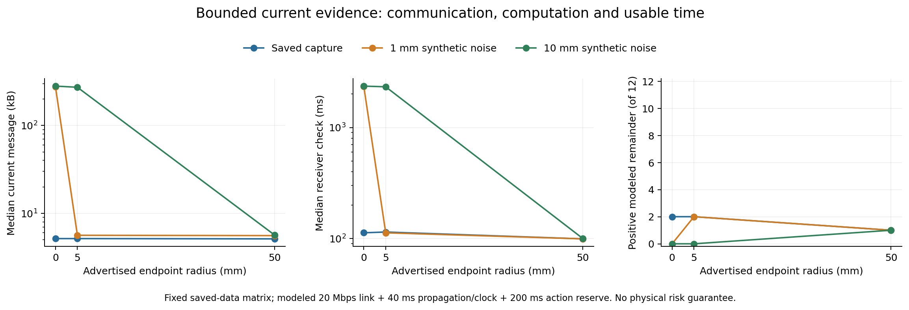

# 不完整当前观测的有效期：有界表示可保留部分可用时间，但紧致性尚未解决

本轮在 sheng 完成端点邻域算法与固定保存数据实验：36次初始证明、108个当前观测案例。它修复了上一版“坐标必须逐位不变才能复用”的限制。接收端不需要得到所有当前坐标，但未传来的坐标必须落在明确的集合里，不能被当作旧值或空闲空间。

**结论边界：已完成的是当前证据的有界表示与复核。尚未证明整个有效期估计不过度保守，也未建立真实传感器下的物理安全保证。**

## 研究问题应怎样定义

给定当前证据E、动作u及明确的感知／物体覆盖／运动假设，令X(E)为所有仍与证据相容的场景，T(x,u)为场景x中动作首次违反约束的时间。信息能够支持的最强鲁棒期限是：

`H*(E,u) = inf_{x in X(E)} T(x,u)`。

算法应输出下界L与上界U，满足`L <= H* <= U`。L保证期限内成立，U由相容的失效状态提供；`U-L`才反映仍未解释的保守性。如果两个场景的观测完全相同，但其中一个在动作区已有未观测障碍，任何算法都不能从这些观测保证正期限。此时零有效期是信息不足，不是算法应“放宽”的安全余量。

本实现中的X仍然只是固定地面评分接受的已知形状姿态集合，并非完整交通场景集合。未知物体覆盖、物理测量误差、运动契约和跨时间风险都不能由当前数值测试代替。单次观测的边际覆盖也不能自动成为反复驾驶的全程保证。

## 已实现的算法

发送端读取全部当前返回。对于落在旧端点ε邻域中的返回，只发送当前帧／时间与邻域契约；超出邻域的返回连同索引精确发送。参考、传感器变换、采样方式、数量、类别和校准身份必须一致；不兼容数据拒绝复用。SHA用于完整性检查，不证明发送端的成员关系断言诚实。

对于每个连续姿态区间，用外盒膨胀覆盖可能相交射线，用内盒收缩确认必然相交射线，同时上下移动地面裁剪平面。因为端点偏移不超过ε时，射线参数t处的偏移不超过tε，这些集合可以给出整个端点邻域内的评分下界。只有下界超过固定阈值才排除整个姿态区间。

缓存复核使用逐射线可加计数：

`当前有界计数 = 旧邻域计数 − 例外返回的旧邻域贡献 + 例外返回的当前精确贡献`。

旧排除不再成立时就撤销，未知区间继续保留，再重新求有效期。一个已修复的边界错误也有回归测试：内盒收缩为空时，未知返回不能贡献全零计数，否则与精确例外混合后可能制造虚假排除。现在贡献最坏未知计数。

[完整推导与限制](../experiments/tube_evidence_20261003/THEORY.md)区分了两种不同的不确定性：未传输的当前坐标与真实物理表面的测量误差。本轮只对前者建立表示界。

## 固定实验与完整成本

六类目标、两个固定查询，端点半径0／5／50mm，当前坐标扰动标准差0／1／10mm。每类使用同一确定随机向量缩放到不同扰动等级，不能当成独立风险样本。旧测试00建立分区后才处理当前测试10；二者源时间相隔20.5s，属于已有独立保存案例，并非连续运动轨迹。

每个配置64,000次节点检查，暖复核重复三次；源报文构造重复五次。比较增量与全量复核时使用同一报文、同一继承分区，要求每个计数、状态和期限一致。半径为零另作精确无损更新对照。不同半径的分区可能不同，不能直接把它们的期限差解释成信息精度差。

| 邻域半径 | 合成扰动σ | 消息中位数 | 接收复核中位耗时 | 正几何期限 | 正净余量 |
|---:|---:|---:|---:|---:|---:|
| 0mm | 0mm | 5.150kB | 112.936ms | 6/12 | 2/12 |
| 0mm | 1mm | 274.062kB | 2344.910ms | 0/12 | 0/12 |
| 0mm | 10mm | 280.731kB | 2358.225ms | 2/12 | 0/12 |
| 5mm | 0mm | 5.152kB | 114.689ms | 6/12 | 2/12 |
| 5mm | 1mm | 5.618kB | 112.850ms | 6/12 | 2/12 |
| 5mm | 10mm | 272.370kB | 2324.618ms | 2/12 | 0/12 |
| 50mm | 0mm | 5.115kB | 99.574ms | 6/12 | 1/12 |
| 50mm | 1mm | 5.572kB | 99.539ms | 6/12 | 1/12 |
| 50mm | 10mm | 5.670kB | 100.380ms | 6/12 | 1/12 |

净余量扣除源报文构造、邻域编码、接收解码与复核、20Mbps串行化、20ms单向传播、20ms时钟余量和200ms动作预留；采用实测重复中的最大组合开销。参考传输、压缩解压和初始证明也计费，初始化未完成的等待计入当前代价。这是有限重复的最坏观测值，不是WCET。每个查询和半径单独核算，没有免费事后选择最佳配置。真实传感器采集、回调与无线链路时延仍未测量。报文时间兼容性检查相对于固定参考；重复计时属于独立回放，不能当作已部署的跨帧会话、到达时钟校验或动作执行门控。

1mm扰动下，5mm邻域使消息中位数从274.062kB降至5.618kB，接收增量复核中位耗时从2344.910ms降至112.850ms。两个查询在上述完整模型化扣费后分别剩25.377ms和67.888ms；其余10个仍为零。10mm扰动下，50mm邻域仅有一个查询剩34.267ms。全部108个同消息全量复核对照均无正净余量。

较大的邻域并非普遍更好：在1mm扰动下，5mm邻域有2/12正余量，50mm只有1/12。原始无扰动条件下，精确无损更新本来就有2/12正余量。两种扰动都使零半径方案的全部21,612个返回变成例外；本方法的收益仍依赖固定视角、固定返回索引以及大量背景落在小邻域内。运动传感器、丢点重排和真实噪声尚未验证。

初始传输及证明准备总成本为689.100–14,493.187ms，均小于本数据的20.5s源间隔；不能据此宣称在线启动或并发调度满足期限。

## 保守性有两个不同来源

第一项指标固定同一继承证明，比较有界消息与完整当前坐标的复核结果：仅允许旧排除区间重新被排除，旧未解决区间仍保留。105/108个案例的该项额外损失为零；50mm邻域的Tesla −6m查询在三个扰动版本中均额外损失17.026ms。这个指标没有覆盖初始邻域导致的分区变化，也没有用完整当前数据重新检查所有旧未解决区间。

因此，5mm邻域在1mm扰动下比零半径方案产生更多正期限，不能解释成“不精确数据更有信息”。两者继承的分区不同；本实验评估的是整个固定构造与复核流程。原始精确信息在相同允许推理操作下不会弱于包含它的邻域表示。

对总推断误差，另作了明确标为事后诊断的有限搜索：在每个暖查询的保留区间中选择靠近任务的中点及投影点，使用全部当前射线检查3,385个不同候选姿态，共73,156,620次候选点贡献检查。两个主机的结果一致，但没有找到通过评分的候选，因此没有收紧原来的上界。剩余上下界差仍为158.818–500ms。搜索失败既不能证明最优期限为零，也不能证明不存在更紧的算法。

因此，“噪声后还能给出正余量”与“已经不过度保守”是两项不同结论；当前只支持前者在少量受控案例中成立。

## 审计、复现与论文定位

sheng与本地的独立审计JSON逐字节一致：检查2,930,074个分区节点、2,304,000次冷计数、2,516,883次暖计数及同数目的完整当前计数支配关系，并核验108个消息的当前坐标覆盖。独立角度预筛选后检查8,024,107,676次候选点贡献，另作447次全点云对照；没有把预筛选审计说成每区间无条件扫描全点云。全部108次暖查询共撤销88,785个旧排除。

6个原始当前观测的18个扰动版本均保留真实姿态，仅用于真实性诊断；原有地面评分在车辆测试上的3/100误排记录保持不变。没有重新宣布5%部署风险。两端的成本汇总及事后见证搜索也逐字节一致，全部源文件和结果有SHA-256清单。

五项测试覆盖1,840组随机姿态／端点组合、地面裁剪、空内盒及报文身份拒绝；100个端点测试夹具全部具有正下界，避免全零情况下的空泛通过。浮点裕量仍不是形式化向外舍入证明。源码、完整消息、分区、全部失败案例、成本记录和复现命令见[实验目录](../experiments/tube_evidence_20261003/README.md)。

文献约束已更新：[IJRR安全证书](https://journals.sagepub.com/doi/10.1177/0278364915625345)和[ICRA证书共享](https://ottelab.com/html_stuff/pdf_files/Otte.Bialkowski.ea.ICRA14.pdf)使“复用／共享证书”不能成为本项目的新颖性主张；[UNCAP](https://arxiv.org/html/2510.12992v2)已有不确定性感知的选择性语义通信；[RA-L的共形安全规划](https://www.georgejpappas.org/wp-content/uploads/2023/08/Safe_Planning_in_Dynamic_Environments_Using_Conformal_Prediction.pdf)已有预测区域到规划约束的理论路径。实际阅读范围和区别推论见[文献记录](tube_evidence_reading_20261003.md)，没有声称已复现这些系统或全面超过它们。

MobiCom候选问题由此收窄为：**在固定风险语义下，怎样联合选择当前证据精度与复核工作，使到达后的可用有效期最大，并给出可计算的保守性界。** 本轮提供了有界证据机制和正／负结果；全场景感知覆盖、独立风险验证、紧致推断、实测动态闭环与无线强基线仍未完成。没有创建持续研究循环。
