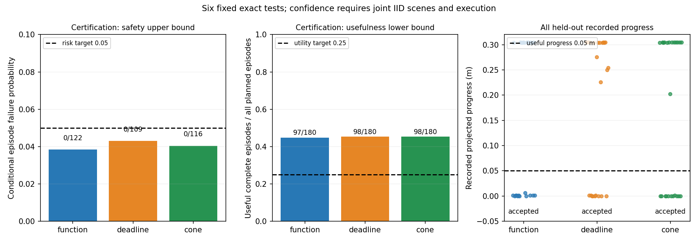

# 不完整观测的证据有效期：联合风险与有效前进验证

**结果：3/3 个预先固定的方法同时通过本批次的风险与有效前进检验。通过的方法：function、deadline、cone。这是声明联合分布与执行假设下的有限原型结论，不是普适道路安全、最小保守性或 MobiCom 新颖性证明。**

## 回答的具体问题

算法先由部分 XYZ 回波形成可能的目标中心集合，再把集合与完整自车动作包络的分离距离换算为源时刻有效期。接收端使用原始时间戳，扣除证据年龄、全部当前接收和查询处理时间，以及 300 ms 动作承诺。几何查询、整数期限、源归属和动作包络均可审计；无法满足条件时拒绝。推断准确性和下游选择误差必须由整个固定使用链独立验证，不能仅凭几何计算精确来宣称可信。

形式化前提和推导见 [证据有效期论证](evidence_expiry_argument_20261004.md)。当前原型限于已登记、已知类别/车身的静止目标；未知遮挡物体、任意道路和移动目标分布未被本批次覆盖。

## 为何重新采集

之前的 612 次批次虽然通过条件风险检验，72 次测试却几乎没有前进；它已作为 [完整负结果](ego_policy_certificate_result_20261004.md)公开。随后 [36 次固定诊断](receiver_budget_live_result_20261004.md)显示，额外等待一个 50 ms 控制周期会消耗短有效期。新的控制器按实际处理耗时及时使用已到达证据，同时将源周期改为 100 ms；后者增加了源报文，成本没有隐藏。旧数据只用于开发，没有继承旧风险证书。

本批次的控制器、完整随机场景请求列表、阈值和认证方法均先冻结。540 次认证后锁定通过/拒绝策略，再运行 72 次独立测试。没有替换失败、追加样本或结果后调参。场景从 243 个固定单元均匀有放回抽取：3 类目标、3 个起点、各 3 种横纵偏移和朝向。每种方法 180 次认证、24 次测试。

接收预算为 20 ms，超过则拒绝；自车三维包络额外膨胀 0.26 m。链路是 20 Mbps FIFO 与 20 ms 模拟传播，源 TTL 上限 500 ms，控制周期 50 ms，每回合 3 秒驾驶与 2 秒制动，固定丢弃第 30–49 个控制步产生的报文。每回合计划 30 条源报文，较旧 150 ms 周期增加 50%。Windows CARLA 0.9.15 为同步非实时节拍，算法在同一 Tailscale peer“sheng”的 Ubuntu WSL 执行；不是独立 Linux 集群或真实无线实验。

## 六个预设统计检验

G：回合曾尝试工程动作；F：所用证据中心漏覆、支付处理和动作时间后的 oracle 年龄违规、记录操作违规/碰撞，或已尝试动作的未完成采集。风险目标为 P(F|G)≤0.05。M：回合完整且存储中心的精确道路投影前进至少 50000 微米；有效性目标为 P(M)≥0.25，所有 180 个计划回合都在分母，包括拒绝和未完成。

每种方法的两项检验均需通过。六项单侧精确二项检验各使用 1/120 的错误预算，总预算 0.05；零风险失败也至少需要 94 个被选择回合。通过后的同时置信度至少 95% 依赖**场景与服务/执行行为联合 IID**。场景随机化不能证明执行 IID，95% 也不是每个具体观测的安全概率。二项与多重检验使用标准方法，没有新定理主张。

| 方法 | 选择回合 / 180 | 所选回合失败 | 风险单侧上界 | ≥5cm 回合 / 180 | 有效性单侧下界 | 联合通过 |
|---|---:|---:|---:|---:|---:|---|
| function | 122 | 0 | 0.038482 | 97 | 0.447125 | 是 |
| deadline | 109 | 0 | 0.042971 | 98 | 0.452630 | 是 |
| cone | 116 | 0 | 0.040431 | 98 | 0.452630 | 是 |

未通过可能表示证据量不足或无法满足当前门槛，不能一律解释成系统已被证明不安全。5 cm / 3 秒以及 25% 概率只是有限原型的非停滞门槛，远低于完整驾驶任务要求，也没有证明所有行动都有效或算法达到最小保守性。

## 72 次独立测试，全部方法保留

| 方法 | 完成 / 24 | 有效前进 / 24 | 选择回合 | 所选回合失败 | 前进中位数 m | 前进最大值 m | 实际源报文字节 |
|---|---:|---:|---:|---:|---:|---:|---:|
| function | 24 | 12 | 20 | 0 | 0.155274 | 0.304956 | 231654 |
| deadline | 24 | 15 | 18 | 0 | 0.265050 | 0.304956 | 195195 |
| cone | 24 | 13 | 14 | 0 | 0.253432 | 0.304956 | 186447 |

未获联合认证的方法在测试阶段按冻结规则拒绝驾驶，仍采集并保留其观测。独立方法使用各自预先抽取的场景与实测服务耗时，因此上表不是相同输入的因果方法比较；中位数等描述统计的完整/可用分母在 summary 中明列。

## 相同输入下的强紧凑表示对比

在测试开始前另行固定离线对比：将每个可用测试源的同一 XYZ、里程计、车身、模型与原始时间戳分别编码为 function、deadline、cone；实际执行方法的报文必须逐字节复现。比较保留所有可用缓存查询，不重写原动作与处理耗时，也不产生反事实驾驶证书。

共 2160 个相同来源，4176 个可比较缓存查询，144 个无缓存查询；未完成回合 0 个。

| 表示 | 相同来源总报文字节 |
|---|---:|
| function | 703086 |
| deadline | 586108 |
| cone | 559564 |

cone 相对 function 的同输入字节变化为减少 20.413%。函数减圆锥的有效源年龄差（微秒）：中位数 0.000000，P95 2.000000，最小 0.000000，最大 50.000000；两者相同 3606 次，圆锥更长 0 次。deadline 查询域失效 0 次。

这些结果衡量表示损失与字节成本，不等于替换控制器后的端到端收益。紧凑下界由三角不等式输运；若在小位移场景中已接近完整函数，就应如实保留该负结果。见 [紧凑表示的诊断性上界](compact_expiry_bound_20261004.md)。没有据此证明完整函数必胜、圆锥普适最优，或超过外部协作感知系统。

## 原始数据、两端核验与故障记录

认证完成 540/540，测试完成 72/72，共 18360 次源扫描与 61200 次控制记录。

认证采样违规：`{"ego_enclosure": 0, "ego_speed_cap": 0, "self_mask_leak_returns": 0, "target_mask_removed_returns": 0}`；测试采样违规：`{"ego_enclosure": 0, "ego_speed_cap": 0, "self_mask_leak_returns": 0, "target_mask_removed_returns": 0}`。这些是存储时刻的检查，不是连续时间安全证明。碰撞与源排除事件保留在逐回合风险标签中，不能用总平均稀释。

认证审计、测试审计、独立有理数统计重算、汇总、同输入对比和压缩存储验证，分别在 sheng 与本地执行，JSON 逐字节一致。源及接收费用使用原始记录，不重新计时挑选更快结果。所有物理采集和审计结束、所属服务停止后才开始大文件打包与导出。采集期间仅做小量进度读取及补充分析源码传输。

补充源码第一次打包附带 macOS AppleDouble 元数据，严格文件名校验在写入源码之前拒绝了传输；原错误与两份包的哈希保留。改用标准 Python tar 后，相同已冻结源码在证书与测试数据尚不存在时登记。此处没有控制策略修复、重启或重采集。

原始点云及报文共 36720 个文件、4374361272 字节，无损存为 612 个 XZ 包、929541992 字节。每个压缩包及每个原始成员均有 SHA256；轨迹、结果和小元数据直接公开。sheng 保留原始文件，本地从压缩包恢复后完整重放，不是只抽查或只验证压缩包。

复现入口：[完整离线步骤](../experiments/useful_expiry_certificate_20261004/REPLAY_COMPLETE.md)。四份历史逻辑 JSON 从已发布 gzip 按哈希恢复；本地还在隔离的新目录验证恢复与重复检查不会覆盖既有输入。最终清单固定源码、输入、结果、图、报告及失败记录；新克隆不需要连接 Windows CARLA 即可重放。

诊断清理辅助源码的末尾换行同步差异另有完整执行版本保留和两端核验，见 [格式同步补充](receiver_source_sync_20261005.md)。该补充不改变已固定的原诊断报告或结果。

## 全部 72 个计划测试回合

| 回合 | 类别 | 前进 m | 有效 | 曾选择 | 失败 | 状态 |
|---|---|---:|---|---|---|---|
| test_function_000 | walker.pedestrian.0001 | 0.001483 | False | True | False | captured |
| test_deadline_000 | vehicle.diamondback.century | 0.304956 | True | True | False | captured |
| test_cone_000 | walker.pedestrian.0001 | 0.304136 | True | True | False | captured |
| test_deadline_001 | walker.pedestrian.0001 | 0.304956 | True | True | False | captured |
| test_cone_001 | vehicle.diamondback.century | 0.000000 | False | False | False | captured |
| test_function_001 | vehicle.diamondback.century | 0.304136 | True | True | False | captured |
| test_cone_002 | vehicle.audi.a2 | 0.000000 | False | False | False | captured |
| test_function_002 | vehicle.audi.a2 | 0.000000 | False | False | False | captured |
| test_deadline_002 | vehicle.diamondback.century | 0.304956 | True | True | False | captured |
| test_function_003 | walker.pedestrian.0001 | 0.001483 | False | True | False | captured |
| test_deadline_003 | walker.pedestrian.0001 | 0.001483 | False | True | False | captured |
| test_cone_003 | vehicle.diamondback.century | 0.304956 | True | True | False | captured |
| test_deadline_004 | walker.pedestrian.0001 | 0.304956 | True | True | False | captured |
| test_cone_004 | walker.pedestrian.0001 | 0.304136 | True | True | False | captured |
| test_function_004 | walker.pedestrian.0001 | 0.001483 | False | True | False | captured |
| test_cone_005 | walker.pedestrian.0001 | 0.304956 | True | True | False | captured |
| test_function_005 | vehicle.audi.a2 | 0.000000 | False | False | False | captured |
| test_deadline_005 | walker.pedestrian.0001 | 0.001483 | False | True | False | captured |
| test_function_006 | walker.pedestrian.0001 | 0.001483 | False | True | False | captured |
| test_deadline_006 | vehicle.audi.a2 | 0.000000 | False | False | False | captured |
| test_cone_006 | vehicle.audi.a2 | 0.000000 | False | False | False | captured |
| test_deadline_007 | vehicle.audi.a2 | 0.000000 | False | False | False | captured |
| test_cone_007 | vehicle.diamondback.century | 0.000000 | False | False | False | captured |
| test_function_007 | vehicle.diamondback.century | 0.000000 | False | False | False | captured |
| test_cone_008 | walker.pedestrian.0001 | 0.304136 | True | True | False | captured |
| test_function_008 | vehicle.audi.a2 | 0.304956 | True | True | False | captured |
| test_deadline_008 | walker.pedestrian.0001 | 0.304136 | True | True | False | captured |
| test_function_009 | walker.pedestrian.0001 | 0.304136 | True | True | False | captured |
| test_deadline_009 | vehicle.audi.a2 | 0.000000 | False | False | False | captured |
| test_cone_009 | vehicle.audi.a2 | 0.000000 | False | False | False | captured |
| test_deadline_010 | walker.pedestrian.0001 | 0.001483 | False | True | False | captured |
| test_cone_010 | vehicle.diamondback.century | 0.304956 | True | True | False | captured |
| test_function_010 | walker.pedestrian.0001 | 0.304136 | True | True | False | captured |
| test_cone_011 | vehicle.diamondback.century | 0.202727 | True | True | False | captured |
| test_function_011 | vehicle.audi.a2 | 0.304956 | True | True | False | captured |
| test_deadline_011 | walker.pedestrian.0001 | 0.275500 | True | True | False | captured |
| test_function_012 | walker.pedestrian.0001 | 0.304136 | True | True | False | captured |
| test_deadline_012 | walker.pedestrian.0001 | 0.304136 | True | True | False | captured |
| test_cone_012 | vehicle.audi.a2 | 0.000000 | False | False | False | captured |
| test_deadline_013 | vehicle.audi.a2 | 0.000000 | False | False | False | captured |
| test_cone_013 | walker.pedestrian.0001 | 0.304956 | True | True | False | captured |
| test_function_013 | walker.pedestrian.0001 | 0.006412 | False | True | False | captured |
| test_cone_014 | vehicle.audi.a2 | 0.000000 | False | False | False | captured |
| test_function_014 | vehicle.audi.a2 | 0.000000 | False | False | False | captured |
| test_deadline_014 | walker.pedestrian.0001 | 0.304136 | True | True | False | captured |
| test_function_015 | walker.pedestrian.0001 | 0.304956 | True | True | False | captured |
| test_deadline_015 | vehicle.audi.a2 | 0.226263 | True | True | False | captured |
| test_cone_015 | walker.pedestrian.0001 | 0.304956 | True | True | False | captured |
| test_deadline_016 | vehicle.audi.a2 | 0.000000 | False | False | False | captured |
| test_cone_016 | vehicle.diamondback.century | 0.001483 | False | True | False | captured |
| test_function_016 | vehicle.diamondback.century | 0.304956 | True | True | False | captured |
| test_cone_017 | vehicle.audi.a2 | 0.304956 | True | True | False | captured |
| test_function_017 | vehicle.diamondback.century | 0.304136 | True | True | False | captured |
| test_deadline_017 | vehicle.diamondback.century | 0.304136 | True | True | False | captured |
| test_function_018 | walker.pedestrian.0001 | 0.001483 | False | True | False | captured |
| test_deadline_018 | vehicle.audi.a2 | 0.304956 | True | True | False | captured |
| test_cone_018 | vehicle.audi.a2 | 0.000000 | False | False | False | captured |
| test_deadline_019 | walker.pedestrian.0001 | 0.304136 | True | True | False | captured |
| test_cone_019 | vehicle.audi.a2 | 0.304956 | True | True | False | captured |
| test_function_019 | walker.pedestrian.0001 | 0.304956 | True | True | False | captured |
| test_cone_020 | vehicle.audi.a2 | 0.000000 | False | False | False | captured |
| test_function_020 | vehicle.diamondback.century | 0.304136 | True | True | False | captured |
| test_deadline_020 | walker.pedestrian.0001 | 0.304956 | True | True | False | captured |
| test_function_021 | walker.pedestrian.0001 | 0.001483 | False | True | False | captured |
| test_deadline_021 | vehicle.audi.a2 | 0.000000 | False | False | False | captured |
| test_cone_021 | walker.pedestrian.0001 | 0.304956 | True | True | False | captured |
| test_deadline_022 | vehicle.diamondback.century | 0.250284 | True | True | False | captured |
| test_cone_022 | vehicle.diamondback.century | 0.000000 | False | False | False | captured |
| test_function_022 | walker.pedestrian.0001 | 0.304956 | True | True | False | captured |
| test_cone_023 | vehicle.audi.a2 | 0.304956 | True | True | False | captured |
| test_function_023 | walker.pedestrian.0001 | 0.001483 | False | True | False | captured |
| test_deadline_023 | vehicle.audi.a2 | 0.254599 | True | True | False | captured |

## 投稿判断与仍未解决的部分

本次落实了一个能够拒绝“只安全但停滞”的实验判据，以及可独立复算、成本完整的有效期使用链。能否形成 MobiCom 2027 的算法贡献，还取决于强基线下的真实通信/任务收益及更有区分度的观测条件，不能由六个检验通过直接推出。

未知目标完整性、多目标、移动目标、更长路线、真实无线链路、最坏执行时间与连续安全、执行分布变化，以及全局最小保守性均未被本批次解决。现有不确定性通信、风险选择与控制文献已覆盖多项基础工具；见 [最新文献补充](useful_expiry_literature_addendum_20261004.md)。没有把已有工具组合或原型运行成功宣称为新定理或必然可录用。项目整体完成状态仍未达成。
