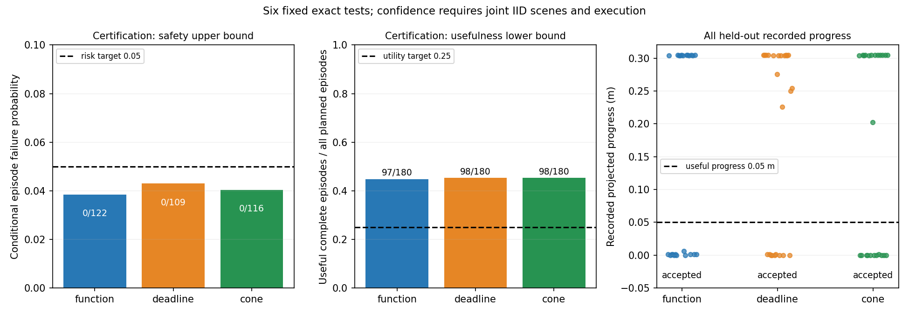

# 证据有效期项目：2026-10-05 发布核验

已完成一批新的、预先固定的 612 次 CARLA 闭环实验，并在本地完整重放全部原始观测。三种固定方法均通过预设的风险与有效进展联合检验。当前结论适用于已登记静止目标、已知车身/运动界和声明的场景及执行分布；尚未证明普适最小保守性或 MobiCom 级创新。

| 方法 | 认证选择回合 | 选择回合失败 | 条件风险上界 | 有效进展概率下界 | 测试有效回合 / 24 |
|---|---:|---:|---:|---:|---:|
| function | 122 | 0 | 3.85% | 44.71% | 12 |
| deadline | 109 | 0 | 4.30% | 45.26% | 15 |
| cone | 116 | 0 | 4.04% | 45.26% | 13 |

三个方法各两个精确检验，总错误预算 0.05；同时置信结论依赖场景与服务/执行联合 IID。单个回合内的多个查询不是独立样本。测试各自使用预先抽取的场景，表中的方法差异不能解释为同输入因果优势。

**时间终点说明：** 进展量来自 100 个 50 ms 步结束后的中心位置，即 3 秒驾驶与 2 秒制动后的完整 5 秒回合。有效门槛是最终道路方向投影至少 5 cm。原冻结文件/报告中“5cm/3s”的简称应按此修正理解，实际标签定义以冻结审计代码为准。新的终点诊断逐一检查了全部 612 回合：第 60 步和第 100 步的门槛标签在本批观测中一致；这不把原证书升级为另一个总体时间门槛的保证。原指标、证书、图、报告保留，未调参或重采集。

得到的算法链条是：不完整 XYZ 观测构造候选中心集合；计算候选集合与完整动作包络的分离距离下界；按运动上界换算源时刻绝对期限；接收端用原始时间戳支付证据年龄、解码/查询及动作预算；完整固定使用策略同时接受风险和非停滞检验。[形式化说明](evidence_expiry_argument_20261004.md)给出必要前提，无法排除兼容危险状态的观测应拒绝。

强基线比较使用全部 2160 个测试来源、4176 个可比较缓存查询。紧凑 cone 比 function 总字节少 20.41%；函数减圆锥有效期差异中位数 0、P95 2、最大 50 微秒，3606 次相同。这支持保留较小表示，尚未支持完整函数的通信/任务优势。[紧凑表示的解析诊断](compact_expiry_bound_20261004.md)解释为何小位移场景可能没有足够区分度。

[完整结果与全部 72 测试回合](useful_expiry_certificate_result_20261004.md)、[完整离线复现步骤](../experiments/useful_expiry_certificate_20261004/REPLAY_COMPLETE.md)、[代码及冻结方案](../experiments/useful_expiry_certificate_20261004)、[无损原始观测与核验清单](../results/useful_expiry_certificate_20261004)均已整理。37,000 量级原始文件中的本批精确计数为 36,720，原始 4,374,361,272 字节无损存为 929,541,992 字节。两端的全量几何/时序审计、独立统计重算、同输入比较、存储验证和发布核验逐字节一致。

运行使用 Tailscale 名为 sheng 的 Windows 主机及 Ubuntu WSL，CARLA 0.9.15 同步非实时节拍，链路为软件 FIFO/传播模型。未知目标、多目标、移动目标、长路线、真实无线、最坏执行时间、连续安全和执行分布变化仍需要独立证据。现有工作已经覆盖多项基础工具，[文献补充](useful_expiry_literature_addendum_20261004.md)明确阅读范围；不会将工具组合或原型通过检验直接视作论文创新成立。

[36 次接收时序诊断](receiver_budget_live_result_20261004.md)与[此前安全通过但几乎停滞的 612 次负结果](ego_policy_certificate_result_20261004.md)也完整保留。诊断中进展同样是完整回合末量。清理回执文件名恢复与源码格式差异有[独立保留说明](receiver_source_sync_20261005.md)。当前发布图只调整标签和图例以解除遮挡；原冻结图保留。没有建立持续研究循环。
