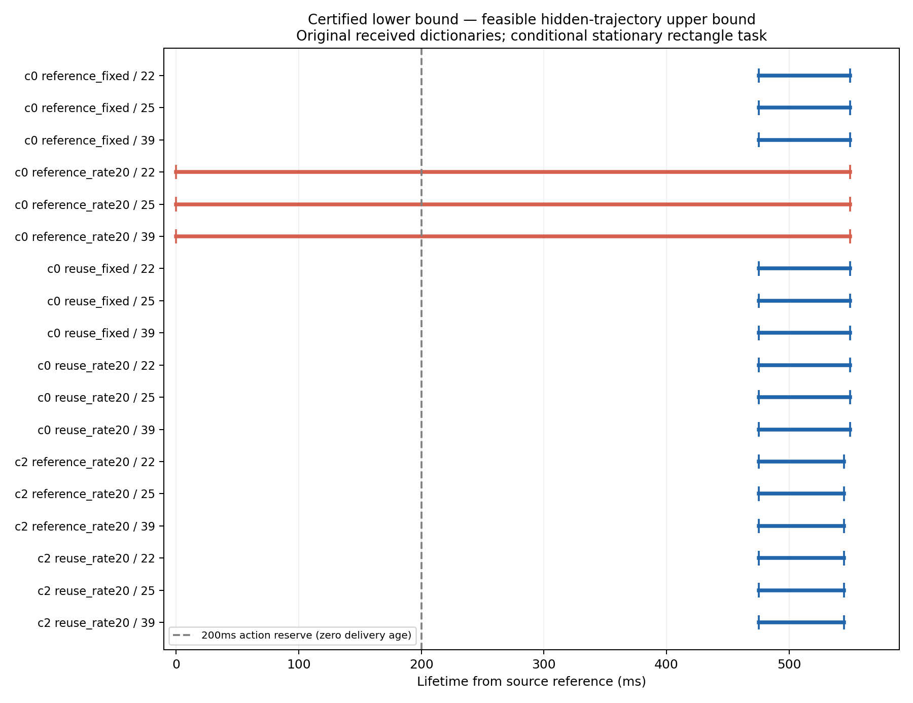

# 不完整观测下的证据有效期：可认证下界、反例上界与通信信息缺口

本轮在 sheng 完成有限实验并归档代码、原始输入、轨迹、独立审计和图表。
新的结果是：**有效期的保守程度可以被界定，而不必用“算法没有认证”来猜测信息不足。**
在固定的接收端信息和运动／核心／误差合同下，18个双类别查询中的15个已经给出
最优条件有效期的上下界，保守损失不超过74.488ms，相对损失上界13.5433%。
另外3个仍是0–550ms，没有解决，不能宣称最小保守或信息论不可能。
这是条件模型结果；完整项目与MobiCom投稿要求仍未完成。

## 怎样把“可信、不过度保守”说清楚

令O为接收端实际拥有的全部历史射线与已验证根事实，C为明确的合同，R为当前
固定矩形任务。H*定义为所有与O、C一致的隐藏世界中，R最早可能发生危险的时间。
原有保守观察器证明L之前所有允许世界安全；构造一条确实符合观测／运动／外廓
条件、在U时刻侵入R的隐藏轨迹，就得到`L ≤ H* ≤ U`。因此漏掉的有效时长至多
`U-L`；L为正时，相对损失至多`1-L/U`。L为零只表示证书未建立。

本轮沿用已独立审计的fine-terminal下界，没有把有限搜索的最早成功时间叫作最优。
同一组射线、相同误差、相同时间戳和物理类参与比较，两类任务同时满足才可认证。
时间从源参考时刻起算；传输和验证消耗A时，仍须`A+200ms<L`才允许原任务。
上界搜索耗时另列，不能免费用于实时授权。事实保留与动作权限继续分离。

本模型假设相对射线时间戳可信、处于共同时间相位，保留原有20ms未来时钟裕量；
并未覆盖或校准任意逐包时钟漂移。阴影中的所有对象都要满足实际观测时刻的速度
上界与全时段加速度界，不能用“只观测到的车辆限速”替代。探测平面、遮挡核心、
最大外廓和误差盒也不是从空检测列表推断出来的。详见[条件推导](../experiments/validity_witness_20261002/THEORY.md)。

## sheng有限实验

六条已有历史，每条根事实包含42个已接受原始包；查询22／25／39，small与vehicle两类。
每个查询只使用根事实和source20至当前查询，不使用后续帧。全部原始时间戳保留。
首先冻结36个球体案例，再单独冻结36个椭球案例、12个接触法向／运动方向解耦案例。
后二者是分析后的扩展，不冒充原始预注册比较。共84条候选轨迹均通过独立复核。

轨迹在每个实际观测时刻速度为5m/s，两次观测之间先以3m/s²加速、后减速，速度连续，
每个观测时刻仍满足上界；末次观测后未来加速仍是一侧约束。完整不透明球／椭球避开
每条选中三维射线段，并留出端点盒误差与量化的严格裕量。矩形侵入和运动积分分别复核。
这些对象满足抽象射线／运动合同；不保证道路、墙体、地面等额外物理约束，也不是
真实Audi碰撞或完整替代CARLA世界的证明。

| 原始接收信息上的双类别查询 | 数量 | L(ms) | 最紧已验证U(ms) | 最大缺口(ms) |
|---|---:|---:|---:|---:|
| c0正有效期历史 | 9 | 475.512 | 550 | 74.488 |
| c2正有效期历史 | 6 | 475.551 | 545 | 69.449 |
| c0 reference_rate20零有效期历史 | 3 | 0 | 550 | 550，未解决 |

球体／椭球家族搜索分别为83.420–154.117ms、155.655–239.710ms；方向解耦为
3336.984–4687.317ms。因此它们是离线可复核诊断，尚不能直接成为实时安全控制器。
完整历史、球体／椭球几何都保留失败的解释边界：没有找到200ms以内反例，不能证明
200ms安全；没有找到更早反例，不能证明550ms是最早危险时间。

## 找到一个明确的通信突破口，但未夸大效果

对36条原始球体反例，仅检查**同一时刻发送端的完整当前扫描**。每条都找到一条
原包没有发送的合法射线，足以排除该反例。发送端有信息，接收端缺少它。
保存的单射线事实为760–768bytes；独立64角点审计后的核心排除裕量至少0.149077m。
额外读取／选择耗时26.038–56.286ms。未运行实际链路，未把它当作完整安全证书。

这个结果支持研究“为缩小有效期上下界缺口而交换什么证据”。但排除一条反例，
并不等于排除全部隐藏世界，也不直接延长L。新射线改变了O，需要重新求界和验证。
因此本轮完成的是**可审计的有效期缺口和额外证据排除机制**；最优在线选证据、
重新认证后能增加多少有效动作时长、代价是否值得，尚未得到证明。

## 独立复核与文献约束

两端14项不同测试通过。球体独立审计重新检查252个完整根包、120个来源／点云，
三种轨迹家族累计检查13,946,682个三维射线距离；运动积分使用独立有理数计算。
额外射线另检查2304对端点盒角点及原始XYZ／时间／未发送关系。三个独立审计JSON
在sheng与本地逐字节一致。初始化、源输入、native源码／二进制和结果均有SHA记录。
首次运行在元数据路径写入处失败，修复后完整重跑；失败日志也保留，没有补造结果。

[APRO](https://arxiv.org/html/2606.15046v1)已在自身仿射／多面体模型中处理联合隐藏状态与精确集合检查；
[OcclusionCBF](https://arxiv.org/html/2609.06342v1)已把隐藏占用与经过验证的备份终端条件结合。
两者为本轮读取的arXiv版本，未核实同行评审接收状态。“加入速度状态”“加入备份控制”
本身不足以支撑创新。阅读章节、模型差异和未读部分见[阅读记录](../experiments/validity_witness_20261002/READING.md)。

更合理的MobiCom候选问题是：**在计算、传输、验证与丢包的共同约束下，让接收端获得
可复核、保守损失有界的动作证据；当缺口过大时，选择额外真实观测重新认证。**
本轮给出测量工具与实质证据，尚未证明该整体机制新颖。此前强固定区域基线与共同
精确压缩必须保留。改变场景、可信物理合同、真实移动动作及备份、真实链路，以及
三个零下界查询的完整原因，仍是项目未完成项。

复现：[代码与协议](../experiments/validity_witness_20261002/README.md)；
[逐查询区间](../results/validity_witness_20261002/joint_bounds.json)；
[球体审计](../results/validity_witness_20261002/audit_sheng.json)；
[形状／方向审计](../results/validity_witness_20261002/extension_audit_sheng.json)；
[额外射线审计](../results/validity_witness_20261002/extra_ray_audit_sheng.json)。
本轮没有新建CARLA服务、自动化或持续研究循环。它改变代码、数据与科研判断，属于
实质进展；完整项目目标继续处于未完成状态。
