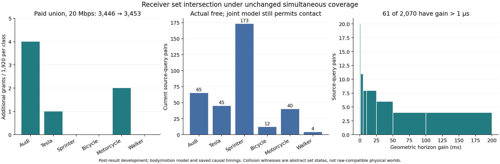

# 同时覆盖下的双视角交集：有效期求解已紧，观测集合仍过宽

日期：2026-10-04。执行：sheng；本地独立复算。目标仍是从不完整观测中得到可信、不过度保守的证据有效期。本轮完成一个有限的接收端算法实验，没有建立持续研究循环。

**结果：双视角交集在全部额外接收端费用计入后，将 20 Mbps 的紧凑消息许可数从 3446 提高到 3453，仅增加 7 次；Sprinter 仍为 4→4。** 几何距离证书的上下界间隙不超过 2 微米，有效期间隙不超过 1 微秒。因而在这个声明模型里，继续提高求解精度不能解决主要保守性。173 个 Sprinter 来源查询虽然实际当前位置不接触查询区域，两个状态集合的交集却仍包含可核验的接触位置。这些替代位置尚未证明兼容原始点云，不能据此宣称原始观测在信息论上不可辨识。

## 可信性如何继承，有效期如何计算

固定使用[上一轮前瞻性实验](prospective_expiry_result_20261003.md)的原始数据、XYZ-only 前端、按类 max95 半径、车体外接圆、消息与源时间戳。每个视角提供所有当前分量中心的半径 q 圆盘并集 S_v。上一轮的整回合覆盖事件 E 同时约束所有可用视角、所有被输出的当前帧；在 E 上，真实中心属于每个 S_v。因此对于同一源帧，真实中心也属于 C=S_0∩S_1。这个推理不需要两个视角独立，也不需要重新拟合融合分数。下游选择已收到的同帧交集仍继承 E。它不能修复 E 本身的失败，也不能把当前中心覆盖自动升级为物理安全。

对查询中心 z、车体与查询半径之和 b，以及位移包络 D(t)=5t+1.5t²（米、秒），严格不接触条件是 dist(z,C)>b+D(t)。C 是有限个双圆盘透镜的并集。枚举所有分量对后，整数支持平面和非负对偶权重给出距离下界，经过精确整数成员检验的有理可行点给出上界。Decimal 运算只生成候选点与权重，最终接受依据是独立整数检验。相切、重合、查询已在集合内以及不相交等退化情况单独处理。

距离上下界再通过严格接触判据，转为最后安全的整数微秒；上限仍为 500 ms。这个阈值在“无限制校准中心集合＋各向同性位移”的声明模型内达到最大保证时长，误差由保存的证书括住。没有证明所有集合内状态与原始返回兼容，也没有证明所有允许位移可由真实车辆实现；因此不能称其为实际观测或物理世界的最优有效期。[完整推导](../experiments/view_intersection_20261004/THEORY.md)和[冻结协议](../experiments/view_intersection_20261004/PROTOCOL.md)保留这一区别。

接收端在第一份合法消息解码后即可使用单视角事实；只有伙伴视角已经完成缓存写入，才允许同帧结合。新增缓存与完整交集计算的三次 sheng 实测最大耗时进入接收端 FIFO，也延迟后续解码。派生事实只在计算完成时可用，始终保留原始源时间，不能刷新 TTL。不同回合、类别、帧、源时刻的事实不能结合。空交集是矛盾，检出后撤销该回合的权限；缺失或精度不足则拒绝新增约束。此次接受批次没有空交集或精度拒绝。

## 完整分母与强基线

本轮复用上一轮已公开的测试部分，属于结果后的算法开发，**没有新的 untouched holdout**，没有新采集或风险拟合。360 个计划测试回合中 346 个有采集；每回合三个源时刻、两个视角，得到 1038/1080 个计划同帧对与 2076 条视角记录。1035 对成功给出界，3 对缺失视角。独立审计完成 16015 个整数证书检查。2070 个几何查询中 61 个相对最强单视角增加超过 1 微秒；增益中位数及 p95 均为零，最大 191.319 ms。

比较对象是已经能选择“已送达单视角中最大绝对期限”的基线，不是要求两个视角同时有效的弱基线。紧凑中心并集、无损 float64 中心和完整保存 XYZ 解码到相同量化中心候选；最后一项是保存的 stride-four XYZ，不是全部原始射线。原有源端、链路和解码耗时样本不变，传播 20 ms，动作与时钟储备合计 220 ms。本轮只增加实际测量的接收端缓存与交集处理费用。

| 链路 | 表示 | 原单视角许可 | 交集算法许可 | 净增加 |
|---|---|---:|---:|---:|
| 20 Mbps | 紧凑并集 | 3446 | 3453 | 7 |
| 20 Mbps | 无损中心 | 3446 | 3453 | 7 |
| 20 Mbps | 完整保存 XYZ | 1449 | 1449 | 0 |
| 2 Mbps | 紧凑并集 | 3439 | 3446 | 7 |
| 2 Mbps | 无损中心 | 3438 | 3445 | 7 |
| 2 Mbps | 完整保存 XYZ | 0 | 0 | 0 |

每行分母都是 11520 个计划动作查询，保留采集失败的拒绝。20 Mbps 紧凑并集净收益为基线许可数的约 0.203%，或计划查询的 0.0608 个百分点。32 次许可选用了交集期限，但不等于新增 32 次许可。按类净增加依次为 Audi 4、Tesla 1、Sprinter 0、自行车 0、摩托车 2、行人 0。紧凑并集新增处理费用中位数 28.5 微秒、p95 1316 微秒、最大 3856 微秒；无损中心为 16.5/1283/3401 微秒，保存 XYZ 为 19.5/1286/3612 微秒。它们是此主机三次观测的最大值，包含缓存和组合两种任务，不是最坏执行时间证明。整体时线为使用实测费用的因果回放，不是实际无线闭环。

本轮完善的是状态包络路径。上一轮动作条件化直接期限路径的 4451 次许可使用不同几何与校准，不得拿 3453 与 4451 混合解释；Sprinter 的 500.001 ms 直接期限修正也没有被本轮修复。

## 保守性来自哪里

另外保存了每个有理接触见证：它确实在两个当前圆盘并集中，并且距查询不超过 b。真实当前中心只用于离线诊断，生产算法不能读取它。下表统计“真实当前位置空闲，但交集中存在接触见证”，并限定两个单视角集合实际均覆盖真实中心。

| 类别 | 可求界的来源查询 | 覆盖成立时仍有模型内接触歧义 |
|---|---:|---:|
| Audi | 360 | 65 |
| Tesla | 348 | 45 |
| Sprinter | 360 | 173 |
| 自行车 | 358 | 12 |
| 摩托车 | 360 | 40 |
| 行人 | 284 | 4 |

这些是来源查询，不是统计独立回合；不能把它们当作独立样本建立风险置信区间。见证证明此中心集合模型不足以排除接触，并未证明替代世界兼容原始 XYZ、遮挡、完整网格或真实动力学。同样，空交集检测能揭示矛盾，却无法排除两个视角共同有偏。原校准半径中 Sprinter 达 5.591086 m，宽集合的影响不会靠微秒级求解自行消失。

上一轮保留的一个摩托车整回合中心排除事件仍在。本轮 20 Mbps 紧凑与无损表示各有 15 次许可来自这个回合，保存 XYZ 有 7 次。有限真值时刻上没有观察到占用许可，不能抵消覆盖失败。继承的 max95 定理只是在固定 iid 整回合分布下，以至少 95.4091% 的六类联合校准置信度约束各类当前中心排除风险不超过 5%；不是许可条件风险、任意场景或连续物理碰撞保证。本轮复用数据也不能制造新的统计验证。

## 失败保留与复现

sheng 第一次生产运行在一个行人重合圆盘上终止。Decimal 的边界投影舍入使候选点相对同一个圆盘略微越界，候选列表为空；当时没有写出接受结果。保留原始源码、测试、冻结清单与 AssertionError 日志。唯一生产修复是允许重合圆盘的投影进入候选集合，最终有理成员与整数对偶检查不变，并增加独立平方距离回归测试。数据、风险参数、阈值及运动常量未变化。修复后重新完成一次生产运行，失败运行的费用不参与接受结果，也没有为有利时延多次挑选运行。

三个独立 JSON 对（整数证书与队列审计、汇总、模型歧义审计）在本地和 sheng 逐字节一致；每台机器 13 个测试通过。审计器不导入生产几何或队列实现。原始生产文件、额外费用、完整因果时线、故障日志、两端测试记录与证明见证都在 [results](../results/view_intersection_20261004)。[复现入口](../experiments/view_intersection_20261004/README.md)和 verify_package.py 校验当前、原始失败及父实验源文件和数据哈希。无需重新运行计时生产者即可复核接受结果。

## 文献约束下的候选问题

[CooperTrim 官方论文](https://proceedings.iclr.cc/paper_files/paper/2026/hash/c99e08e921b90e901e5eaa7ddee51d6c-Abstract-Conference.html)已研究时序变化与不确定性驱动的协作请求；[MOT-CUP 作者全文](https://arxiv.org/html/2303.14346)已将检测不确定性和共形校正用于协作跟踪；[依赖传感器共形融合](https://www.sciencedirect.com/science/article/pii/S0925231226005795)研究融合依赖与重校准；[Proof-of-Perception 作者预印本](https://arxiv.org/html/2603.00324)研究集合输出驱动的额外计算和停止决策。读到的章节和无法获取的部分在[阅读记录](../experiments/view_intersection_20261004/READING.md)分别注明。这些模型没有在本轮实现为同信息比较，不能声称超过它们。集合交集、对偶距离与自适应计算本身也不足以形成新 MobiCom 贡献。

当前更精确的候选问题是：**在完整回合覆盖约束下，怎样让补充观测排除真正影响动作期限的状态歧义，并使获得的期限收益超过采集、传输和计算造成的证据老化。** 本轮已经实现并核验“费用后收益”的接收端接口，但没有证明新的选择策略、优越前端或有用的端到端闭环。后续应先改善观测到状态集合的表示，保留漏观测导致的宽集合与拒绝，再以冻结的新校准和新测试验证；只提高已经足够紧的几何求解精度不会解决这里发现的模型歧义。

本轮有限实验与软件包完成；可信且普遍不过度保守的有效期、未知物体清单、真实链路、连续物理与 ego 控制，以及投稿级创新仍未完成。项目完成状态保持未达成。
