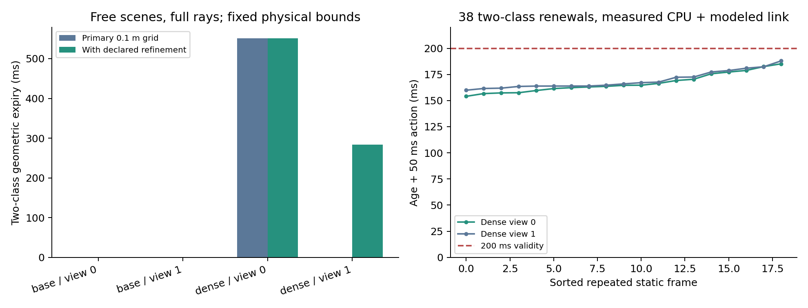

# 从不完整射线观测到可核验证据有效期：sheng 有限实验

**结论：已经实现并在 sheng 验证了一条有条件成立的计算链：真实空闲射线 → 排除不可能的障碍物中心 → 未排除位置的运动可达范围 → 动作对应的有效期 → 接收端可重验的证明 → 使用当前观测续期。** 在约定的两类障碍物模型下，加密扫描的两种视角均能支持 200 ms 的联合证明，38 个空闲/远障碍重复帧在计入处理预算后通过，20 个具有初始化模板的近障碍帧全部拒绝。

这解决了本项目中“有效期从哪里来、何时必须拒绝、怎样避免每帧重建证明耗尽有效期”的实现问题。它不是无条件感知安全保证，也尚未证明新的 MobiCom 算法贡献。普通扫描下的小目标模型仍然缺少足够信息；将这个结果保留为零有效期，是方法可信性的必要部分。

代码见 [实验入口](../experiments/visibility_certificate_20261001/README.md)，数字和图由 [analyze.py](../experiments/visibility_certificate_20261001/analyze.py) 从逐帧记录生成；[核验汇总](../results/visibility_certificate_20261001/analysis.json) 和所有原始点云均随仓库保存。

## 1. 必须先划定可解问题

任意不完整观测不能无条件推出正有效期。只要查询区域存在未观测的小空隙，又允许任意小障碍物，就可以构造两个观测完全相同的世界：一个为空，另一个已经在空隙内有障碍物。若速度无上界，区域外的障碍物也可任意快地进入。因此，“学习一个始终可信且不保守的 TTL”在这种设定下不可识别。

这里明确采用可检查的数学契约：在指定探测平面，每类障碍物都包含半径至少为 r_min 的不透明圆盘，其完整水平轮廓又被同中心、半径 r_max 的圆盘包住；空闲射线可靠，平面见证点误差不超过 ε；初始速度和加速度范数分别不超过 v、a；时钟误差不超过 δ；障碍物不能凭空生成或瞬移。行动的整个受保护占用范围须落入已声明查询圆盘。真实系统必须建立这些上游契约；当前代码不能从缺失观测中凭空证明契约本身。

默认查询半径 0.5 m，见证点误差 0.05 m，速度 5 m/s，加速度 3 m/s²，时钟误差 20 ms，中心域为 ±15 m。两类模型分别取 (r_min,r_max)=(0.2,0.4) m 与 (0.55,2.5) m。这些是明确的模型敏感性设定，不能直接称为“所有行人”“所有汽车”的真实规格。0.5 m 查询圆盘也不能直接代表整车占用或完整行驶轨迹。

## 2. 有效期的推导及其可信性

对一条首回波射线，只使用其在命中物之前穿过探测平面的点。没有回波、平面以上的回波和射线之间的空间均不被补成空闲。记估计见证点为 w，真实空点为 w*，且 ‖w−w*‖≤ε。如果某个障碍物中心 c 满足 ‖c−w‖<r_min−ε，那么 w* 必在该障碍物的不透明内核中，与它为空矛盾。因此这部分**中心位置**可以排除，尽管射线没有扫描这片空间的每一点。

实现以边长 h 的正方形覆盖中心域。对于中心为 c_T 的网格 T，只有满足

\[
\min_w\|c_T-w\|+h/\sqrt2<r_{\min}-\epsilon
\]

才排除整个网格。压缩坐标还需额外减去量化误差。其余网格以及有限域之外始终保留为可能的中心集合 U。三角不等式保证网格内所有位置都满足排除条件；这避免只验证网格中心、漏掉网格角落。

令 Q 是查询圆盘，d 是 U 到 Q 按 r_max 膨胀后的集合之间的距离下界。实现对每个未排除网格计算精确的矩形到查询中心距离，并同时纳入域外距离，因此没有忽略域外来车。最大运动距离为 v·t+a·t²/2，于是对于 a>0，保守有效期为

\[
\tau=\max\left(0,\frac{2d}{v+\sqrt{v^2+2ad}}-\delta\right).
\]

a=0 时使用 d/v；静止模型另作退化处理。严格在 τ 之前执行，运动距离不足以跨越已证明的间隔。所有必要类别分别计算并全部通过，才可以对所声明的完整对象集合使用证据。这个结论是给定契约下的充分条件，不是关于自然驾驶场景的概率结论。

“减少保守性”有两个有据可查的来源：有限大小的物体无法藏在所有几何小缝隙中，因而不要求空间每一点都有射线；细化网格可减少对潜在中心集合的数值外包误差。没有通过降低安全误差、增大假定目标大小或放宽覆盖百分比来获得正结果。仍未证明该离散界是最大可得有效期；运动包络、圆盘外形和单平面表示都可能留下保守性。

## 3. 接收端证明与及时续期

发送端选择覆盖目标时间范围所需中心网格的一组见证点，将坐标量化到 1 cm，显式增加最大二维量化误差 0.01/√2 m，序列化模型、动作 scope、采样时间、目标时长和见证点。接收端使用自己确定的模型与 scope 重验几何，不允许消息自行减小误差或漏掉必要类别。接受条件是：当前时刻 + 整段动作时长 < 采样时刻 + 证据有效期。

初版每次冷启动都求稀疏覆盖，导致证明成立但送达时已来不及用。本轮完成的修复是**复用选点位置，重新取得当前证据**：旧模板只提出在哪里寻找见证点；每次从当前点云寻找邻近的真实射线见证、重新量化、重新覆盖验证。障碍物挡住这些射线时，旧空闲内容不能续期。若当前覆盖失败，返回拒绝，可重新初始化模板，但初始化期间不能借用过期证据执行动作。

这包含两项不同检查：SHA-256 只检查数据损坏；几何重验检查“这些声称可信的见证点是否足以支持范围与时间”。二者都不证明发送端诚实，也不提供消息认证。生产系统还需要可信传感器来源、认证和防重放机制。scope 必须由双方映射到同一个不可变的查询位置、坐标系、探测平面与动作占用，不能只比较一个任意字符串。平面点误差 ε 需要上游把定位、地图、量程及投影误差一起界定，不能把量程精度直接当作 ε。

## 4. 实际完成的有限实验

运行位置为 sheng 的 WSL Ubuntu-20.04；CARLA 0.9.15 在其 Windows 主机上运行，GPU 为 RTX 4090。已有直接 `ssh sheng` 地址不可达时，通过 Windows 的 Tailscale SSH 进入同一台机器的 WSL 执行，未换到本地假冒服务器结果。

| 阶段 | 实际规模 | 结果与解释 |
|---|---:|---|
| 解析圆盘场景、真实首命中射线、界内坐标扰动 | 2,000 场景 | 417 个正有效期，0 次错误排除真实中心，0 次超过模型中的最早碰撞上界；验证实现，不把零错误换算为真实道路安全率 |
| 历史 CARLA 点云回放 | 4 点云，2 类模型，3 网格尺寸，2 稀疏度 | 保留为回放，不计入新帧；完整射线的车辆模型在两空闲视角得 676 / 169 ms，小目标模型为 0 |
| 新 CARLA 采集 | 2 扫描密度 × 2 安装视角 × 3 场景 × 10 帧 = 120 帧 | 480 条分析记录；全部 sensor/world frame ID 一致，0 个过期帧；标签仅用于事后评估 |
| 冷启动证明 | 96 次 | 26 次几何通过，4 次通过原记录时间预算；保留失败，不与后续不同分母计算提升倍数 |
| 单类别当前点云续期 | 377 次 | 247 次几何通过，124 次时间通过，近障碍无接受；部分拒绝包含网格与模板配置不一致，不全归因于遮挡 |
| 固定模板、两类同时验证 | 232 次 | 58 次具备两类模板，其中 38 次空闲/远障碍几何与时间均通过，20 次近障碍拒绝；其余 174 次缺少两类模板而拒绝 |

新采集的普通配置为 64 通道、50 万点/秒，加密配置为 256 通道、200 万点/秒。额外检查固定每 8 点保留 1 点的稀疏输入。三种场景是空闲、查询中心近障碍、前方 8 m 远障碍，障碍物为静止 Audi A2。探测平面在局部路面上方 0.6 m，视角 0/1 分别为横向 4/8 m、高度 8/6 m。加密扫描的传感与采集成本更高，没有把它当成免费算法收益。

下表为完整射线的空闲场景几何有效期均值，尚未扣除本次传输和处理耗时。十个静态重复帧几何相同；不据此计算独立场景置信区间。

| 扫描/视角 | 小目标模型，主网格 0.1 m | 小目标模型，允许预先声明的细化 | 车辆模型，0.1 m | 两类最终最小值 |
|---|---:|---:|---:|---:|
| 普通 / 0 | 0 ms | 0 ms | 676 ms | 0 ms |
| 普通 / 1 | 0 ms | 0 ms | 169 ms | 0 ms |
| 加密 / 0 | 551 ms | 551 ms | 689 ms | 551 ms |
| 加密 / 1 | 0 ms | 283 ms（0.05 m 网格） | 656 ms | 283 ms |

主网格结果原样保留。加密视角 1 说明数值离散确实可能造成无谓的零有效期；普通扫描细化后仍为零，说明不能把信息不足都归咎于算法保守。远障碍情况下，两加密视角的车辆模型有效期约 574 ms，小目标模型仍为 551 / 283 ms；近障碍全部为零。

新点云的 320 项实际障碍物中心检查均未发现错误排除。它们只检查已放置汽车中心的排除一致性，没有验证每个 CARLA 网格的不透明内核，尤其没有开展真实小目标/行人实验。不能据此声称两类物理契约已在现实中成立。

## 5. 联合证明的时间与通信成本

联合实验只使用每个配置的第一张空闲扫描初始化模板，排除这四张初始化扫描，对剩余 116 张点云和两种稀疏度做 232 次有限回放。只有加密完整射线具备两类模板。每个视角各有 9 张空闲、10 张远障碍、10 张近障碍。每张当前点云均重新取点，不访问障碍物标签；模板的模型和网格在三场景间固定。该实验避免了单类别诊断中的网格切换歧义。

38 次通过的联合证明，观测到接收验证结束的年龄为 **104.05–137.97 ms，中位数 114.69 ms**；其中采集时间来自采集时实测，发送端串行处理与接收端验证在 sheng 实测，传输时间固定建模为 20 ms。发送端中位数 39.40 ms，接收端中位数 4.18 ms。加上预先约定的 50 ms 动作后，仍严格小于 200 ms，最差记录余量约 12.03 ms。这个余量不能吸收任意无线抖动；部署时须按实际到达时间拒绝超时消息。

联合证明完整 JSON 为 **9,148–9,794 字节**，包含两类模型、scope、时间戳、见证点、校验和与容器开销。对应加密空闲帧的未压缩 float32 XYZ 数据约 1.04 / 1.08 MB；这里只作信息量参照，**没有与压缩点云/特征基线做公平带宽对照**，也未计入真实无线帧、认证和重传。旧模板构建成本没有消失，已单独记录为冷启动；需要每帧重建时不能套用续期时延。

采集是同步仿真的真实新帧；后两项续期实验是当前点云的服务器回放。相对时间零加记录/建模年龄不等于部署中的传感器时钟协议；未运行车辆控制器、真实无线链路或动态交通闭环。冷启动记录未单列射线投影预处理成本，不能当作完整部署延迟的精确值；联合续期计时包含共享投影、两类处理、序列化与两类接收验证。

## 6. 与现有文献的关系及科研判断

[Share the Unseen](https://people.kth.se/~kallej/papers/Share_the_Unseen_ICST2024_Nyberg.pdf) 已经研究带时间戳空闲信息与运动可达范围；我们不能把“旧证据会失效”当作原创。[Occlusion-Aware MPC](https://msl.stanford.edu/papers/firoozi_occlusion-aware_2022.pdf) 已经使用遮挡区域和可达集，安全分析显式依赖传感器返回包含真实对象的集合，并包含终端停止条件。本轮核查其摘要、§IV–V 与 §VI 开头；其停止状态安全定义与我们的圆盘保持空闲也不同，不能直接合并成同一个安全命题。

[CARLA 0.9.15 传感器文档](https://carla.readthedocs.io/en/0.9.15/ref_sensors/#semantic-lidar-sensor) 说明语义 LiDAR 的射线命中及附加对象信息。本实现只使用 XYZ、传感器位姿与地图查询位置，不将对象标签输入认证器；这种理想射线仿真不等于验证了真实 LiDAR 的误报、漏报和材料穿透误差。相关工作的完整增量核查与尚未取得全文的近邻见 [阅读记录](literature_update_20261001.md)。

配置空间、可达集、保守网格与集合覆盖均有成熟基础。当前可继续检验的研究主张是：**在行动截止时间内，以可重验的几何充分证据为通信对象，联合控制观测分辨率、证明精度和刷新成本。** 本轮实现提供了可运行接口和反例：更多观测会提高可证明时长，也会增加处理成本；更细网格可能恢复证明，却加大计算；重用支持位置能减少重新求覆盖的工作，但缺少当前射线时必须拒绝。

这是一条比“语义重要性打分加调度”更具体的候选问题，而不是已经完成的 MobiCom 2027 论文。要主张系统论文贡献，仍缺少真实噪声与核心外形契约验证、动态动作占用与闭环、同等感知预算下的强几何/通信基线、真实网络预算和跨场景泛化。本轮不把这些未做实验写成已有结果，也没有建立持续研究循环。

## 7. 可追溯性与运行清理

四个阶段分别保存 source SHA-256、原始逐帧数据、序列化证明和日志；主协议有独立哈希。加密配置及网格细化是在新采集之前，根据历史回放诊断写入 [addendum](../experiments/visibility_certificate_20261001/ADDENDUM.md)；续期实验是看到冷启动失败后明确记录的 [有限跟进](../experiments/visibility_certificate_20261001/TIMING_FOLLOWUP.md)，不伪装为预注册。

十二项单元测试覆盖空扫描、真正隐藏空隙、域外目标、误差单调性、量化/损坏/作用域/时间拒绝、小类别不能借用大内核、当前观测续期和必要类别缺失。独立结果核验又检查了四份源码清单、120 份点云、帧匹配、76 个已保存类别证明的当前射线来源，以及接收端联合结果。

采集结束时的即时 actor 列表仍显示 1 辆车和 1 个传感器，不能写成该时刻已清零；随后已按实验元数据和进程路径核对，关闭本次自行启动的 CARLA 进程，[单独清理记录](../results/visibility_certificate_20261001/server_cleanup.json) 确认该进程不再运行。没有建立后台循环、定时任务或自动续跑。
